# Chapter 10 - Graphs

## Section 1 Graphs ang Graph Models

A **graph** G=(V,E) consists of a set V of **vertices(nodes)** and a set E of **edges**, where each edge is associated with a pair of vertices.

Types of graphs:

- **Undirected graph**: an edge (u,v) is unordered pair of vertices.
    - Simple graph: no loops or multiple edges.
    - Multigraph: may have multiple edges.
    - Pseudograph: may have multiple edges and loops.
- **Directed graph(Digraph)**: an edge (u,v) is ordered pair of vertices.
    - Simple digraph: no loops or multiple edges.
    - directed multigraph: may have multiple edges, and loops.
- **Mixed graph**: a graph that contains both directed and undirected edges.

### Undirected graph

- if (u,v) is an edge, then u and v are **adjacent** or **neighbors**, the edge is **incident** to u and v, and u and v are **endpoints** of the edge.
- **Loop** is an edge that connects a vertex to itself.
- The **neighborhood** of a vertex v is the set of vertices adjacent to v. - The **degree of a vertex** is the number of edges incident to it, with loops counted twice.
    - If deg(v) = 0, then v is an **isolated vertex**.
    - If deg(v) = 1, then v is a **pendant vertex**.

**Theorem**: In any graph, the sum of the degrees of all vertices is equal to twice the number of edges.

**Theorem**: In any graph, the number of vertices of odd degree is even.

### Directed graph

- if (u,v) is an edge, then u is the **initial vertex** and is **adjacent to**v, and v is the **terminal vertex** and is **adjacent from** u.
- **Underlying undirected graph** of a digraph is the undirected graph obtained by replacing each directed edge by an undirected edge.
- $deg^+(v)$ is the **outdegree** of v, the number of edges with v as initial vertex.
- $deg^-(v)$ is the **indegree** of v, the number of edges with v as terminal vertex.

**Theorem**: In any digraph, the sum of the indegrees of all vertices is equal to the sum of the outdegrees of all vertices.

> $ \sum_{v \in V} deg^+(v) = \sum_{v \in V} deg^-(v) = |E| $

## Section 2 Some special graphs

### Complete graph ($K_n$)

A **complete graph** on n vertices, denoted by $K_n$, is a simple graph that contains exactly one edge between each pair of distinct vertices.

### Cycle graph ($C_n$)

A **cycle graph** on n vertices, denoted by $C_n$, is a simple graph that consists of the vertices $v_1, v_2, ..., v_n$ and edges $v_1v_2, v_2v_3, ..., v_{n-1}v_n, v_nv_1$.

### Wheel graph ($W_n$)

A **wheel graph** on n vertices, denoted by $W_n$, is a simple graph that consists of the vertices $v_1, v_2, ..., v_n$ and edges $v_1v_2, v_2v_3, ..., v_{n-1}v_n, v_nv_1, v_1v_3, v_1v_4, ..., v_1v_n$.

>Cycle graph + one vertex connected to all vertices of the cycle.

### n-Cube ($Q_n$)

An **n-cube** is a graph whose vertices are the n-bit strings and two vertices are adjacent if and only if the corresponding bit strings differ in exactly one bit position.

> $Q_1$ is a single vertex, $Q_2$ is a square, $Q_3$ is a cube, $Q_4$ is a hypercube.

### Bipartite graph

A graph G=(V,E) is **bipartite** if V can be partitioned into two sets V1 and V2 such that every edge in E connects a vertex in V1 and a vertex in V2.

The pair (V1,V2) is a **bipartition** of G.

两色问题：一个图是**二分图**，当且仅当用两种颜色对图的所有顶点进行着色，使得任意一条边的两个顶点颜色都不相同。

如果每个顶点都和另一个子集的每一个顶点相连，则称为**完全二分图**。

### Complete bipartite graph ($K_{m,n}$)

A **complete bipartite graph** on $m+n$ vertices, denoted by $K_{m,n}$, is a bipartite graph that contains ***exactly one*** edge between each vertex in V1 and each vertex in V2.

### Regular graph

A graph is **regular** if all vertices have the same degree.

A **n-regular** graph is a regular graph if all vertices have degree n.

> $K_n$ is a (n-1)-regular graph.

### New graph from old

#### Subgraph

$G=(V,E),H=(W,F)$

- $H$ is a **subgraph** of $G$ if $W \subseteq V$ and $F \subseteq E$.
- $H$ is an **proper subgraph** of $G$ if $G \neq H$.
- $H$ is an **spanning subgraph** of $G$ if $W = V$, $F \subseteq E$.(相当于从$G$中删除了一些边)
- $H$ is an **induced subgraph** of $G$ if $W \subseteq V$, $F = \{uv \in E | u,v \in W\}$.(相当于从$G$中删除了一些顶点和与这些顶点相关的边)

#### Some operations

- **Removing edges of a graph**: $G-E'=(V,E-E')$.
- **Adding edges to a graph**: $G+E'=(V,E \cup E')$.
- **Edge contraction**: $G/e=(V',E')$, where $V'=V-\{u,v\} \cup \{w\}$ and $E'$ contains all edges of $E$ except those incident to $u$ or $v$, and contains a new edge $wx$ for each edge $uy$ or $vy$ in $E$（相当于把$u,v$合并成一个顶点$w$）.
- **Removing vertices of a graph**: $G-v=(V-\{v\},E')$, where $E'$ contains all edges of $E$ except those incident to $v$.(相当于删去顶点$v$及与之相关的边)

- **Graph Union**: $G \cup H = (V \cup W, E \cup F)$.

## Section 3 Representating graphs and graph isomorphism

### Adjacency lists

- **Adjacency list**: lists that specify the vertices adjacent to each vertex.

> 例如：对于无向图

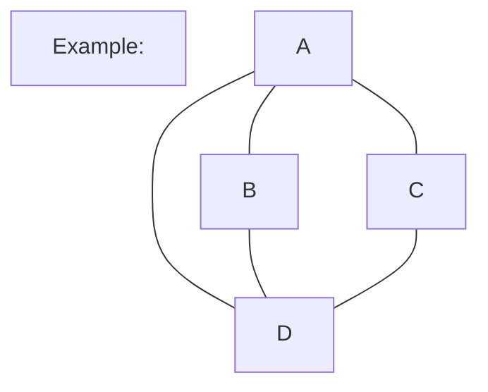

> 可以用下面的邻接表表示：

| vertex | adjacent vertices |
| :----: | :---------------: |
|   a    |       b,c,d       |
|   b    |        a,d        |
|   c    |        a,d        |
|   d    |       a,b,c       |

> 对于有向图

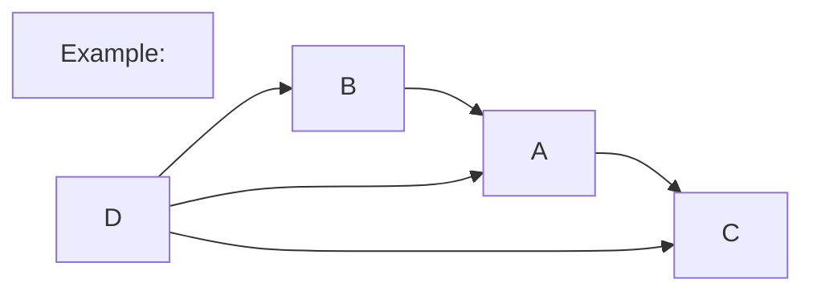

> 可以用下面的邻接表表示：

| Initial vertex | terminal vertices |
| :------------: | :---------------: |
|       a        |         c         |
|       b        |         a         |
|       c        |                   |
|       d        |       a,b,c       |

### Adjacency matrices

- **Adjacency matrix**: a two-dimensional array A of size $n \times n$, where $n=|V|$, such that $A_{ij}=1$ if $(v_i,v_j) \in E$ and $A_{ij}=0$ otherwise.

无向图的邻接矩阵是对称的，有向图的邻接矩阵不一定对称。

> 例如：对于无向图

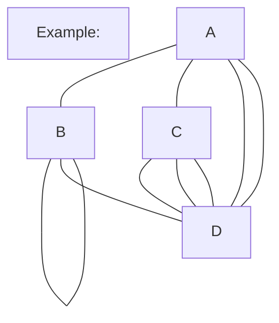

> 可以用下面的邻接矩阵表示：
>
> $A_G = \begin{bmatrix} 0 & 1 & 1 & 2 \\ 1 & 1 & 0 & 1 \\ 1 & 0 & 0 & 3 \\ 2 & 1 & 3 & 0 \end{bmatrix}$
>
> 此时loop不需要乘以2，但是在计算度数时需要乘以2。
>
> 每一行加起来的和就是对应顶点的度数减去这个顶点上loop的个数。

---

> 对于有向图

> 可以用下面的邻接矩阵表示：
>
> $A_G = \begin{bmatrix} 0 & 0 & 1 & 0 \\ 1 & 0 & 0 & 0 \\ 0 & 0 & 0 & 0 \\ 1 & 1 & 1 & 0 \end{bmatrix}$
>
> 每一行加起来的和就是对应顶点的出度，每一列加起来的和就是对应顶点的入度。
>
> 例如:$a_{13}$代表的是从顶点1到顶点3的边的个数，即顶点1的出度，在此处是指顶点A的出度。

### Incidence matrices

- **Incidence matrix**: a two-dimensional array $M$ of size $n \times m$, where $n=|V|$ and $m=|E|$, such that $M_{ij}=1$ if $v_i$ is incident to $e_j$ and $M_{ij}=0$ otherwise.
- 其实就是顶点和边的关系矩阵，行代表边，列代表顶点，如果边和顶点相连，则为1，否则为0。

> 例如：对于无向图

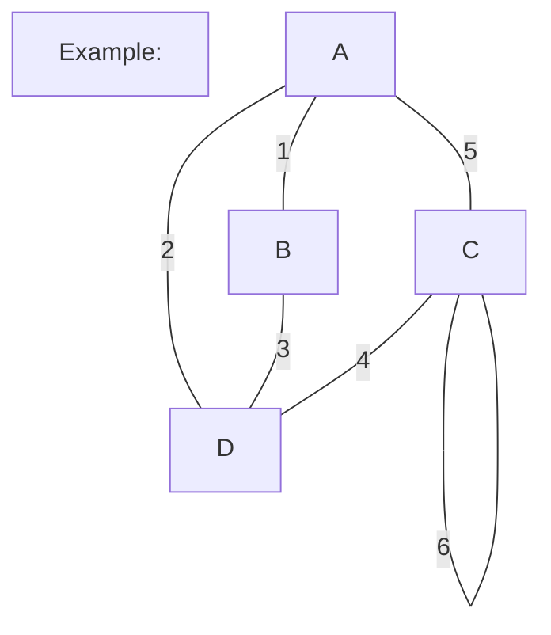

> 可以用下面的关系矩阵表示：
>
> $M = \begin{bmatrix} 1 & 1 & 0 & 0 & 1 & 0 \\ 1 & 0 & 1 & 0 & 0 & 0 \\ 0 & 0 & 0 & 1 & 1 & 1 \\ 0 & 1 & 1 & 1 & 0 & 0  \end{bmatrix}$

### Graph isomorphism

- **Graph isomorphism**: two graphs $G_1=(V_1,E_1)$ and $G_2=(V_2,E_2)$ are **isomorphic** if there is a one-to-one correspondence $f:V_1 \rightarrow V_2$ such that $(u,v) \in E_1$ if and only if $(f(u),f(v)) \in E_2$.
- 一般会让你判断两个图是否同构，如果是同构的，就要找到一个一一对应的关系，并记$f(u_1)=v_1,f(u_2)=v_2,...,f(u_n)=v_n$。
- 例子：画出所有四个顶点，三条边的非同构的undirected simple graph。

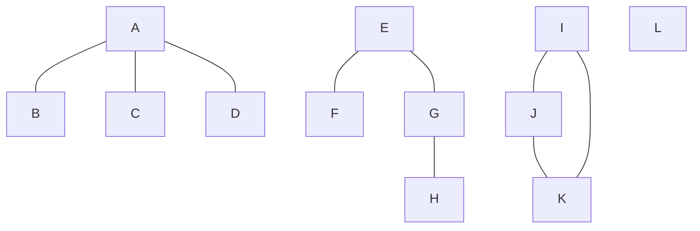

## Section 4 Connectivity

### Connectivity

- **Path**: a **path** from vertex $v_1$ to vertex $v_n$ is a sequence of vertices $v_1,v_2,...,v_n$ such that $(v_i,v_{i+1}) \in E$ for $i=1,2,...,n-1$.
- **Circuit**: a **circuit** is a path that starts and ends at the same vertex.
- **Simple path/circuit**: a **simple path/circuit** is a path/circuit that does not contain the same edge more than once.
- **Connected**: a graph is **connected** if there is a path from any vertex to any other vertex.
- **Connected component**: a **connected component** of a graph is a maximal connected subgraph.

> 举个例子：对于下面的图，有四个connected component，分别是$\{a,b,c,d,e\},\{f,g,h\},\{i,j,k\},\{l\}$。

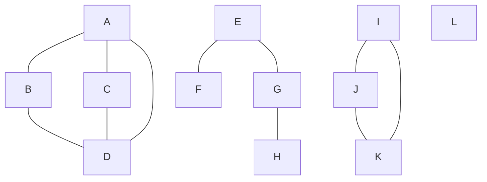

**[Theorem 1]** There is a simple path between every pair of distinct vertices of a connected undirected graph.（对于一个连通的无向图，任意两个顶点之间都有一条简单路径。）

**cut vertex**（割点）: a vertex whose removal disconnects the graph.

**cut edge/bridge**（割边）: an edge whose removal disconnects the graph.

> 举个例子：对于下面的图，点D是一个割点，所有的边都是割边。

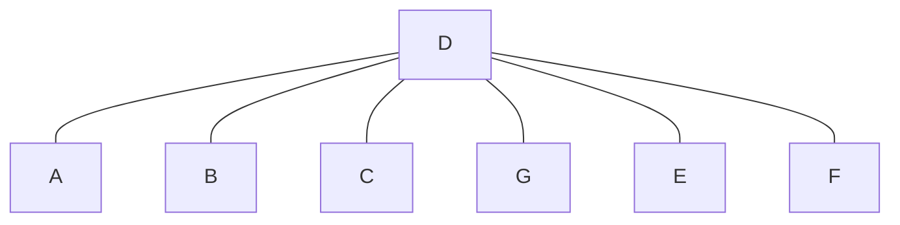

**nonseparable graph**（非分离图）: a connected graph that contains no cut vertices.

---

### How to measure the connectivity of a graph?

#### 无向图

- **Vertex cut**: a **vertex cut** of a graph $G$ is a ***set*** of vertices whose removal disconnects $G$.
- **Vertex connectivity**: the **vertex connectivity** of a graph $G$, denoted by $\kappa(G)$, is the minimum number of vertices whose removal disconnects $G$.

> 1. The minimum number of vertices whose removal either disconnects $G$ or leaves a graph with only one vertex is called the **vertex connectivity** of $G$.
>    （对于一个图$G$，如果删除最少的顶点，使得图$G$不连通，或者只剩下一个顶点，则这个最少的顶点数就是图$G$的顶点连通度。）
> 2. $\kappa(G) =0$ iff $G$ is disconnected or $G=K_1$
> 3. $\kappa(G) =1$ if $G$ connected with cut vertices or $G=K_2$
> 4. $\kappa(G) =n-1$ iff $G$ is a complete graph
>
> - The larger  $\kappa(G)$ is, the more connected we consider $G$ to be.

**k-connected**(or **k-vertex-connected)**（k-连通）: a graph $G$ is **k-connected** if $\kappa(G) \geq k$.

- **Edge cut**: an **edge cut** of a graph $G$ is a ***set*** of edges whose removal disconnects $G$.
- **Edge connectivity**: the **edge connectivity** of a graph $G$, denoted by $\lambda(G)$, is the minimum number of edges whose removal disconnects $G$.

> 1. The minimum number of edges that can be removed from $G$ to
>    disconnect $G$
> 2. $\lambda(G) =0$ iff $G$ is disconnected or $G$ is a graph consisting of a single vertice.
> 3. $\lambda(G) =n-1$ iff $G=K_n$

$\kappa(G) \leq \lambda(G) \leq \delta(G)$，其中$\delta(G)$是图$G$中度数最小的顶点的度数。

#### 有向图

- **strongly connected**: a directed graph $G$ is **strongly connected** if there is a directed path from $u$ to $v$ and a directed path from $v$ to $u$ for every pair of vertices $u$ and $v$.
- **weakly connected**: a directed graph $G$ is **weakly connected** if if the underlying undirected graph is connected.
  每一个强连通图都是弱连通图，但是反过来不一定成立。
- **strongly connected component**: a **strongly connected component** of a directed graph is a maximal strongly connected subgraph.
  找强连通分量的方法：先找到一个强连通分量，然后把这个强连通分量中的顶点删除，再找一个强连通分量，直到所有的顶点都被删除。

> 举个例子：对于下面的图，有三个强连通分量，分别是$A$;$E$;the subgraph consisting of vertices
>
> $B$, $C$, and $D$ and edges $(B,C)$, $(C,D)$, and $(D,B)$.

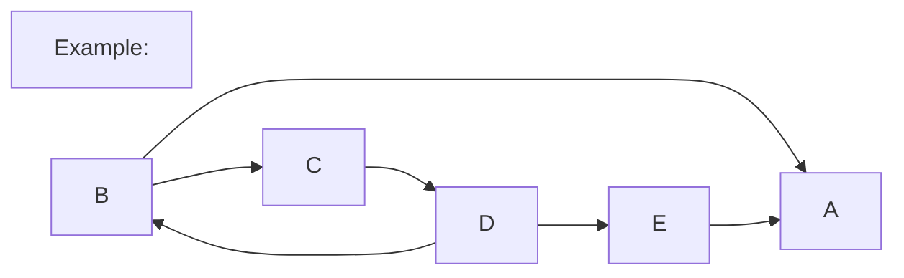

#### 用Path判断同构

- Two graphs are isomorphic only if they have simple circuits
  of the same length.（两个图同构当且仅当他们有相同长度的简单回路。）
- Two graphs are isomorphic only if they contain paths that
  go through vertices so that the corresponding vertices in
  the two graphs have the same degree.（两个图同构当且仅当他们包含通过顶点的路径，使得两个图中对应的顶点具有相同的度数。）

>判断下面的两个图是否同构：

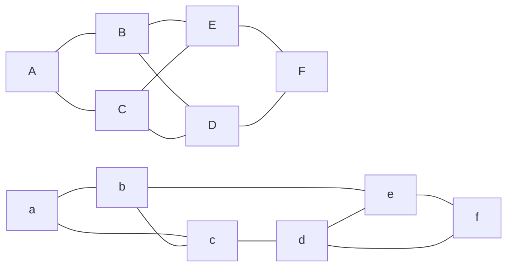

>These two graphs are not isomorphic.
> Because the right graph contains circuits of length 3, while
>the left graph does not

#### 用矩阵计算路径数

**Theorem 2** The number of different paths of length $r$ from $v_i$ to $v_j$ is equal to the $(i,j)$th entry of $A^r$, where $A$ is the adjacency matrix representing the graph consisting of vertices $v_1,v_2,...,v_n$.

这里计算时不用布尔矩阵，而是用普通的矩阵。

> 举个例子：对于下面的图，计算从顶点$A$到顶点$D$的长度为2的路径数。

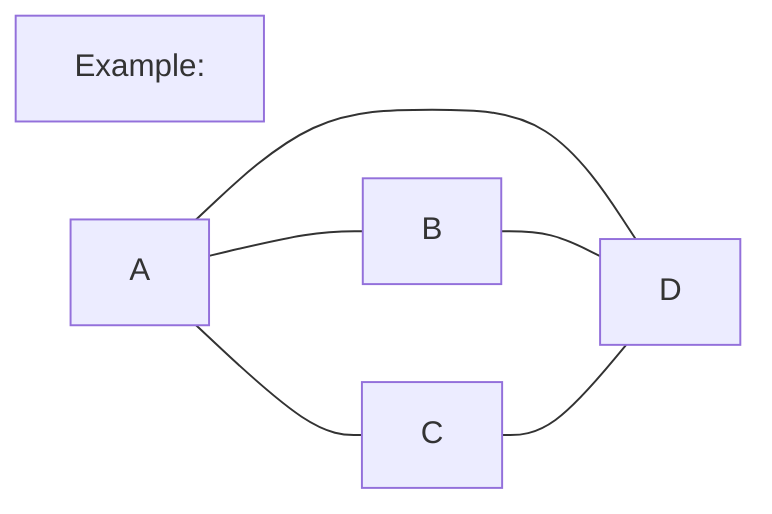

> $A_G = \begin{bmatrix} 0 & 1 & 1 & 1 \\ 1 & 0 & 0 & 1 \\ 1 & 0 & 0 & 1 \\ 1 & 1 & 1 & 0 \end{bmatrix}$
>
> $A_G^2 = \begin{bmatrix} 3 & 1 & 1 & 2 \\ 1 & 2 & 2 & 1 \\ 1 & 2 & 2 & 1 \\ 2 & 1 & 1 & 3 \end{bmatrix}$
>
> 从顶点$A$到顶点$D$的长度为2的路径数为2。

## Section 5 Euler and Hamilton paths

### Euler paths and circuits

- **Euler path**: an **Euler path** in a graph $G$ is a simple path that contains every edge of $G$.（一笔画）
- **Euler circuit**: an **Euler circuit** in a graph $G$ is a simple circuit that contains every edge of $G$.（一笔画回到原点）
- **Eulerian graph**: a graph that contains an Euler circuit.（可以一笔画回到原点的图）

#### 无向图(undirected graph)

**[Theorem 1]** A connected graph has an Euler circuit if and only if every vertex has even degree.

**[Theorem 2]** A connected graph has an Euler path but not an Euler circuit if and only if it has exactly two vertices of odd degree.

> Königsberg bridge problem（著名的七桥问题）: Is it possible to walk through the city of Königsberg, Prussia, crossing each of its seven bridges exactly once and returning to the starting point?
> 不成立，因为有四个顶点的度数是奇数。

#### 有向图(directed graph)

**[Theorem 3]** A **connected** directed graph has an Euler circuit if and only if every vertex has **equal in-degree and out-degree**.

**[Theorem 4]** A **connected** directed graph has an Euler path but not an Euler circuit if and only if it has exactly **two vertices** with **(out-degree) - (in-degree) = 1** and **two vertices** with **(in-degree) - (out-degree) = 1**; all other vertices have equal in-degree and out-degree.

### Hamilton paths and circuits

- **Hamilton path**: a **Hamilton path** in a graph $G$ is a simple path that contains every vertex of $G$.（包括所有顶点的路径）
- **Hamilton circuit**: a **Hamilton circuit** in a graph $G$ is a simple circuit that contains every vertex of $G$.（包括所有顶点的回路）
- **Hamiltonian graph**: a graph that contains a Hamilton circuit.

判断一个图是否是Hamiltonian graph还没有找到有效的方法。

下面是Hamiltonian path的充分条件：

**[Theorem 5]** If $G$ is a <u>simple graph</u> with $n$ vertices where $n \geq 3$ and $deg(v) \geq \frac{n}{2}$ for <u>*every vertex*</u> $v$ of $G$, then $G$ has a **Hamilton circuit**.

**[Theorem 6]** If $G$ is a <u>simple graph</u> with $n$ vertices where $n \geq 3$ and $deg(u)+deg(v) \geq n-1$ for <u>*every pair of nonadjacent vertices*</u> $u$ and $v$ of $G$, then $G$ has a **Hamilton path**.

**[Theorem 7]** If $G$ is a <u>simple graph</u> with $n$ vertices where $n \geq 3$ and $deg(u)+deg(v) \geq n$ for <u>*every pair of nonadjacent vertices*</u> $u$ and $v$ of $G$, then $G$ has a **Hamilton circuit**.

可以用下面的方法判断一个图是否不是Hamiltonian circuit。

> - a graph with a vertex of degree 1 cannot have a Hamilton circuit.
> - If a vertex in the graph has degree 2, then the two edges incident to this vertex must be part of any Hamilton circuit.（如果一个顶点的度数为2，则这个顶点的两条边必须是任何Hamilton回路的一部分。）
> - When a Hamilton circuit is being constructed and this circuit has passed through a vertex, then all remaining edges incident with this vertex, other than the two used in the circuit , can be removed from consideration. （当正在构造一个Hamilton回路时，如果这个回路已经通过了一个顶点，则除了这个回路中使用的两条边之外，所有剩余的与这个顶点相关的边都可以从考虑中删除。）

- $K_n$ is a Hamiltonian graph for $n \geq 3$.

**一个重要的必要条件**：如果一个图$G$是Hamiltonian graph，则对于$G$的任意一个非空子集$S$，$G-S$的连通分量的个数不超过$|S|$，$|S|$表示集合$S$中元素的个数。

应用：如果删去顶点后，连通分量的个数比删去的顶点的个数多，则这个图不是Hamiltonian graph。

## Section 6 Shortest-path problems

### Shortest-path problems

- **Weighted graph**（加权图）: a **weighted graph** is a graph in which each edge is assigned a weight.
- $G=(V,E,W)$，其中$w(x,y)$表示边$(x,y)$的权重，如果边$(x,y)$不存在，则$w(x,y)=\infty$。
- The length of a path is the sum of the weights of the edges in the path.

### Dijkstra's algorithm

- **Dijkstra's algorithm**（迪杰斯特拉算法）: a method for finding the length of the shortest path from a given vertex to each of the other vertices in a weighted graph.(用于找到从给定顶点到加权图中其他顶点的最短路径的长度的方法。)
- main idea: 从起点开始，每次找到一个离起点最近的顶点，然后更新这个顶点到其他顶点的距离，直到所有的顶点都被访问过。（贪心算法）
  **[Theorem 1]** Dijkstra's algorithm finds the length of the shortest path between two vertices in a connected simple undirected graph with nonnegative edge weights.(适用于简单无向图，边的权重非负)

而且适用于有向图，但是边的权重必须非负。

> 操作：
>
> 1. 每次从未标记的节点中选择距离出发点最近的节点，标记，收录到最优路径集合中。
> 2. 计算与该节点相邻的节点的距离，如果新的距离小于原来的距离，则更新距离。
> 3. 重复1、2步骤，直到所有的节点都被标记。
>
> 举个例子：对于下面的图，计算从顶点$A$到其他顶点的最短路径。

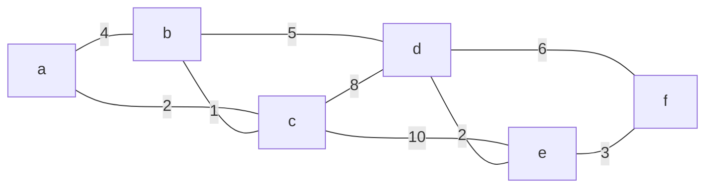

先列表：

| Vertex | S    | Link | $L_0$ | $L_1$ | $L_2$ | $L_3$ | $L_4$ | $L_5$ |
| ------ | ---- | ---- | ----- | ----- | ----- | ----- | ----- | ----- |
| a      |      |      |       |       |       |       |       |       |
| b      |      |      |       |       |       |       |       |       |
| c      |      |      |       |       |       |       |       |       |
| d      |      |      |       |       |       |       |       |       |
| e      |      |      |       |       |       |       |       |       |
| f      |      |      |       |       |       |       |       |       |

初始化，

| Vertex | S    | Link |  $L_0$   | $L_1$ | $L_2$ | $L_3$ | $L_4$ | $L_5$ |
| :----: | ---- | ---- | :------: | :---: | :---: | :---: | :---: | :---: |
|   a    |      |      |    0     |       |       |       |       |       |
|   b    |      |      | $\infty$ |       |       |       |       |       |
|   c    |      |      | $\infty$ |       |       |       |       |       |
|   d    |      |      | $\infty$ |       |       |       |       |       |
|   e    |      |      | $\infty$ |       |       |       |       |       |
|   f    |      |      | $\infty$ |       |       |       |       |       |

第一次迭代,以a为起点。

| Vertex | S    | Link |  $L_0$   |  $L_1$   | $L_2$ | $L_3$ | $L_4$ | $L_5$ |
| :----: | ---- | :--: | :------: | :------: | :---: | :---: | :---: | :---: |
|   a    | 1    |      | ***0***  |          |       |       |       |       |
|   b    |      |  a   | $\infty$ |    4     |       |       |       |       |
|   c    |      |  a   | $\infty$ |    2     |       |       |       |       |
|   d    |      |      | $\infty$ | $\infty$ |       |       |       |       |
|   e    |      |      | $\infty$ | $\infty$ |       |       |       |       |
|   f    |      |      | $\infty$ | $\infty$ |       |       |       |       |

第二次迭代，以c为起点。

| Vertex | S    |      Link       |  $L_0$   |  $L_1$   |  $L_2$   | $L_3$ | $L_4$ | $L_5$ |
| :----: | ---- | :-------------: | :------: | :------: | :------: | :---: | :---: | :---: |
|   a    | 1    |                 |    0     |          |          |       |       |       |
|   b    |      | a$\rightarrow$c | $\infty$ |    4     |    3     |       |       |       |
|   c    | 1    |        a        | $\infty$ | ***2***  |          |       |       |       |
|   d    |      | a$\rightarrow$c | $\infty$ | $\infty$ |    10    |       |       |       |
|   e    |      | a$\rightarrow$c | $\infty$ | $\infty$ |    12    |       |       |       |
|   f    |      |                 | $\infty$ | $\infty$ | $\infty$ |       |       |       |

第三次迭代，以b为起点。

| Vertex | S    |             Link              |  $L_0$   |  $L_1$   |  $L_2$   |  $L_3$   | $L_4$ | $L_5$ |
| :----: | ---- | :---------------------------: | :------: | :------: | :------: | :------: | :---: | :---: |
|   a    | 1    |                               |    0     |          |          |          |       |       |
|   b    | 1    |        a$\rightarrow$c        | $\infty$ |    4     | ***3***  |          |       |       |
|   c    | 1    |               a               | $\infty$ |    2     |          |          |       |       |
|   d    |      | a$\rightarrow$c$\rightarrow$b | $\infty$ | $\infty$ |    10    |    8     |       |       |
|   e    |      |        a$\rightarrow$c        | $\infty$ | $\infty$ |    12    |    12    |       |       |
|   f    |      |                               | $\infty$ | $\infty$ | $\infty$ | $\infty$ |       |       |

第四次迭代，以d为起点。

| Vertex | S    |                    Link                     |  $L_0$   |  $L_1$   |  $L_2$   |  $L_3$   | $L_4$ | $L_5$ |
| :----: | ---- | :-----------------------------------------: | :------: | :------: | :------: | :------: | :---: | :---: |
|   a    | 1    |                                             |    0     |          |          |          |       |       |
|   b    | 1    |               a$\rightarrow$c               | $\infty$ |    4     |    3     |          |       |       |
|   c    | 1    |                      a                      | $\infty$ |    2     |          |          |       |       |
|   d    | 1    |        a$\rightarrow$c$\rightarrow$b        | $\infty$ | $\infty$ |    10    | ***8***  |       |       |
|   e    |      | a$\rightarrow$c$\rightarrow$b$\rightarrow$d | $\infty$ | $\infty$ |    12    |    12    |  10   |       |
|   f    |      | a$\rightarrow$c$\rightarrow$b$\rightarrow$d | $\infty$ | $\infty$ | $\infty$ | $\infty$ |  14   |       |

第五次迭代，以e为起点。

| Vertex | S    |                           Link                            |  $L_0$   |  $L_1$   |  $L_2$   |  $L_3$   |  $L_4$   | $L_5$ |
| :----: | ---- | :-------------------------------------------------------: | :------: | :------: | :------: | :------: | :------: | :---: |
|   a    | 1    |                                                           |    0     |          |          |          |          |       |
|   b    | 1    |                      a$\rightarrow$c                      | $\infty$ |    4     |    3     |          |          |       |
|   c    | 1    |                             a                             | $\infty$ |    2     |          |          |          |       |
|   d    | 1    |               a$\rightarrow$c$\rightarrow$b               | $\infty$ | $\infty$ |    10    |    8     |          |       |
|   e    | 1    |        a$\rightarrow$c$\rightarrow$b$\rightarrow$d        | $\infty$ | $\infty$ |    12    |    12    | ***10*** |       |
|   f    |      | a$\rightarrow$c$\rightarrow$b$\rightarrow$d$\rightarrow$e | $\infty$ | $\infty$ | $\infty$ | $\infty$ |    14    |  13   |

第六次迭代，以f为起点。

| Vertex | S    |                           Link                            |  $L_0$   |  $L_1$   |  $L_2$   |  $L_3$   | $L_4$ |  $L_5$   |
| :----: | ---- | :-------------------------------------------------------: | :------: | :------: | :------: | :------: | :---: | :------: |
|   a    | 1    |                                                           |    0     |          |          |          |       |          |
|   b    | 1    |                      a$\rightarrow$c                      | $\infty$ |    4     |    3     |          |       |          |
|   c    | 1    |                             a                             | $\infty$ |    2     |          |          |       |          |
|   d    | 1    |               a$\rightarrow$c$\rightarrow$b               | $\infty$ | $\infty$ |    10    |    8     |       |          |
|   e    | 1    |        a$\rightarrow$c$\rightarrow$b$\rightarrow$d        | $\infty$ | $\infty$ |    12    |    12    |  10   |          |
|   f    | 1    | a$\rightarrow$c$\rightarrow$b$\rightarrow$d$\rightarrow$e | $\infty$ | $\infty$ | $\infty$ | $\infty$ |  14   | ***13*** |

最后的结果：

a到b的最短路径长度为3，路径为a$\rightarrow$c$\rightarrow$b。

a到c的最短路径长度为2，路径为a$\rightarrow$c。

a到d的最短路径长度为8，路径为a$\rightarrow$c$\rightarrow$b$\rightarrow$d。

a到e的最短路径长度为10，路径为a$\rightarrow$c$\rightarrow$b$\rightarrow$d$\rightarrow$e。

a到f的最短路径长度为13，路径为a$\rightarrow$c$\rightarrow$b$\rightarrow$d$\rightarrow$e$\rightarrow$f。

---

- **Dijkstra's algorithm复杂度**：$O(n^2)$
- **应用模型**：The Traveling Salesperson Problem (TSP/旅行商问题)

> **问题描述**：有一个旅行商人要去$n$个城市，他必须从一个城市出发，经过每个城市一次，最后回到出发的城市。每个城市之间的距离都是已知的，问旅行商人应该如何选择路径，才能保证总的旅行距离最短。
>
> **模型**:weighted,complete,undirected graph.
>
> **等价问题**：找到一个Hamilton circuit，使得这个Hamilton circuit的权重最小。
>
> **解决方法**：穷举法，枚举所有的Hamilton circuit，然后找到权重最小的Hamilton circuit。

## Section 7 Planar graphs 平面图

> 一些概念们：
>
> - **region**（区域）: a part of the plane completely disconnected off from other parts of the plane by the edges of the graph.（平面上被图的边完全隔离的部分）
>
> > **Bounded region**（有界区域）: a region that is bounded by edges of the graph and the boundary of the plane.（被图的边和平面边界隔离的区域）
> >
> > **Unbounded region**（无界区域）: a region that is not bounded by edges of the graph and the boundary of the plane.（也就是平面上的无穷区域）
> >
> > **The boundary of a region**（区域的边界）: the edges of the graph that bound the region.（区域被图的边隔离的边）
> >
> > **The degree of a region $R$ Deg($R$)**（区域的度数）: the number of the edges which surround R, suppose R is a region of a connected planar simple graph.（区域被图的边隔离的边的个数）
> >
> > **Adjacent regions**（相邻区域）: two regions are adjacent if they share a common edge.（两个区域有公共边）
> >
> > > e不是割边的话，必然为两个区域的公共边界。
---
> Example:对于下面的图，有4个区域.

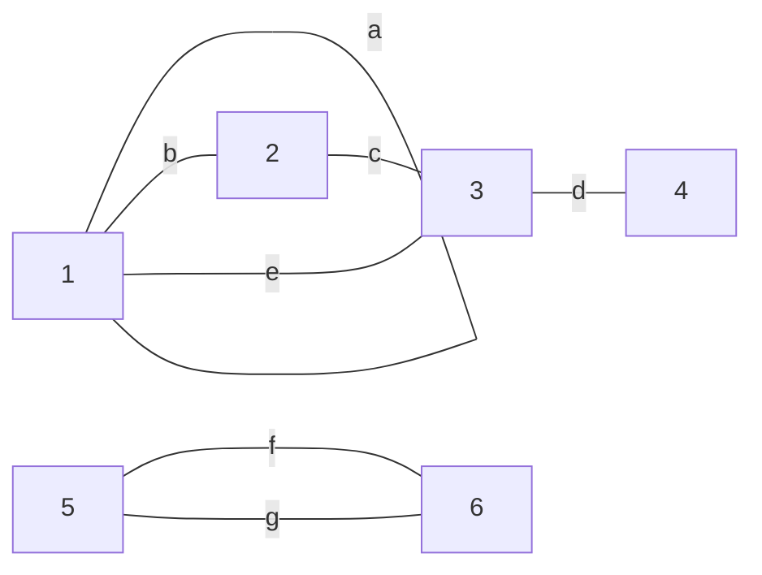

> the boundary of region :
>
> - $R_1$ : $a$
> - $R_2$ : $b,c,e$
> - $R_3$ : $f,g$
> - $R_0$ : $a,b,c,d,d,e,f,g$
>
> 因此，$Deg(R_1)=1,Deg(R_2)=3,Deg(R_3)=2,Deg(R_0)=8$.
---
> **Note**:
>
> The sum of the degrees of the regions is exactly twice the number of edges in the planar graph, $2e = \underset {all~region~R}{\sum} Deg(R)$.

- **Planar graph**（平面图）: a graph is **planar** if it can be drawn in the plane without any edges crossing.
- 也就是说，平面图可以被画在平面上，而且不会有边相交。

> **Note**：
>
> - Complete Bipartite Graphs $K_{2,n}(n \geq 1)$ are planar.
> - Complete Graphs $K_{1,n}$ are planar.

### Planar graphs 的一些必要条件

- **Eular formula**（欧拉公式）: If $G$ is a connected planar graph with $v$ vertices, $e$ edges, and $r$ regions, then $v-e+r=2$.

> Construct a dodecahedron（正十二面体）:
>
> 用欧拉公式计算出顶点数、边数。正十二面体中$r=12$
>
> 设正十二面体由正$n$边形组成，所以有$\frac{rn}{2}$条边(每条边被两个正$n$边形共用)。
>
> 假设每个顶点都引出了$k$条边，所以$v=\frac{rn}{k}$。
>
> 所以$v-e+r=2$，即$\frac{rn}{k}-\frac{rn}{2}+r=2$，得到$n=\frac{5}{3-\frac{6}{k}}$。
>
> 所以使得n为正整数的$k$只有$k=5$。
>
> 所以正十二面体包含20个顶点，30条边，12个区域。

- 欧拉公式对非连通图：$v-e+r=k+1$，其中$k$是连通分量的个数。
- **[Corollary 1]** If $G$ is a connected planar simple graph with $v$ vertices and $e$ edges, where $v \geq 3$, then $e \leq 3v-6$.

> 因为每个区域的度数至少为3，所以$2e = \underset {all~region~R}{\sum} Deg(R) \geq 3r$，所以$r \leq \frac{2}{3}e$，代入欧拉公式得到$e \leq 3v-6$。

- 对于非连通图：$e \leq 3v-6$也成立

> 因为每个连通分量都满足$e \leq 3v-6$，所以$e \leq 3v-6$。

- **[Corollary 2]** If $G$ is a connected planar simple graph with $v$ vertices and $e$ edges, where $v \geq 3$ and $G$ has no circuits of length 3, then $e \leq 2v-4$.

> 因为每个区域的度数至少为4，所以$2e = \underset {all~region~R}{\sum} Deg(R) \geq 4r$，所以$r \leq \frac{1}{2}e$，代入欧拉公式得到$e \leq 2v-4$。

- Generalization of Corollary 2: If $G$ is a connected planar simple graph with $v$ vertices and $e$ edges, where $v \geq 3$ and $G$ has circuits of length *at least* $k$, then $e \leq \frac{(v-2)k}{k-2}$.

- **[Corollary 3]** If $G$ is a connected planar simple graph, then $G$ *has a* vertex of degree at most 5.

### Kuratowski's theorem

> 一些基本概念：
>
> **Elementary subdivision**（基本细分）: an **elementary subdivision** of a graph $G$ is a graph obtained from $G$ by subdividing an edge of $G$.（在边上插入一个顶点）
>
> **Homeomorphic**（同胚）: two graphs are **homeomorphic** if they can be obtained from the same graph by a sequence of elementary subdivisions and edge contractions.（在边上添加顶点或删去度为2的顶点，使得两个图相同）

**[Kuratowski's theorem]** A graph is nonplanar if and only if it contains a subgraph that is homeomorphic to $K_5$ or $K_{3,3}$.

## Section 8 Coloring of graphs

**Dual graph**（对偶图）:

- Each region of the map is represented by a vertex.
- Edge connect two vertices if the regions represented by these vertices have a common border.
- Two regions that touch at only one point are not considered adjacent.

**Coloring**（着色）: a **coloring** of a graph $G$ is an assignment of a color to each vertex of $G$ so that no two adjacent vertices are assigned the same color.(给图的每个顶点赋予一个颜色，使得相邻的顶点颜色不同。)

**Chromatic number**（色数）: the **chromatic number** of a graph $G$, denoted by $\chi(G)$, is the minimum number of colors needed to color $G$.

> The chromatic numbers of some simple graphs:
>
> - $\chi(K_n) = n$
> - $\chi(C_n) = 2$ if $n$ is even, $\chi(C_n) = 3$ if $n$ is odd.
> - $\chi(K_{m,n}) = 2$
>
> > Note: A simple graph $G$ is bipartite if and only if $\chi(G) = 2$.

Construct a coloring of a graph $G$:

1. List the vertices in order of decreasing degree.
2. Color the vertices in this order, using the smallest possible color at each step.
3. If a vertex cannot be colored with any of the colors already used, then add a new color to the list of available colors and use this color to color the vertex.
4. Repeat step 3 until all vertices are colored.
5. The number of colors used is the chromatic number of $G$.

**The Four Color Theorem**（四色定理）: The chromatic number of any planar graph is at most 4.
