# Chapter 11 - Trees

## 11.1 - Introduction

- **Tree**:  a connected undirected graph with no simple circuits.
    - Any tree must be **a simple graph**.
    - Every tree is a **bipartite graph**.

- **forest**: a graph with no simple circuits, but not necessarily connected.

 **[Theorem 1]**:  An undirected graph is a tree if and only if there is a unique simple path between any two of its vertices.

- **rooted tree**: A rooted tree is a tree in which one vertex has been designated as the root and every edge is directed away from the root.
（有向树）

    - An **unrooted tree** is converted into different rooted trees when different vertices are chosen as the root.
    - 注意区分**rooted tree**和**unrooted tree**，题目让你枚举时，**rooted tree**可以由同一个**unrooted tree**转化为不同的**rooted tree**。
- **parent**: a vertex adjacent to a vertex $v$ on the unique path from $v$ to the root.

- **child**: a vertex adjacent to a vertex $v$ that is the parent of $v$.

- **sibling**: vertices that have the same parent.

- **ancestor**: a vertex $w$ that lies on the unique path from the root to $v$.

- **descendant**: a vertex $w$ that has $v$ as an ancestor.

- **leaf**: a vertex of degree 1.

- **internal vertex**: a vertex of degree at least 2.

- **subtree**: the tree consisting of a vertex and its descendants.

---

- **m-ary tree**: a rooted tree in which each internal vertex has no more than $m$ children.
    - If $m = 2$, the tree is called a **binary tree**.
    - If each internal vertex has exactly $m$ children, the tree is called a **full m-ary tree**.

- **Ordered rooted tree**: a rooted tree in which the children of each internal vertex are ordered.
    - In an ordered binary tree, the two possible children of a vertex are called the left child and the right child, if they exist.（顶点的两个可能的子节点称为左子节点和右子节点。）
    - The tree rooted at the left child is called the left subtree, and that rooted at the right child is called the right subtree.（以左子节点为根的树称为左子树，以右子节点为根的树称为右子树。）
  -有序树的同构，要求节点的子节点的顺序也相同。

**[Theorem 2]**:  A tree with $n$ vertices has $n-1$ edges

>〖Example〗A tree has two vertices of degree 2, one vertex of degree 3, three vertices of degree 4. How many leafs does this tree has?
>
> 1. 假设有 $x$ 个leaf，那么树的总顶点数
>
> $$v = x+2+1+3 = x+6$$
>
> 总度数为
>
> $$x+2×2+1×3+3×4=x+19$$
>
> 2. 因为边的总数为总度数的一半，所以
>
> $$x+19=2e$$
>
> 3. 根据定理2，我们有
>
> $$e=v-1$$
>
> 所以
>
> $$x+19=2(v-1)=2(x+5)$$
>
> 解得
>
> $$n=9$$
>

**[Theorem 3]**:  A **full m-ary tree** with $i$ internal vertices contains $n = mi + 1$ vertices and $l = (m-1)i + 1$ leaves.

- 由此可以构建出一棵full m-ary tree中的internal vertices, leaves, vertices的关系。

 **Level of a vertex**: the number of edges on the unique path from the root to the vertex.
> Root的Level为0，其余顶点的Level为其父节点的Level+1。

- **Height of a tree**: the maximum level of any vertex in the tree.

- **Balanced m-ary tree**: a full m-ary tree of height $h$ is balanced if all leaves are at level $h$ ***or*** $h-1$.

**[Theorem 4]**:  There are at most $m^h$ leaves in **an m-ary tree** of height $h$.

**[Corollary]**:  If an m-ary tree of height $h$ has $l$ leaves, then $h \geq \lceil \log_m l \rceil$, and $h = \lceil \log_m l \rceil$ if the tree is balanced and full.

## 11.2 - Applications of Trees

**Binary Search Tree**: a binary tree in which the key in each node is greater than all keys in its left subtree and less than all keys in its right subtree.(二叉搜索树中每个节点的键值大于其左子树中的所有键值，小于其右子树中的所有键值。)

> **复杂度**：如果这个二分搜索树是balanced，那么定位或增加一个元素的比较次数不超过$\lceil \log (n+1) \rceil$

**Decision Tree**: A rooted tree in which each internal vertex corresponds to a decision, with a subtree at these vertices for each possible outcome of the decision.(决策树是一种有根树，其中每个内部顶点对应一个决策，每个决策的可能结果在这些顶点处有一个子树。)

**Prefix Codes**: 是一种特殊的编码方式，每个字符对应一个编码，且任意一个字符的编码都不是另一个字符编码的前缀。
重要例子：**霍夫曼编码**。

> 1. 从频率最低的开始，每次取出两个频率最低的，合并成一个新的频率，直到只剩一个频率。
> 2. 从根节点开始，左子节点编码为0，右子节点编码为1，直到叶子节点。
> 3. 从根节点到叶子节点的路径就是该叶子节点的编码。
>
>> 〖Example 1〗 Use Huffman coding to encode the following symbols with the frequencies listed: $A:0.08,~B:0.10,~C:0.12,~D:0.15,~E:0.20,~F:0.35$. What is the average number of bits used to encode a character?
>> 该例子中，频率小的在右边


开始合并：

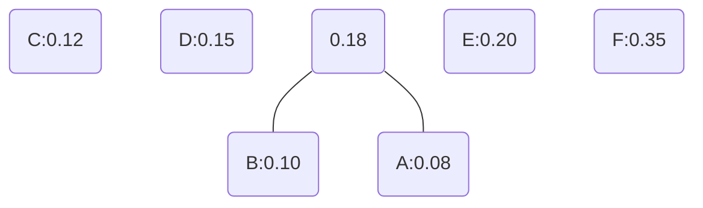

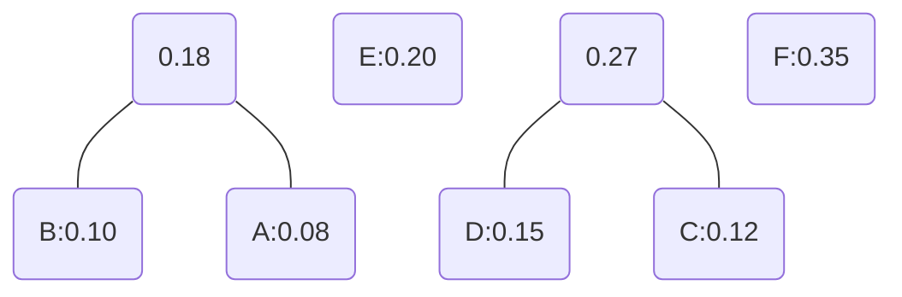

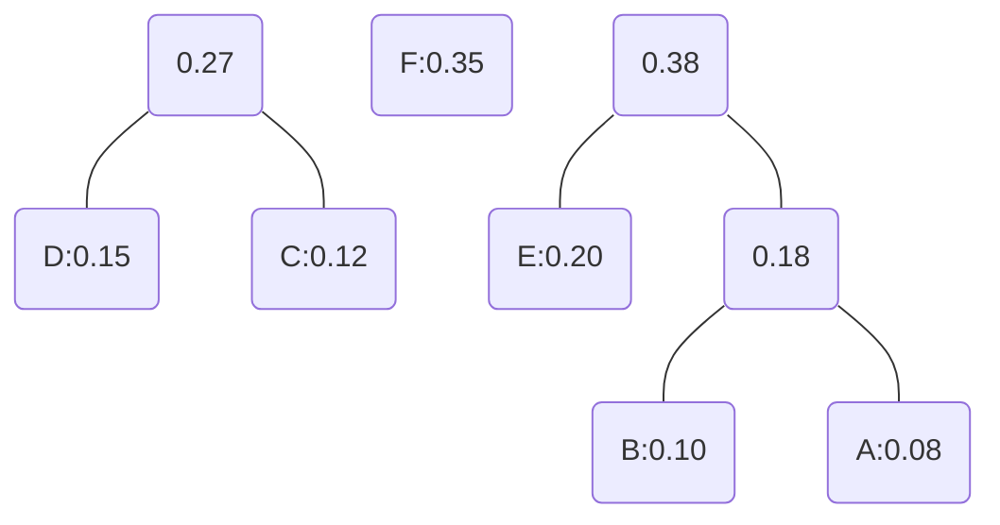

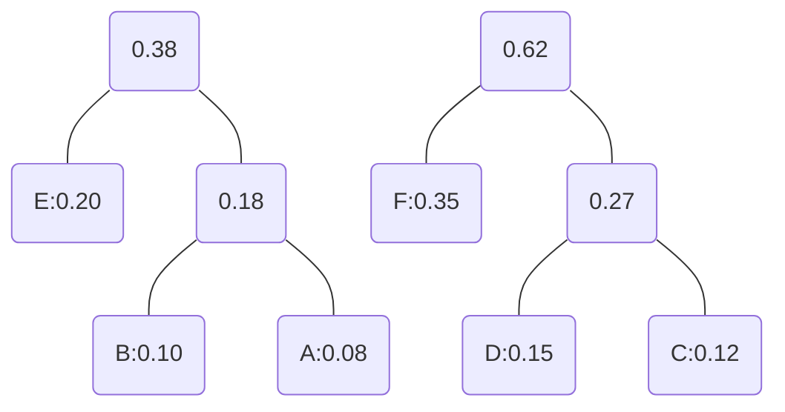

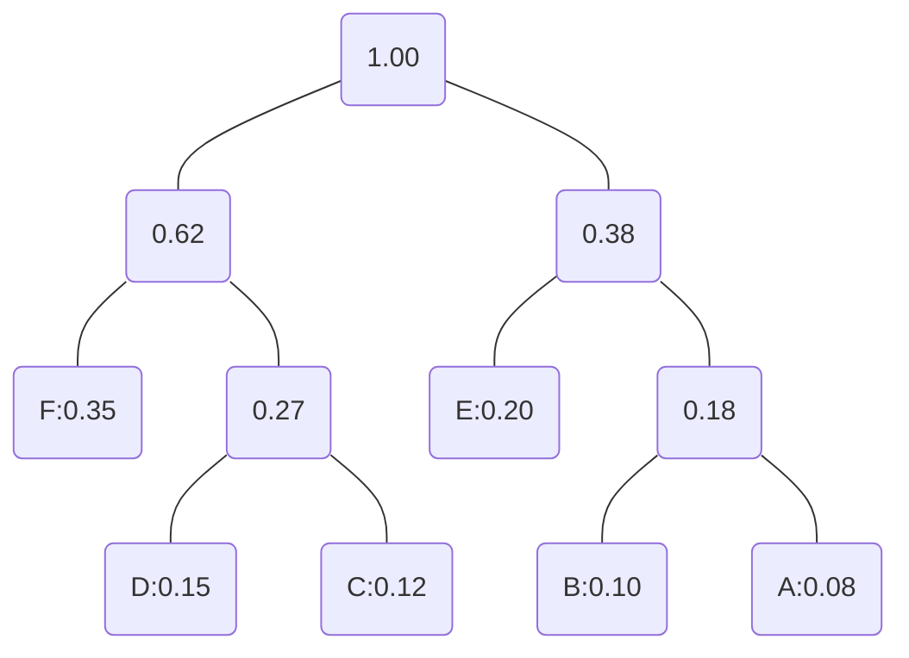

> 向左为零，向右为一，得到编码：
> F:00,D:010,C:011,E:10,B:110,A:111
> 所以平均编码长度为：$0.35×2+0.15×3+0.12×3+0.20×2+0.10×3+0.08×3=2.45$

## 11.3 - Tree Traversal(树的遍历)

- **preorder traversal(前序遍历)**: 先访问*根节点*，然后递归地前序遍历*左子树*，最后递归地前序遍历*右子树*。

- **inorder traversal(中序遍历)**: 递归地中序遍历*左子树*，然后访问*根节点*，最后递归地中序遍历*右子树*。

- **postorder traversal(后序遍历)**:递归地后序遍历*左子树*，然后递归地后序遍历*右子树*，最后访问*根节点*。

> 〖Example〗: 用前序遍历、中序遍历、后序遍历的方式遍历下面的树。

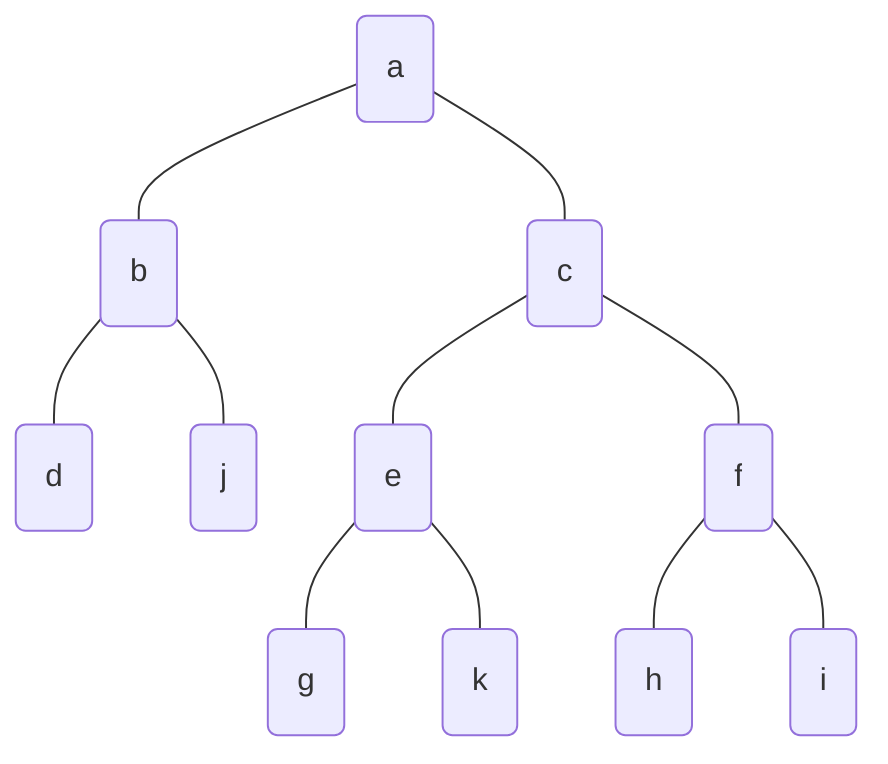

> Preorder: a,b,d,j,c,e,g,k,f,h,i
> Inorder: d,b,j,a,g,e,k,c,h,f,i
> Postorder: d,j,b,g,k,e,h,i,f,c,a
---
> 〖Example〗 There is a binary tree. Its preorder traversal is ABDECF，and its
inorder traversal is DBEACF. Its postorder traversal is _____________?
>
> 1. 根据前序遍历，我们知道A是根节点。
> 2. 根据中序遍历，我们知道BDE在A的左子树，CF在A的右子树。
> 3. 根据前序遍历，我们知道BDE在A的左子树，所以B是A的左子节点，D是B的左子节点，E是D的右子节点。
> 4. 根据前序遍历，我们知道CF在A的右子树，所以C是A的右子节点，F是C的右子节点。
> 5. 所以，该树的后序遍历为：DEBFCA

- **Expression Tree**: a binary tree in which each internal node corresponds to an operator and each leaf node corresponds to an operand.(表达式树是一种二叉树，其中每个内部节点对应一个运算符，每个叶节点对应一个操作数。)
    - Each leaf node contains a single operand(每个叶节点包含一个操作数).
    - Each nonleaf node contains an operator(每个非叶节点包含一个运算符，并且有两个子节点).
    - The left and right subtrees of an operator node represent subexpressions that must be evaluated before applying the operator at the root of the subtree(运算符节点的左子树和右子树表示必须在应用子树根处的运算符之前计算的子表达式).

> 〖Example〗: What is the odered tree that represents the expression $3*\ln(x+1)+\frac{a}{x^2}$?

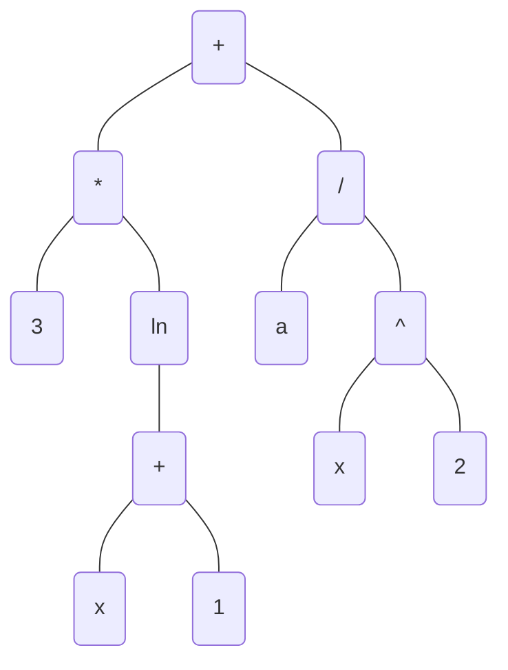

- **Infix Form(中缀表达式)**: the operator is between the operands.
  > 〖Example〗: $3*\ln(x+1)+\frac{a}{x^2}$
- **Prefix Form(前缀表达式)**: the operator is before the operands.
  > 〖Example〗: $+*3\ln+x1/a\hat~x2$
- **Postfix Form(后缀表达式)**: the operator is after the operands.
  > 〖Example〗: $3x1+\ln*ax2\hat~/+$

> 〖Example〗: The string $2~~3~~a~~\cdot~~x~~+~~4~~\wedge~~+~~7~~\wedge$ is **postfix** notation for an algebraic expression.
Write the expression in prefix notation
>
> 1. **从左往右**，遇到第一个运算符，将其与其前的两个操作数组成一个新的表达式。
> 在本例中，第一个运算符是$~~\cdot~~$，其前的两个操作数是$3$和$a$，所以新的表达式为$3\cdot a$。
> 2. 将新的表达式替换原来的两个操作数，得到新的表达式$2~~(3\cdot a)~x + 4 \wedge + 7 \wedge$。
> 3. 重复步骤1和2，得到新的表达式$2~~((3\cdot a) +x~) 4 \wedge + 7 \wedge$。
> 4. 重复步骤1和2，得到新的表达式$2~~(((3\cdot a) +x~)\wedge 4)  + 7\wedge~$。
> 5. 重复步骤1和2，得到新的表达式$(2+(((3\cdot a) +x~)\wedge 4) ) 7\wedge~$。
> 6. 重复步骤1和2，得到新的表达式$(2+(((3\cdot a) +x~)\wedge 4) ) \wedge 7$。
> 7. 最终得到的表达式为$(2+(((3\cdot a) +x~)\wedge 4) ) \wedge 7$。
>
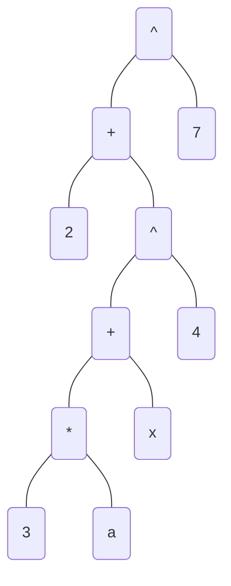

> 8. 其前缀表达式为$\wedge +2\wedge +\cdot 3~a~x~4~7$

---
> 〖Example〗Find the value of $-~~\wedge~~x~~*~~5~~t~~/~~4~~-~~7~~c$ (in **prefix** notation) when $x = 2,~t = 1,~c = 5$.
>
> 1. **从右往左**，遇到第一个运算符，将其与其后的两个操作数组成一个新的表达式。
> 在本例中，第一个运算符是$~~-~~$，其后的两个操作数是$7$和$c$，所以新的表达式为$7-c$。
> 2. 将新的表达式替换原来的两个操作数，得到新的表达式$-~~\wedge~~x~~*~~5~~t~~/~~4~~(7-c)$。
> 3. 重复步骤1和2，得到新的表达式$-~~\wedge~~x~~*~~5~~t~~(4/(7-c))$。
> 4. 重复步骤1和2，得到新的表达式$-~~\wedge~~x~~(5*t)~~(4/(7-c))$。
> 5. 重复步骤1和2，得到新的表达式$-~~(x\wedge(5*t))~~(4/(7-c))$。
> 6. 重复步骤1和2，得到新的表达式$(x\wedge(5*t))-(4/(7-c))$。
> 7. 也就是$x^{5t}-\frac{4}{7-c}$。
> 8. 将$x = 2,~t = 1,~c = 5$代入，得到$x^{5t}-\frac{4}{7-c}=2^5-\frac{4}{7-5}=32-2=30$。
>

总结：**prefix**和**postfix**的区别在于运算符的位置：

- **prefix**的运算符在操作数的前面，所以**从右往左**遍历
- **postfix**的运算符在操作数的后面，所以**从左往右**遍历

## 11.4 - Spanning Trees

- **Spanning Tree**: a spanning tree of a graph $G$ is a subgraph of $G$ that is a tree containing every vertex of $G$.
    - A graph may have many different spanning trees.
    - A graph may have no spanning trees, if it is disconnected.
    - A graph may have spanning trees with different numbers of edges.

**[Theorem 1]**:  A simple graph is connected if and only if it has a spanning tree.

### 构建生成树

- Theorem 1 gives an algorithm for finding spanning trees by removing edges from simple circuits.

Instead of constructing spanning trees by removing edges, spanning trees can be built up by successively adding edges.

#### Depth-first search（深度优先搜索）

- **Depth-first search(DFS/backtracking)**: this procedure forms a rooted tree, and the underlying undirected graph is a spanning tree(这个过程形成一个有根树，底层的无向图是一棵生成树).

> 1. 任意选择一个顶点作为根。
> 2. 从这个顶点开始，通过不断添加边来形成一条路径，其中每条新边与路径中的最后一个顶点和尚未在路径中的顶点相邻。
> 3. 只要可能，就继续向这条路径添加边。
> 4. 如果路径经过图的所有顶点，则由该路径组成的树是一棵生成树。
> 5. 如果路径没有经过所有顶点，则必须添加更多边。如果可能的话，回到路径中的倒数第二个顶点，在这个顶点开始形成一条新的路径，通过尚未访问的顶点。如果不能这样做，就回到路径中的另一个顶点。
> 6. 重复这个过程

---
> 〖Example〗: Use depth-first search to find a spanning tree for the directed graph below.

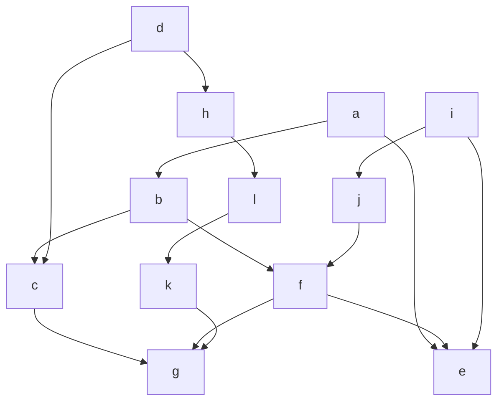
>
> 1. 从没有入度的顶点开始，这里有三个：$a$，$d$，$i$，我们从$a$开始。
> 2. 因为$e$已经被访问过了，所以$a$没有其他的child，以$a$为根的树已经构建完成，开始构建以$d$为根的树。
> 3. 以$d$为根的树构建完成，开始构建以$i$为根的树。
>
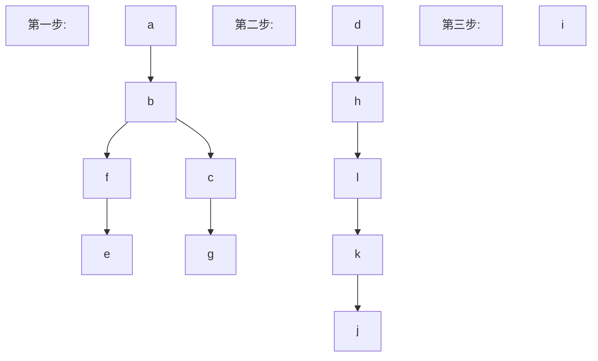

#### Breadth-first search（广度优先搜索）

- **Breadth-first search(BFS)**:

> 1. 任意选择一个顶点作为根，将与该顶点相邻的所有边添加到树中。
> 2. 在这个阶段添加的新顶点成为生成树中的第一级顶点。任意排序它们。
> 3. 对于每个在第一级的顶点，按顺序访问，将与该顶点相邻的每条边添加到树中，只要它不产生一个回路。任意排序每个第一级顶点的子顶点。这样就得到了树中的第二级顶点。
> 4. 重复相同的过程，直到树中的所有顶点都被添加。

---
> 〖Example〗: Use breadth-first search to find a spanning tree for the graph below.

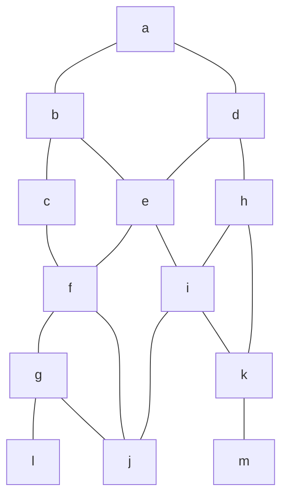

> 任意选择一个顶点作为根，这里选择$e$。

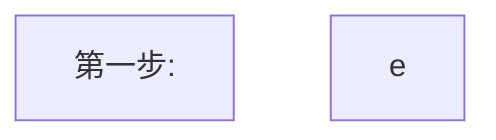

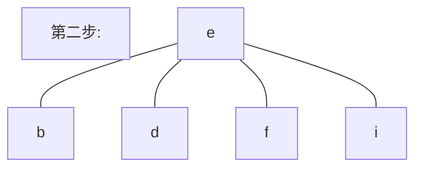

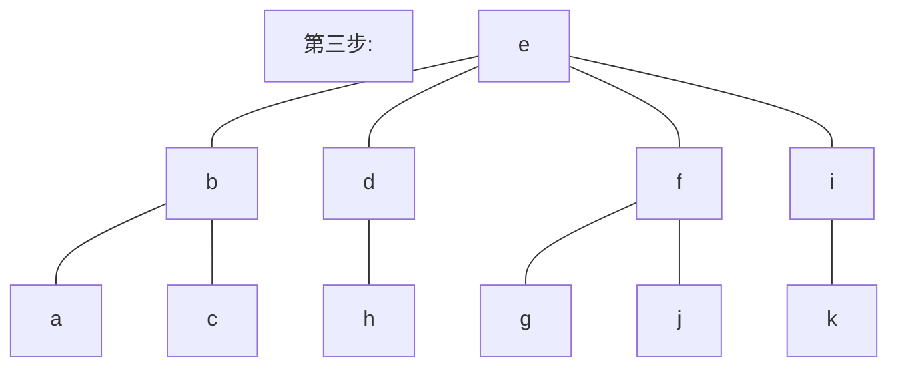

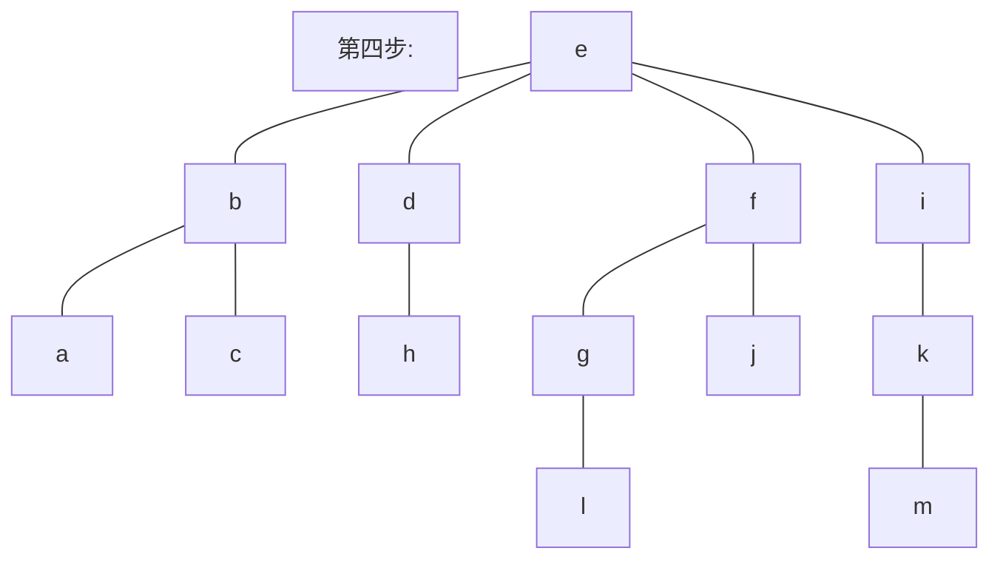

### Backtracking scheme（回溯方案）
>
> 应用：
>
> - Graph coloring
> - The Q-queens problem
> - Sums of subsets
>
- **Backtracking scheme**: to search systematically for a solution is to use a decision tree, where each internal vertex represents a decision and each leaf a possible solution.(系统地搜索解决方案的方法是使用决策树，其中每个内部顶点表示一个决策，每个叶子表示一个可能的解决方案。)

其实就是枚举，例如：
> 用三种颜色对下面的图进行着色，使得相邻的顶点颜色不同。

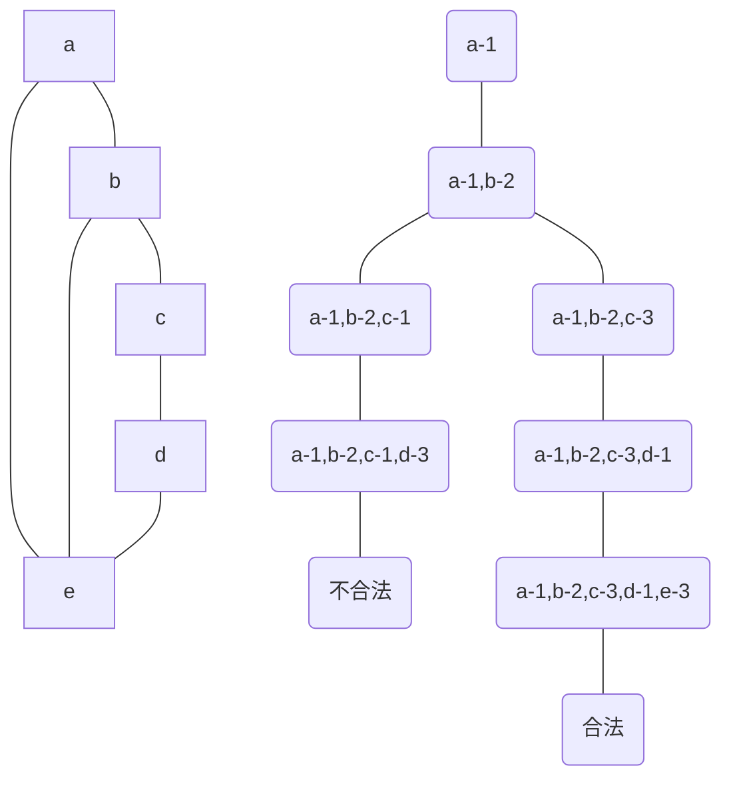

### Minimum Spanning Trees（最小生成树）

- **Minimum Spanning Trees**: a spanning tree of a connected weighted graph $G$ is a spanning tree whose sum of edge weights is as small as possible.

#### Prim's Algorithm（普里姆算法）

- **Prim's algorithm**:

> Example: Use Prim's algorithm to find a minimum spanning tree for the graph below.

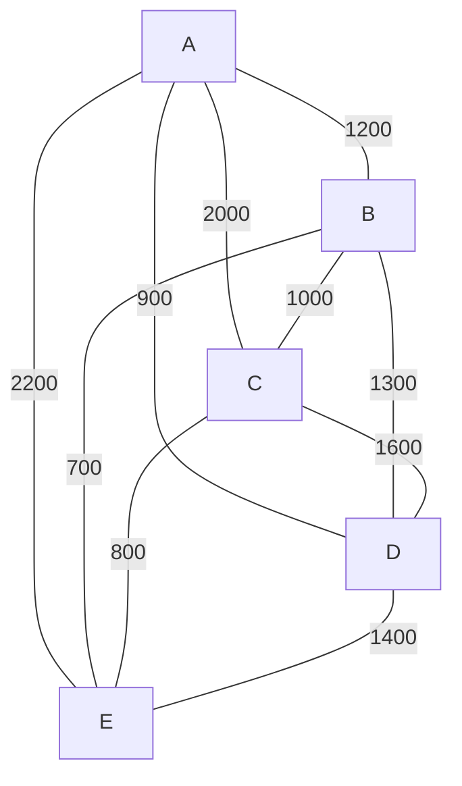

> 任意选择一个顶点作为根，这里选择$A$。

| 已选择的顶点 | 未选择的顶点 | 最小权重的边 | Cost |
| :---: | :---: | :---: | :---: |
| A | B,C,D,E | A-D | 900 |
| A,D | B,C,E | A-B | 1200 |
| A,D,B | C,E | B-E | 700 |
| A,D,B,E | C | C-E | 800 |

> 所以最小生成树为：

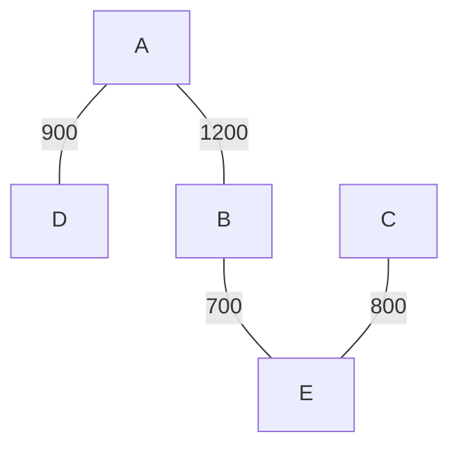

#### Kruskal's Algorithm（克鲁斯卡尔算法）

- **Kruskal's algorithm**:

> Example: Use Kruskal's algorithm to find a minimum spanning tree for the graph below.


> 从最小权重的边开始，这里是$B-E$。
>
> 然后是$E-C$, $A-D$,
>
> 下一个应该是$B-C$，但是这样会产生回路，所以跳过。
>
> 然后是$B-A$,所有的顶点都已经被访问过了，所以最小生成树为：

```mermaid
graph TD
B --700--- E;
E --800--- C;
A --900--- D;
A --1200--- B;
```
