# 第一讲：随机变量的熵和互信息

!!! note ""

    - 掌握随机事件的自信息，互信息的概念及物理意义
    - 了解条件事件的互信息与联合事件的互信息
    - 掌握随机变量的熵的概念以及物理意义
    - 了解随机变量的条件熵和联合熵及其性质
    - 掌握随机变量互信息定义以及互信息的性质

## 概率论基础

!!! note "随机变量的概率空间"

    随机变量的概率空间可以表示为 $\{X,\mathcal{X},q(X)\}$，其中 $X$ 为随机变量，$\mathcal{X} = \{x_k;k=1,2,\cdots,K\}$ 为 $X$ 的取值空间，$q(x)$ 为事件 $\{X=x\}$ 的概率。显然我们有：

    $$
    q(x)>0,\quad \sum_{x\in\mathcal{X}}q(x)=1
    $$

!!! note "联合变量对 $(X,Y)$"

    二维随机变量 $\{X,Y\}$ 的联合概率空间可以表示为 $\{(X,Y),\mathcal{X}\times\mathcal{Y},p(x,y)\}$，其中 $p(x,y)$ 为事件 $\{X=x,Y=y\}$ 的概率。我们有：

    $$
    \begin{aligned}
    &p(x,y)=P\{X=x,Y=y\},\mathcal{X}=\{x_k;k=1,2,\cdots,K\},\mathcal{Y}=\{y_j;j=1,2,\cdots,J\}\\
    &\sum_k p(x_k,y_j)=\omega(y_j),\quad \sum_j p(x_k,y_j)=q(x_k)
    \end{aligned}
    $$

!!! note "条件概率"

    $$p(x|y)=\frac{p(x,y)}{\omega(y)},\quad p(y|x)=\frac{p(x,y)}{q(x)}$$

## 自信息

!!! note ""
    自信息：事件发生后提供的信息量。

**信息量**是信息论的重要概念，事件的**信息量**基于该事件发生的**概率**：

$$I(x_k)=-\log_aq(x_k)$$

!!! note ""

    当 $a=2$ 时，信息量的单位是比特（bit）；当 $a=e$ 时，信息量的单位是纳特（nat）。

定义为概率的负对数的优点：

- 符合**概率越小，信息量越大**的要求
- 对数函数是比较简单的函数，**容易进行数学处理**，
- **对数函数的可加性**符合生活中关于**信息可叠加性**的经验

!!! note "事件自信息的本质"

    1. 事件发生后对外界(观察者)所提供的信息量。
    2. 事件发生前外界(观察者)为确证该事件的发生所需要的信息量，也是外界为确证该事件所需要付出的代价。
    3. 事件的自信息并不代表事件的不确定性，事件本身没有不确定性可言，它要么是观察的假设和前提，要么是观察的结果。

概率越小的事件，其自信息越大，概率为1的事件，其自信息为0。

### 条件自信息

对于二维随机变量 $\{(X,Y),\mathcal{X}\times\mathcal{Y},p(x,y)\}$，事件 $Y=y_j$ 发生后，事件 $X=x_k$ 的条件自信息为：

$$I(x_k|y_j)=-\log p(x_k|y_j)$$

!!! note "事件条件自信息的本质"

    1. 事件 $Y=y_j$ 发生后，事件 $X=x_k$ 再发生需要新的信息量。
    2. 事件 $Y=y_j$ 发生后，事件 $X=x_k$ 再发生提供给观察者的信息量。

### 联合自信息

对于二维随机变量 $\{(X,Y),\mathcal{X}\times\mathcal{Y},p(x,y)\}$，事件 $(X,Y)=(x_k,y_j)$ 的联合自信息为：

$$I(x_k,y_j)=-\log p(x_k,y_j)$$

## 互信息

!!! note ""
    互信息：相互之间提供的信息量。

**互信息**是衡量两个随机变量之间的相关性的重要指标，定义为：

$$I(x_k;y_j)=I(x_k)-I(x_k|y_j)=\log\frac{p(x_k,y_j)}{q(x_k)\omega(y_j)}$$

显然可以看出，互信息有对称性 $I(x_k;y_j)=I(y_j;x_k)$

!!! note "互信息的本质"

    1. 事件 $Y=y_j$ 发生后对事件 $X=x_k$ 不确定性的减少量。
        $I(x_k)$ 表示事件 $X=x_k$ 发生前的不确定性，$I(x_k|y_j)$ 表示事件 $Y=y_j$ 发生后事件 $X=x_k$ 的不确定性。
        
        比如说 $I(x_k)=2$，$I(x_k|y_j)=1$，那么 $I(x_k,y_j)=1$，表示事件 $Y=y_j$ 发生后事件 $X=x_k$ 的不确定性减少了1。

        比如说 $I(x_k)=2$，$I(x_k|y_j)=3$，那么 $I(x_k,y_j)=-1$，表示事件 $Y=y_j$ 发生后事件 $X=x_k$ 的不确定性增加了1。

### 条件互信息

在给定事件 $Z=z$ 的条件下，事件 $X=x$ 和事件 $Y=y$ 的条件互信息为：

$$I((x;y)|z)=I(x|z)-I(x|(y,z))=\log \frac{p(x|(y,z))}{q(x|z)}=\log\frac{p(x,y|z)}{q(x|z)\omega(y|z)}$$

!!! note ""
    这里的 $I(x;y|z)$ 表示 $I(x;y)$ 在给定 $Z=z$ 的条件下的值。

    直接从原先的推导结果出发，因为$I(x;y)=\log\frac{p(x,y)}{q(x)\omega(y)}$，所以：

    $$
    I(x;y|z)=\log\frac{p(x,y|z)}{q(x|z)\omega(y|z)}
    $$

表示在给定事件 $Z=z$ 的条件下，事件 $X=x$ 和事件 $Y=y$ 相互之间提供的信息量。

### 联合互信息

联合事件 $\{Y=y,Z=z\}$ 与事件 $\{X=x\}$ 之间的互信息为:

$$I(x;(y,z))=\log\frac{p(x|y,z)}{q(x)}=\log\frac{p(x,y,z)}{q(x)\omega(y,z)}$$

表示事件 $Y=y$ 和事件 $Z=z$ 联合发生后对事件 $X=x$ "不确定性的减少量 / 提供的信息量"。

#### 链式法则

$$I(x;(y,z))=I(x;y)+I(x;z|y)$$

事件 $Y=y$ 和事件 $Z=z$ 联合发生后对事件 $X=x$ 的信息量等于[事件 $Y=y$ 对事件 $X=x$ 的信息量]加上[事件 $Y=y$ 发生后事件 $Z=z$对事件 $X=x$ 的信息量]。

## 熵

!!! note ""
    熵：随机变量的不确定性。

**熵**是衡量随机变量不确定性的重要指标，定义为随机变量各个事件的平均自信息：

$$H(X)=E[I(X)]=\sum_{x\in\mathcal{X}}q(x)I(x)=-\sum_{x\in\mathcal{X}}q(x)\log q(x)$$

!!! note "**熵**与**自信息**的区别"

     - **自信息**是对单个事件的信息量的度量，是对某个事件发生后提供的信息量的度量。
     - **熵**是对随机变量的不确定性的度量，是对随机变量各个事件的平均信息量的度量。

!!! note "例子"
    二元随机变量 $X$ 的概率分布 $q(x_1)=p,q(x_2)=1-p$，则 $X$ 的熵为：

    $$
    H(X)=-p\log p-(1-p)\log(1-p)
    $$

    当 $p=0.5$ 时，$H(X)=1$，表示 $X$ 的不确定性最大；当 $p=0$ 或 $p=1$ 时，$H(X)=0$，表示 $X$ 的不确定性最小。

### 条件熵

#### 给定事件

在给定事件 $Y=y$ 的条件下，事件 $X$ 的条件熵为：

$$H(X|Y=y)=-\sum_{x\in\mathcal{X}}p(x|y)\log p(x|y)$$

$H(X|y)$ 不一定比 $H(X)$ 小，可能随着 $y$ 的引入，系统更加混乱。

#### 随机变量

在随机变量 $Y$ 的条件下，随机变量 $X$ 的条件熵为 $H(X|y)$ 对 $y$ 的平均：

$$
    \begin{aligned}
    H(X,Y)&=E[H(X|y)]\\
    &=-\sum_{y\in\mathcal{Y}}\omega(y)\sum_{x\in\mathcal{X}}p(x|y)\log p(x|y)\\
    &=-\sum_{y\in\mathcal{Y}}\sum_{x\in\mathcal{X}}p(x,y)\log p(x|y)
    \end{aligned}
$$

当 $X$ 和 $Y$ 统计独立时，$H(X|Y)=H(X)$。

### 联合熵

对于二维随机变量 $\{(X,Y),\mathcal{X}\times\mathcal{Y},p(x,y)\}$，事件 $(X,Y)$ 的联合熵为：

$$H(X,Y)=-\sum_{x\in\mathcal{X}}\sum_{y\in\mathcal{Y}}p(x,y)\log p(x,y)$$

表示随机变量 $X$ 和 $Y$ 联合发生后的不确定性。

#### 链式法则

$$H(X,Y)=H(X)+H(Y|X)=H(Y)+H(X|Y)$$

随机变量 $X$ 和 $Y$ 联合发生后的不确定性等于随机变量 $X$ 的不确定性加上在给定 $X$ 的条件下随机变量 $Y$ 的不确定性。

当 $X$ 和 $Y$ 统计独立时，$H(X,Y)=H(X)+H(Y)$。

三元：

$$H(X,Y,Z)=H(X)+H(Y|X)+H(Z|X,Y)$$

### 熵的性质

对于随机变量 $X$ ，如果

$$\mathbb{X}=\begin{pmatrix}x_1&x_2&\cdots&x_K\\p_1&p_2&\cdots&p_K\end{pmatrix}$$

则有：

$$H(X)\triangleq H_K({p_1,p_2,\cdots,p_K})\triangleq H_K(P)=-\sum_{k=1}^Kp_k\log p_k$$

1. $H_K(P)$ 对概率矢量 $P$ 的分量是**对称的**，即 $H_K(P)$ 对 $p_1,p_2,\cdots,p_K$ 的排列是不变的——$p_1,p_2,\cdots,p_K$ 的排列不同，$H_K(P)$ 的值不变。
2. **非负性**：$H(X)\geq 0$
3. **确定性**：$H(X)=0$ 当且仅当 $X$ 是**确定性**的随机变量，即 $X$ 的取值只有一个。
4. **可扩展性**：$\lim_{\epsilon\to 0}H_{K+1}(P_1,P_2,\cdots,P_K-\epsilon,\epsilon)=H_K(P_1,P_2,\cdots,P_K)$ —— 在增加一个概率接近于零的事件时，总熵几乎不变。

    !!! note ""

        假设我们有一个 \(K\) 个事件的概率分布 \(P = (P_1, P_2, \cdots, P_K)\)。增加一个新事件，概率为 \(\epsilon\)，新的分布为 \(P_1, P_2, \cdots, P_{K-1}, P_K - \epsilon, \epsilon\)。我们需要证明在 \(\epsilon\) 很小时，新的熵 \(H_{K+1}\) 接近原来的熵 \(H_K\)。

        熵的定义为：

        \[ H(P_1, P_2, \cdots, P_K) = -\sum_{i=1}^K P_i \log P_i \]

        对于 \(K+1\) 个事件：

        \[ H_{K+1}(P_1, P_2, \cdots, P_{K-1}, P_K - \epsilon, \epsilon) = -\sum_{i=1}^{K-1} P_i \log P_i - (P_K - \epsilon) \log (P_K - \epsilon) - \epsilon \log \epsilon \]

        当 \(\epsilon \to 0\) 时：
        - \(- \epsilon \log \epsilon \to 0\)
        - \((P_K - \epsilon) \log (P_K - \epsilon) \approx P_K \log P_K\)

        所以：

        $$
        \lim_{\epsilon \to 0} H_{K+1}(P_1, P_2, \cdots, P_{K-1}, P_K - \epsilon, \epsilon) = -\sum_{i=1}^{K-1} P_i \log P_i - P_K \log P_K = H_K(P_1, P_2, \cdots, P_K)
        $$

        这样，我们证明了熵的可扩展性。

5. **可加性**：$H(X_2)=H(X_1)+H(X_2|X_1)$
   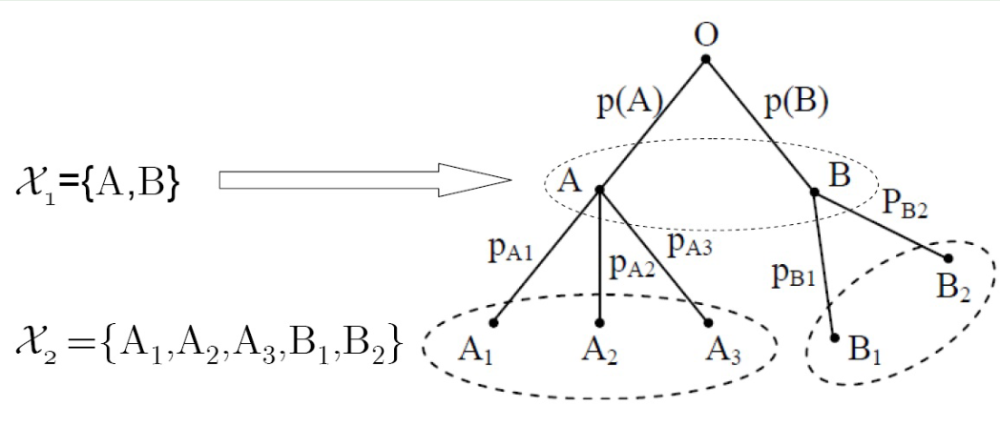

    !!! note ""

        通过图示和公式，我们可以理解如何从一个粗略的观察层次细化到更细的层次，并如何计算总不确定性。

        ##### 设定

        1. **事件集合 \(\mathcal{X}_1\)**：粗略观察，包含事件 \(\{A, B\}\)。
        2. **事件集合 \(\mathcal{X}_2\)**：细化观察，包含事件 \(\{A_1, A_2, A_3, B_1, B_2\}\)，其中：
        - 事件 \(A\) 被细分为 \(A_1, A_2, A_3\)。
        - 事件 \(B\) 被细分为 \(B_1, B_2\)。

        ##### 熵的计算

        1. **第一层次（粗略层次）的熵 \(H(X_1)\)**：
        - 计算公式：\( H(X_1) = H(P(A), P(B)) \)
        - 这里，\(H\) 表示熵函数，\(P(A)\) 和 \(P(B)\) 是事件 \(A\) 和 \(B\) 的概率。

        2. **第二层次（细化层次）的熵 \(H(X_2)\)**：
        - 计算公式：\( H(X_2) = H(P(A)P_{A_1}, P(A)P_{A_2}, P(A)P_{A_3}, P(B)P_{B_1}, P(B)P_{B_2}) \)
        - 这里，\(P_{A_1}, P_{A_2}, P_{A_3}\) 是在 \(A\) 发生的情况下，细分事件 \(A_1, A_2, A_3\) 的条件概率。类似地，\(P_{B_1}, P_{B_2}\) 是在 \(B\) 发生的情况下，细分事件 \(B_1, B_2\) 的条件概率。

        3. **条件熵 \(H(X_2 | X_1)\)**：
        - 表示在已知第一层次事件的情况下，第二层次事件的不确定性。
        - 计算公式：\( H(X_2 | X_1) = P(A) H(P_{A_1}, P_{A_2}, P_{A_3}) + P(B) H(P_{B_1}, P_{B_2}) \)
        - 这里，\(P(A)\) 和 \(P(B)\) 是事件 \(A\) 和 \(B\) 的概率。\(H(P_{A_1}, P_{A_2}, P_{A_3})\) 和 \(H(P_{B_1}, P_{B_2})\) 分别是事件 \(A\) 和 \(B\) 的细分事件的熵。

        ##### 总熵公式

        1. **定义粗略层次熵 \(H(X_1)\)**：

            \[ H(X_1) = -\sum_{x_1 \in \mathcal{X}_1} P(x_1) \log P(x_1) \]

            对于 \(\mathcal{X}_1 = \{A, B\}\)，

            \[ H(X_1) = -[P(A) \log P(A) + P(B) \log P(B)] \]

        2. **定义细化层次熵 \(H(X_2)\)**：

            \[ H(X_2) = -\sum_{x_2 \in \mathcal{X}_2} P(x_2) \log P(x_2) \]

            对于 \(\mathcal{X}_2\)，

            \[ H(X_2) = -[P(A)P_{A_1} \log (P(A)P_{A_1}) + P(A)P_{A_2} \log (P(A)P_{A_2}) + P(A)P_{A_3} \log (P(A)P_{A_3}) + P(B)P_{B_1} \log (P(B)P_{B_1}) + P(B)P_{B_2} \log (P(B)P_{B_2})] \]

        3. **定义条件熵 \(H(X_2 | X_1)\)**：

            \[ H(X_2 | X_1) = \sum_{x_1 \in \mathcal{X}_1} P(x_1) H(X_2 | x_1) \]

            - 对于 \(x_1 = A\)：

                \[ H(X_2 | A) = -[P_{A_1} \log P_{A_1} + P_{A_2} \log P_{A_2} + P_{A_3} \log P_{A_3}] \]

            - 对于 \(x_1 = B\)：

                \[ H(X_2 | B) = -[P_{B_1} \log P_{B_1} + P_{B_2} \log P_{B_2}] \]

            所以，

            \[ H(X_2 | X_1) = P(A) H(P_{A_1}, P_{A_2}, P_{A_3}) + P(B) H(P_{B_1}, P_{B_2}) \]

        4. **将条件熵分解到总熵公式中**：

            结合以上公式：

            !!! note 
                $H(X_2) = H(X_1) + H(X_2 | X_1)$

            具体计算：

            \[ H(X_2) = -\sum_{x_2 \in \mathcal{X}_2} P(x_2) \log P(x_2) \]

            展开：

            \[ H(X_2) = -[P(A)P_{A_1} \log (P(A)P_{A_1}) + P(A)P_{A_2} \log (P(A)P_{A_2}) + P(A)P_{A_3} \log (P(A)P_{A_3}) + P(B)P_{B_1} \log (P(B)P_{B_1}) + P(B)P_{B_2} \log (P(B)P_{B_2})] \]

            分解成粗略层次和条件熵部分：

            \[ H(X_2) = -[P(A) \log P(A) + P(B) \log P(B)] + P(A) H(P_{A_1}, P_{A_2}, P_{A_3}) + P(B) H(P_{B_1}, P_{B_2}) \]

            最终等式为：

            $$
            H(X_2) = H(X_1) + H(X_2 | X_1)
            $$

        ### 总结

        这个推导展示了如何通过细化事件的观察，将粗略层次的熵和在此条件下的细化层次的熵相结合，以得到总熵。这种分层处理有助于理解信息在不同细化程度上的不确定性。

    熵的可加性一般表达式：

    假设一个随机变量可以取的值被划分成 \(K\) 个子集，每个子集的出现概率为 \(p_k\)，其中 \(k = 1, 2, \cdots, K\)。对每个子集进一步划分成 \(m_k\) 个小单元，记这些小单元的出现概率为 \(p_k \cdot q_{jk}\)，其中 \(j = 1, 2, \cdots, m_k\)，\(q_{jk}\) 是条件概率。整个范围被划分成 \(M = \sum_{k=1}^K m_k\) 个小单元。

    总熵 \(H_M\) 的可加性可以表示为：

    $$
    \begin{aligned}
    H_M &= -\sum_{k=1}^K \sum_{j=1}^{m_k} p_k q_{jk} \log (p_k q_{jk}) \\
    &= -\sum_{k=1}^K \sum_{j=1}^{m_k} p_k q_{jk} \log p_k - \sum_{k=1}^K \sum_{j=1}^{m_k} p_k q_{jk} \log q_{jk} \\
    &= -\sum_{k=1}^K p_k \log p_k \sum_{j=1}^{m_k} q_{jk} - \sum_{k=1}^K p_k \sum_{j=1}^{m_k} q_{jk} \log q_{jk} \\
    &= -\sum_{k=1}^K p_k \log p_k - \sum_{k=1}^K p_k \sum_{j=1}^{m_k} q_{jk} \log q_{jk} \\
    &= H_K(p_1, p_2, \cdots, p_K) + \sum_{k=1}^K p_k H_{m_k}(q_{1k}, q_{2k}, \cdots, q_{m_k k})
    \end{aligned}
    $$

    对变量 $X$ 可以进行多步分层的观察，每一步都可从上一步的观察结果中得到更为细致的结果，变量 $X$ 在最后的观察结果集合中的不确定性等于第一次观察结果的不确定性，加上其后每次观察结果在前一次观察结果已知的前提下的条件不确定性。

6. **极值性**：$H_K(p_1,p_2,\cdots,p_k)\leq H_K(\frac1K,\frac1K,\cdots,\frac1K) =  \log K$，当且仅当 $X$ 是**均匀分布**时取等号。

7. **条件熵小于等于熵**：$H(X|Y)\leq H(X)$——增加条件，减少不确定性。当且仅当 $X$ 和 $Y$ 独立时取等号

    $$
    \begin{aligned}
    H(X|Y) &= E \{H(X|y)\} \\
    &= -\sum_{x \in \mathcal{X}} \sum_{y \in \mathcal{Y}} P(x, y) \log P(x|y) \\
    &= -\sum_{y \in \mathcal{Y}} \omega(y) \left\{\sum_{x \in \mathcal{X}} P(x|y) \log P(x|y)\right\} \\
    &\leq -\sum_{y \in \mathcal{Y}} \omega(y) \left\{\sum_{x \in \mathcal{X}} P(x|y) \log P(x)\right\} \\
    &= -\sum_{x \in \mathcal{X}} \left\{\sum_{y \in \mathcal{Y}} P(x|y) w(y)\right\} \log P(x) \\
    &= -\sum_{x \in \mathcal{X}} \left\{\sum_{y \in \mathcal{Y}} P(x,y)\right\} \log P(x) \\
    &= -\sum_{x \in \mathcal{X}} P(x) \log P(x) \\
    &= H(X)
    \end{aligned}
    $$

8. **凸性**：$H(X)$是严格上凸函数， $H(\lambda \vec{P_1}+(1-\lambda)\vec{P_2})\geq \lambda H(\vec{P_1})+(1-\lambda)H(\vec{P_2}),\quad 0\leq \lambda\leq 1$

    !!! note "取极大值的充要条件"
        Jensen不等式：

        $$
        \begin{aligned}
            &\text{令 } (\alpha_1, \alpha_2, \cdots, \alpha_L) \text{ 是凸集中的一组矢量，} f(\alpha) \text{ 是该凸集上的一个上凸函数，} \\
            &(\theta_1, \theta_2, \cdots, \theta_L) \text{ 是一组概率分布，则有} \\
            &\sum_{l=1}^L \theta_l f(\alpha_l) \leq f \left( \sum_{l=1}^L \theta_l \alpha_l \right)
        \end{aligned}
        $$

        首先我们有

        

        !!! note "怎么理解？"
            注意到，此时每个分量为非负。我们要找到极值，就是让这个函数在邻域内的值都比它小。
            
            如果 $\alpha_k$ 大于零，那么这个偏导数一定要为零，否则必定在这个方向或反方向上有增大的空间。-->如果我们增大或减小 $\alpha_k$，那么这个函数的值会增大。

            如果 $\alpha_k$ 等于零，那么这个偏导数需要小于或等于零。如果大于零，必定在这个方向上有增大的空间。-->如果我们增大 $\alpha_k$，那么这个函数的值会增大。

        把这个移作概率空间。除了要求非负，还要求和为1。所以我们用拉式乘子法，构造函数：

        $$
        L(P,\lambda)=H(P)+\lambda(1-\sum_{k=1}^Kp_k)
        $$

        求偏导，有：

        $$
        \begin{cases}
        \frac{\partial L}{\partial p_k}=\frac{\partial f(P)}{\partial p_k}-\lambda=0\\
        \frac{\partial L}{\partial \lambda}=1-\sum\limits_{k=1}^Kp_k=0
        \end{cases}
        $$

        根据前文的解释，我们有：

        $$
        \begin{cases}
        \frac{\partial f(P)}{\partial p_k}=\lambda\qquad p_k > 0\\
        \frac{\partial f(P)}{\partial p_k}\leq \lambda\qquad p_k = 0
        \end{cases}
        $$

### 其他熵（仅做了解）

#### 加权熵

香农熵仅考虑事件发生的客观规律，无法描述主观意义上对事件判断的差别。为了解决这个问题，引入了加权熵的概念。

$$
\begin{aligned}
\mathbf{X}&=\begin{pmatrix}x_1&x_2&\cdots&x_K\\w_1&w_2&\cdots&w_K\\p_1&p_2&\cdots&p_K\end{pmatrix}\\
H_w(X)&=-\sum_{k=1}^Kw_kp_k\log p_k
\end{aligned}
$$

就相当于给每个事件赋予了一个权重。

#### R$\acute{e}$nyi熵

$$
H_{\alpha}(X)=\frac{1}{1-\alpha}\log\sum_{k=1}^Kp_k^{\alpha}
$$

当 $\alpha\to 1$ 时，$H_{\alpha}(X)\to H(X)$。

当 $\alpha = 0$ 时，$H_{\alpha}(X)=\log K$。

## 平均互信息

在概率空间 $\{(X,Y),\mathcal{X}\times\mathcal{Y},p(x,y)\}$ 中，事件 $(X,Y)$ 的平均互信息（简称互信息）为随机变量 $I(x;y)$ 的数学期望：

$$I(X;Y)=E[I(x;y)]=\sum_{x\in\mathcal{X}}\sum_{y\in\mathcal{Y}}p(x,y)\log\frac{p(x,y)}{q(x)\omega(y)}$$

### 性质

1. $I(X;Y)=I(Y;X)$
2. $I(X;Y)\geq 0$，当且仅当 $X$ 和 $Y$ 独立时取等号
3. $I(X;Y)=H(X)-H(X|Y)=H(Y)-H(Y|X)=H(X)+H(Y)-H(X,Y)$
   
4. $I(X;Y)\leq \min\{H(X),H(Y)\}$

## 条件互信息

在概率空间 $\{(X,Y,Z),\mathcal{X}\times\mathcal{Y}\times\mathcal{Z},p(x,y,z)\}$ 中，事件 $(X,Y)$ 在给定事件 $Z$ 的条件下的条件互信息为：

$$I(X;Y|Z)=E[I(x;y|z)]=\sum_{x\in\mathcal{X}}\sum_{y\in\mathcal{Y}}\sum_{z\in\mathcal{Z}}p(x,y,z)\log\frac{p(x,y|z)}{q(x|z)\omega(y|z)}$$

## 联合互信息

在概率空间 $\{(X,Y,Z),\mathcal{X}\times\mathcal{Y}\times\mathcal{Z},p(x,y,z)\}$ 中，事件 $X$ 和事件 $(Y,Z)$ 的联合互信息为：

$$I(X;(Y,Z))=E[I(x;(y,z))]=\sum_{x\in\mathcal{X}}\sum_{y\in\mathcal{Y}}\sum_{z\in\mathcal{Z}}p(x,y,z)\log\frac{p(x|y,z)}{q(x)}=I(X;Z)+I(X;Y|Z)$$

## 相对熵 | 鉴别熵

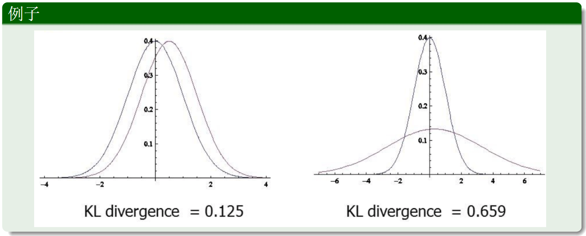

!!! note "相对熵的性质"
        

    互信息和相对熵的关系↑

    

    这个公式展示了熵 \( H(X) \) 可以分解为均匀分布熵 \( H(U) \) 减去相对熵 \( D(X \parallel U) \)。

    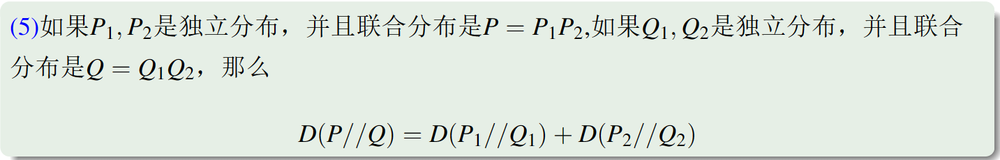

    公式 (5): 独立分布下的相对熵分解

    \[ D(P \parallel Q) = D(P_1 \parallel Q_1) + D(P_2 \parallel Q_2) \]

    假设 \( P_1 \) 和 \( P_2 \) 是独立分布，并且联合分布是 \( P = P_1 P_2 \)，如果 \( Q_1 \) 和 \( Q_2 \) 是独立分布，并且联合分布是 \( Q = Q_1 Q_2 \)，那么相对熵 \( D(P \parallel Q) \) 可以分解为两个独立分布的相对熵之和。

    #### 数学推导

    1. **相对熵的定义**:

    对于联合分布 \( P \) 和 \( Q \)：

    \[
    D(P \parallel Q) = \sum_{x_1, x_2} P(x_1, x_2) \log \frac{P(x_1, x_2)}{Q(x_1, x_2)}
    \]

    2. **引入独立分布**:

    假设 \( P_1 \) 和 \( P_2 \) 是独立分布：

    \[
    P(x_1, x_2) = P_1(x_1) P_2(x_2)
    \]

    \( Q_1 \) 和 \( Q_2 \) 也是独立分布：

    \[
    Q(x_1, x_2) = Q_1(x_1) Q_2(x_2)
    \]

    将这些分布代入相对熵公式：

    \[
    D(P \parallel Q) = \sum_{x_1, x_2} P_1(x_1) P_2(x_2) \log \frac{P_1(x_1) P_2(x_2)}{Q_1(x_1) Q_2(x_2)}
    \]

    3. **分解**:

    可以分解为两个部分：

    \[
    D(P \parallel Q) = \sum_{x_1, x_2} P_1(x_1) P_2(x_2) \left( \log \frac{P_1(x_1)}{Q_1(x_1)} + \log \frac{P_2(x_2)}{Q_2(x_2)} \right)
    \]

    \[
    D(P \parallel Q) = \sum_{x_1} P_1(x_1) \log \frac{P_1(x_1)}{Q_1(x_1)} + \sum_{x_2} P_2(x_2) \log \frac{P_2(x_2)}{Q_2(x_2)}
    \]

    \[
    D(P \parallel Q) = D(P_1 \parallel Q_1) + D(P_2 \parallel Q_2)
    \]

    #### 实际意义

    - **分解属性**: 如果联合分布 \(P\) 和 \(Q\) 是由独立分布 \(P_1\), \(P_2\) 和 \(Q_1\), \(Q_2\) 组成的，那么相对熵 \( D(P \parallel Q) \) 可以分解为两个独立相对熵的总和。这种性质在处理多维分布时非常有用，可以简化计算。

### 相对熵的应用

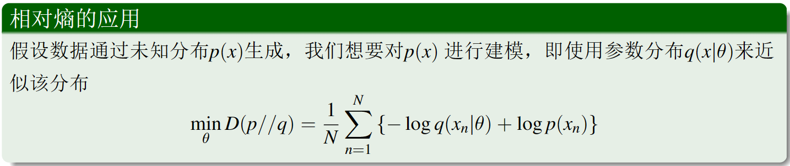

图片展示了 **相对熵（KL 散度）** 在模型拟合中的应用，即如何使用参数分布 \( q(x|\theta) \) 来逼近未知分布 \( p(x) \)，并通过最小化 KL 散度来优化参数 \(\theta\)。以下是详细解释和推导。

#### 问题描述

假设我们有一个数据集，该数据集由未知的真实分布 \( p(x) \) 生成，但我们不知道这个真实分布。我们希望通过一个参数化的分布 \( q(x|\theta) \) 来逼近这个未知分布 \( p(x) \)。

#### 目标

通过最小化相对熵 \( D(p \parallel q) \) 来优化参数 \(\theta\)，使得 \( q(x|\theta) \) 尽可能接近 \( p(x) \)。

#### 相对熵公式及其应用

##### 相对熵的定义

相对熵 \( D(p \parallel q) \) 度量了两个概率分布 \( p \) 和 \( q \) 之间的差异性：

\[
D(p \parallel q) = \sum_x p(x) \log \frac{p(x)}{q(x)}
\]

##### 最小化相对熵

我们的目标是通过最小化 \( D(p \parallel q) \) 来找到最佳参数 \(\theta\)：

\[
\min_\theta D(p \parallel q)
\]

#### 数学推导

假设我们有 \(N\) 个独立同分布（i.i.d.）的样本 \( x_1, x_2, \cdots, x_N \) 来自真实分布 \( p(x) \)，我们可以用样本均值来近似期望值。将相对熵 \( D(p \parallel q) \) 的公式展开：

\[
D(p \parallel q) = \sum_x p(x) \log \frac{p(x)}{q(x|\theta)}
\]

对 \( N \) 个样本，我们可以使用经验分布来替代真实分布 \( p(x) \)：

\[
\hat{p}(x) = \frac{1}{N} \sum_{n=1}^N \delta(x - x_n)
\]

!!! note ""
    这里的 \(\delta(x - x_n)\) 是狄拉克函数，表示当 \(x = x_n\) 时为1，否则为0。

将其代入相对熵公式：

\[
D(\hat{p} \parallel q) = \sum_x \hat{p}(x) \log \frac{\hat{p}(x)}{q(x|\theta)}
\]

因为 \(\hat{p}(x)\) 是经验分布，我们可以简化为样本的平均：

\[
D(\hat{p} \parallel q) \approx \frac{1}{N} \sum_{n=1}^N \log \frac{\hat{p}(x_n)}{q(x_n|\theta)}
\]

其中 \(\hat{p}(x_n) = \frac{1}{N}\)，所以公式变为：

\[
\min_\theta D(p \parallel q) = \frac{1}{N} \sum_{n=1}^N \left( -\log q(x_n|\theta) + \log p(x_n) \right)
\]

1. **相对熵** \( D(p \parallel q) \) 度量了两个分布之间的差异，用于优化模型参数以使得模型分布 \( q(x|\theta) \) 接近真实分布 \( p(x) \)。
2. **最小化 KL 散度** 等价于最大化对数似然，这是很多机器学习和统计模型中的核心思想。
3. **应用广泛**: 这种方法在各种概率模型、生成模型和贝叶斯推断中有广泛应用，帮助我们在缺乏真实分布的情况下使用参数化模型进行近似。

## 关于疑义度的Fano不等式

这里 $Pr$ 就是 $P$

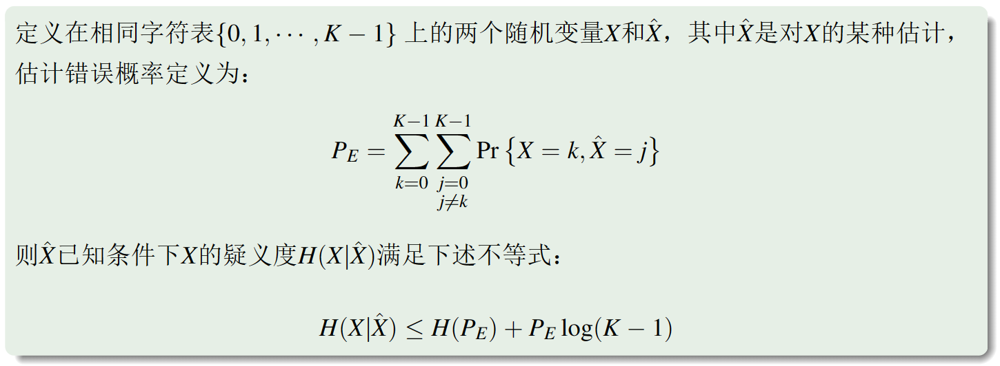

表示上界，不确定性最多这么多

!!! note ""

    $E$ 表示不等的情况，即 $E =
    \left \{
        \begin{array}{c}
        0,X = \hat{X}\\
        1,X \ne \hat{X}
        \end{array}
    \right.$，$P_E$ 为出错的概率。

### 图示解释

图片中的图示解释了这些熵的分解和条件概率的关系。它展示了误码概率 \( P_E \) 的不同值对条件熵 \( H(X | \hat{X}) \) 的影响，进一步帮助理解条件熵在不同情况下的变化。

### 实际意义

1. **误码概率**：这个推导的结果展示了误码概率 \( P_E \) 对条件熵的影响。较高的误码概率 \( P_E \) 导致较高的条件熵。
2. **熵的上下界**：这个证明过程帮助我们理解如何通过联合熵和条件熵来确定随机变量的上下界。

### 证明

1. 法一
    

2. 法二
    

3. 法三
   

   第一行：因为 $E$ 是由 $X,\hat{X}$ 确定的，所以 $H(E|X,\hat{X})$为0

    前两行是由于 $H(X,Y)=H(X)+H(Y|X)=H(Y)+H(X|Y)$

    显然 $H(E)=H(P_E)$，显然吗？

    $$
    \begin{aligned}
    H(E)&=E_{\text{期望}}[I(E)]\\&=\sum_{e\in E}q(e)I(e)\\&=-\sum_{e\in E}q(e)\log q(e)\\&=-q(0)\log q(0)-q(1)\log q(1)
    \\&=-(\sum\limits_{k=0}^{K-1}p(k,k))\log(1-P_E)-(\sum\limits_{k=0}^{K-1}\sum\limits_{j=0, j\neq k}^{K-1}p(k,j))\log(P_E)\\
    &=-(1-P_E)\log(1-P_E)-P_E\log(P_E)
    \\&=H(P_E)
    \end{aligned}
    $$

    最后一步是为什么？这是定义...

    

### 物理意义

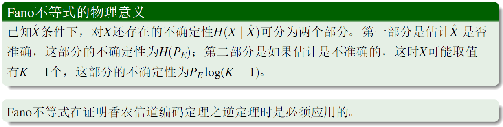

$K=2$，表示两个事件，一个是正确，一个是错误。如果$P_E=1$，那么$H_2(P_E)=0$，也表示是完全确定，没有不确定性。

## 马尔科夫链

!!! warning ""
    人生是马尔科夫的

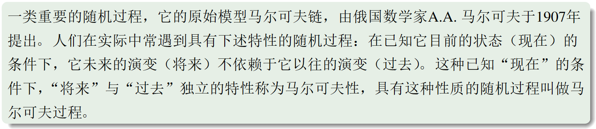

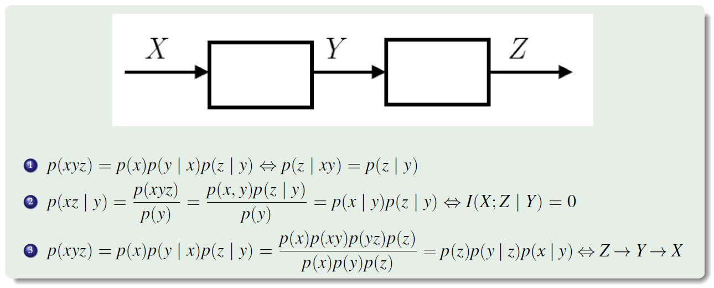

2. 给定现在的状态，未来的状态与过去的状态无关。

!!! note "2的推导"

    $$
    \begin{aligned}
    I(X;Z|Y)&=\sum_{x\in\mathcal{X}}\sum_{z\in\mathcal{Z}}\sum_{y\in\mathcal{Y}}p(x,y,z)\log\frac{p(x|y,z)}{q(x|y)}\\&=\sum_{x\in\mathcal{X}}\sum_{z\in\mathcal{Z}}\sum_{y\in\mathcal{Y}}p(x,y,z)\log\frac{p(x,z|y)}{q(x|y)w(z|y)}\\&=0
    \end{aligned}
    $$

!!! warning ""
    PPT第三条这里打错了，我已修改。
3. 如果 $X,Y,Z$ 构成马尔科夫链，那么 $Z,Y,X$ 也构成马尔科夫链。

### 数据处理定理

!!! note ""
    随机变量的互信息有非负性。

### 四变量马尔科夫链

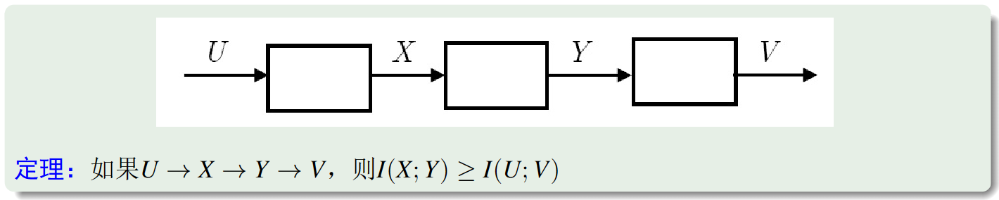

## 互信息的凸性

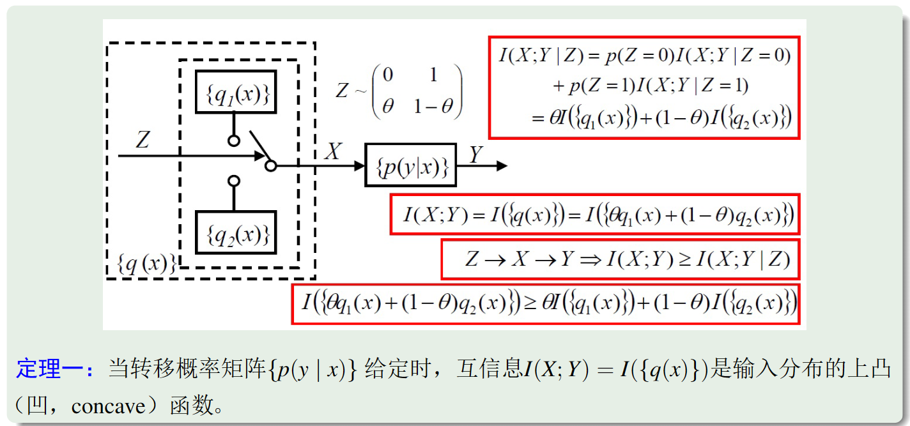
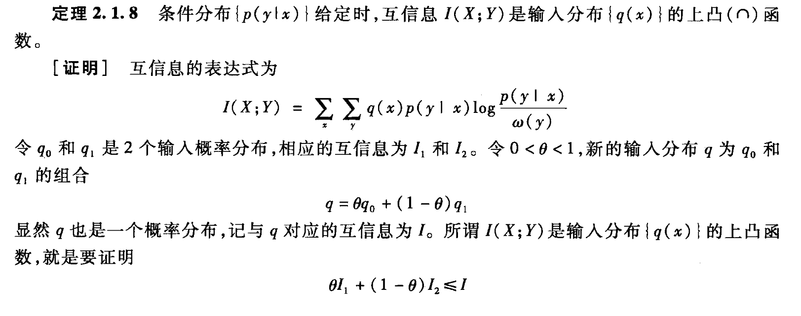

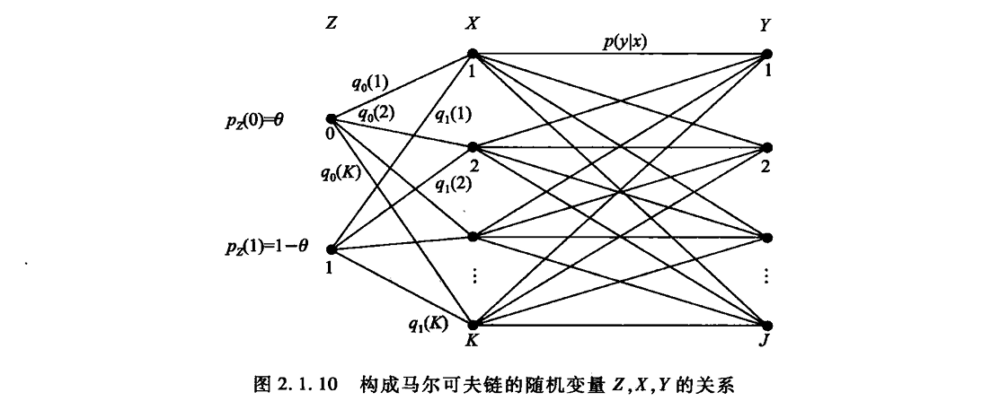

