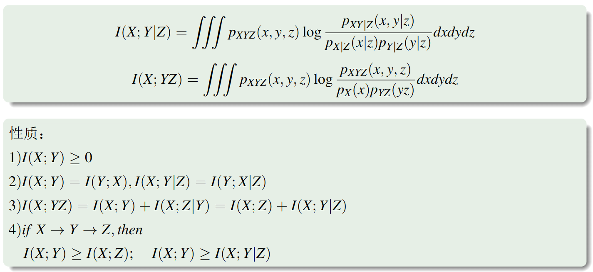
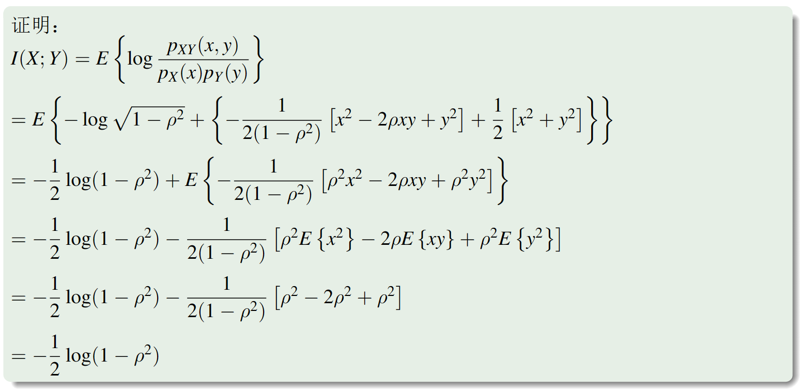
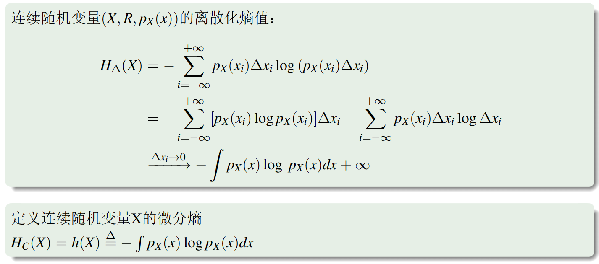
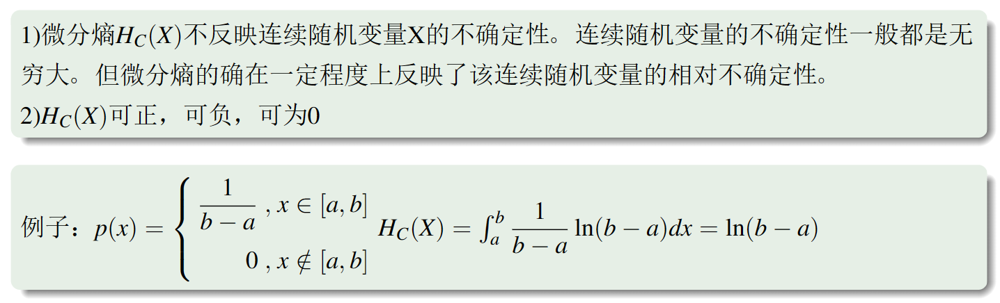
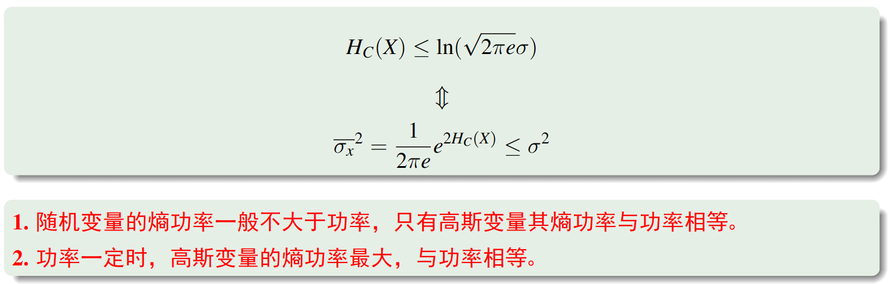

# 第二讲：连续随机变量的互信息和微分熵

## 连续随机变量的互信息

为了推广，我们按照微积分的思想，对其离散化

### 互信息和相关系数

## 连续随机变量的微分熵

直接采用离散化进行推广会出现bug，所以我们简单地略去无穷大项。

### 微分熵的本质和性质

### 条件微分熵和联合微分熵及其性质

### 微分熵的线性变性

### 微分熵的极大化

#### 峰值受限

#### 平均功率受限

指方差受到限制。

!!! note ""
    所以我们大多采用正态分布

### 熵功率

#### 熵功率不等式

