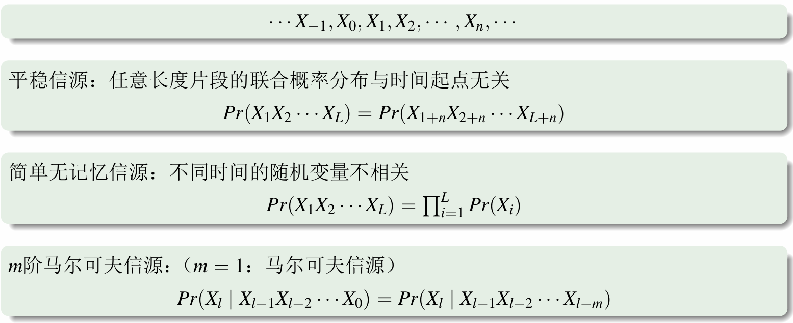
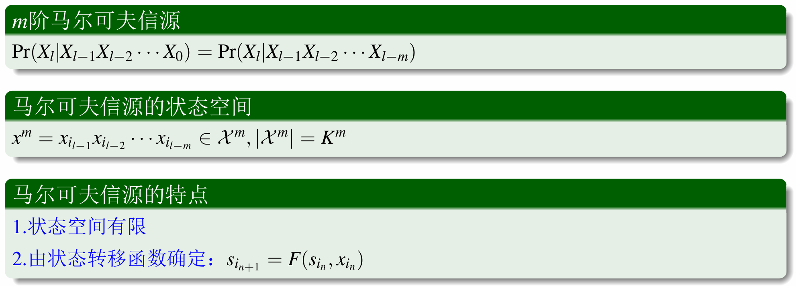
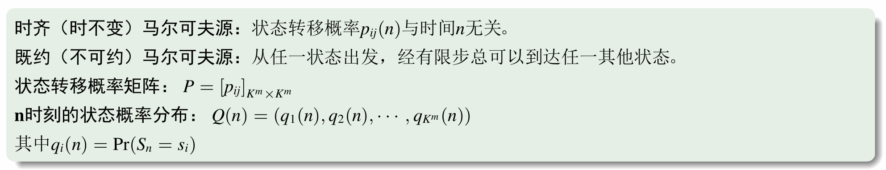
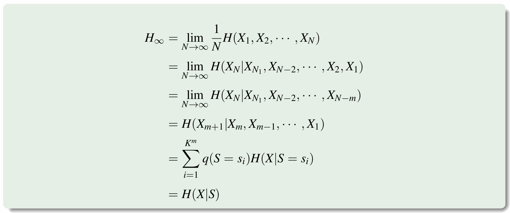

# 第三讲：平稳离散信源的熵

!!! note ""

    - 了解平稳离散信源的概念
    - 掌握平稳离散信源熵的定义
    - 了解马尔可夫信源的概念
    - 掌握马尔可夫信源熵的计算方法

!!! warning "重点"
    信源熵 $H(X)$ 表示信源发出任何一个消息状态所携带的平均信息量

## 平稳随机过程

### 平稳信源

!!! note ""
    $m$ 阶马尔科夫信源是一种有限记忆的信源，其记忆能力为$m$。

#### 平稳信源的熵

##### 平稳信源的熵的性质

!!! note "证明"
    
    
    
    

### 熵速率

!!! note ""
    对无记忆离散源，若 $X$ 在取值范围 $\mathcal{X}=\set{x_1,x_2,\cdots,x_K}$ 上等概分布，则 $H(X)=\log K\triangleq H_0$。

## 马尔可夫信源

!!! note ""
    对于 $m$ 阶马尔科夫信源，$x_{i_{n}}$是$n$时刻信源输出符号，$s_{i_{n}}$是$n$时刻信源状态。每一个状态$s_{i}$对应一个长度为 $m$ 的符号序列。

!!! note ""

    $p_{ij}(n)$ 是 $n$ 时刻状态 $s_{i}$ 转移到 $s_{j}$ 的概率。
    

!!! note ""
    对于既约的马尔可夫信源，存在一个唯一的平稳分布 $Q$，使得 $Q=P^{T}Q $。

### 马尔可夫信源的熵率

!!! note ""
    马尔可夫信源的熵率等于信源在各状态下的条件熵对状态概率求平均。