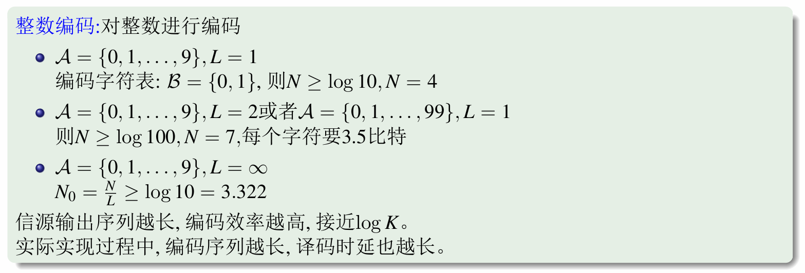
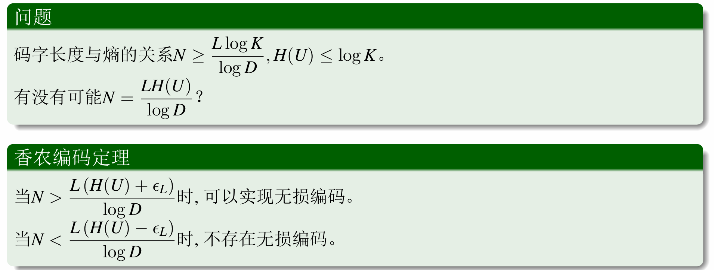
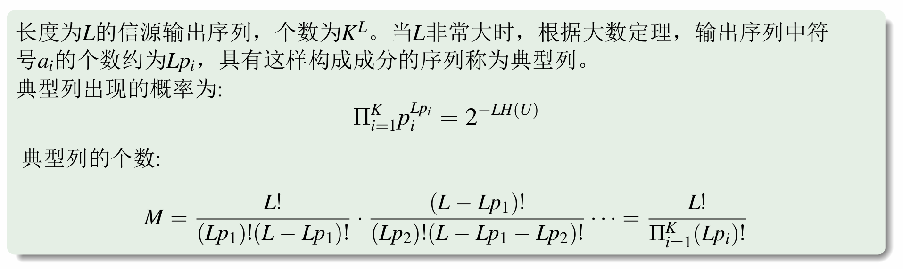
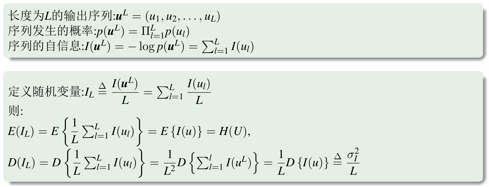
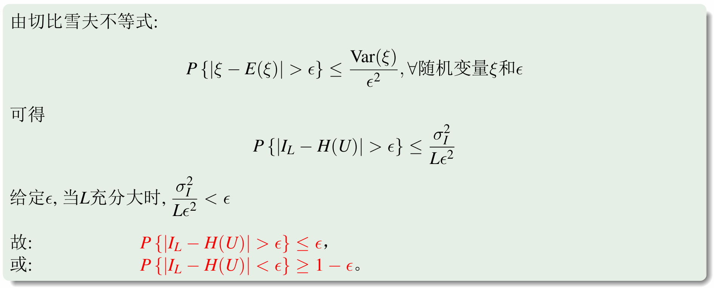
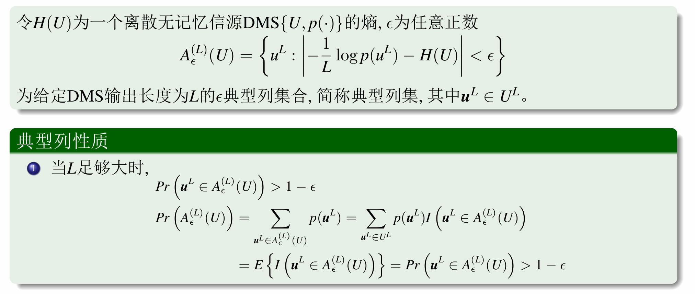
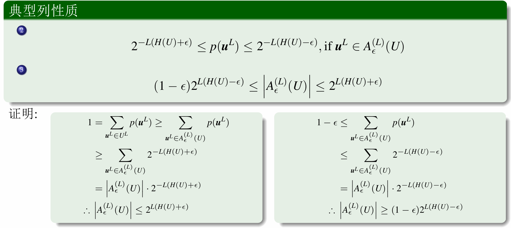
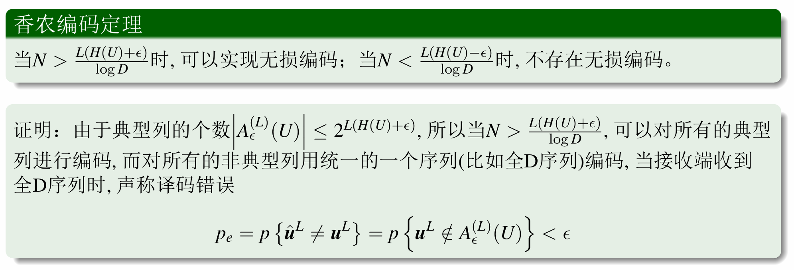

# 第一讲：等长编码

!!! note ""

    - 了解离散无记忆信源等长编码的基本概念
    - 掌握香农信源编码定理
    - 了解随机序列的渐进等分性质
    - 了解典型列的基本概念和意义

## 等长编码的基本概念

一个离散无记忆信源，它的输出字符表为 \(\mathcal{A} = \{a_1, a_2, \cdots, a_k\}\)，相应的概率分布为 \(\{p_1, p_2, \cdots, p_k\}\)，\(\sum_{i=1}^k p_i = 1\)。如果信源输出长度为 \(L\) 的消息序列为 \(u^L = (u_1, u_2, \cdots, u_k)\)，显然信源可能输出 \(K^L\) 种长度为 \(L\) 的不同序列。另一个包含 \(D\) 个符号的集合 \(\mathcal{B} = \{b_1, b_2, \cdots, b_D\}\)，称为编码字符表。现在要用长度为 \(N\) 的编码字符序列（称为码字）来表示长度为 \(L\) 的信源输出序列。这样的编码称为等长编码。因为所有待编码的消息序列都是等长的，所有码字长度也是一样的。显然若这种表示是无损的，也就是说能从码字唯一正确地恢复出信源信息序列，则要求

\[ D^N \geq K^L \tag{3.1.1} \]

即要求

\[ N \geq \frac{L \log K}{\log D} \tag{3.1.2} \]

当 \(D = 2\) 时，也就是要求用 \(N\) 个比特来表示长度为 \(L\) 的每个消息序列时要求

\[ N \geq L \log K \tag{3.1.3} \]

## 香农信源编码定理

对典型列编码即可。

### 渐进等分性质

落在 $H(U)$ 的邻域里的典型列的概率是很大的。

### 典型列

### 证明

