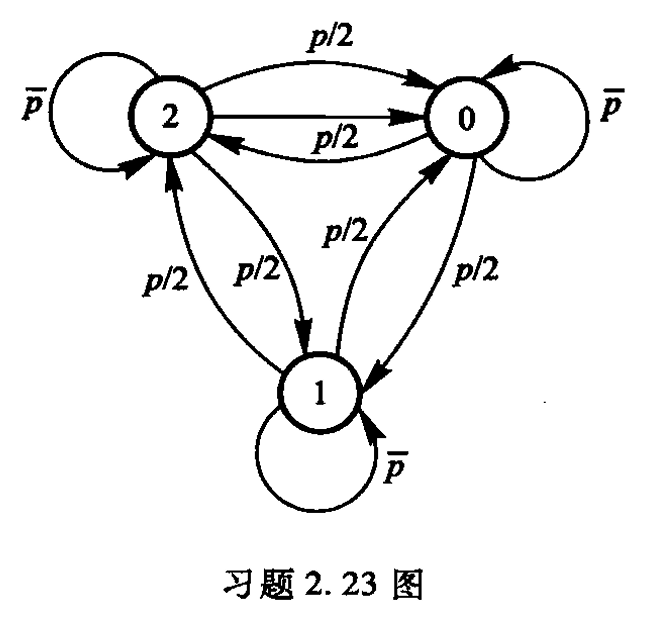
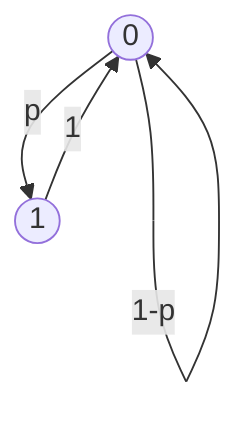

# Homework 2

## Chapter 2.1 随机变量的熵和互信息

!!! note ""
    2.1; 2.2; 2.4; 2.5; 2.6; 2.9; 2.12; 2.13

### 2.1

A 村有一半人说真话，3/10 人总说假话，2/10 人拒绝回答；B 村有 3/10 人诚实，一半人说谎，2/10 人拒绝回答。现随机地从 A 村和 B 村抽取人，\( p \) 为抽到 A 村人的概率，\( 1 - p \) 为抽到 B 村人的概率。问通过测试某人说话的状态平均能获得多少关于该人属于哪个村的信息？通过改变 \( p \)，求出该信息的最大值。

| 村庄 | 诚实 | 说谎 | 拒绝回答 | 抽到概率 $P(X)$ |
| :----: | :----: | :----: | :--------: | :--------: |
| A    | $\frac{5}{10}p$ | $\frac{3}{10}p$ | $\frac{2}{10}p$ | $p$ |
| B    | $\frac{3}{10}(1-p)$ | $\frac{5}{10}(1-p)$ | $\frac{2}{10}(1-p)$ | $1-p$ |
| 说话状态概率 $P(Y)$  | $\frac{3}{10}+\frac{2}{10}p$ | $\frac{5}{10}-\frac{2}{10}p$ | $\frac{2}{10}$ | 1 |

记 \( X \) 为村庄，\( Y \) 为说话状态，我们要求的就是 \( I(X;Y) \)。

$$
\begin{aligned}
I(X;Y)&= H(Y)-H(Y|X)\\
&= -\sum_{y\in Y}P(y)\log P(y) + \sum_{x\in X}\sum_{y\in Y}P(x,y)\log P(y|x)\\
&= [-\left(\frac{3}{10}+\frac{2}{10}p\right)\log\left(\frac{3}{10}+\frac{2}{10}p\right) - \left(\frac{5}{10}-\frac{2}{10}p\right)\log\left(\frac{5}{10}-\frac{2}{10}p\right) - \frac{2}{10}\log\frac{2}{10}]\\
&+ [\frac{5}{10}p\log\frac{5}{10} + \frac{3}{10}p\log\frac{3}{10} + \frac{2}{10}p\log\frac{2}{10} \\
&+ \frac{3}{10}(1-p)\log\frac{3}{10} + \frac{5}{10}(1-p)\log\frac{5}{10} + \frac{2}{10}(1-p)\log\frac{2}{10}]\\
&= -\left(\frac{3}{10}+\frac{2}{10}p\right)\log\left(\frac{3}{10}+\frac{2}{10}p\right) - \left(\frac{5}{10}-\frac{2}{10}p\right)\log\left(\frac{5}{10}-\frac{2}{10}p\right) + \frac{3}{10}\log\frac{3}{10} + \frac{5}{10}\log\frac{5}{10}\\
\end{aligned}
$$

求导:

$$
\begin{aligned}
\frac{dI(X;Y)}{dp} &=\log e(\frac{2}{10}\ln\frac{5-2p}{3+2p})=\log e(\frac{1}{5}\ln(\frac{8}{3+2p}-1))\\
\end{aligned}
$$

令导数为 0，解得 \( p = \frac{1}{2} \)。

$$
\begin{aligned}
I(X;Y) &= -\left(\frac{3}{10}+\frac{1}{10}\right)\log\left(\frac{3}{10}+\frac{1}{10}\right) - \left(\frac{5}{10}-\frac{1}{10}\right)\log\left(\frac{5}{10}-\frac{1}{10}\right) + \frac{3}{10}\log\frac{3}{10} + \frac{5}{10}\log\frac{5}{10}\\
&= -\frac{8}{10}\log\frac{4}{10}+ \frac{3}{10}\log\frac{3}{10} + \frac{5}{10}\log\frac{5}{10}\\
&= \frac{3\log3+5\log5-8\log4}{10}\\
& \approx 0.03645 bit
\end{aligned}
$$

### 2.2

一个无偏骰子，抛掷一次，如果出现 1, 2, 3, 4 点，则把一枚均匀硬币投掷 1 次，如果骰子出现 5, 6 点，则硬币投掷 2 次，求硬币投掷中正面出现次数对于骰子出现点数所提供的信息。

记骰子点数为 \( X \)，硬币正面次数为 \( Y \)。我们要求的就是 \( I(X;Y) \)。

| 点数 | 投掷次数 | 概率 $P(X)$ |
| :----: | :----: | :--------: |
| 1, 2, 3, 4 | 1 | $\frac{4}{6}$ |
| 5, 6 | 2 | $\frac{2}{6}$ |

| 点数 $X$ | 正面次数 $Y$ | 概率 $P(Y\|X)$ | 概率 $P(X,Y)$ |
| :----: | :----: | :--------: | :--------: |
| 1, 2, 3, 4 | 0 | $\frac{1}{2}$ | $\frac{2}{6}$ |
| 1, 2, 3, 4 | 1 | $\frac{1}{2}$ | $\frac{2}{6}$ |
| 5, 6 | 0 | $\frac{1}{4}$ | $\frac{1}{12}$ |
| 5, 6 | 1 | $\frac{1}{2}$ | $\frac{1}{6}$ |
| 5, 6 | 2 | $\frac{1}{4}$ | $\frac{1}{12}$ |

| 正面次数 $Y$ | 概率 $P(Y)$ |
| :----: | :--------: |
| 0 | $\frac{5}{12}$ |
| 1 | $\frac{1}{2}$ |
| 2 | $\frac{1}{12}$ |

$$
\begin{aligned}
I(X;Y)&= H(Y)-H(Y|X)\\
&= -\sum_{y\in Y}P(y)\log P(y) + \sum_{x\in X}\sum_{y\in Y}P(x,y)\log P(y|x)\\
&= [-\frac{5}{12}\log\frac{5}{12} - \frac{1}{2}\log\frac{1}{2} - \frac{1}{12}\log\frac{1}{12}]\\
&+ [\frac{2}{6}\log\frac{1}{2} + \frac{2}{6}\log\frac{1}{2} + \frac{1}{12}\log\frac{1}{4} + \frac{1}{6}\log\frac{1}{2} + \frac{1}{12}\log\frac{1}{4}]\\
&=-\frac{5}{12}\log\frac{5}{12} - \frac{1}{12}\log{\frac{1}{12}}+\frac{2}{3}\log{\frac{1}{2}}\\
&\approx 0.15834 bit
\end{aligned}
$$

### 2.4

随机掷 3 颗骰子，以 \( X \) 表示第一颗骰子掷出的结果，以 \( Y \) 表示第一颗和第二颗骰子抛掷之和，以 \( Z \) 表示 3 颗骰子的点数之和，试求 \( H(X|Y) \)，\( H(Y|X) \)，\( H(Z|X, Y) \)，\( H(X, Z|Y) \) 和 \( H(Z|X) \)。

记 \( X_1, X_2, X_3 \) 为 3 颗骰子的点数，\( Y = X_1 + X_2 \)，\( Z = X_1 + X_2 + X_3 \)。

| $X_1$ | $X_2$ | $Y$ | 
| :----: | :----: | :----: |
| 1 | 1 | 2 |
| $\cdots$ | $\cdots$ | $\cdots$ |
| 1 | 6 | 7 |
| $\cdots$ | $\cdots$ | $\cdots$ |
| 6 | 1 | 7 |
| $\cdots$ | $\cdots$ | $\cdots$ |
| 6 | 6 | 12 |

| $Y$|$P(Y)$ |
| :----: | :----: |
| 2 | $\frac{1}{36}$ |
| 3 | $\frac{2}{36}$ |
| 4 | $\frac{3}{36}$ |
| $\cdots$ | $\cdots$ |
| 11 | $\frac{2}{36}$ |
| 12 | $\frac{1}{36}$ |

- $H(X|Y) = H(Y|X) + H(X) - H(Y)=2H(X)-H(Y)$
- $H(Y|X) = H(X)$
- $H(Z|X, Y) = H(X)$
- $H(X, Z|Y) = H(X|Z, Y) + H(Z|Y) = H(X) + H(X) = 2H(X)$
- $H(Z|X) = H(Y)$

其中：

- $H(X)=H(\frac{1}{6},\frac{1}{6},\frac{1}{6},\frac{1}{6},\frac{1}{6},\frac{1}{6})=\log 6$
- $H(Y)=H(\frac{1}{36},\frac{2}{36},\frac{3}{36},\cdots,\frac{2}{36},\frac{1}{36})=-\frac{\log \frac{1}{36}+2\log\frac{2}{36}+3\log\frac{3}{36}+4\log\frac{4}{36}+5\log\frac{5}{36}+3\log\frac{6}{36}}{18}=\frac{23\log2+30\log3-5\log5}{18}$

代入即可

### 2.5

设一个系统传送 10 个数字：\( 0, 1, 2, \cdots, 9 \)，奇数在传送时以 0.5 概率等可能地错成另外的奇数，而其他数字总能正确接收。试求收到一个数字后平均得到的信息量。

设 \( X \) 为发送的数字，\( Y \) 为接收的数字，我们要求的就是 \( I(X;Y) \)。

- $P(X)=\frac{1}{10},x\in\{0,1,2,\cdots,9\}$
- $P(Y)=\frac{1}{10},y\in\{0,1,2,\cdots,9\}$
- $P(Y=y|X=x)=\begin{cases}
    0.125, & y\neq x, x\in\{1,3,5,7,9\}, \\
    0.5, & y=x, x\in\{1,3,5,7,9\}\\
    1, & y=x, x\in\{0,2,4,6,8\}
    \end{cases}$

$$
\begin{aligned}
I(X;Y) &= H(Y) - H(Y|X)\\
&= H(\frac{1}{10}\cdots\frac{1}{10}) + \sum_{x\in X}P(x)\sum_{y\in Y}P(y|x)\log P(y|x)\\
&= \log 10 + \frac{1}{10}\sum_{x\in X}\sum_{y\in Y}P(y|x)\log P(y|x)\\
&= \log 10 + \frac{1}{10}\left[\sum_{x\in\{0,2,4,6,8\}}\sum_{y=x}1\log1 + \sum_{x\in\{1,3,5,7,9\}}\sum_{y\neq x}0.125\log0.125 + \sum_{x\in\{1,3,5,7,9\}}\sum_{y=x}0.5\log0.5\right]\\
&= \log 10 + \frac{1}{10}\left[5\log1 + 5\cdot4\cdot0.125\log0.125 + 5\cdot0.5\log0.5\right]\\
&= \log 10 + \frac{1}{10}\left[2.5\log0.125 + 2.5\log0.5\right]\\
&= \log10-\log{2}\\
&\approx 2.32193 bit
\end{aligned}
$$

<!-- | $X$ | $Y$ | $P(X,Y)$ |
| :----: | :----: | :----: |
| 0 | 0 | 0.1 |
| 1 | 1 | 0.05 |
| 1 | 3 | 0.0125 |
| 1 | 5 | 0.0125 |
| 1 | 7 | 0.0125 |
| 1 | 9 | 0.0125 |
| 2 | 2 | 0.1 |
| 3 | 3 | 0.05 |
| 3 | 1 | 0.0125 |
| 3 | 5 | 0.0125 |
| 3 | 7 | 0.0125 |
| 3 | 9 | 0.0125 |
| 4 | 4 | 0.1 |
| 5 | 5 | 0.05 |
| 5 | 1 | 0.0125 |
| 5 | 3 | 0.0125 |
| 5 | 7 | 0.0125 |
| 5 | 9 | 0.0125 |
| 6 | 6 | 0.1 |
| 7 | 7 | 0.05 |
| 7 | 1 | 0.0125 |
| 7 | 3 | 0.0125 |
| 7 | 5 | 0.0125 |
| 7 | 9 | 0.0125 |
| 8 | 8 | 0.1 |
| 9 | 9 | 0.05 |
| 9 | 1 | 0.0125 |
| 9 | 3 | 0.0125 |
| 9 | 5 | 0.0125 |
| 9 | 7 | 0.0125 | -->

### 2.6

对任意概率分布的随机变量，证明下述三角不等式成立：

(a) \( H(X|Y) + H(Y|Z) \geq H(X|Z) \)

(b) \(
\frac{H(X|Y)}{H(X, Y)} + \frac{H(Y|Z)}{H(Y, Z)} \geq \frac{H(X|Z)}{H(X, Z)}
\)

证明：

(a) 由于条件熵小于熵

$$
\begin{aligned}
H(X|Y) + H(Y|Z) &\geq H(X|Y,Z) + H(Y|Z)\\
&= H(X, Y|Z)\\
&= H(Y|X,Z) + H(X|Z)\\
&\geq H(X|Z)
\end{aligned}
$$

(b) 

- $H(X,Y)=H(X| Y)+H(Y)\leq H(X| Y)+H(Y|Z)+H(Z)$
- $H(Y,Z)=H(Y| Z)+H(Z)\leq H(X| Y)+H(Y|Z)+H(Z)$
- $\frac{x}{x+a}$ 在 \(x\geq 0, a\geq 0\) 时是随 \(x\) 单调递增的，所以
$$
\begin{aligned}
\frac{H(X|Y)}{H(X, Y)} + \frac{H(Y|Z)}{H(Y, Z)} &\geq \frac{H(X|Y)+H(Y|Z)}{H(X| Y)+H(Y| Z)+H(Z)}\\
&\geq \frac{H(X|Z)}{H(X, Z)}
\end{aligned}
$$

### 2.9

若 3 个随机变量 \( X, Y, Z \)，有 \( X + Y = Z \) 成立，其中 \( X \) 和 \( Y \) 独立，试证：

(a) \( H(X) \leq H(Z) \)

(b) \( H(Y) \leq H(Z) \)

(c) \( H(X, Y) \geq H(Z) \)

(d) \( I(X; Z) = H(Z) - H(Y) \)

(e) \( I(X, Y; Z) = H(Z) \)

(f) \( I(X; Y, Z) = H(X) \)

(g) \( I(Y; Z | X) = H(Y) \)

(h) \( I(X; Y | Z) = H(X | Z) = H(Y | Z) \)

- (a) $H(Z) = H(X,Y,Z)-H(X,Y|Z) = H(X,Y)-(H(X|Y,Z)+H(Y|Z)) = H(X)+H(Y)-H(Y|Z) = H(X)+I(Y;Z) \geq H(X)$
- (b) $H(Z) = H(X,Y,Z)-H(X,Y|Z) = H(X,Y)-(H(Y|X,Z)+H(X|Z)) = H(X)+H(Y)-H(X|Z) = H(Y)+I(X;Z) \geq H(Y)$
- (c) $H(X,Y) = H(X,Y,Z)=H(Z)+H(X,Y|Z) \geq H(Z)$
- (d) $I(X;Z) = H(Z)-H(Z|X) = H(Z)-H(Y) $
- (e) $I(X,Y;Z) = H(Z)-H(Z|X,Y) = H(Z)$
- (f) $I(X;Y,Z) = H(X)-H(X|Y,Z) = H(X)$
- (g) $I(Y;Z|X) = H(Y|X)-H(Y|X,Z) = H(Y)$
- (h) 
  - $I(X;Y|Z) = H(X|Z)-H(X|Y,Z) = H(X|Z)$
  - $I(X;Y|Z) = H(Y|Z)-H(Y|X,Z) = H(Y|Z)$
---

### 2.12

证明下列关系：

(a) \( H(Y, Z | X) \leq H(Y | X) + H(Z | X) \) 等号成立的充要条件为对一切 \( i, j, k \) 有 \( p(y_j, z_k | x_i) = p(y_j | x_i)p(z_k | x_i) \) 成立。

(b) \( H(Y, Z | X) = H(Y | X) + H(Z | X, Y) \)

(c) \( H(Z | X, Y) \leq H(Z | X) \) 等号成立的充要条件为对一切 \( i, j, k \) 有 \( p(y_j, z_k | x_i) = p(y_j, z_k | x_i) \) 成立。

- (a)
    $$
    \begin{aligned}
    H(Y, Z | X) &=-\sum_{i,j,k}p(x_i,y_j,z_k)\log p(y_j,z_k|x_i)\\
    &=-\sum_{i,j,k}p(x_i,y_j,z_k)\log p(y_j|x_i)p(z_k|x_i,y_j)\\
    &=-\sum_{i,j,k}p(x_i,y_j,z_k)\log p(y_j|x_i)+\sum_{i,j,k}p(x_i,y_j,z_k)\log p(z_k|x_i,y_j)\\
    &=-\sum_{i,j,k}p(x_i,y_j,z_k)\log p(y_j|x_i)+\sum_{i,j,k}p(x_i,y_j)p(z_k|x_i,y_j)\log p(z_k|x_i,y_j)\\
    &\leq-\sum_{i,j,k}p(x_i,y_j,z_k)\log p(y_j|x_i)+\sum_{i,j,k}p(x_i,y_j)p(z_k|x_i,y_j)\log p(z_k|x_i)\\
    &=-\sum_{i,j,k}p(x_i,y_j,z_k)\log p(y_j|x_i)+\sum_{i,j,k}p(x_i,y_j,z_k)\log p(z_k|x_i)\\
    &=-\sum_{i,j}p(x_i,y_j)\log p(y_j|x_i)+\sum_{i,k}p(x_i,z_k)\log p(z_k|x_i)\\
    &=H(Y|X)+H(Z|X)
    \end{aligned}
    $$

    放且仅当 \( p(y_j, z_k | x_i) = p(y_j | x_i)p(z_k | x_i) \) 时等号成立。

- (b)
    $$
    \begin{aligned}
    H(Y, Z | X) &=-\sum_{i,j,k}p(x_i,y_j,z_k)\log p(y_j,z_k|x_i)\\
    &=-\sum_{i,j,k}p(x_i,y_j,z_k)\log p(y_j|x_i)p(z_k|x_i,y_j)\\
    &=-\sum_{i,j,k}p(x_i,y_j,z_k)\log p(y_j|x_i)+\sum_{i,j,k}p(x_i,y_j,z_k)\log p(z_k|x_i,y_j)\\
    &=H(Y|X)+H(Z|X, Y)
    \end{aligned}
    $$

- (c) 由 (a) 和 (b) 可得
    等号成立的充要条件为对一切 \( i, j, k \) 有 \( p(y_j, z_k | x_i) = p(y_j, z_k | x_i) \) 成立。

---

### 2.13

令 \( X_1 \) 和 \( X_2 \) 为分别定义在字符表 \( \mathcal{X}_1 = \{1, 2, \cdots, m\} \) 和 \( \mathcal{X}_2 = \{m+1, \cdots, n\} \) 上的 2 个离散随机变量，它们的分布函数分别为 \( p_1(\cdot) \) 和 \( p_2(\cdot) \)。现构造随机变量 \( X \):

\[ 
X = \begin{cases} 
X_1 & \text{以概率} \ \alpha \\
X_2 & \text{以概率} \ 1 - \alpha 
\end{cases} 
\]

(a) 试用 \( H(X_1), H(X_2) \) 和 \( \alpha \) 来表示 \( X \) 的熵 \( H(X) \)。

(b) 在 \( \alpha \) 上求 \( H(X) \) 的极大值，证明 \( 2^{H(X)} \leq 2^{H(X_1)} + 2^{H(X_2)} \)。

- (a) 用熵的可加性
    $$
    \begin{aligned}
    H(X) &= H(\alpha, 1-\alpha) + \alpha H(X_1) + (1-\alpha)H(X_2)\\
    \end{aligned}
    $$
- (b)
    $$
    \begin{aligned}
    H(X) &= H(\alpha, 1-\alpha) + \alpha H(X_1) + (1-\alpha)H(X_2)\\
    &= -\alpha\log\alpha - (1-\alpha)\log(1-\alpha) + \alpha H(X_1) + (1-\alpha)H(X_2)\\
    \end{aligned}
    $$

    求导

    $$
    \begin{aligned}
    \frac{dH(X)}{d\alpha} &= \log e(-\ln\alpha + \ln(1-\alpha)) + H(X_1) - H(X_2)\\
    &= \log \frac{1-\alpha}{\alpha} + H(X_1) - H(X_2)
    \end{aligned}
    $$

    令导数为 0，底数为2，有 \(\log\frac{1-\alpha}{\alpha}=H(X_2)-H(X_1)\)，解得 \(\alpha = \frac{1}{1+2^{H(X_2)-H(X_1)}}\)。

    $$
    \begin{aligned}
    H(X)_{max} &= -\alpha\log\alpha - (1-\alpha)\log(1-\alpha) + \alpha H(X_1) + (1-\alpha)H(X_2)\\
    &= -\log(1-\alpha) + \alpha\log(\frac{1-\alpha}{\alpha}) + \alpha H(X_1) + (1-\alpha)H(X_2)\\
    &= -\log(1-\frac{1}{1+2^{H(X_2)-H(X_1)}}) + \alpha(H(X_2)-H(X_1)) + \alpha H(X_1) + (1-\alpha)H(X_2)\\
    &= -\log(\frac{2^{H(X_2)-H(X_1)}}{1+2^{H(X_2)-H(X_1)}}) + H(X_2)\\
    &= \log(\frac{2^{H(X_1)}+2^{H(X_2)}}{2^{H(X_2)}}) + H(X_2)\\
    &= \log(2^{H(X_1)}+2^{H(X_2)})\\
    \end{aligned}
    $$

    证明 \( 2^{H(X)} \leq 2^{H(X_1)} + 2^{H(X_2)} \)。

## Chapter 2.2 连续随机变量的互信息和微分熵

### 2.19

设 \( X \) 是 \([-1, 1]\) 上的均匀分布的随机变量，试求 \( H_c(X) \) 和 \( H_c(X^2) \)。

$p(x)=\frac{1}{2}, x\in[-1,1]$

- \( H_c(X) = -\int_{-1}^{1}\frac{1}{2}\log\frac{1}{2}dx = \log 2 \)

记 $Y=X^2$，

$F_Y(y)=P(Y\leq y)=P(X^2\leq y)=P(-\sqrt{y}\leq X\leq \sqrt{y})=\int_{-\sqrt{y}}^{\sqrt{y}}\frac{1}{2}dx=\sqrt{y}$

$P(Y=y)=F_Y'(y)=\frac{1}{2\sqrt{y}}, y\in[0,1]$

- $H_c(X^2) = -\int_{0}^{1}\frac{1}{2\sqrt{y}}\log\frac{1}{2\sqrt{y}}dy = \log 2-\log e$

---

### 2.20

令 \( X \) 是取值 \( \pm 1 \) 的二元随机变量，概率分布为 \( p(x = 1) = p(x = -1) = 0.5 \)，令 \( Y \) 是连续随机变量，已知条件概率密度为

\[ p(y|x) = \begin{cases} 
1/4 & -2 < y - x \leq 2 \\
0 & \text{其他}
\end{cases} \]

试求：

(a) \( Y \) 的概率密度。

(b) \( I(X; Y) \)。

(c) 若对 \( Y \) 做硬判决
\[ V = \begin{cases} 
1 & y > 1 \\
0 & -1 < y \leq 1 \\
-1 & y \leq -1
\end{cases} \]

求 \( I(V; X) \)，并对结果加以解释。

- (a) $p(y)=\sum_{x\in X}p(x)p(y|x)=\begin{cases}
    \frac{1}{4}, &x=1, -1<y\leq3\\
    \frac{1}{4}, &x=-1, -3<y\leq1\\
    0, & \text{其他}
    \end{cases}$= $\begin{cases}
    \frac{1}{8}, & -3<y\leq-1\\
    \frac{1}{4}, & -1<y\leq1\\
    \frac{1}{8}, & 1<y\leq3\\
    0, & \text{其他}
    \end{cases}$

(b) 

$$
\begin{aligned}
H(Y)=&-\int_{-3}^{-1}\frac{1}{8}\log\frac{1}{8}dy-\int_{-1}^{1}\frac{1}{4}\log\frac{1}{4}dy-\int_{1}^{3}\frac{1}{8}\log\frac{1}{8}dy\\
&=\frac{1}{4}\log 8 + \frac{1}{2}\log 4 + \frac{1}{4}\log 8\\
&=\frac52\log 2
\end{aligned}
$$

$$
\begin{aligned}
H(Y|X)=\sum_{x\in X}p(x)H(Y|X=x)&=\frac{1}{2}H(Y|X=1)+\frac{1}{2}H(Y|X=-1)\\
&=\frac{1}{2}\left[-\int_{-1}^{3}\frac{1}{4}\log\frac{1}{4}dy-\int_{-3}^{1}\frac{1}{4}\log\frac{1}{4}dy\right]\\
&=\log4\\
&=2\log2\\
\end{aligned}
$$

$I(X;Y)=H(Y)-H(Y|X)=\frac{5}{2}\log2-2\log2=\frac{1}{2}\log2$

(c)

$P(V)=\begin{cases}
    \frac{1}{4}, &-3<y\leq-1,V=-1\\
    \frac{1}{2}, &-1<y\leq1,V=0\\
    \frac{1}{4}, &1<y\leq3,V=1\\
    0, &\text{其他}
    \end{cases}$

$H(V)=-\frac{1}{4}\log\frac{1}{4}-\frac{1}{2}\log\frac{1}{2}-\frac{1}{4}\log\frac{1}{4}=1.5\log2$

$P(V,X)=\begin{cases}
P(V,X=1)=\begin{cases}
    \frac{1}{2}, &V=0,X=-1\\
    \frac{1}{2}, &V=-1,X=-1\\
    \end{cases}\\
    P(V,X=-1)=\begin{cases}
    \frac{1}{2}, &V=0,X=1\\
    \frac{1}{2}, &V=1,X=1\\
    \end{cases}\\0, &\text{其他}
    \end{cases}$

$H(V|X)=\frac{1}{2}H(V|X=1)+\frac{1}{2}H(V|X=-1)=\log2$

$I(V;X)=H(V)-H(V|X)=0.5\log2$

## Chapter 2.3 平稳离散信源的熵

### 2.23

一阶马尔可夫信源的状态图如习题 2.23 图所示，信源符号集为 \(\{0, 1, 2\}\)，并定义 \( p = 1 - \overline{p_0} \)。

{width=50%}

(a) 求信源平稳概率分布 \( p(0), p(1), p(2) \)。

(b) 求此信源的熵。

(c) 近似认为此信源为无记忆时，符号概率分布等于平稳分布，求此近似信源的熵 \( H(X) \)，并与 \( H_{\infty} \) 进行比较。

(d) 对一阶马尔可夫信源，\( p \) 取何值时 \( H_{\infty} \) 取最大值？又当 \( p = 0 \) 和 \( p = 1 \) 时结果如何？

- (a) $\mathbf{P}=\begin{bmatrix}1-p&\frac{p}{2}&\frac{p}{2}\\ \frac{p}{2}&1-p&\frac{p}{2}\\ \frac{p}{2}&\frac{p}{2}&1-p\end{bmatrix}$

    $$\begin{cases}
    \mathbf{P}^T
        \begin{bmatrix}
        p(0)\\p(1)\\p(2)
        \end{bmatrix}=
        \begin{bmatrix}
        p(0)\\p(1)\\p(2)
        \end{bmatrix}\\
    p(0)+p(1)+p(2)=1
    \end{cases}$$

    解得 $p(0)=p(1)=p(2)=\frac{1}{3}$

    实际上，三者地位是对称的，所以 $p(0)=p(1)=p(2)$

- (b) 马尔可夫信源的熵率等于信源在各状态下的条件熵对状态概率求平均。

$$
\begin{aligned}
H_\infty &= H(X|S)\\
&= \frac{1}{3}(H(1-p, \frac{p}{2}, \frac{p}{2})+H(\frac{p}{2}, 1-p, \frac{p}{2})+H(\frac{p}{2}, \frac{p}{2}, 1-p))\\
&= H(1-p, \frac{p}{2}, \frac{p}{2})\\
&= -(1-p)\log(1-p)-p\log\frac{p}{2}\\
\end{aligned}
$$

- (c) 无记忆信源的熵

概率分布等于平稳分布，即(b)中的$p=\frac{2}{3}$

$$H(X)=\log3$$

求导可得：

$$H_\infty\leq H(X)$$

- (d)
    - $p=\frac{2}{3}$ 时 $H_\infty$ 取最大值
    - $p=0$ 时 $H_\infty=0$
    - $p=1$ 时 $H_\infty=\log2$

---

### 2.25

!!! note ""

    (a) 求状态转移矩阵为

    \[
    P = \begin{pmatrix}
    1 - p_{01} & p_{01} \\
    p_{10} & 1 - p_{10}
    \end{pmatrix}
    \]

    的 2 状态马尔可夫信源的熵率。

    (b) 使 (a) 中熵率最大的 \( p_{01}, p_{10} \) 为多少？

    (c) 如状态转移矩阵为

    \[
    P = \begin{pmatrix}
    1 - p & p \\
    1 & 0
    \end{pmatrix}
    \]

    则相应的 2 状态马尔可夫信源熵率为多少？

    (d) 寻找最大化 (c) 中熵率的 \( p \) 值。

    (e) 令 \( N(t) \) 表示 (c) 中马尔可夫信源输出的长度为 \( t \) 的可允许状态序列的数目。求 \( N(t) \) 并计算 \( H = \lim_{t \to \infty} \frac{1}{t} \log N(t) \)。

- (a) 

$$\begin{aligned}
\begin{bmatrix}
\mu_1\\
\mu_2
\end{bmatrix}&=\begin{bmatrix}
1-p_{01}&p_{01}\\
p_{10}&1-p_{10}
\end{bmatrix}^T\begin{bmatrix}
\mu_1\\
\mu_2
\end{bmatrix}\\
\end{aligned}$$

解得 $\mu_1=\frac{p_{10}}{p_{01}+p_{10}}, \mu_2=\frac{p_{01}}{p_{01}+p_{10}}$

$$H_\infty=H(X|S)=\mu_1H(1-p_{01}, p_{01})+\mu_2H(p_{10}, 1-p_{10})$$

- (b) 由对称性，当 $p_{01}=p_{10} = \frac{1}{2}$ 时熵最大
- (c)

取 $p_{01}=p$，$p_{10}=1$

$$H_\infty=H(X|S)=\mu_1H(1-p, p)+\mu_2H(1, 0)=\mu_1H(1-p, p)$$

- (d) 求个导

- (e)

序列的可能性如下：

对于长度为 $t$ 的序列。
- 若该序列结尾为0，则其前 $t-1$ 长度的序列的末位可取0或1，共 $N(t-1)$ 种可能。
- 若该序列结尾为1，则其前 $t-1$ 长度的序列的末位只能取0；则其前 $t-2$ 长度的序列的末位可取0或1，共 $N(t-2)$ 种可能。

$$N(t)=N(t-1)+N(t-2), N(1)=2, N(2)=3$$

$$N(t)=\frac{1}{\sqrt{5}}\left[\left(\frac{1+\sqrt{5}}{2}\right)^{t+2}-\left(\frac{1-\sqrt{5}}{2}\right)^{t+2}\right]$$

$$H=\lim_{t\to\infty}\frac{1}{t}\log N(t)=\log\frac{1+\sqrt{5}}{2}$$