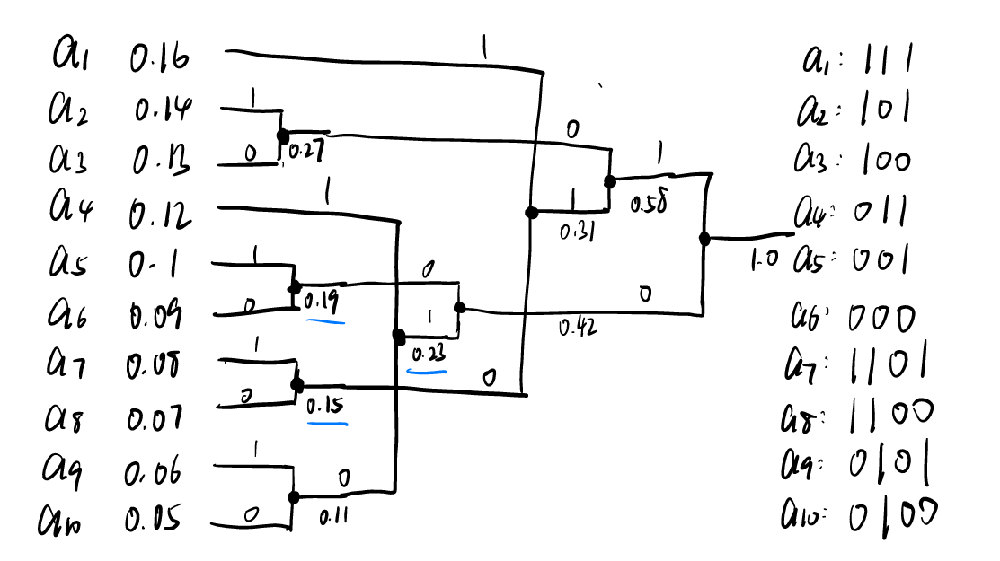
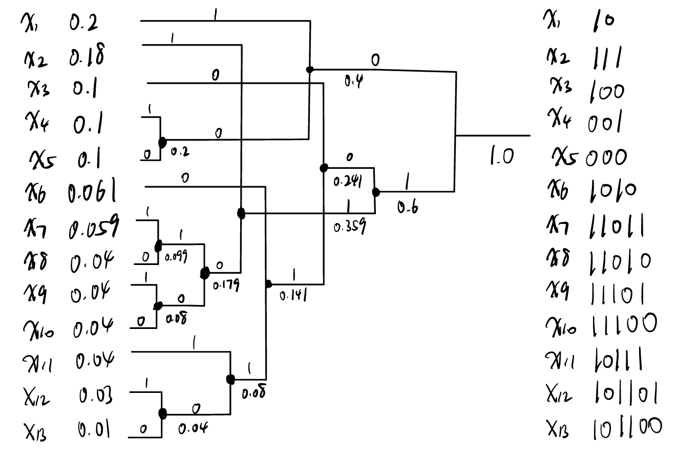
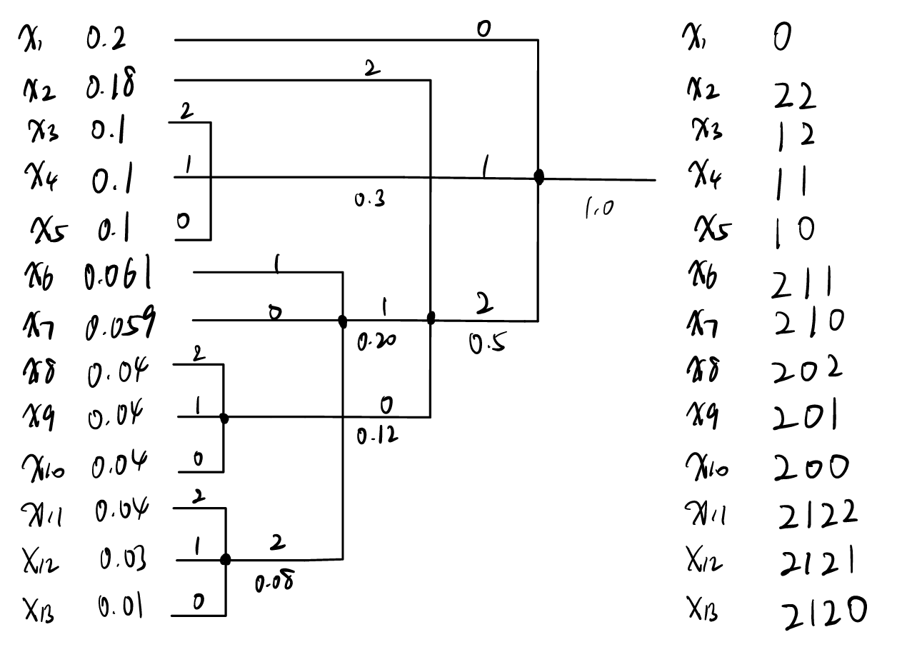

# Homework 3

## Chapter 3.2

### 3.1

试证明最大长度不大于 \( N \) 的 \( D \) 元不等长码至多有 \( D \frac{D^N - 1}{D - 1} \) 个码字。

!!! note "answer"
    由于码字的最大长度不大于 \( N \)，所以码字的长度可以是 \(1, 2, \cdots, N\)。对于长度为 \(1\) 的码字，有 \(D\) 种选择；对于长度为 \(2\) 的码字，有 \(D^2\) 种选择；对于长度为 \(N\) 的码字，有 \(D^N\) 种选择。所以最大长度不大于 \(N\) 的 \(D\) 元不等长码至多有 \(D + D^2 + \cdots + D^N\) 个码字。根据等比数列求和公式，有

    \[ D + D^2 + \cdots + D^N = D \frac{D^N - 1}{D - 1} \]

    所以最大长度不大于 \( N \) 的 \( D \) 元不等长码至多有 \( D \frac{D^N - 1}{D - 1} \) 个码字。

---

### 3.3

下面哪些码是唯一可译的？

(a) \(\{0, 10, 11\}\)

(b) \(\{0, 01, 11\}\)

(c) \(\{0, 01, 10\}\)

(d) \(\{0, 01\}\)

(e) \(\{00, 01, 10, 11\}\)

(f) \(\{110, 11, 10\}\)

(g) \(\{110, 100, 00, 10\}\)

!!! note "answer"
    !!! note "(a) \(\{0, 10, 11\}\)"
        |$S_0=C$|$S_1$|
        |:---:|:---:|
        |0||
        |10||
        |11||

        $S_1=\emptyset$，该码是即时可译并且唯一可译的。
    !!! note "(b) \(\{0, 01, 11\}\)"
        |$S_0=C$|$S_1$|$S_2$|$\cdots$|
        |:---:|:---:|:---:|:---:|
        |0|1|1|$\cdots$|
        |01||||
        |11||||

        $S_i\wedge S_0\neq\emptyset$，该码是唯一可译的。
    !!! note "(c) \(\{0, 01, 10\}\)"
        |$S_0=C$|$S_1$|$S_2$|
        |:---:|:---:|:---:|
        |0|1|0|
        |01|||
        |10|||

        $S_2\wedge S_0\neq\emptyset$，该码不是唯一可译的。例如，\(010\) 可以被解释为 \(0, 10\) 或 \(01, 0\)。
    !!! note "(d) \(\{0, 01\}\)"
        |$S_0=C$|$S_1$|$S_2$|
        |:---:|:---:|:---:|
        |0|1||
        |01|||

        $S_2 = \emptyset$，该码是唯一可译,且译码延时有限.
    !!! note "(e) \(\{00, 01, 10, 11\}\)"
        | $S_0=C$ | $S_1$ |
        |:-------:|:-----:|
        |    00   |       |
        |    01   |       |
        |    10   |       |
        |    11   |       |

        $S_1 = \emptyset$，该码是即时可译并且唯一可译的。

    !!! note "(f) \(\{110, 11, 10\}\)"
        | $S_0=C$ | $S_1$ | $S_2$ |
        |:-------:|:-----:|:-----:|
        |   110   |   0   |       |
        |    11   |       |       |
        |    10   |       |       |

        $S_2 = \emptyset$，该码是唯一可译,且译码延时有限.
    !!! note "(g) \(\{110, 100, 00, 10\}\)"
        | $S_0=C$ | $S_1$ | $S_2$ | $\cdots$ |
        |:-------:|:-----:|:-----:|:-----:|
        |   110   |   0   |   0   | $\cdots$      |
        |   100   |       |       |       |
        |    00   |       |       |       |
        |    10   |       |       |       |

        $S_i\wedge S_0=\emptyset$，该码是唯一可译的。
---

### 3.4

确定下面码是否唯一可译，若不是则构造一个模糊序列。

(a)
\(
\begin{aligned}
&x_1: 010 \\
&x_2: 0001 \\
&x_3: 0110 \\
&x_4: 1100 \\
&x_5: 00011 \\
&x_6: 00110 \\
&x_7: 11110 \\
&x_8: 101011
\end{aligned}
\)

(b)
\(
\begin{aligned}
&x_1: \text{abc} \\
&x_2: \text{abcd} \\
&x_3: \text{e} \\
&x_4: \text{dba} \\
&x_5: \text{bace} \\
&x_6: \text{ceac} \\
&x_7: \text{ceab} \\
&x_8: \text{eabd}
\end{aligned}
\)

!!! note "answer"
    !!! note "(a)"
        |  $S_0=C$ | $S_1$ | $S_2$ | $S_3$ | $S_4$ | $S_5$ |   $S_6$  |
        |:--------:|:-----:|:-----:|:-----:|:-----:|:-----:|:--------:|
        |    010   |   **1**   |  100  |   11  |   00  |   01  |     0    |
        |   **0001**   |       |  1110 |       |  **110**  |  011  |    10    |
        | 0110  |       | **01011** |       |       |  110  |    001   |
        |   1100   |       |       |       |       |   **0**   |    110   |
        |   00011  |       |       |       |       |       |   0011   |
        |   00110  |       |       |       |       |       | **0110** |
        |   11110  |       |       |       |       |       |          |
        |  101011  |       |       |       |       |       |          |

        因为 $S_6\wedge S_0\neq\emptyset$，所以该码不是唯一可译的。例如，
        \(0001 1 01011 110 0 0110\) 可以被解释为 \(0001,101011,1100,0110\) 或 \(00011,010,11110,00110\)。
    !!! note "(b)"
        | $S_0=C$ | $S_1$ | $S_2$ | $S_3$ | $S_4$ | $S_5$ | $S_6$ | $S_7$ | $S_8$ | $S_9$ | $S_{10}$ |$\cdots$ |
        |:-------:|:-----:|:-----:|:-----:|:-----:|:-----:|:-----:|:-----:|:-----:|:-----:|:-----:|:-----:|
        |   abc   |   d   |   ba  |   ce  |   ac  |   c   |  eac  | **d**     | ba    | ce    | **d**        ||
        |   abcd  |  abd  |       |       |   ab  |   cd  |  eab  | **ac**    | c     | eac   | **ac**       ||
        |   bace  |       |       |       |       |       |       | **ab**    | cd    | eab   | **ab**       ||
        |   ceac  |       |       |       |       |       |       |       |       |       |          ||
        |   ceab  |       |       |       |       |       |       |       |       |       |          ||
        |   dba   |       |       |       |       |       |       |       |       |       |          ||
        |    e    |       |       |       |       |       |       |       |       |       |          ||
        |   eabd  |       |       |       |       |       |       |       |       |       |          ||
        
        因为 $S_i\wedge S_0=\emptyset$，所以该码是唯一可译的。

---

### 3.6

令 DMS 为
\[ U = \{a_1, a_2, a_3, a_4, a_5, a_6, a_7, a_8, a_9, a_{10}\} = \{0.16, 0.14, 0.13, 0.12, 0.1, 0.09, 0.08, 0.07, 0.06, 0.05\} \]

(a) 求二元 Huffman 码，计算 \( \overline{n} \) 和 \( \eta_0 \)。

(b) 求三元 Huffman 码，计算 \( \overline{n} \) 和 \( \eta_0 \)。

!!! note "answer"
    $H(U) = -\sum_{i=1}^{10} p_i \log_2 p_i = 3.234 bit$。

    !!! note "(a)"
        {width=70%}
        $R = \overline{n}=3*(1-0.08-0.07-0.06-0.05)+4*(0.08+0.07+0.06+0.05)=3.26 bit$。
        $\eta_0=\frac{H(U)}{R}=99.20\%$。

    !!! note "(b)"
        {width=70%}
        $\overline{n}=2*(1-0.06-0.05)+3*(0.06+0.05)=2.11 bit$。
        $R=\overline{n}\log(D)=2.11*log(3)=3.34 bit$。
        $\eta_0=\frac{H(U)}{R}=96.70\%$。
---

### 3.11

令 DMS 为

\[ U = \{x_1, x_2, x_3, x_4, x_5, x_6, x_7, x_8, x_9, x_{10}, x_{11}, x_{12}, x_{13}\} = \{0.2, 0.18, 0.1, 0.1, 0.1, 0.061, 0.059, 0.04, 0.04, 0.04, 0.04, 0.03, 0.01\} \]

(a) 求二元 Huffman 码，计算 \( \overline{n} \) 和 \( \eta_0 \)。

(b) 求三元 Huffman 码，计算 \( \overline{n} \) 和 \( \eta_0 \)。

!!! note "answer"
    $H(U) = -\sum_{i=1}^{13} p_i \log_2 p_i = 3.3545 bit$。

    !!! note "(a)"
        {width=70%}
        $R = \overline{n}=2*(0.2)+3*(0.18+0.1+0.1+0.1)+4*(0.061)+5*(0.059+0.04+0.04+0.04+0.04)+6*(0.03+0.01)=3.419 bit$。
        $\eta_0=\frac{H(U)}{R}=98.11\%$。

    !!! note "(b)"
        {width=70%}
        $\overline{n}=1*(0.2)+2*(0.18+0.1+0.1+0.1)+3*(0.061+0.059+0.04+0.04+0.04)+4*(0.04+0.03+0.01)=2.20 bit$。
        $R=\overline{n}\log(D)=2.20*log(3)=3.4869 bit$。
        $\eta_0=\frac{H(U)}{R}=96.20\%$。

---

