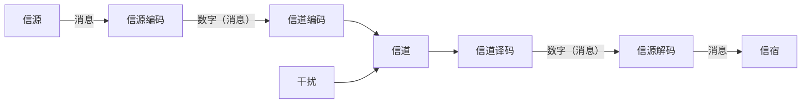

# 信息理论

!!! note ""

    这门课是一门数学课，可以理解成概率统计和随机过程的高级版。主要介绍上世纪40年代末香农所创立的信息理论(Information Theory)，内容主要是关于信息理论最基础的部分，包括信息的定义和度量、无损和有损压缩的数学基础、通信的数学基础三大部分。我们使用的教材是信息论与编码（第2版，仇佩亮等著），授课内容是这本书的前四章以及第五章的一部分。

    信息论、控制论和系统论被并称为二十世纪的三大理论，自诞生之后成为了信息与通信学科的重要数学基础。本世纪以来，尤其是最近十年，信息论也渐渐成为了机器学习的数学基础之一。姚期智在2018年提出了人工智能接下来比较成熟的三个理论方向，其中就包括了信息论。他表示，最近5-10年人工智能都是基于深度学习技术来发展。过去发展的技术终究会到一个饱和阶段。在机器学习阶段，比较接近于成熟的是以前的算法都是数学上证明好了，能达到某一定的效果。但深度学习则是完全不一样的性质，从科学上不能做出合理的解释出它为什么能做得这么好。他表示，如今科学家们在探讨是否可以从信息论和统计物理学的角度来看深度学习。

    助教何扬槊博士的研究课题就是用信息论来做机器学习的可解释性分析，或者利用信息论提升机器学习的性能。有机会他在课堂上会分享一些他最近的研究成果。

!!! note "主要内容"

    - 信息与信息科学
    - 信息的度量
    - 什么是信息论
    - 信息论有什么用
    - 计算理论
    - 控制论

## 信息与信息科学

### 什么是信息？

- 质量、能量、信息
    - 诺伯特·维纳对**信息**的著名定义：“信息就是信息，**不是物质**也**不是能量**。
    - 信息是21世纪的支柱，信息**将取代物质和能量**成为创造财富的重要来源。

- 符号、信号或消息所包含的内容，用来**消除对客观事物认识的不确定性**。
    - 数学家香农在题为“通讯的数学理论”的论文中指出：“信息是用来消除不确定性的东西”。

信息来源于物质,但**不是物质**本身；信息与能量有密切关系，但**不等于能量**；信息**必须有载体**，在信息传输的过程中载体可以不断变更而信息保持原来的内容。

信息具有**弥漫性**，可以**在时间上无限延续**，可**以在空间上无限扩散**。

信息**可被**人类、生物、社会、机器所**利用**。

信息**可被感知、检测、识别、存储、传递、变换、处理、显示、记录和复制**。

信息是一种**不可缺少**的资源,可以**采集、生成、压缩、更新和共享**。

!!! note "概念辨析"

    - 信息与**消息**：消息是信息的外壳，信息是消息的内核。
    - 信息与**信号**：信号是信息的载体。
    - 信息与**数据**：数据是信息存在的一种形态或一种记录形式。
    - 信息与**知识**：知识是事物运动状态和方式在人们头脑中一种有序的、规律性的表达，是信息加工的产物。

### 什么是信息科学？

**信息科学**是研究信息现象及其运动规律、信息系统基本构成与运行机理的科学方法体系
    - 探讨信息的本质内涵与度量方法；
    - 阐明信息获取、信息传递、信息认知、信息决
    策等等信息过程的基本规律和相应信息系统的
    优化组成和运行机理；
    - 建立从信息视角出发来研究自然规律的科学方
    法体系；

**信息科学**涵盖了计算科学、控制科学、系统科学、认知科学等主要研究领域，以信息论、控制论、系统论和计算理论为基础。

## 信息的度量

!!! quote ""
    - 比尔·盖茨曾云：电脑有一个好处，就是不管你存多少数据，它都不会变重。
    - 乔布斯：iphone有一个好处，就是不管你下载多少应用，它都不会变重。

信息的度量是**信息论研究的基本问题**，信息只有被度量了，才能定量分析信息的多少，才能建立一门学科体系对信息进行研究

> 信息的度量非常困难，迄今为止最为权威的是由信息论的创始人香农（Shannon）在《通信的数学理论》（1948）中提出的。

!!! note ""

    我们从一个例子引入**信息熵**，信息是一个很抽象的东西，我和小美在聊天，小美说：**明天**天气真好，是晴天，气温有25度。这句话很短，对于我来说，我要从这句话中提取出有用的信息，但问题来了，我不可能在听到小美说的话后就立刻在自己的脑袋里刻上这条信息。明天天气是否真的那么好？会是晴天吗？如果是晴天，可能达到25度吗？也就是说这条信息具有 **不确定性**，不确定性和信息的大小是密切相关的，如果一条信息的不确定性很大，我们要获取到它，必须查阅很多的资料。明天是晴天？我先去看看天气预报。如果小美说**今天**天气真好，是晴天。这句话的**不确定性就非常小**，因为我知道今天是什么天气。

信息的**信息量**与其**不确定性**有着直接的关系。

$$
I(A) = -\log P(A)
$$

!!! note ""

    - 信息基于事件发生的概率
    - 为什么是log函数?
        - 概率越小，信息量越大
        - 非负数
        - 可加性
    - 确定事件，信息量为0
    - 不可能发生事件，信息量为无穷大

## 什么是信息论

信息论（Information theory）是运用**概率论与数理统计的方法**研究**信息、信息熵、通信系统、数据传输、密码学、数据压缩**等问题的**应用数学**学科(来源：wikipedia)。

信息论将信息的传递作为一种**统计现象**来考虑，给出了**估算通信信道容量**的方法。**信息传输**和**信息压缩**是信息论研究中的两大领域(来源：wikipedia) 。

### 狭义信息论与广义信息论

- 信息论是在信息可以度量的基础上，研究有效地和可靠地传递信息的科学，它涉及**信息量度、信息特性、信息传输速率、信道容量、干扰对信息传输的影响**等方面的知识。通常把上述范围的信息论称为**狭义信息论**，又因为它的创始人是香农，故又称为**香农信息论**。
- **广义信息论**则包含通信的全部统计问题的研究，除了香农信息论之外，还包括**信号设计、噪声理论、信号的检测与估值**等。
- 本课程讲述的**信息理论部分的基本内容是与通信科学密切相关的狭义信息论**。

!!! note ""

    1941～1944年香农对通信和密码进行深人研究，用概率论的方法研究通信系统，揭示了通信系统传递的对象就是信息，并对信息给以科学的定量描述，提出了信息熵的概念。指出**通信系统的中心问题是在噪声下如何有效而可靠地传送信息**，以及**实现这一目标的主要方法是编码**等。香农因此成为信息论的奠基人。

### 信息论的主要内容

信息论所研究的通信系统的基本模型如下：

!!! note "信源"

    - 信源是**产生消息（或消息序列）**的源。
    - 信源输出的是**以符号形式**出现的具体消息，它载荷信息。
    - 信源输出的消息可归纳为两类：
        - **离散**消息（例如由文字、数字等符号组成的符号**序列**）
        - **连续**消息（例如话音、图像等在**时间上连续变化**的电参数）
    - 信源的核心问题是：它包含的信息到底有多少，怎样将信息定量地表示出来，即如何确定信息量。

!!! note "信宿"
    - 信宿是**接收消息的人和机器**。
    - 信宿需要研究的核心问题是**能收到或提取多少信息**。

!!! note "信道"

    - 信道是**传递消息的通道**，又是传送**物理信号**的设施。
    - 信道的问题主要是它**能够传送多少信息**的问题，即**信道容量**的大小。

!!! note "干扰源"

    - 是整个通信系统中各个干扰的集中反映，用以表示消息在信道中传输时遭受干扰的情况。
    - 对于任何通信系统而言，干扰的性质、大小是影响系统性能的重要因素。

**信源编码器**的主要指标是它的**编码效率**；**信道编码器**的主要指标则是对信号提供的**检纠错能力**。

香农信息论解决了通信系统中的两个关键问题，即**信源编码和信道编码的极限速率**：

- 达到**不失真信源压缩编码的极限（最低）编码速率**是该信源的**熵 $H$**。（信源编码）
- 只要**信息传输速率小于信道容量 $C$** ，**传输的错误概率可以任意的小**；反过来如果超过**信道容量**，则传输的错误是不可避免的。（信道编码）

**编码理论**研究的重点是在寻求**接近香农理论极限的编码算法**的同时，**降低算法的复杂性**。

## 信息论有什么用

信息论奠定了通信的基础理论，它所确定的**理论极限**是人类追求
的目标，也是近代几乎所有通信技术取得重大突破的理论
动力和思想源泉。

信息论也带动了整个信息科学的发展，推动了计算理论和控制论的发展和应用，产生了很多信息科学的边缘学科和交叉学科，例如量子信息论，生物信息学，等等

现代信息论蓬勃发展，导致网络通信、深空通信、量子通信、分子通信、计算理论等许多学科方向的发展，新理论与新技术日新月异，层出不穷

!!! note ""
    - 信息与通信工程
    - 生物信息学
        - DNA 测序、DNA复制、生物遗传
    - 文艺信息论(百度百科)
    - 信息论与金融
    - 信息论与人工智能

