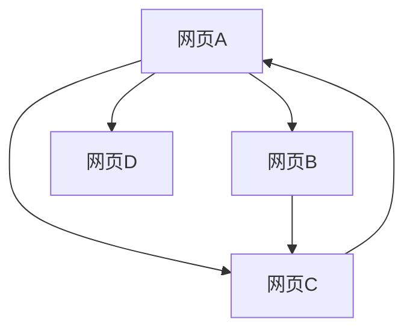

# Lec02 搜索引擎的PageRank模型

!!! question "问题背景："
    如何给出一种合理、客观、定量、可操作的网页排序规则，使“重要”的网页排在前面？

## 网页重要度

网页重要度的原则与假设：某网页重要，是因为有其他重要的网页链接到它。

- 传递性：重要度大的网页链接到网页A时对A重要度的贡献大于重要度小的网页
    - 某网页对其他网页重要度的贡献之和等于它自身的重要度
- 等效性：网页对它所链接的每个网页的重要度贡献相等
    - 某网页对其他网页的重要度贡献与它所链接的网页数量成反比
- 叠加性：连接到网页A的网页越多，A越重要
    - 网页A的重要度是所有链接到它的网页的重要度贡献之和
- 无关性：网页链接其它网页的多少，与其本身的重要度无关

## 网络链接图

互联网中网页之间的连接关系可用图表示，成为**网络链接图**
    顶点：网页
    弧：网页之间的有向链接

记网页$v_i$的重要度为$x_i$，出度为$q_i$，根据上面的假设，我们有

- 网页$v_i$对其他网页重要度贡献之和等于它自身的重要度
- 网页$v_i$对它链接的$q_i$个网页的重要度贡献相等，为$\frac{x_i}{q_i}$
- 若链接到$v_i$的网页有$v_{j_1},v_{j_2},\cdots,v_{j_{q_i}}$，则有

    $$x_i=\frac{x_{j_1}}{q_{j_1}}+\frac{x_{j_2}}{q_{j_2}}+\cdots+\frac{x_{j_{q_i}}}{q_{j_{q_i}}}$$

!!! question "节点没有出度->悬挂网页，用链接矩阵"

随机矩阵

- 各行（列）元素之和均为1的非负方阵称为**行（列）随机矩阵**
- 各行和各列元素之和均为1的非负方阵称为**双随机矩阵**

证明1是他的特征值，对行随机，特征向量为全为1的列向量，特征值为1。转置为列随机，因为转置前后特征值相同。

上面重要度的是列随机矩阵

随机矩阵的模最大特征值

链接矩阵
将该列所有元素修改为$1/n$，单独领出来

修改矩阵成P拔

!!! question "这个线性方程组有多个解"

证明唯一性

若 有两个属于特征值 的线性无关的特征向量（
属于特征值 的特征子空间维数大于 ），用上述
方法可能得到相互矛盾的网页重要度比较结果

修改P拔成P拔拔，成为完全正矩阵

先证明还是列随机矩阵