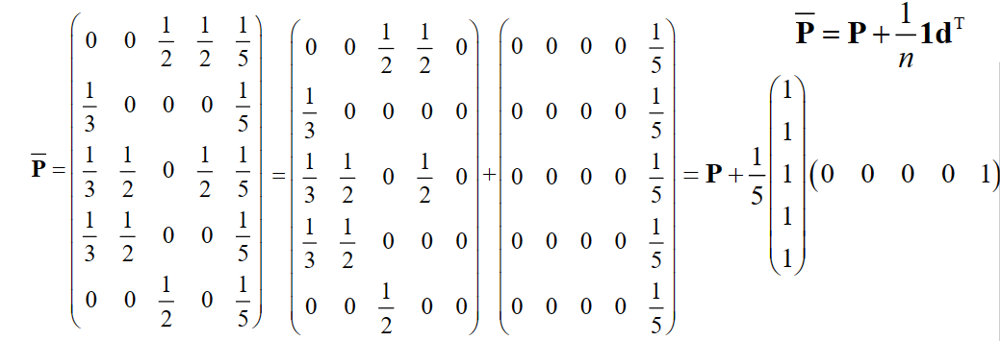

# Model 02 搜索引擎的PageRank模型

!!! question "问题背景："
    如何给出一种<u>合理、客观、定量、可操作</u>的网页排序规则，使“重要”的网页排在前面？

### 随机矩阵

我们先对矩阵的一些概念进行定义：

- 各行（列）元素之和均为1的非负方阵称为**行（列）随机矩阵**
- 各行和各列元素之和均为1的非负方阵称为**双随机矩阵**

任一随机矩阵的模最大特征值为 1 

!!! note "证明"

    1. 证明 $1$ 是随机矩阵的特征值。
       1. 对行随机矩阵，我们很容易就能取到特征向量为全为1的列向量，此时特征值为1。
       2. 对列随机矩阵，因为转置前后特征值相同，所以也是1。
    2. 证明 $1$ 是随机矩阵的模最大特征值。
       1. 设 $\lambda$ 是行随机矩阵$\mathbf{P}=P_{ij}$的特征值，非零向量 $\mathbf{x}=(x_1,x_2,\cdots,x_n)^T$ 为属于特征值$\lambda$的特征向量。设$|x_i|=\max\{|x_1|,|x_2|,\cdots,|x_n|\}$
       2. 由 $\mathbf{P}\mathbf{x}=\lambda\mathbf{x}$，可得 $\lambda x_i = \sum_{j=1}^np_{ij}x_j$。
       3. 对上式两边取模，$|\lambda||x_i| = |\sum_{j=1}^np_{ij}x_j| \leq \sum_{j=1}^n|p_{ij}||x_j| \leq \sum_{j=1}^n|p_{ij}||x_i| = |x_i|\sum_{j=1}^n|p_{ij}| = |x_i|$，即 $|\lambda| \leq 1$。

    所以，1是随机矩阵的特征值，且模最大。

## 网页重要度

为了排序网页，我们首先肯定需要定量地描述网页的重要度。于是，我们给出以下网页重要度的原则与假设：

!!! note "某网页重要，是因为有其他重要的网页链接到它"

    - 传递性：重要度大的网页链接到网页A时，它对A重要度的贡献大于重要度小的网页
        - 某网页对其他网页重要度的贡献之和等于它自身的重要度
    - 等效性：网页对它所链接的每个网页的重要度贡献相等
        - 某网页对其他网页的重要度贡献与它所链接的网页数量成反比
    - 叠加性：链接到网页A的网页越多，A越重要
        - 网页A的重要度是所有链接到它的网页的重要度贡献之和
    - 无关性：网页链接其它网页的多少，与其本身的重要度无关

### 网络链接图

我们用<u>有向图</u>来表示互联网中网页之间的连接关系，并称之为**网络链接图**，我们定义顶点为网页$V=\{v_1,v_2,\cdots,v_n\}$，弧为网页之间的有向链接。

!!! note "例子"

    如图所示，我们记网页A、B、C、D为$v_1,v_2,v_3,v_4$，则有$v_1$指向$v_2, v_3,v_4$; $v_2$指向$v_3,v_4$; $v_3$指向$v_1$; $v_4$指向$v_1,v_3$。
    
    {:height="20%" width="20%"}

### 网页重要度的矩阵表示

记网页$v_i$的重要度为$x_i$，出度为$q_i$，根据网页重要度中的假设，我们有

- 网页$v_i$对其他网页重要度贡献之和等于它自身的重要度$x_i$
- 网页$v_i$对它链接的$q_i$个网页的重要度贡献相等，为$\frac{x_i}{q_i}$
- 若链接到$v_i$的网页有$v_{j_1},v_{j_2},\cdots,v_{j_{q_i}}$，则有

    $$x_i=\frac{x_{j_1}}{q_{j_1}}+\frac{x_{j_2}}{q_{j_2}}+\cdots+\frac{x_{j_{q_i}}}{q_{j_{q_i}}}$$

记$p_{ij}$为网页$v_i$到$v_j$的链接概率，即$v_i$链接到$v_j$的概率，我们有

$$p_{ij}=\begin{cases}
\frac{1}{q_i},&\text{若}v_i\text{链接到}v_j\\
0,&\text{若}v_i\text{不链接到}v_j
\end{cases}$$

所以，我们可以将上式改写为

$$x_i=\sum_{j=1}^np_{ij}x_j$$

记矩阵$\mathbf{P}=(p_{ij})_{n\times n}$为初始链接矩阵，$\mathbf{x}=(x_1,x_2,\cdots,x_n)^T$为网页重要度向量，我们有

$$\mathbf{x}=\mathbf{P}\mathbf{x}$$

显然，$\mathbf{x}$是$\mathbf{P}$的特征向量，对应的特征值为1。且$\text{Rank}(\mathbf{I}-\mathbf{P})<n$（其实$\mathbf{I}-\mathbf{P}$的每一列和为0，将最后一行前的所有行相加至最后一行，得到$\mathbf{0}$，所以$\text{Rank}(\mathbf{I}-\mathbf{P})<n$）。

因为初始链接矩阵$\mathbf{P}$的每一列和为1，所以$\mathbf{P}$是**列随机矩阵**。

!!! note "例子"

    如图所示，我们记网页A、B、C、D为$v_1,v_2,v_3,v_4$，则有$v_1$指向$v_2, v_3,v_4$; $v_2$指向$v_3,v_4$; $v_3$指向$v_1$; $v_4$指向$v_1,v_3$。
    
    {:height="20%" width="20%"}

    我们有（$p_{ij}$是从$v_j$到$v_i$的概率）

    $$
    \mathbf{P}=\begin{bmatrix}
    0&0&1&\frac{1}{2}\\
    \frac{1}{3}&0&0&0\\
    \frac{1}{3}&\frac{1}{2}&0&\frac{1}{2}\\
    \frac{1}{3}&\frac{1}{2}&0&0
    \end{bmatrix}
    $$

    所以：

    $$
    \mathbf{I}-\mathbf{P}=\begin{bmatrix}
    1&0&-1&-\frac{1}{2}\\
    -\frac{1}{3}&1&0&0\\
    -\frac{1}{3}&-\frac{1}{2}&1&-\frac{1}{2}\\
    -\frac{1}{3}&-\frac{1}{2}&0&1
    \end{bmatrix}
    $$

    可以解得：

    $$
    \mathbf{x}=\begin{bmatrix}
    \frac{12}{31}\\
    \frac{4}{31}\\
    \frac{9}{31}\\
    \frac{6}{31}
    \end{bmatrix}
    $$

但是，线性方程组$\mathbf{x}=\mathbf{P}\mathbf{x}$还会有特殊情况：

!!! note ""
    !!! question "节点没有出度"
        [悬挂网页](#_5)

    !!! question "这个线性方程组有多个解"

### 悬挂网页

若某网页不链接到任意其它网页，我们称之为**悬挂网页**。显然，悬挂网页的出度为0，但它的重要度不为0，因为有其他网页链接到它。所以我们需要对初始链接矩阵$\mathbf{P}$进行修正。

将链接矩阵$\mathbf{P}$的该列所有元素由$0$修改为$\frac{1}{n}$，得到（修正）链接矩阵$\overline{\mathbf{P}}$。

我们记悬挂网页为第$i$个网页，记$\mathbf{d}^T=(0,0,\cdots,0,1,0,\cdots,0)$，其中索引至悬挂网页的值为1，其余为0。则有

$$\overline{\mathbf{P}}=\mathbf{P}+\frac{1}{n}\mathbf{1}\mathbf{d}^T$$

!!! note "悬挂网页例子"
    
    === "图"
        
        如下图中，修正的链接矩阵为多少？

        

    === "修正连接矩阵"

        

证明唯一性

若 有两个属于特征值 的线性无关的特征向量（
属于特征值 的特征子空间维数大于 ），用上述
方法可能得到相互矛盾的网页重要度比较结果

修改P拔成P拔拔，成为完全正矩阵

先证明还是列随机矩阵

!!! question "节点没有出度->悬挂网页，用链接矩阵"
