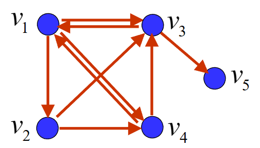

# 02 搜索引擎的PageRank模型

!!! question "问题背景："
    如何给出一种<u>合理、客观、定量、可操作</u>的网页排序规则，使“重要”的网页排在前面？

## 随机矩阵

我们先对矩阵的一些概念进行定义：

- 各行（列）元素之和均为1的非负方阵称为**行（列）随机矩阵**
- 各行和各列元素之和均为1的非负方阵称为**双随机矩阵**

任一随机矩阵的模最大特征值为 1

!!! note "证明"

    1. 证明 $1$ 是随机矩阵的特征值。

          1. 对行随机矩阵，我们很容易就能取到特征向量为全为1的列向量，此时特征值为1。
          2. 对列随机矩阵，因为转置前后特征值相同，所以也是1。

    2. 证明 $1$ 是随机矩阵的模最大特征值。
    
          1. 设 $\lambda$ 是行随机矩阵$\mathbf{P}=P_{ij}$的特征值，非零向量 $\mathbf{x}=(x_1,x_2,\cdots,x_n)^T$ 为属于特征值$\lambda$的特征向量。设$|x_i|=\max\{|x_1|,|x_2|,\cdots,|x_n|\}$
          2. 由 $\mathbf{P}\mathbf{x}=\lambda\mathbf{x}$，可得 $\lambda x_i = \sum_{j=1}^np_{ij}x_j$。
          3. 对上式两边取模，$|\lambda||x_i| = |\sum_{j=1}^np_{ij}x_j| \leq \sum_{j=1}^n|p_{ij}||x_j| \leq \sum_{j=1}^n|p_{ij}||x_i| = |x_i|\sum_{j=1}^n|p_{ij}| = |x_i|$，即 $|\lambda| \leq 1$。

    所以，1是随机矩阵的特征值，且模最大。

## 网页重要度

为了排序网页，我们首先肯定需要定量地描述网页的重要度。于是，我们给出以下网页重要度的原则与假设：

!!! note "某网页重要，是因为有其他重要的网页链接到它"

    - 传递性：重要度大的网页链接到网页A时，它对A重要度的贡献大于重要度小的网页
        - 某网页对其他网页重要度的贡献之和等于它自身的重要度
    - 等效性：网页对它所链接的每个网页的重要度贡献相等
        - 某网页对其他网页的重要度贡献与它所链接的网页数量成反比
    - 叠加性：链接到网页A的网页越多，A越重要
        - 网页A的重要度是所有链接到它的网页的重要度贡献之和
    - 无关性：网页链接其它网页的多少，与其本身的重要度无关

### 网络链接图

我们用<u>有向图</u>来表示互联网中网页之间的连接关系，并称之为**网络链接图**，我们定义顶点为网页$V=\{v_1,v_2,\cdots,v_n\}$，弧为网页之间的有向链接。

!!! note "例子"

    如图所示，我们记网页A、B、C、D为$v_1,v_2,v_3,v_4$，则有$v_1$指向$v_2, v_3,v_4$; $v_2$指向$v_3,v_4$; $v_3$指向$v_1$; $v_4$指向$v_1,v_3$。
    
    {:height="20%" width="20%"}

### 网页重要度的矩阵表示

记网页$v_i$的重要度为$x_i$，出度为$q_i$，根据网页重要度中的假设，我们有

- 网页$v_i$对其他网页重要度贡献之和等于它自身的重要度$x_i$
- 网页$v_i$对它链接的$q_i$个网页的重要度贡献相等，为$\frac{x_i}{q_i}$
- 若链接到$v_i$的网页有$v_{j_1},v_{j_2},\cdots,v_{j_{q_i}}$，则有

    $$x_i=\frac{x_{j_1}}{q_{j_1}}+\frac{x_{j_2}}{q_{j_2}}+\cdots+\frac{x_{j_{q_i}}}{q_{j_{q_i}}}$$

记$p_{ij}$为网页$v_i$到$v_j$的链接概率，即$v_i$链接到$v_j$的概率，我们有

$$p_{ij}=\begin{cases}
\frac{1}{q_i},&\text{若}v_i\text{链接到}v_j\\
0,&\text{若}v_i\text{不链接到}v_j
\end{cases}$$

所以，我们可以将上式改写为

$$x_i=\sum_{j=1}^np_{ij}x_j$$

记矩阵$\mathbf{P}=(p_{ij})_{n\times n}$为初始链接矩阵，$\mathbf{x}=(x_1,x_2,\cdots,x_n)^T$为网页重要度向量，我们有

$$\mathbf{x}=\mathbf{P}\mathbf{x}$$

显然，$\mathbf{x}$是$\mathbf{P}$的特征向量，对应的特征值为1。且$\text{Rank}(\mathbf{I}-\mathbf{P})<n$（其实$\mathbf{I}-\mathbf{P}$的每一列和为0，将最后一行前的所有行相加至最后一行，得到$\mathbf{0}$，所以$\text{Rank}(\mathbf{I}-\mathbf{P})<n$）。

因为初始链接矩阵$\mathbf{P}$的每一列和为1，所以$\mathbf{P}$是**列随机矩阵**。

!!! note "例子"

    如图所示，我们记网页A、B、C、D为$v_1,v_2,v_3,v_4$，则有$v_1$指向$v_2, v_3,v_4$; $v_2$指向$v_3,v_4$; $v_3$指向$v_1$; $v_4$指向$v_1,v_3$。
    
    {:height="20%" width="20%"}

    我们有（$p_{ij}$是从$v_j$到$v_i$的概率）

    $$
    \mathbf{P}=\begin{bmatrix}
    0&0&1&\frac{1}{2}\\
    \frac{1}{3}&0&0&0\\
    \frac{1}{3}&\frac{1}{2}&0&\frac{1}{2}\\
    \frac{1}{3}&\frac{1}{2}&0&0
    \end{bmatrix}
    $$

    所以：

    $$
    \mathbf{I}-\mathbf{P}=\begin{bmatrix}
    1&0&-1&-\frac{1}{2}\\
    -\frac{1}{3}&1&0&0\\
    -\frac{1}{3}&-\frac{1}{2}&1&-\frac{1}{2}\\
    -\frac{1}{3}&-\frac{1}{2}&0&1
    \end{bmatrix}
    $$

    可以解得：

    $$
    \mathbf{x}=\begin{bmatrix}
    \frac{12}{31}\\
    \frac{4}{31}\\
    \frac{9}{31}\\
    \frac{6}{31}
    \end{bmatrix}
    $$

但是，线性方程组$\mathbf{x}=\mathbf{P}\mathbf{x}$还会有特殊情况：

!!! note ""
    !!! question "节点没有出度"
        [悬挂网页](#_5)

        {:height="40%" width="40%"}

    !!! question "这个线性方程组有多个解"
        若$\overline{\mathbf{P}}$有两个属于特征值$1$的线性无关的特征向量，我们就无法得到唯一的网页重要度向量$\mathbf{x}$。如下图。
        {:height="40%" width="40%"}

### 悬挂网页

若某网页不链接到任意其它网页，我们称之为**悬挂网页**。显然，悬挂网页的出度为0，但它的重要度不为0，因为有其他网页链接到它。所以我们需要对初始链接矩阵$\mathbf{P}$进行修正。

将链接矩阵$\mathbf{P}$的该列所有元素由$0$修改为$\frac{1}{n}$，得到（修正）链接矩阵$\overline{\mathbf{P}}$。

我们记悬挂网页为第$i$个网页，记$\mathbf{d}^T=(0,0,\cdots,0,1,0,\cdots,0)$，其中索引至悬挂网页的值为1，其余为0。则有

$$\overline{\mathbf{P}}=\mathbf{P}+\frac{1}{n}\mathbf{1}\mathbf{d}^T$$

!!! note "悬挂网页例子"

    === "图"
        
        如下图中，修正的链接矩阵为多少？

        

    === "修正连接矩阵"

        

### 多解修正

若$\overline{\mathbf{P}}$有两个属于特征值$1$的线性无关的特征向量，我们就无法得到唯一的网页重要度向量$\mathbf{x}$。

于是，我们对$\overline{\mathbf{P}}$进行修正，使得$\overline{\mathbf{P}}$成为**完全正矩阵**，即$\overline{\mathbf{P}}$的所有方阵子式的行列式都大于0。

我们先给出修正的方法：

$$\overline{\overline{\mathbf{P}}}=\alpha\overline{\mathbf{P}}+(1-\alpha)\frac{1}{n}\mathbf{1}\mathbf{1}^T$$

其中，$\alpha$为修正系数，$\alpha=0.85$。$\overline{\overline{\mathbf{P}}}$是完全正矩阵与列随机矩阵的结合。

!!! note "证明$\overline{\overline{\mathbf{P}}}$是列随机矩阵"

    $\mathbf{1}^T\overline{\overline{\mathbf{P}}}=\alpha\mathbf{1}^T\overline{\mathbf{P}}+(1-\alpha)\mathbf{1}^T\frac{1}{n}\mathbf{1}\mathbf{1}^T=\alpha\mathbf{1}^T+(1-\alpha)\mathbf{1}^T=\mathbf{1}^T$

    所以，$\overline{\overline{\mathbf{P}}}$是列随机矩阵。

注意，我们说的是$\overline{\overline{\mathbf{P}}}$是列随机矩阵，而我们要求的是$\overline{\overline{\mathbf{P}}}\mathbf{x}=\mathbf{x}$，所以这里的$\mathbf{1}^T$并不是$\overline{\overline{\mathbf{P}}}$的特征向量。

!!! note "证明$\overline{\overline{\mathbf{P}}}$关于特征值1的特征向量有且只有一个"

    1. 存在性：$\overline{\overline{\mathbf{P}}}$是列随机矩阵，所以1是$\overline{\overline{\mathbf{P}}}$的特征值，且$\mathbf{1}$是属于特征值1的特征向量。
    2. 唯一性：用反证法：
    
    设$\mathbf{v}=(v_1,v_2,\cdots,v_n)^T, \mathbf{w}=(w_1,w_2,\cdots,w_n)^T$是完全正、列随机矩阵$\overline{\overline{\mathbf{P}}}$的属于特征值1的特征向量，且$\mathbf{v}\neq\mathbf{w}$。令$x_i = -\frac{W}{V}v_i+w_i, i = 1,2,\cdots,n$，其中$W=\sum_{i=1}^nw_i, V=\sum_{i=1}^nv_i\neq 0$，因为$\mathbf{v}$和$\mathbf{w}$线性无关，且

    $$\sum\limits_{j=i}^n\overline{\overline{p}}_{ij}x_j=\sum\limits_{j=i}^n\overline{\overline{p}}_{ij}(-\frac{W}{V}v_j+w_j)=-\frac{W}{V}\sum\limits_{j=i}^n\overline{\overline{p}}_{ij}v_j+\sum\limits_{j=i}^n\overline{\overline{p}}_{ij}w_j=-\frac{W}{V}v_i+w_i=x_i$$

    !!! note ""
        $\sum\limits_{j=i}^n\overline{\overline{p}}_{ij}v_j=v_i$，是因为$\mathbf{v}=(v_1,v_2,\cdots,v_n)^T$是属于特征值1的特征向量，经计算可得。

    所以有$\sum\limits_{i=1}^nx_i = \sum\limits_{i=1}^n(-\frac{W}{V}v_i+w_i) = -\frac{W}{V}\sum\limits_{i=1}^nv_i+\sum\limits_{i=1}^nw_i = -\frac{W}{V}V+W = 0$，即$\mathbf{x}$是$\overline{\overline{\mathbf{P}}}$的属于特征值1的特征向量，所以$\mathbf{x}$的分量之和为0。

    我们接下来尝试证明：如果$\mathbf{x}$是$\overline{\overline{\mathbf{P}}}$的属于特征值1的特征向量，那么$\mathbf{x}$的分量之和不为零，从而与上面的结论矛盾。这也就证明了属于特征值1的特征向量有且只有一个。

    !!! note ""
    
        证明：
        设$\mathbf{x}$是$\overline{\overline{\mathbf{P}}}$的属于特征值1的特征向量，则$x_i=\sum\limits_{j=1}^n\overline{\overline{p}}_{ij}x_j$
        
        如果$\sum\limits_{i=1}^nx_i=0$，则$\mathbf{x}$的分量有正有负，所以
        
        $$|x_i|=|\sum\limits_{j=1}^n\overline{\overline{p}}_{ij}x_j|<\sum\limits_{j=1}^n\overline{\overline{p}}_{ij}|x_i|$$

        所以

        $$\sum\limits_{i=1}^n|x_i|<\sum\limits_{i=1}^n\sum\limits_{j=1}^n\overline{\overline{p}}_{ij}|x_j|=\sum\limits_{j=1}^n\sum\limits_{i=1}^n\overline{\overline{p}}_{ij}|x_j|=\sum\limits_{j=1}^n(|x_j|\sum\limits_{i=1}^n\overline{\overline{p}}_{ij})=\sum\limits_{j=1}^n|x_j|$$

        矛盾，所以$\mathbf{x}$的分量之和不为零。

    所以，$\overline{\overline{\mathbf{P}}}$关于特征值1的特征向量有且只有一个。

#### Perron-Frobenius定理

把上述结论一般化，我们有：

!!! note "Perron定理"
    若矩阵 $\mathbf{A}$是完全正矩阵，则
    - $\mathbf{A}$的模最大特征值唯一，且为正实数
    - 该特征值代数重数为1
    - 存在该特征值的一个特征向量，其分量全为正

!!! note "Perron—Frobenius定理"
    若矩阵 $\mathbf{A}$是非负不可约（irreducible）矩阵，则
    - $\mathbf{A}$的模最大特征值为正实数
    - 该特征值代数重数为1
    - 存在该特征值的一个特征向量，其分量全为正

    !!! note "不可约矩阵"
        不可约矩阵当且仅当矩阵对应的有向图是强连通图。

        强连通图是指在有向图$G$中，如果对于每一对$v_i,v_j$，$v_i\neq v_j$，从$v_i$到$v_j$和从$v_j$到$v_i$都存在路径，则称$G$是强连通图。

        

    !!! note "不可约矩阵的代数描述"
        若干个初等对换矩阵的乘积称为置换矩阵（permutation matrix）
        - 置换矩阵每行和每列都恰有一个元素为 1，其余元素都为 0
        - 若存在置换矩阵 $\mathbf{Q}$，使得 $\mathbf{Q}^T\mathbf{A}\mathbf{Q}= \begin{pmatrix}\mathbf{X}&0\\\mathbf{Y}&\mathbf{Z}\end{pmatrix}$，其中 $\mathbf{X}$ 和 $\mathbf{Z}$ 均为方阵，则称 $\mathbf{A}$ 为可约矩阵（reducible matrix），否则 $\mathbf{A}$ 为不可约矩阵

## PageRank中的矩阵求解

整个互联网有相当多且稀疏的网页，所以我们需要一个好的算法来求解网页重要度向量$\mathbf{x}$。

### 幂法

幂法是计算矩阵模最大特征值和对应的特征向量的一种迭代算法

任取初始向量$\mathbf{x}^{(0)}>0$，且$\sum\limits_{i=1}^nx_i^{(0)}=1$，我们通过迭代计算$\mathbf{x}^{(k)}=\overline{\overline{\mathbf{P}}}\mathbf{x}^{(k-1)}$，直到$\mathbf{x}^{(k)}$收敛

!!! note ""
    $\mathbf{1}^T\mathbf{x}^{(k)}=\mathbf{1}^T\overline{\overline{\mathbf{P}}}\mathbf{x}^{(k-1)}=\mathbf{1}^T\mathbf{x}^{(k-1)}=1$

我们展开$\mathbf{x}^{(k)}=\overline{\overline{\mathbf{P}}}\mathbf{x}^{(k-1)}$

!!! note ""

    $$\overline{\mathbf{P}}=\mathbf{P}+\frac{1}{n}\mathbf{1}\mathbf{d}^T$$

    $$\overline{\overline{\mathbf{P}}}=\alpha\overline{\mathbf{P}}+(1-\alpha)\frac{1}{n}\mathbf{1}\mathbf{1}^T$$

$$\begin{aligned}
\mathbf{x}^{(k)}&=\overline{\overline{\mathbf{P}}}\mathbf{x}^{(k-1)}\\
&=\alpha\overline{\mathbf{P}}\mathbf{x}^{(k-1)}+(1-\alpha)\frac{1}{n}\mathbf{1}\mathbf{1}^T\mathbf{x}^{(k-1)}\\
&=\alpha\overline{\mathbf{P}}\mathbf{x}^{(k-1)}+(1-\alpha)\frac{1}{n}\mathbf{1}\\
&=\alpha(\mathbf{P}+\frac{1}{n}\mathbf{1}\mathbf{d}^T)\mathbf{x}^{(k-1)}+(1-\alpha)\frac{1}{n}\mathbf{1}\\
&=\alpha\mathbf{P}\mathbf{x}^{(k-1)}+\alpha\frac{1}{n}\mathbf{1}\mathbf{d}^T\mathbf{x}^{(k-1)}+(1-\alpha)\frac{1}{n}\mathbf{1}\\
\end{aligned}$$

#### 完全正、列随机矩阵幂法的收敛性

!!! note ""
    $$\mathbf{1}^T\overline{\overline{\mathbf{P}}}=\mathbf{1}^T$$

    $$\overline{\overline{\mathbf{P}}}=(\overline{\overline{p_{ij}}})_{n\times n}$$

记$\mathbf{V}$为满足$\mathbf{1}^T\mathbf{v}=1$的$n$维列向量$\mathbf{v}=\{v_1,v_2,\cdots,v_n\}$全体组成的集合。记$\|\mathbf{v}\|_1=\sum\limits_{i=1}^n|v_i|$。

对任意的$\mathbf{v}\in\mathbf{V}$，我们取$\mathbf{w}=\overline{\overline{\mathbf{P}}}\mathbf{v}$，因为

$$\mathbf{1}^T\mathbf{w}=\mathbf{1}^T\overline{\overline{\mathbf{P}}}\mathbf{v}=\mathbf{1}^T\mathbf{v}=0$$

所以$\mathbf{w}\in\mathbf{V}$。

我们接下来尝试证明$\|\mathbf{w}\|_1=\|\overline{\overline{\mathbf{P}}}\mathbf{v}\|_1\leq c\|\mathbf{v}\|_1$，其中$c<1$。

1. $\mathbf{w}=0$，显然成立。
2. $\mathbf{w}\neq0$，记$\mathbf{w}=(w_1,w_2,\cdots,w_n)^T$，$e_i = \text{sgn}(w_i)$，则有

$$\begin{aligned}
\|\mathbf{w}\|_1&=\sum\limits_{i=1}^n|w_i|\\
&=\sum\limits_{i=1}^ne_iw_i\\
&=\sum\limits_{i=1}^n(e_i\sum\limits_{j=1}^n\overline{\overline{p_{ij}}}v_j)\\
&=\sum\limits_{i=1}^n(\sum\limits_{j=1}^ne_i\overline{\overline{p_{ij}}}v_j)\\
&=\sum\limits_{j=1}^n(\sum\limits_{i=1}^ne_i\overline{\overline{p_{ij}}}v_j)\\
&=\sum\limits_{j=1}^n(v_j\sum\limits_{i=1}^ne_i\overline{\overline{p_{ij}}})\\
&\leq\sum\limits_{j=1}^n(|v_j||\sum\limits_{i=1}^ne_i\overline{\overline{p_{ij}}}|)\\
\end{aligned}$$

记$c = \max \limits_{1\leq j\leq n}|\sum\limits_{i=1}^ne_i\overline{\overline{p_{ij}}}|<1$，则有

$$\begin{aligned}
\|\mathbf{w}\|_1&\leq\sum\limits_{j=1}^n(|v_j||\sum\limits_{i=1}^ne_i\overline{\overline{p_{ij}}}|)\\
&\leq\sum\limits_{j=1}^n(|v_j|c)\\
&=c\sum\limits_{j=1}^n|v_j|\\
&=c\|\mathbf{v}\|_1\\
\end{aligned}$$

所以，$\|\mathbf{w}\|_1\leq c\|\mathbf{v}\|_1$，其中$c<1$。

---

记$\mathbf{v}_0=\mathbf{x}^{(0)}-\mathbf{X}\in \mathbf{V}$，我们有

$$\mathbf{1}^T\mathbf{v}_0=\mathbf{1}^T\mathbf{x}^{(0)}-\mathbf{1}^T\mathbf{X}=1-1=0$$

所以$\mathbf{v}_0\in \mathbf{V}$。

由于$\overline{\overline{\mathbf{P}}}\mathbf{X}=\mathbf{X}$，

$$\mathbf{x}^{(k)}=\overline{\overline{\mathbf{P}}}^k\mathbf{x}^{(0)}=\overline{\overline{\mathbf{P}}}^k(\mathbf{X}+\mathbf{v}_0)=\mathbf{X}+\overline{\overline{\mathbf{P}}}^k\mathbf{v}_0$$

由于$\|\overline{\overline{\mathbf{P}}}^k\mathbf{v}_0\|_1\leq c^k\|\mathbf{v}_0\|_1$，所以

$$\|\mathbf{x}^{(k)}-\mathbf{X}\|_1\leq c^k\|\mathbf{v}_0\|_1$$

所以，$\mathbf{x}^{(k)}$收敛到$\mathbf{X}$，得证。

## 随机浏览

按以下模式浏览互联网的网页

- 有时从当前网页的链接中随机打开一个网页
- 有时键入网址新建一个网页
- 从任一网页开始，充分长时间后，访问各网页的概率即为网页重要度

经过统计，随机打开网页的次数与键入网址新建网页的次数之比约为$5:1$，这就是$\alpha=0.85$的来源。

## 随机概率

记事件 $\{X_m=j\}$ 为时刻 $m$ 访问网页 $v_j$，则$P\{X_m=i | X_{m-1}=j\}=p_{ij}$

若  $P\{X_m=j\}=x_j$，则$P\{X_{m}=i\}=\sum\limits_{j=1}^nP\{X_m=i | X_{m-1}=j\}P\{X_{m-1}=j\}=\sum\limits_{j=1}^np_{ij}x_j$

记 $\mathbf{x}^{(m)}=(P\{X_m=1\},P\{X_m=2\},\cdots,P\{X_m=n\})^T$，则有$\mathbf{x}^{(m)}=\overline{\overline{\mathbf{P}}}\mathbf{x}^{(m-1)}$

## 随机过程

随机过程是描述随机现象随时间推移而演化的一类数学模型。

在**一族随机变量**$\{X(t),t\in T\}$中$T$为参数集，$t$是参数。$\{X(t),t\in T\}$称为参数为$t$的随机变量。

- $T$为整数集的随机过程称为随机序列

### Markov过程

在已知目前的状态（现在）的条件下，它未来的演变（将来）不依赖于它以往的演变（过去）。

在随机序列$\{X(n),n=0,1,2,\cdots\}$中($X_n$有限或可列)，我们对于任意的$n\geq0$，有

$$P\{X_{n+1}=j | X_n=i,X_{n-1}=i_{n-1},\cdots,X_0=i_0\}=P\{X_{n+1}=j | X_n=i\}$$