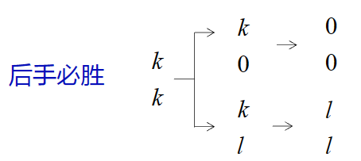
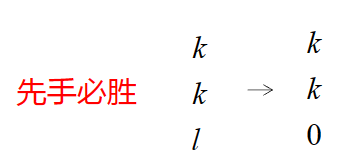

# 03 Nim游戏

!!! question "问题背景"

    现有$n$堆硬币，每堆数量一定。两人轮流取硬币，每次只能从其中一堆中取，且每次取至少一枚。取到最后一枚硬币的一方获胜。

    那么，这个游戏是否有必胜策略？若有，应如何取胜？

## 特殊情况

我们先从考虑一下这个游戏的特殊情况。

!!! note "两堆硬币"

    === "1 1"
        

    === "k 1"
        先手第一步将硬币数转换为 1 1

        

    === "k k"
        

    === "k l"
        先手第一步将硬币数转换为 l l 形式

        

!!! note "三堆硬币"

    === "1 1 1"
        

    === "l k k"
        

    === "复杂情况"
        
        
        

但是，这些复杂情况我们就不能一一列举了。我们需要找到一种方法，能够将任意情况转换为上述的特殊情况。

## 安全状态

我们先来定义一下什么是安全状态。

若无论对方如何取均不会获胜，或者无论对方如何取，己方下一次取后均可变为一个安全状态的，称为安全状态。

若对方至少存在一种获胜的取法，己方下一次取无法变为一个安全状态的，称为不安全状态。

必胜策略：己方取法使得下一状态为安全状态。

## Nim游戏的必胜策略

### 二进制与位和

将每堆硬币数表示为二进制。将所有二进制数的每一位数字分别求和，其尾数称为位和。（其实就是异或）

- 只有一堆硬币时，位和不可能全为0
- 每次从某一堆中取若干枚硬币，该堆硬币的二进制数发生变化，且至少有一位位和发生变化

### 位和与安全状态

若所有位和均为 0 ，则当前状态为安全的，否则为不安全

- 若当前状态安全，对任意取法，状态变为不安全
- 若当前状态不安全，存在一种取法，状态变为安全
    - 按自左至右的顺序确定第一个数字之和不为 0 的位，寻找该位数字为 1 的堆，从该堆中取走若干枚使得状态变为安全

{: width="40%" height="50%"}
