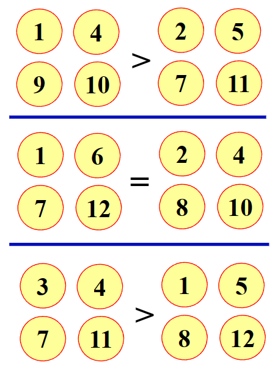

# 04 组合群式 - 伪币辨识

!!! question "问题背景"
    12枚外观相同的硬币中有一枚是伪币，伪币质量与真币不同。天平一次称量只能比较两端质量大小，不能读出质量数值。能否用天平称量三次找出伪币，并说明伪币相对真币偏轻或偏重。

## 组合群式

群式分为组合群试和概率群式。

- 组合群式：假定$n$枚硬币中有$k$枚是伪币，如何用尽可能少的检测次数（在任何情况下）找出全部的伪币
- 概率群试：假定$n$枚硬币相互独立地以概率$p$可能是伪币，如何找出全部的伪币，使平均检测次数尽可能少

这个问题是组合群试的问题。概率群式我们将在[疾病检测](./Disease.md)中讨论。

## 特殊情况

后一次称量依赖于之前称量结果的方案为自适应（adaptive）的，否则称为非自适应（non-adaptive）的

### 自适应方案

硬币真伪的可能性共有$12\times 2 = 24$种。每一种称量结果对应一种可能性，不同称量结果对应的可能性各不相同

### 非自适应方案

自适应方案缺点在于三次实验不能同时进行，这对一些称量周期大的实验来说是不可接受的。因此我们考虑非自适应方案。

我们先给出十二枚硬币三种称量

!!! note ""

    === "第一次"
    

    如果伪币为重，则在1、4、9、10中，如果伪币为轻，则在2、5、7、12中

    === "第二次"
    

    此时不知伪币轻重，但是可以确定伪币在补集3、5、9、11中

    === "第三次"
    

    如果伪币为重，则在3、4、7、11中，如果伪币为轻，则在1、5、8、12中

    === "总结"
    把我们判断轻重的部分放在一起，可以得到如下的判断表
    
    {: width="50%"}

    每个判断中取三组的交集，即可得到伪币的位置

## 一般结论

对任意整数$w>2$
    - 若 $3\leq n\leq \frac{3^w-3}{2}$，则存在一种非自适应的称量方案，使用 $w$ 次称量可从 $n$ 枚硬币中辨别伪币并确定轻重。
    - 若 $n>\frac{3^w-3}{2}$，则不存在自适应的称量方案，用 $w$ 次称量即可从 $n$ 枚硬币中辨别伪币并确定轻重。

## 一般情况的非自适应方案

构造要能实现非自适应方案，需要满足Dyson集，即满足以下条件的$w$元向量子集$S\subseteq \{-1,0,1\}^w$

- $\sum_{\mathbf{v}\in S}\mathbf{v}=\mathbf{0}$，确保天平两端硬币数相等
- 若$\mathbf{v}\in S$，则$-\mathbf{v}\notin S$，确保伪币唯一且确定轻重

我们要先构造出这样的向量集，然后再放上去称。例如，对于$w=3$，我们可以构造出如下的集合

$$
\begin{aligned}
S=\{&(1,1,-1)&,&(-1,-1,0)&,&(0,0,1)&,&(1,-1,1)&,\\
&(-1,0,-1)&,&(0,1,0)&,&(-1,1,1)&,&(0,-1,-1)&,\\
&(1,0,0)&,&(1,-1,0)&,&(-1,0,1)&,&(0,1,-1)&\}
\end{aligned}
$$

对应到那12个硬币，$1$表示在天平左侧，$-1$表示在天平右侧，$0$表示不在天平上。我们可以验证，这个集合满足Dyson集的条件。

如果最后的结果如下图所示，

{: width="50%"}

那么我们可以得到1,0,1(1表示为重)这样的向量，这个向量就与伪币有关。如果我们硬币的标记为1,0,1，那它就是重伪币；如果为-1,0,-1，那它就是轻伪币。

### 构造Dyson集

构造映射$f:\{-1,0,1\}\rightarrow \{-1,0,1\}$，使得$f(-1)=0$，$f(0)=1$，$f(1)=-1$。例如$(-1,0,1,1)\rightarrow (0,1,-1,-1)$。

记集合$\mathbf{S}(\mathbf{x})=\{\mathbf{x},f(\mathbf{x}),f(f(\mathbf{x})),-\mathbf{x},-f(\mathbf{x}),-f(f(\mathbf{x}))\}$，$\mathbf{S}(\mathbf{x})^+ = \{\mathbf{x},f(\mathbf{x}),f(f(\mathbf{x}))\}$。我们要选取的就是属于$\mathbf{S}(\mathbf{x})^+$的向量。

因为我们不要$\{1,1,\cdots,1\}$，$\{0,0,\cdots,0\}$，$\{-1,-1,\cdots,-1\}$，且不要$\mathbf{S}(\mathbf{x})^- = \{-\mathbf{x},-f(\mathbf{x}),-f(f(\mathbf{x}))\}$中的向量，所以我们可选取的向量个数为$\frac{3^w-3}{2}$个，也就印证了一般结论中的第一个结论。

那么如何选取$\mathbf{v}\in \mathbf{S}(\mathbf{x})$使得$\sum_{\mathbf{v}\in S}\mathbf{v}=\mathbf{0}$呢？我们先寻找$\{-1,0,1\}^w$中$\frac{3^w-3}{6}$个基本向量，每个对应着不同的$\mathbf{S}(\mathbf{x})^+$。

然后需要分情况讨论。

!!! note ""
    $w$ 次称量可从 $n$ 枚硬币中辨别伪币并确定轻重

- $n=3k$时，因为$\mathbf{x}+f(\mathbf{x})+f(f(\mathbf{x}))=0$，所以我们选取：$S^+(\mathbf{v_1})\cup S^+(\mathbf{v_2})\cup S^+(\mathbf{v_3})\cup \cdots \cup S^+(\mathbf{v_k})$
- $n=3k+1$时
    {: width="50%"}
- $n=3k+2$时
    {: width="50%"}

至此，我们给出了一般情况下的非自适应方案。这就是为什么我们在第一次称量中要把硬币分成三组的原因。
