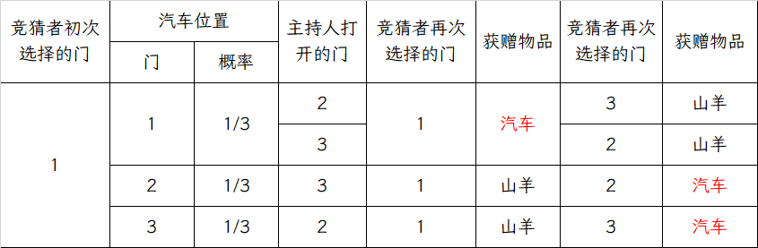

# 06 Monty Hall问题

!!! question "问题背景"
    舞台上有三扇道具门，其中一扇门后置有一辆汽车，另两扇门后各置有一头山羊。竞猜者可任选其中一扇门并获赠门后物品。当竞猜者选择了其中一扇门后，主持人打开了另两扇门中的一扇，门后面是一头山羊。

    - 主持人知道汽车所在位置。他打开的门既不是竞猜者选择的，也不是后置汽车的。若有两扇门符合以上要求，他以相同概率选择其中一扇
    - 主持人允许竞猜者改变之前的选择，竞猜者为增加获得汽车的可能性，是否应该改变当前的选择？

初次见到这个问题的人，大多数都会认为改变选择不会增加获得汽车的可能性。但是事实上，改变选择会使获得汽车的概率提高一倍。

## 枚举法

我们不妨用枚举法来验证一下。

可见，若改变选择，获得汽车的概率为 $\frac{2}{3}$ ；若不改变选择，获得汽车的概率为 $\frac{1}{3}$ 。

## 概率论方法

我们再用概率论的知识来计算一下这个问题。

假设竞猜者初次选择1号门，记 $C_i$ 为汽车在 $i$ 号门后的事件，$M$ 为主持人打开 $2$ 号门的事件，则有

$$
P(M|C_1)=\frac{1}{2}\;\;;
P(M|C_2)=0\;\;;
P(M|C_3)=1
$$

若竞猜者改变选择，则获得汽车的概率为

$$
\begin{aligned}
P(C_3|M)=&\frac{P(M|C_3)P(C_3)}{P(M|C_1)P(C_1)+P(M|C_2)P(C_2)+P(M|C_3)P(C_3)}\\
=&\frac{1\cdot\frac{1}{3}}{\frac{1}{2}\cdot\frac{1}{3}+0\cdot\frac{1}{3}+1\cdot\frac{1}{3}}\\
=&\frac{2}{3}
\end{aligned}
$$

若竞猜者不改变选择，则获得汽车的概率为

$$
\begin{aligned}
P(C_1|M)=&\frac{P(M|C_1)P(C_1)}{P(M|C_1)P(C_1)+P(M|C_2)P(C_2)+P(M|C_3)P(C_3)}\\
=&\frac{\frac{1}{2}\cdot\frac{1}{3}}{\frac{1}{2}\cdot\frac{1}{3}+0\cdot\frac{1}{3}+1\cdot\frac{1}{3}}\\
=&\frac{1}{3}
\end{aligned}
$$

可见，若改变选择，获得汽车的概率为 $\frac{2}{3}$ ；若不改变选择，获得汽车的概率为 $\frac{1}{3}$ 。

## 变种

### 被蒙在鼓里的主持人

如果主持人不知道汽车在哪扇门后，那么他打开的门后面有可能是汽车，也有可能是山羊。此时，改变选择和不改变选择的获得汽车的概率均为 $\frac{1}{2}$ 。

因为此时，如果我们再
假设竞猜者初次选择1号门，记 $C_i$ 为汽车在 $i$ 号门后的事件，记$M$ 为主持人打开 $2$ 号门<u>后是山羊</u>的事件，则有

$$
P(M|C_1)=\frac{1}{2}\;\;;
P(M|C_2)=0\;\;;
P(M|C_3)=\underline{\frac{1}{2}}
$$

通过计算可得，若改变选择，获得汽车的概率为 $\frac{1}{2}$ ；若不改变选择，获得汽车的概率为 $\frac{1}{2}$ 。

!!! note ""
    由此我们可以看出，在之前的问题中，主持人是有额外信息的，他知道汽车在哪扇门后，这导致了改变选择和不改变选择的获得汽车的概率不同。

### $n$ 扇门

有 $n$ 扇道具门，其中一扇门后置有一辆汽车，其他 $n-1$ 扇门后各置有一头山羊

- 当至少有三扇门还未打开时，竞猜者选择其中一扇未打开的门，主持人以相同概率打开竞猜者未选择且后面是山羊的门中的任意一扇，并允许竞猜者改变之前的选择。继续上述过程直至只有两扇门还未打开
- 在游戏进行过程中每次允许竞猜者改变选择时，竞猜者应采取怎样的策略

### $n$ 扇门，$k$ 辆车

有 $n$ 扇道具门，其中 $k$ 扇门后置有一辆汽车，其他 $n-k$ 扇门后各置有一头山羊

- 竞猜者选择其中一扇门后，主持人以相同概率打开了其他 $n-1$ 扇门中的 $m$ 扇，$1\leq m\leq n-2$ ，其中 $j$ 扇门后各有一辆汽车， $m-j$ 扇门后各有一头山羊
- 主持人允许竞猜者改变之前的选择，竞猜者是否应该改变当前的选择

### $n$ 扇门，多种奖品

有 $n$ 扇道具门，其中 $n_i$ 扇门后各置有价值为 $v_i$ 的奖品，$i=1,2,\cdots,m$

- 竞猜者选择其中一扇门后，主持人以相同概率打开了其他 $n-1$ 扇门中的一扇，并允许竞猜者改变之前的选择。竞猜者看到打开的门后的奖品后，是否应该改变当前的选择