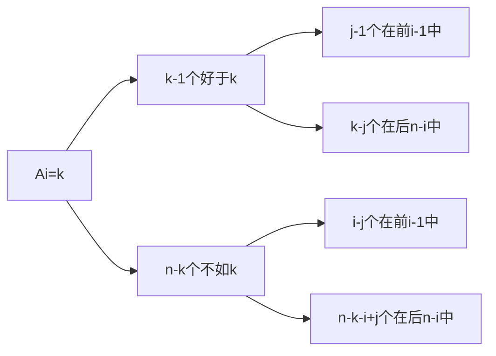
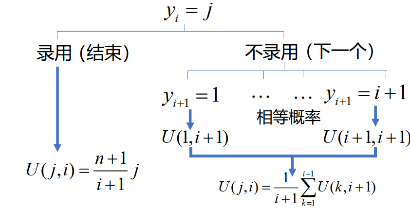

# 09 秘书问题

!!! question "问题背景"
    $n$位求职者应聘秘书职位，招聘方通过逐个面试予以考察。应聘者的综合能力各不相同，通过面试可给出已面试的应聘者的综合能力大小顺序，且有如下要求。

    - 应聘者以某一顺序接受面试，某个应聘者是否被录用必须在他面试结束后<u>立即决定</u>
    - 若录用，招聘即告结束，不再面试其他应聘者
    - 若不录用，招聘方继续面试下一位应聘者
    - 招聘方不得录用曾作出过不录用决定的应聘者

    提问：招聘方采用何种策略可使招聘到第一名的应聘者的概率最大？

## 问题求解

### 数学描述与假设

为了更好地分析问题，我们给出以下数学描述：

**绝对名次**：用 $j$ 表示在所有应聘者中居于第 $j$ 名的应聘者，$j$ 为他的绝对名次。第 $i$ 位接受面试的应聘者为 $A_i$，$1\leq A_i\leq n$。$A_i=j$ 表示其绝对名次为 $j$。

但招聘方在面试的过程中是无法知道每位应聘者的绝对名次的，只知道每位应聘者在面试过程中的局部名次，即相对名次。

**相对名次**：设$A_i$ 在前 $i$ 位接受面试的应聘者 $A_1,A_2,\cdots,A_i$ 中综合能力名次排名记为 $y_i$，称为他的相对名次，$1\leq y_i\leq \min\{i,A_i\}$（$y_i$ 不会比绝对名次来的大）。

- 我们记相对名次 $y_i=1$ 的应聘者称为备选者，备选者是不唯一的。

根据问题背景，招聘方只能根据每位应聘者的相对名次进行决策。

对 $1,2,\cdots,n$ 的任一固定排列，应聘者以该排列的顺序面试的概率均为 $\frac{1}{n!}$。

### 策略 $s$

由于招聘到绝对名次第一的应聘者的必要条件是录用相对名次第一的备选者。

为了尽可能招到第一名，招聘方应采用“从第 $s$ 位应聘者开始，录用首次出现的一名备选者”的策略 $s$ 来决定录用哪位应聘者。

此时，我们就要去选取更好的 $s$ 使得招聘到第一名的概率最大。

#### 特殊情况

假设目前有 $n=4$ 个人，记上方栏为采用的策略$s=1,2,3,4$ 为绝对排名，侧边栏的每个数字代表参与者的绝对排名。我们将其全排列和采用的策略结果列出来：

!!! note ""
    刚开始看的话可能看不懂，我们举 `2314` 的例子：

    - 策略 $1$：从第 $1$ 位开始录用，此时为 `2`
    - 策略 $2$：从第 $2$ 位开始录用，此时由于第二位的`3`不如第一位的`2`，所以继续面试下一个，并录用第三位的`1`
    - 策略 $3$：从第 $3$ 位开始录用，此时由于第三位的`1`是备选者，所以录用第三位的`1`
    - 策略 $4$：从第 $4$ 位开始录用，此时由于第四位的`4`不是备选者，而此时又没有面试者了，所以本次招聘失败。

通过上述分析可知，策略 $2$ 在24种可能顺序中有11次可录用到第一名，为最优策略

!!! note ""
    其实我们通过分析还可以知道，策略 $s$ 就是从第 $s$ 位开始，向后找比前方数字都小的数字，如果找到了就录用，如果没有找到就失败。

记 $p_n(s)$为采用策略 $s$ 录用到第一名的概率。

!!! note ""
    例如，若采用策略 $1$ ，则必录取 $A_1$ ， $p_n(1)=\frac{1}{n}$

为了更好地处理，我们把这个问题分成多个子问题，然后再把子问题的结果合并起来。

记 $p_n^k(s)$ 为采用策略 $s$ 录用 $A_k(k\geq s)$，且 $A_k$ 为第一名的概率。则有

$$p_n(s)=\sum_{k=s}^n p_n^k(s)$$

### 计算 $p_n^k(s)$

我们考察每一个 $p_n^k(s)$ 。经分析可知：

- $A_s,\cdots,A_{k-1}$ 均不是备选者，否则选不到 $A_k$
- 前 $k-1$ 位应聘者中的最佳者出现在前 $s-1$ 位应聘者中，否则他将先于 $A_k$ 被录用

{width=50%}

#### 组合方法

我们可以通过组合的方法来计算 $p_n^k(s)$ 。

假设目前第一名在 $k$ 位上，我们先选取 $k-1$ 个人，并对其进行排列。因为前 $k-1$ 位应聘者中的最佳者要出现在前 $s-1$ 位应聘者中，所以最佳者的可能位置数为 $s-1$，而其他 $k-2$ 个人没有约束条件，可能位置数为 $(k-1)!$ 。在 $k$ 位之后的人也可以随意排列，其排列数为 $(n-k)!$ 。所以总的可能数有

$$
\begin{aligned}
N &= \begin{pmatrix}n-1\\k-1\end{pmatrix}(s-1)(k-2)!(n-k)!\\
&=\frac{(n-1)!}{(k-1)!(n-k)!}(s-1)(k-2)!(n-k)!\\
&=\frac{(n-1)!}{(k-1)}(s-1)\\
\end{aligned}
$$

由此，我们可以得到 $p_n^k(s)$ 为

$$p_n^k(s)=\frac{N}{n!}=\frac{\frac{(n-1)!}{(k-1)}(s-1)}{n!}=\frac{1}{n}\cdot \frac{s-1}{k-1}$$

#### 概率论方法

我们也可以通过概率论的方法来计算 $p_n^k(s)$ 。

第一名出现在 $k$ 位上的概率为 $\frac{1}{n}$ ，而前 $k-1$ 位应聘者中的最佳者出现在前 $s-1$ 位应聘者中的概率为 $\frac{s-1}{k-1}$ 。所以

$$p_n^k(s)=\frac{1}{n}\cdot \frac{s-1}{k-1}$$

### 计算 $p_n(s)$

由于 $p_n(s)=\sum_{k=s}^n p_n^k(s)$ ，所以

$$\begin{aligned}
p_n(s)&=\sum_{k=s}^n p_n^k(s)\\
&=\sum_{k=s}^n \frac{1}{n}\cdot \frac{s-1}{k-1}\\
&=\frac{s-1}{n}\cdot \sum_{k=s}^n \frac{1}{k-1}\\
&=\frac{s-1}{n}\cdot \sum_{k=s-1}^{n-1} \frac{1}{k}\\
\end{aligned}$$

我们得到了 $p_n(s)$ 的表达式，由于我们希望用策略 $s$ 来招聘到第一名的概率最大，所以我们需要找到最优的 $s$ 使得 $p_n(s)$ 最大。

### 最优策略 $s^*$

因为 $p_n(s)$ 是关于 $s$ 的离散数列，所以我们可以通过隔项相减的方法来求出最优策略。

$$
\begin{aligned}
p_n(s)-p_n(s-1)&=\frac{s-1}{n}\cdot \sum_{k=s-1}^{n-1} \frac{1}{k}-\frac{s-2}{n}\cdot \sum_{k=s-2}^{n-1} \frac{1}{k}\\
&=\frac{s-1}{n}\cdot \sum_{k=s-1}^{n-1} \frac{1}{k}-\frac{s-2}{n}\cdot (\frac{1}{s-2}+\sum_{k=s-1}^{n-1} \frac{1}{k})\\
&=\frac{1}{n}\cdot \sum_{k=s-1}^{n-1} \frac{1}{k}-\frac{1}{n}\\
p_n(s)-p_n(s+1)&=\frac{s-1}{n}\cdot \sum_{k=s-1}^{n-1} \frac{1}{k}-\frac{s}{n}\cdot \sum_{k=s}^{n-1} \frac{1}{k}\\
&=\frac{s-1}{n}\cdot (\frac{1}{s-1}+\sum_{k=s}^{n-1} \frac{1}{k})-\frac{s}{n}\cdot \sum_{k=s}^{n-1} \frac{1}{k}\\
&=\frac{1}{n}-\frac{1}{n}\cdot \sum_{k=s}^{n-1} \frac{1}{k}\\
\end{aligned}$$

分析差值，我们记 $s^*$ 为使 $\sum\limits_{k=s}^{n-1} \frac{1}{k} < 1$ 的最小的 $s$ ，则

1. 当 $s\geq s^*$ 时，则$\sum\limits_{k=s}^{n-1} \frac{1}{k} < 1$ ，所以 $p_n(s)-p_n(s+1)=\frac{1}{n}-\frac{1}{n}\cdot \sum\limits_{k=s}^{n-1} \frac{1}{k}>0$ ，所以 $p_n(s^*)>p_n(s^*+1)>\cdots>p_n(n)$
2. 当 $s \leq s^*$ 时，则$\sum\limits_{k=s-1}^{n-1} \frac{1}{k} \geq 1$ （注意，此时的下标为 $s-1$ ，其必然小于 $s^*$ ，所以是 $\geq$ ） ，所以 $p_n(s)-p_n(s-1)=\frac{1}{n}\cdot \sum\limits_{k=s-1}^{n-1} \frac{1}{k}-\frac{1}{n}>0$ ，所以 $p_n(s^*)>p_n(s^*-1)>\cdots>p_n(1)$

所以当 $s=s^*$ 时，$p_n(s)$ 取得最大值，此时的 $s$ 是最优策略。

### 最优策略的上下界

我们已知

$$
\sum\limits_{k=s^*}^{n-1} \frac{1}{k} < 1\quad \;\; ; \;\; \sum\limits_{k=s^*-1}^{n-1} \frac{1}{k} \geq 1
$$

尝试将其放缩为可以逐项相消求和的形式，我们引入不等式：

$$\int_k^{k+1}\frac{1}{x}dx+\frac{1}{2}(\frac{1}{k}-\frac{1}{k+1})
<\frac{1}{k}<
\int_{k-\frac{1}{2}}^{k+\frac{1}{2}}\frac{1}{x}dx
$$

!!! note "证明不等式"
    左侧不等式：

    $$\int_k^{k+1}\frac{1}{x}dx+\frac{1}{2}(\frac{1}{k}-\frac{1}{k+1})
    <\frac{1}{k}
    $$

    通过下图。 红斜线的表示 $\int_k^{k+1}\frac{1}{x}dx$ ，绿色的表示 $\frac{1}{2}(\frac{1}{k}-\frac{1}{k+1})$ ，红色大框里的就是 $\frac{1}{k}$ 。因为 $\frac{1}{x}$是凸函数，显然有红斜线的面积加上绿色的面积红色大框里的面积小于红色大框里的面积。

    {width=50%}

    右侧不等式：

    这边就不能通过图形来证明了，我们就用最基本的方法来计算：

    要证：

    $$
    \begin{aligned}
    &\frac{1}{k}<\int_{k-\frac{1}{2}}^{k+\frac{1}{2}}\frac{1}{x}dx\;(k\geq 1)\\
    \Leftrightarrow&\frac{1}{k}<\ln(k+\frac{1}{2})-\ln(k-\frac{1}{2})=\ln\frac{2k+1}{2k-1}\\
    (令t=\frac{1}{k}\in (0,1]) \Leftrightarrow&t<\ln\frac{2+t}{2-t}=\ln(\frac{4}{2-t}-1)
    \end{aligned}
    $$

    记 $g(t)=t-\ln(\frac{4}{2-t}-1)$ ，则 $g'(t)=1-\frac{4}{(2-t)^2}\cdot \frac{2-t}{2+t}=\frac{t^2}{t^2-4}<0$ ，所以 $g(t)$ 单调递减，所以 $g(t)<g(0)=0-\ln1=0$ ，所以 $t<\ln\frac{2+t}{2-t}$ ，因此 $\frac{1}{k}<\int_{k-\frac{1}{2}}^{k+\frac{1}{2}}\frac{1}{x}dx$ ，得证。

对$1 \leq \sum\limits_{k=s^*-1}^{n-1}$，有：

$$
\begin{aligned}
1 \leq \sum\limits_{k=s^*-1}^{n-1} \frac{1}{k} &< \sum\limits_{k=s^*-1}^{n-1} \int_{k-\frac{1}{2}}^{k+\frac{1}{2}}\frac{1}{x}dx\\
&=\int_{s^*-\frac{3}{2}}^{n-\frac{1}{2}}\frac{1}{x}dx\\
&=\ln(\frac{2n-1}{2s^*-3})\\
\end{aligned}
$$

我们可以得出 $s^*$ 的上界为 

$$s^*<\frac{1}{e}(n-\frac{1}{2})+\frac{3}{2}$$

对 $1 \leq \sum\limits_{k=s^*}^{n-1}$，有：

$$
\begin{aligned}
1 > \sum\limits_{k=s^*}^{n-1} \frac{1}{k} &> \sum\limits_{k=s^*}^{n-1} \int_{k}^{k+1}\frac{1}{x}dx+\frac{1}{2}(\frac{1}{s^*}-\frac{1}{n})\\
&=\int_{s^*}^{n}\frac{1}{x}dx+\frac{1}{2}(\frac{1}{s^*}-\frac{1}{n})\\
&=\ln(\frac{n}{s^*})+\frac{1}{2}(\frac{1}{s^*}-\frac{1}{n})\\
\Rightarrow e&>\frac{n}{s^*}e^{\frac{1}{2}(\frac{1}{s^*}-\frac{1}{n})}
\\&> \frac{n}{s^*}(1+\frac{1}{2}(\frac{1}{s^*}-\frac{1}{n}))\\
&> \frac{n}{s^*}(1+\frac{1}{2}(\frac{1}{\frac{1}{e}(\frac{1}{n}-\frac{1}{2})+\frac{3}{2}}-\frac{1}{n}))\\
\end{aligned}
$$

所以 $s^*$ 的下界为 

$$s^*>\frac{n}{e}(1+\frac{1}{2}(\frac{1}{\frac{1}{e}(\frac{1}{n}-\frac{1}{2})+\frac{3}{2}}-\frac{1}{n}))=\frac{1}{e}(n-\frac{1}{2})+\frac{1}{2}-\frac{3e-1}{2(2n+3e-1)}$$

综上，我们得到了 $s^*$ 的上下界：

$$\frac{1}{e}(n-\frac{1}{2})+\frac{1}{2}-\frac{3e-1}{2(2n+3e-1)}<s^*<\frac{1}{e}(n-\frac{1}{2})+\frac{3}{2}$$

上下界的差距不超过 $1+\frac{3e-1}{2(2n+3e-1)}\approx 1+\frac{1.79}{n+1.79}$ ，当 $n$ 足够大时，上下界的差距趋近于 $1$ 。

且

$$\lim_{n\to \infty} \frac{s^*}{n}=\frac{1}{e}$$

### $p_n(s^*)$ 的渐进性质

因为 $p_n(s^*)=\frac{s^*-1}{n}\cdot \sum\limits_{k=s^*-1}^{n-1} \frac{1}{k}$ ，且

$$\ln(\frac{n}{s^*-1})=\int_{s^*-1}^{n}\frac{1}{x}dx<\sum\limits_{k=s^*-1}^{n-1} \frac{1}{k}<\int_{s^*-\frac{1}{2}}^{n-\frac{1}{2}}\frac{1}{x}dx=\ln(\frac{2n-1}{2s^*-1})$$

所以

$$\frac{s^*-1}{n}\cdot \ln(\frac{n}{s^*-1})<\frac{s^*-1}{n}\cdot \sum\limits_{k=s^*-1}^{n-1} \frac{1}{k}<\frac{s^*-1}{n}\cdot \ln(\frac{2n-1}{2s^*-1})$$

因为$\lim\limits_{n\to \infty} \frac{s^*}{n}=\frac{1}{e}$，我们有

$$\lim\limits_{n\to \infty} \frac{s^*-1}{n}\cdot \ln(\frac{n}{s^*-1})=\lim\limits_{n\to \infty} \frac{s^*-1}{n}\cdot \ln(\frac{2n-1}{2s^*-1})=\frac{1}{e}$$

所以$\lim\limits_{n\to \infty} p_n(s^*)=\frac{1}{e}$

## 变式 1 分布不均

!!! question "问题背景"

    如果 $A_i$ 不再是上文的均匀分布，而是另一种已知的分布，那么招聘方录用一位应聘者时，应采用何种策略？

## 变式 2 双保险

!!! question "问题背景"

    招聘方可录用两名应聘者，但对每位应聘者聘用与否的决定仍需在该应聘者面试结束时给出，此时招聘方采用何种策略可使招聘到第一名的应聘者的概率最大？

我们记策略 $(r,s)$ 为：

1. 录用自 $A_r$ 起首次出现的一名备选者
2. 若已录用一人，录用不早于 $A_s$的一名备选者

那么，采用策略 $(r,s)$ 录用到第一名的可能情形

- 第一名是第一个被录用者
- 第一名是第二个被录用者，且第一个被录用者先于 $A_s$
- 第一名是第二个被录用者，且第一个被录用者不早于 $A_s$

## 变式 3 期望策略

!!! question "问题背景"

    招聘方录用一名应聘者，此时招聘方采用何种策略可使录用者的绝对名次的期望值尽可能小？

### 问题求解

此时就不要求一定要录用备选者了，只要期望值最小即可。

我们记 录用相对名次为 $y_i  = j$ 的应聘者 $A_i$ 情况下，其绝对名次的期望值为

$$E(A_i|y_i=j)=\sum_{k=1}^n k\cdot P(A_i=k|y_i=j)=\sum_{k=1}^n k\cdot \frac{P(A_i=k,y_i=j)}{P(y_i=j)}$$

分析式子中的两个概率：

分母：$P(y_i=j) = \frac{1}{i}$

分子：$P(A_i=k,y_i=j)=P(y_i=j|A_i=k)\cdot P(A_i=k)$

所以在 $A_i = k$ ，$j\leq k$ 的条件下，我们对前 $i-1$ 进行选择，选择$k-1$中的$j-1$个，选择$n-k$中的$i-j$个，即$\begin{pmatrix}k-1\\j-1\end{pmatrix}\begin{pmatrix}n-k\\i-j\end{pmatrix}$种可能。再对前$i-1$个和后$n-i$个分别进行全排列，即$(i-1)!(n-i)!$种可能。而总的可能情况为$(n-1)!$种（我们已经确定了$A_i=k$，只剩下$n-1$个人需要排列）。所以

$$P(y_i=j|A_i=k)=\frac{\begin{pmatrix}k-1\\j-1\end{pmatrix}\begin{pmatrix}n-k\\i-j\end{pmatrix}(i-1)!(n-i)!}{(n-1)!}$$

又$P(A_i=k)=\frac{1}{n}$，所以

$$
\begin{aligned}
P(A_i=k,y_i=j)&=\frac{\begin{pmatrix}k-1\\j-1\end{pmatrix}\begin{pmatrix}n-k\\i-j\end{pmatrix}(i-1)!(n-i)!}{(n-1)!}\cdot \frac{1}{n}\\&= \frac{\begin{pmatrix}k-1\\j-1\end{pmatrix}\begin{pmatrix}n-k\\i-j\end{pmatrix}(i-1)!(n-i)!}{n!}\\
&=\frac{\begin{pmatrix}k-1\\j-1\end{pmatrix}\begin{pmatrix}n-k\\i-j\end{pmatrix}}{i\begin{pmatrix}n\\i\end{pmatrix}}\\
\end{aligned}
$$

如果 $j>k$ ，则 $P(A_i=k,y_i=j)=0$ ，

所以

$$
\begin{aligned}
E(A_i|y_i=j)&=\sum_{k=1}^n k\cdot \frac{P(A_i=k,y_i=j)}{P(y_i=j)}\\
&=\sum_{k=j}^n k\cdot \frac{\begin{pmatrix}k-1\\j-1\end{pmatrix}\begin{pmatrix}n-k\\i-j\end{pmatrix}}{i\begin{pmatrix}n\\i\end{pmatrix}}\cdot i\\
&=\sum_{k=j}^n k\cdot \frac{\begin{pmatrix}k-1\\j-1\end{pmatrix}\begin{pmatrix}n-k\\i-j\end{pmatrix}}{\begin{pmatrix}n\\i\end{pmatrix}}\\
&=\sum_{k=j}^n j\cdot \frac{\begin{pmatrix}k\\j\end{pmatrix}\begin{pmatrix}n-k\\i-j\end{pmatrix}}{\begin{pmatrix}n\\i\end{pmatrix}}\\
&=\frac{j}{\begin{pmatrix}n\\i\end{pmatrix}}\sum_{k=j}^n \begin{pmatrix}k\\j\end{pmatrix}\begin{pmatrix}n-k\\i-j\end{pmatrix}\\
\end{aligned}
$$

!!! note ""
    $$ k \begin{pmatrix}k-1\\j-1\end{pmatrix} = j \begin{pmatrix}k\\j\end{pmatrix} $$

#### 组合恒等式

如何对上式进行化简呢？我们先举一些组合恒等式的例子：

!!! note ""
    $$\begin{aligned}
    &\sum_{k}\binom{r}{k}\binom{s}{n-k}=\binom{r+s}{n},\text{integer }n. \\
    &\sum_{k}\binom{r}{m+k}\binom{s}{n+k}=\binom{r+s}{r-m+n}, \text{integer }m,\text{integer }n,\text{integer }r\geq0.\\
    &\sum_{k}{\binom{r}{k}}{\binom{s+k}{n}}(-1)^{r-k}={\binom{s}{n-r}},\text{integer }n,\text{integer }r\geq0. \\
    &\sum_{k=0}\binom{r-k}{m}\binom{s}{k-t}(-1)^{k-t}=\binom{r-t-s}{r-t-m},\text{integer }t\geq0,\text{ integer }r\geq0,\text{ integer }m\geq0. \\
    &\sum_{k=0}^{r}\binom{r-k}m\binom{s+k}n=\binom{r+s+1}{m+n+1},\text{integer }n\geq\text{integer }s\geq0,\text{ integer }m\geq0,\text{ integer }r\geq0. \\
    &\sum_{k\geq0}\binom{r-tk}k\binom{s-t(n-k)}{n-k}\frac{r}{r-tk}=\binom{r+s-tn}n,\quad\text{integer }n.
    \end{aligned}$$

我们可以用生成函数来解决组合恒等式的问题，例如：

$$
\begin{aligned}
\frac{1}{1-x}&=1+x+x^2+x^3+\cdots=\sum_{l=0}^{\infty}x^l\\
\frac{1}{(1-x)^{p+1}}&=\sum_{l=0}^{\infty}\frac{(l+p)(l+p-1)\cdots(l+1)}{p!}x^l=\sum_{l=0}^{\infty}\binom{l+p}{p}x^l\;\;\quad\text{即上式的p阶导数}\\
\end{aligned}
$$

所以

$$
\begin{aligned}
\frac{1}{(1-x)^{i+2}}&=\frac{1}{(1-x)^{j+1}}\cdot \frac{1}{(1-x)^{i-j+1}}\\
\Rightarrow
\sum_{l=0}^{\infty}\binom{l+i+1}{i+1}x^l&=\sum_{l=0}^{\infty}\binom{l+j}{j}x^l\cdot \sum_{l=0}^{\infty}\binom{l+i-j}{i-j}x^l
\end{aligned}
$$

因为两端的 $x^{n-i}$ 的系数相等，所以

$$\binom{n+1}{i+1}=\sum_{k=0}^{i}\binom{k+j}{j}\binom{n-k-j}{i-j}=
\sum_{k=j}^{i}\binom{k}{j}\binom{n-k}{i-j}$$

#### 期望计算结果

所以

$$
\begin{aligned}
E(A_i|y_i=j)&=\frac{j}{\begin{pmatrix}n\\i\end{pmatrix}}\sum_{k=j}^n \begin{pmatrix}k\\j\end{pmatrix}\begin{pmatrix}n-k\\i-j\end{pmatrix}\\
&=\frac{j}{\begin{pmatrix}n\\i\end{pmatrix}}\binom{n+1}{i+1}\\
&=\frac{n+1}{i+1}j
\end{aligned}
$$

#### 动态规划

令 $U(j,i)$ 为面试相对名次 $y_i=j$ 的 $A_i$ 时可能取得的最优绝对名次期望值。这意味着自首位应聘者面试起，招聘方采用正确决策所能得到的最优绝对名次期望值为 $U(1,1)$ 。

根据 $U$ 之间的关系，我们有如下流程图：

取 

$$U(j,i)=\min \{\frac{n+1}{i+1}j,\frac{1}{i+1}\sum\limits_{k=1}^{i+1}U(k,i+1)\}$$

面试 $A_n$ 时，相对名次即为绝对名次，招聘方必定录用，那么我们有 $U$ 的末端条件$U(j,n)=j$。

!!! note "举个例子"
    有四个人前来面试，他们的绝对名次分别为 $1,2,3,4$（顺序是无所谓的，末端顺序的作用只体现在前一项的“平均”） ，那么我们可以得到如下的表格：

    | $U(j,i)$ | $i=1$ | $i=2$ | $i=3$ | $i=4$ |
    | -------- | ----- | ----- | ----- | ----- |
    | $j=1$    | $\min\{\frac{5}{2}\cdot 1,\frac{15}{8}\}=\frac{15}{8}$   | $\min\{\frac{5}{3}\cdot 1,\frac{25}{12}\}=\frac{5}{3}$   | $\min\{\frac{5}{4}\cdot 1,\frac{5}{2}\}=\frac{5}{4}$   | $4$   |
    | $j=2$    |   | $\min\{\frac{5}{3}\cdot 2,\frac{25}{12}\}=\frac{25}{12}$   | $\min\{\frac{5}{4}\cdot 2,\frac{5}{2}\}=\frac{5}{2}$   | $1$   |
    | $j=3$    |  |    | $\min\{\frac{5}{4}\cdot 3,\frac{5}{2}\}=\frac{5}{2}$   | $3$   |
    | $j=4$    |  |  |   | $2$   |
    | $\frac{1}{i+1}\sum\limits_{k=1}^{i+1}U(k,i+1)$ | $\frac{15}{8}$ | $\frac{25}{12}$ | $\frac{5}{2}$ |  |

    从上表中可以看出，招聘方采用正确决策所能得到的最优绝对名次期望值为 $\frac{15}{8}$ 。

所以，给定 $n$ ，我们就能求出招聘方采用正确决策所能得到的最优绝对名次期望值为 $U(1,1)$ 。

#### 策略

记 $C_i=\frac{1}{i+1}\sum\limits_{k=1}^{i+1}U(k,i+1)$ ，则 $U(j,i)=\min \{\frac{n+1}{i+1}j,C_i\}$ 。

为让 $U(j,i)$ 尽可能小，我们需要让 $\frac{n+1}{i+1}j$ 和 $C_i$ 进行比较，取得小值。所以当 $\frac{n+1}{i+1}j<C_i$ ，即 $j<C_i\cdot \frac{i+1}{n+1}$ 时，我们应该录用 $A_i$ 。否则，继续面试。

此时的策略 $s_i = \lfloor C_i\cdot \frac{i+1}{n+1}\rfloor$ 。

!!! note ""
    动态规划的思想是从末端开始，逐步向前推进，每一步都是最优的。所以我们可以从末端开始，逐步向前推进，每一步都更改策略，且是最优的。

根据每一步的策略，我们可以给出 $C_i$ 的递推式：

$$
\begin{aligned}
C_{i-1}&=\frac{1}{i}\sum_{k=1}^{i}U(k,i)\\&=\frac{1}{i}\sum_{k=1}^{i}\min \{\frac{n+1}{i+1}k,C_i\}\\
&=\frac{1}{i}(\frac{n+1}{i+1}\sum_{k=1}^{s_i}k+\sum_{k=s_i+1}^{i}C_i)\\
&=\frac{1}{i}(\frac{n+1}{i+1}\frac{s_i(s_i+1)}{2}+(i-s_i)C_i)\\
\end{aligned}
$$

尾部条件为 $C_{n-1}=\frac{1}{n}\sum\limits_{k=1}^{n}U(k,n)=\frac{1}{n}\sum\limits_{k=1}^{n}k=\frac{n+1}{2}$

所以我们可以通过递推式来求出 $C_i$ ，然后再求出 $s_i$ ，最后求出 $U(1,1)$ 。

## 变式 4 分布不均的期望策略

!!! question "问题背景"

    如果 $A_i$ 不再是变式3的均匀分布，而是另一种已知的分布，那么招聘方录用一位应聘者时，应采用何种策略使得录用者的绝对名次的期望值尽可能小？

## 问题推广

!!! question "问题背景"

    - 招聘方录用一位应聘者，采用何种策略可使他为第 $k$ 名的概率尽可能大
    - 招聘方录用一位应聘者，采用何种策略可使他为前 $k$ 名的概率尽可能大
    - 招聘方录用 $k$ 位应聘者，采用何种策略可使其中包含第一名的概率尽可能大
    - 应聘者数目为一随机变量