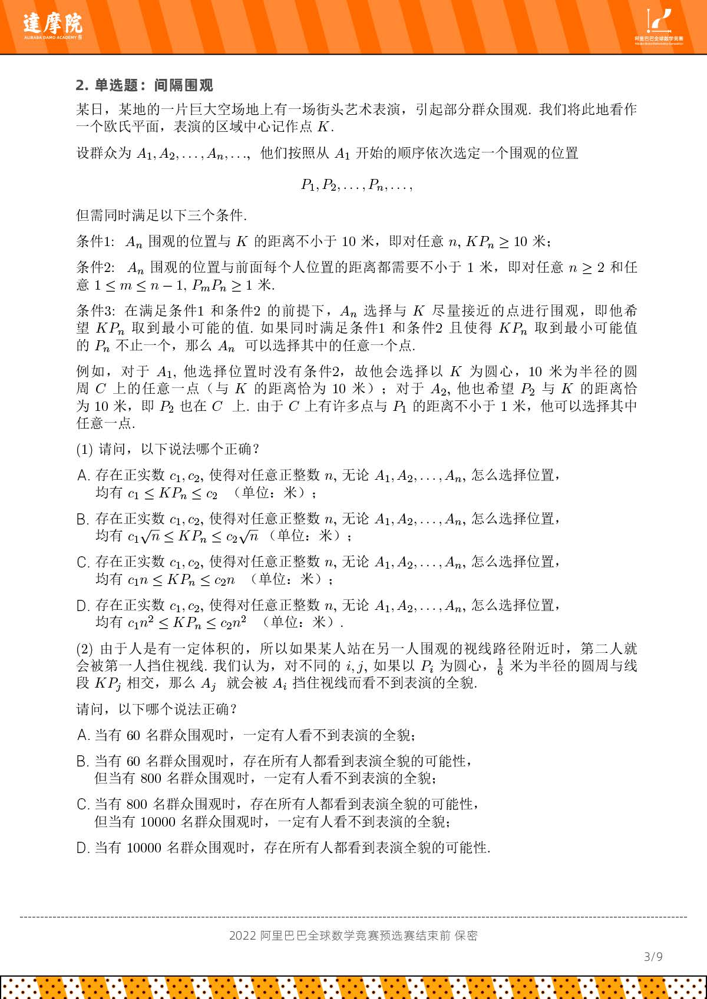

# 10 安全观演

!!! question "问题背景"

    广场某处正在进行一场露天表演，若干人先后到达附近并选择一个地点观看表演。

    - 观众选择地点有如下要求：
        - 与舞台中心的距离不小于 $L$
        - 与之前到达的任一观众的距离不小于 $r$
        - 在满足上述要求的情况下，观众选择与舞台中心距离最近的某个点
    - 观众选择地点的方式有两种：
      - 有引导：观众在工作人员引导下到达满足要求的地点
      - 无引导：观众自行选择满足要求的地点
    
    提问，第 $n$ 个到达的观众与舞台中心的距离 $d_n$ 大概是多少？

    ??? info "题源：阿里巴巴数学竞赛"
        

记舞台中心为 $O$ 。以 $O$ 为圆心，半径为 $L$ 的圆为 $C$，记第 $i$ 个到达的观众为 $A_i$ ，所选位置为 $P_i$ 。以 $P_i$ 为圆心，$r$ 为半径的圆为 $C_i$，我们有

- $d_i = |OP_i|\geq L$
- $P_i$ 不在圆 $C$ 内，也不在圆 $C_1, C_2 \cdots C_{i-1}$内
- $d_1\leq d_2\leq \cdots \leq d_n$，否则若 $d_i > d_{i+1}$，则 $A_i$  到达时可选择 $d_{i+1}$ ，矛盾

{: width="30%"}

## 观演距离上界

观众 $A_n$ 无法选到与点 $O$ 距离小于 $d_n$ 的点，也就是说，以 $O$ 为圆心，半径为 $d_n$ 的园内的所有店均在圆 $C$  或 $C_1, C_2 \cdots C_{n-1}$ 内。因此：

$$
\begin{aligned}
    \pi \cdot d_n^2
    &\leq \pi L^2 + (n-1)\cdot \pi  r^2\\
    \Rightarrow d_n
    &\leq \sqrt{L^2 + (n-1) r^2}
\end{aligned}
$$

!!! note "阿里巴巴 2(1) 上界"

    此时 $r= 1,L = 10$ ，所以 $d_n \leq \sqrt{10^2 + (n-1)1^2}= \sqrt{99 + n }\leq \sqrt{100n} =10\sqrt{n}$

## 观演距离下界

{: width="30%"}

记以 $P_i$ 为圆心，$\frac{r}{2}$ 为半径的圆为 $Q_i$，则 $Q_1, Q_2 \cdots Q_{n-1}$ 两两不相交，且均在以 $O$ 为圆心，半径为 $d_n + \frac{r}{2}$ 的圆内。因此：

$$
\begin{aligned}
    \pi \cdot (d_n + \frac{r}{2})^2
    &\geq n \cdot \pi \cdot (\frac{r}{2})^2\\
    \Rightarrow d_n
    &\geq (\frac{\sqrt{n}}{2} - \frac{1}{2}) \cdot r
\end{aligned}
$$

!!! note "阿里巴巴 2(1) 下界"

    此时 $r= 1,L = 10$ ，所以 $n \geq 2$ 时， $d_n \geq (\frac{\sqrt{n}}{2} - \frac{1}{2}) \cdot 1 \geq \frac{\sqrt{n}}{2} - \frac{2\sqrt{n}}{5}= \frac{\sqrt{n}}{10}$。
    
    $n=1$ 时，$d_1 = 10$，不等式仍然成立。

    所以 2(1) 选B。

## 考虑遮挡

若以 $P_i$ 为圆心，$\rho$ 为半径的圆周与线段 $OP_j$ 相交，则 $A_j$ 会被 $A_i$ 遮挡。如下图所示：

{: width="20%"}

### 圆周引导 - 无遮人数的上界

如果在工作人员引导下，人们都恰好站在圆周 $C$ 上，即：

{: width="20%"}

此时每个人排在$C$的内接正 $n$ 边形的顶点上，所以 $\theta = \frac{2\pi}{n}$，且 $n$ 需满足下列条件：

$$
\begin{aligned}
|P_iP_{i+1}| &= 2L\cdot \sin \frac{\theta}{2} = 2L\cdot \sin \frac{\pi}{n}\geq r\\
d_{P_i,OP_{i+1}} &= L\cdot \sin \theta = L\cdot \sin \frac{2\pi}{n}\geq \rho
\end{aligned}
$$

### 最优引导 - 无遮人数的上界

最优的时候就不该是圆周：

{: width="20%"}

$n$ 条线段在点 $C$ 将周角分为 $n$ 个角 $\angle P_{\sigma(i)}O\angle P_{\sigma(i+1)}$，这里 $\sigma(1),\sigma(2),..,\sigma(n)$是1,2,..,n 的一个排列，并记$\sigma(n+1)=\sigma(1)$，则有$\sum\limits_{i=1}^n \angle P_{\sigma(i)}O\angle P_{\sigma(i+1)} = 2\pi$，且：

$$\sin \angle P_{\sigma(i)}O\angle P_{\sigma(i+1)} \geq \frac{\rho}{2}(\frac{1}{d_{\sigma(i)}}+\frac{1}{d_{\sigma(i+1)}})$$

!!! note ""
    否则，不妨设$d_{\sigma(i)} \leq d_{\sigma(i+1)}$，则

    $$d_{\sigma(i)}\sin \angle P_{\sigma(i)}O\angle P_{\sigma(i+1)} < d_{\sigma(i)}\frac{\rho}{2}(\frac{1}{d_{\sigma(i)}}+\frac{1}{d_{\sigma(i+1)}})\leq d_{\sigma(i)}\frac{\rho}{2}\frac{2}{d_{\sigma(i)}}=\rho$$

    将产生遮挡。

所以

$$
\begin{aligned}
2\pi &= \sum\limits_{i=1}^n \angle P_{\sigma(i)}O\angle P_{\sigma(i+1)}\\
&\geq \sum\limits_{i=1}^n \sin \angle P_{\sigma(i)}O\angle P_{\sigma(i+1)}\\
&\geq \frac{\rho}{2}\sum\limits_{i=1}^n (\frac{1}{d_{\sigma(i)}}+\frac{1}{d_{\sigma(i+1)}})\\
&= \rho\sum\limits_{i=1}^n \frac{1}{d_{i}}\\
\end{aligned}
$$

又因为观演距离的上界为 $d_n \leq \sqrt{L^2 + (n-1) r^2}$，所以：

$$
\begin{aligned}
2\pi &\geq \rho\sum\limits_{i=1}^n \frac{1}{d_{i}}\\
&\geq \rho\sum\limits_{i=1}^n \frac{1}{\sqrt{L^2 + (i-1) r^2}}\\
&\geq \rho\sum\limits_{i=1}^n \int_i^{i+1} \frac{dx}{\sqrt{L^2 + (x-1) r^2}}\\
&= \rho\int_1^{n+1} \frac{dx}{\sqrt{L^2 + (x-1) r^2}}\\
&= \frac{2\rho}{r}\int_1^{n+1} \frac{d((\frac{L}{r})^2 + (x-1))}{2\sqrt{(\frac{L}{r})^2 + (x-1)}}\\
&= \frac{2\rho}{r}(\sqrt{(\frac{L}{r})^2 + (n+1-1)}-\sqrt{(\frac{L}{r})^2 + (1-1)})\\
&= \frac{2\rho}{r}(\sqrt{(\frac{L}{r})^2 + n}-\frac{L}{r})\\
\Rightarrow \frac{\pi r}{\rho} + \frac{L}{r} &\geq \sqrt{(\frac{L}{r})^2 + n}\\
\Rightarrow \frac{\pi^2 r^2}{\rho^2} + \frac{2\pi L}{\rho} + \frac{L^2}{r^2} &\geq (\frac{L}{r})^2 + n\\
\Rightarrow n &\leq \frac{\pi^2 r^2}{\rho^2} + \frac{2\pi L}{\rho} \\
\end{aligned}
$$

!!! note "第三行"
    

!!! note "阿里巴巴 2(2) "

    此时 $r= 1,L = 10,\rho= 1/6$ ，所以 $n \leq \frac{\pi^2 r^2}{\rho^2} + \frac{2\pi L}{\rho} = \frac{\pi^2}{1/36} + \frac{2\pi \cdot 10}{1/6} = 36\pi^2 + 120\pi \approx 732.3$。

    所以 2(2) 选B。
