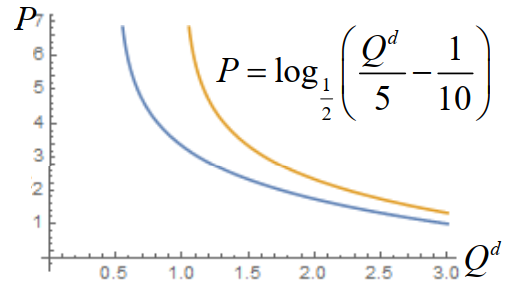
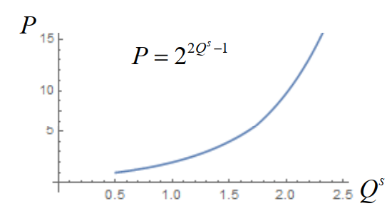
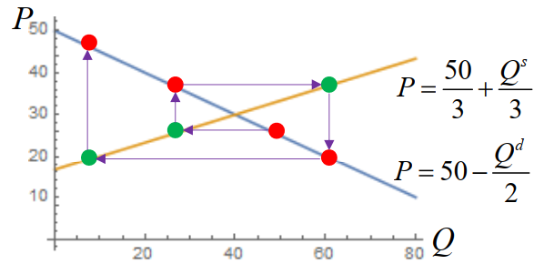

# 11 蛛网模型

!!! question "问题背景"

    如何解释某些生产周期较长的商品在失去均衡时发生的不同波动情况？

## 差分方程

设 $y(n)=y_n$，是依赖于整数变量 $n = 0,\pm 1,\pm 2,\cdots$ 的函数，则称$\Delta y(n) = y(n+1)-y(n)$ 为 $y(n)$ 的**一阶差分**，$\Delta^2 y(n) = \Delta[\Delta y(n)] = \Delta y(n+1)-\Delta y(n)$ 为 $y(n)$ 的**二阶差分**，以此类推，$\Delta^k y(n)$ 为 $y(n)$ 的 **$k$ 阶差分**。

含有未知函数的有限差分的方程称为**差分方程**：

$$
F(n,y_n,\Delta y_n,\Delta^2 y_n,\cdots,\Delta^k y_n) = 0
$$

如果将 $\Delta y_n$ 等同于 $y_{n+1}-y_n$，将 $\Delta^2 y_n$ 等同于 $y_{n+2}-2y_{n+1}+y_n$，以此类推，将 $\Delta^k y_n$ 等同于 $y_{n+k}-ky_{n+k-1}+\cdots+(-1)^k y_n$，则上式可写成

$$
F(n,y_n,y_{n+1},\cdots,y_{n+k}) = 0
$$

所以差分方程本质上就是数列的递推。

$m$ 阶线性差分方程表示为：

$$
a_m(n)y_{n+m}+a_{m-1}(n)y_{n+m-1}+\cdots+a_1(n)y_{n+1}+a_0(n)y_n = f_n
$$

- 齐次：$f_n = 0$
- 常系数：$a_i(n) = a_i\; (i=0,1,\cdots,m)$

## 二阶线性常系数齐次差分方程的解

二阶线性常系数齐次差分方程表示为

$$
x_{n+2}+a_1x_{n+1}+a_2x_n = 0
$$

!!! note ""

    若 $x_n = f(n)$是差分方程的解，则 $x_n = cf(n)$ 也是差分方程的解；若 $x_n = f(n)$ 和 $x_n = g(n)$ 都是差分方程的解，则 $x_n = f(n)+g(n)$ 也是差分方程的解。

若 $x_n = \lambda^n$ 是差分方程的解，则

$$ \lambda^{n+2}+a_1\lambda^{n+1}+a_2\lambda^n = 0 $$

即（计算非零解）

$$
\lambda^2+a_1\lambda+a_2 = 0
$$

称为差分方程的**特征方程**，它的根称为差分方程的**特征根**。

若特征方程有两个不同的实根 $\lambda_1$ 和 $\lambda_2$，则 $x_n = c_1\lambda_1^n+c_2\lambda_2^n$ 是差分方程的解。

若特征方程有两个相等的实根 $\lambda$，则 $x_n = c_1\lambda^n+c_2n\lambda^n$ 是差分方程的解。

## 经济学与经济模型

**经济学**是研究人类社会各个发展阶段之各种经济活动、经济关系、经济运行
规律的科学

**经济数学模型**是广泛用于经济研究、经济分析的数学模型。是用数学形式，对经济理论假说进行数量化，以探讨客观经济过程的本质联系及其规律的一种经济研究与管理的工具。

### 微观经济学

微观经济学通过对个体经济单位的经济行为的分析，说明在现代经济社会中市场机制的运行及其对经济资源的配置

#### 商品、货币与价格

**商品**（commodities）：在社会分工的体系中，经济上相互独立的生产者所生产的、以自己的属性满足人的某种需要、为他人（即为社会）消费、通过交换进入把它当作使用价值的人的手里的劳动产品和服务。

**货币**（money）：在商品交换中逐渐分离出来的固定地充当一般等价物的特殊商品。是价值量发展到一般价值形式的产物。

**价格**（price）：市场经济和商品交换中最常用的范畴，是商品与货币交换的比例，直接表明单位商品交换价值的实际货币量。

#### 需求

一种商品的**需求**是消费者在一定时期内在各种可能的价格水平下，愿意并且能够购买的该商品的数量。

决定需求数量的主要因素有商品的价格、消费者的收入水平、相关商品的价格（最基本的因素）、消费者的偏好、消费者对该商品的价格预期。

**需求函数**表示一种商品的需求数量和影响该需求数量的各种因素之间的相互关系（往往是减函数）

$$Q^d = f(P)$$

其中 $Q^d$ 表示需求数量，$P$ 表示商品的价格。

我们往往用其反函数 $P = f^{-1}(Q^d)$ 来表示需求函数。

{width=50%}

!!! note ""
    - 需求量的变动：其他条件不变，由价格的变动所引起
    - 需求的变动：价格不变，由其他因素变动所引起

#### 供给

一种商品的**供给**是指生产者在一定时期内在各种可能的价格水平下，愿意并且能够提供出售的该商品的数量。

决定供给数量的主要因素有商品的价格、生产的成本、相关商品的价格、生产的技术水平、生产者对未来的价格预期。

**供给函数**表示一种商品的供给量与影响该商品供给量的各种因素之间的相互关系（往往是增函数）

$$Q^s = f(P)$$

其中 $Q^s$ 表示供给数量，$P$ 表示商品的价格。

我们往往用其反函数 $P = f^{-1}(Q^s)$ 来表示供给函数。

{width=50%}

#### 均衡

经济学中的**均衡**指经济系统中变动着的各种力量在相互作用之后所
达到的“平衡”状态，即相对静止状态。如果没有外界扰动因素，这种状态会持续下去。

**均衡价格**是市场上某种商品的需求量和供给量相等时的价格。均衡价格水平下的相等的供求数量称为**均衡数量**。

均衡价格是市场上商品的需求和供给这两种相反力量共同作用的结果，是在市场供求力量自发作用下形成的。一旦市场价格偏离均衡价格，需求量和供给量就会出现不一致的非均衡状态，这种非均衡状态在市场机制的作用下会逐步消失，从而恢复到均衡价格水平。

## 动态模型

### 静态与动态

静态模型与静态分析：

- 变量没有时间先后的差别
- 变量的调整时间被假设为零
- 考察既定条件下变量相互作用下所呈现的状态

动态模型与动态分析：

- 区分变量在时间上的先后差别
- 研究不同时点上变量之间的相互关系
- 考察不同时点上变量的相互作用在状态形成和变化过程中所起的作用和在时间变化过程中状态的实际变化过程

### 动态均衡价格模型

对生产周期较长的商品，商品的供给量通常由前一生产周期的价格决定：

$$Q^s_{n} = g(P_{n-1})$$

但需求还是由当前价格决定：

$$Q^d_{n} = f(P_{n})$$

因此，均衡价格模型为：

$$
Q^s_{n} = g(P_{n-1}) = Q^d_{n} = f(P_{n})
$$

!!! note "有如下的情况"

    {: width="50%"}

    {: width="50%"}

上图长得像蛛网，因此称为**蛛网模型**。

## 蛛网模型

**蛛网模型**是研究某些生产周期较长且不宜储存的商品均衡价格的动态稳定性的模型

- 当商品的市场实际价格偏离均衡价格后，在市场机制的作用下，实际价格是否能回到原有的均衡价格水平，即均衡价格是否动态稳定，并考察它所需要具备的条件

记在周期 $n$ 中，某种商品的供求量为 $x_n$，价格为 $y_n$

!!! note ""
    这里的供求量是指周期 $n$ 中的供给量与需求量，此时的供给量是由周期 $n-1$ 的价格决定的，需求量是由周期 $n$ 的价格决定的，设此时二者相等。

- 需求由当前价格决定，有需求函数 $x_n = f(y_n)$，其反函数为 $y_n = h(x_n)$
- 供给由周期 $n-1$ 的价格决定，有供给函数 $x_{n+1} = g(y_n)$
- 均衡点 $(x_0,y_0)$ 满足 $x_0 = g(y_0)$ 和 $y_0 = h(x_0)$，即需求函数与供给函数的交点

假设需求函数与供给函数为线性函数，其过均衡点 $(x_0,y_0)$ 的方程为

$$
y_n-y_0 = -\alpha(x_n-x_0),\quad x_{n+1}-x_0 = \beta(y_n-y_0)
$$

其中，$\alpha$ 是商品需求量减少一个单位时价格的上涨量，$1/\alpha$ 是商品价格上涨一个单位时需求量的减少量。$\beta$ 是商品价格上涨一个单位时（下一周期）供给量的增加量。  

由此可得，递推关系为

$$
x_{n+1} -x_0 = \beta(y_n-y_0) = -\alpha\beta(x_n-x_0)
$$

所以

$$
x_{n}-x_0 = (-\alpha\beta)^{n-1}(x_1-x_0)
$$

所以，数列 $\{x_n\}$ 收敛的充要条件为 $\alpha\beta < 1$。

!!! note ""

    若需求函数 $h$ 或供给函数 $g$ 不为线性函数，可在均衡点附近用线性函数近似，即令 $a = -h'(x_0)$ 与 $b = g'(y_0)$。

### 均衡的稳定性

当一个均衡价格体系在受到干扰而偏离均衡点时，如果这个体系在市场机制的作用下能回到均衡点，则称这个均衡价格体系是稳定均衡，否则是不稳定均衡。

根据以上分析，均衡价格体系的稳定性取决于 $\alpha\beta$ 的大小，我们可以得到三种情况：

## 改进的蛛网模型

假设商品的供求量由前两个周期的价格决定

- 记需求函数为 $x_n = f(y_n)$，其反函数为 $y_n = h(x_n)$
- 记供给函数为 $x_{n+2} = g_2(y_{n+1},y_n)$
    - 供给函数简化为 $x_{n+2} =g(\frac{y_{n+1}+y_n}{2})$，即供给量由前两个周期的价格的平均值决定
- 均衡点 $(x_0,y_0)$ 满足 $y_0 = h(x_0)$ 和 $x_0 = g(y_0)$

假设需求函数与供给函数为线性函数，其过均衡点 $(x_0,y_0)$ 的方程为

$$
y_n-y_0 = -\alpha(x_n-x_0),\quad x_{n+2}-x_0 = \beta(\frac{y_{n+1}+y_n}{2}-y_0)
$$

则递推关系为

$$
\begin{aligned}
2x_{n+2}-2x_0 &= \beta(y_{n+1}+y_n-2y_0) \\
&= \beta(y_{n+1}-y_0+y_n-y_0) \\
&= \beta(-\alpha(x_{n+1}-x_0)-\alpha(x_n-x_0))
\end{aligned}
$$

记 $z_n = x_n-x_0$，则

$$
2z_{n+2} = -\alpha\beta(z_{n+1}+z_n)
$$

可以发现 $\lim\limits_{n\to\infty}z_n = 0$ 当且仅当 $\lim\limits_{n\to\infty}x_n = x_0$。

### 通项求解

我们现在得到了差分方程

$$
2z_{n+2} + \alpha\beta z_{n+1} + \alpha\beta z_n = 0
$$

其特征方程为

$$
2\lambda^2 + \alpha\beta\lambda + \alpha\beta = 0
$$

解得

$$
\lambda_1 = \frac{-\alpha\beta+\sqrt{\alpha^2\beta^2-8\alpha\beta}}{4},\quad \lambda_2 = \frac{-\alpha\beta-\sqrt{\alpha^2\beta^2-8\alpha\beta}}{4}
$$

!!! note ""
    - $\lambda_1$ 和 $\lambda_2$ 可以是虚数

要使得 $\lim\limits_{n\to\infty}z_n = 0$，则 $\lambda_1$ 和 $\lambda_2$ 的模都小于 $1$，即

- $\alpha\beta \geq 8$ 时，$\lambda_1$ 和 $\lambda_2$ 都是实数，此时$\lambda_2 = \frac{-\alpha\beta-\sqrt{\alpha^2\beta^2-8\alpha\beta}}{4} < \frac{-\alpha\beta}{4} < -1$，所以不收敛
- $0 < \alpha\beta < 8$ 时，$\lambda_1$ 和 $\lambda_2$ 都是复数，此时 $\lambda_{1,2} = \frac{-\alpha\beta}{4}\pm\frac{\sqrt{8\alpha\beta-\alpha^2\beta^2}}{4}i$，其模 $|\lambda_{1,2}| = \sqrt{(\frac{-\alpha\beta}{4})^2+(\frac{\sqrt{8\alpha\beta-\alpha^2\beta^2}}{4})^2} = \frac{\sqrt{8\alpha\beta}}{4} $。
- 所以当 $0<\alpha\beta<2$ 时，$\lim\limits_{n\to\infty}z_n = 0$，即 $\lim\limits_{n\to\infty}x_n = x_0$，此时均衡价格是稳定的；
- 当 $2<\alpha\beta$ 时，$\lim\limits_{n\to\infty}z_n \neq 0$，即 $\lim\limits_{n\to\infty}x_n \neq x_0$，此时均衡价格是不稳定的。

!!! note ""
    与供给量由前一个周期的价格决定相比，价格体系是稳定均衡的条件有所放宽。
