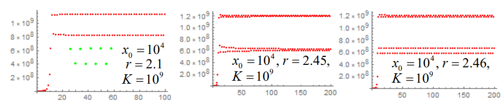

# 12 种群增长模型

!!! question "问题背景"

    一种生物种群的增长过程，可以用一个差分方程来描述。假设种群的增长率与种群数量成正比，且种群的增长受到环境的限制，即种群的增长率随种群数量的增加而减小，那么种群的增长率应该是种群数量的函数。试建立种群增长模型，分析种群的增长规律。

## 生态学概念

**生态学（ecology）**是研究生物与环境及生物与生物之间相互关系的生物学分支学科。其主要研究对象为：

- **种群（population）**：同种生物在一定空间范围内同时生活着所有个体的集群
- **生物群落（biological community）**：生活在一定生境中全部物种及其相互作用、彼此影响所构成的整体
- **生态系统（ecosystem）**：一定空间中的生物群落与其环境组成的系统，其中各成员借助能流和物质循环，形成一个有组织的功能复合体

**种群动态（population dynamics）** 表示种群的消长以及种群消长与种群参数（如出生、死亡、迁入、迁出等）间的数量关系

## 离散单种种群模型

假设现实种群只由一个世代构成，相继世代之间没有重叠，那么每一代的个体数量只与上一代的个体数量有关，这样的种群称为**单种种群（single-species population）**。

记 $x_n$ 为第 $n$ 代个体数量，数列$\{x_n\}$ 满足递推关系式：

$$
x_{n+1} = f(x_n)
$$

### 指数增长模型

每一代个体繁殖的个体数量与该代个体数量之比是一个常数

$$
\frac{x_{n+1}}{x_n} = r
$$

所以

$$
x_n=r^n x_0
$$

其中，$r$ 为**增长率（growth rate）**，$x_0$ 为初始个体数量

指数增长模型不适于描述较长时期的人口演变过程，但某地一个较短时间内的人口统计数据可能符合指数增长模型

### Logistic模型

考虑到种群的增长受到环境的限制，即种群的增长率随种群数量的增加而减小，因此，种群的增长率应该是种群数量的函数，即

$$
x_{n+1} = f(x_n) = x_n+r x_n(1-\frac{x_n}{K})
$$

或者

$$
\frac{\Delta x_n}{x_n} = r(1-\frac{x_n}{K})
$$

其中，$K$ 为**环境承载量（carrying capacity）**，$r(\geq -1)$ 为**内禀增长率（innate rate of increase）** 

#### 平衡点

差分方程的平衡点是指满足 $x_{n+1}=x_n$ 的点，即满足 $f(x^*)=x^*$ 的点，其中 $x^*$ 为平衡点。

若只要初始点 $x_0$ 与平衡点 $x^*$ 充分接近，即有 $\lim\limits_{n\to\infty}x_n = x^*$，则称平衡点 $x^*$ **渐近稳定（asymptotically stable）**

渐进稳定的判别：

| |渐进稳定|不稳定|
|:-:|:-:|:-:|
| | $\lvert f'(x^*)\rvert <1$ |$\lvert f'(x^*)\rvert$ >1 |
|$f'(x^*)=1$| $f''(x^*)= 0$ 且 $f'''(x^*)<0$ | $f''(x^*)\neq 0$ 且 $f'''(x^*)>0$ |
|$f'(x^*)= -1$| $-2f'''(x^*)<3(f'''(x^*))^2$ | $-2f'''(x^*)>3(f'''(x^*))^2$ |
|$\cdots$|$\cdots$|$\cdots$|

考察 Logistic模型的渐近稳定性，即考察 $x_{n+1}  = x_n+r x_n(1-\frac{x_n}{K})$ 的平衡点 $x^*$ 的渐近稳定性。取 $f(x)=(1+r)x-\frac{r}{K}x^2$。

$f(x)=x$ 的解为 $x=0$ 和 $x=K$，所以平衡点为 $x_1^*=0$ 和 $x_1^*=K$。

$f'(x)=1+r-\frac{2r}{K}x$，所以 $f'(0)=1+r$，$f'(K)=1-r$。

- 当 $-1\leq r < 0$ 时，$|f'(0)|<1$，$|f'(K)|>1$，所以 $x_1^*=0$ 渐进稳定，$x_1^*=K$ 不稳定
- 当 $0 < r \leq 2$ 时，$|f'(0)|>1$，$|f'(K)|<1$，所以 $x_1^*=0$ 不稳定，$x_1^*=K$ 渐进稳定
- 当 $r > 2$ 时，$|f'(0)|>1$，$|f'(K)|>1$，所以 $x_1^*=0$ 不稳定，$x_1^*=K$ 不稳定

{width=50%}

#### 周期点

$r>2$ 时，我们会得到这样的结果：

差分方程 $x_{n+1} = f(x_n)$ 的周期点是指满足 $f_k(x^*)=x^*$ 的点，其中 $k$ 为正整数，$x^*$ 为 $k$ 周期点。这里 $f_k(x)$可通过
以下方式定义：

$$
f_k(x) = f(f_{k-1}(x)),\quad f_1(x)=f(x)
$$

- 差分方程 $x_{n+1} = f(x_n)$ 的 $k$ 周期点即为差分方程  $x_{n+1} = f_k(x_n)$ 的平衡点，前者的渐进稳定性也由后者决定

### Logistic模型的 2-周期点

我们有：

$$ f(x) =(1+r)x-\frac{r}{K}x^2$$

且

$$
\begin{aligned}
f_{2}(x)&=f(f(x))=(1+r)\bigg((1+r)x-\frac{r}{K}x^2\bigg)-\frac{r}{K}\bigg((1+r)x-\frac{r}{K}x^2\bigg)^2  \\
&=(1+r)^2x-\frac{r(1+r)(2+r)}Kx^2+\frac{2r^2}{K^2}(1+r)x^3-\frac{r^3}{K^3}x^4 \end{aligned}
$$

因为我们要找的是 2-周期点，所以我们要求解 $x=f_2(x)$，即

$$
\begin{aligned}
 x& =(1+r)^{2}x-\frac{r(1+r)(2+r)}{K}x^{2}+\frac{2r^{2}}{K^{2}}(1+r)x^{3}-\frac{r^{3}}{K^{3}}x^{4}  \\
 &\Rightarrow x\bigg(\frac xK-1\bigg)\bigg(r^2\bigg(\frac xK\bigg)^2-r(r+2)\frac xK+(r+2)\bigg)=0\\
&\Rightarrow x_{+}=\frac{(r+2)+\sqrt{r^{2}-4}}{2r}K,x_{-}=\frac{(r+2)-\sqrt{r^{2}-4}}{2r}K
\end{aligned}
$$

所以，根据2-周期点的性质，我们有$f(f(x_+))=x_+$，两边再作用 $f$，我们有 $f(f(f(x_+)))=f(x_+)$，所以 $f(x_+)$ 也是 2-周期点，又由于我们只有两个 2-周期点，且 $x_+$ 不是平衡点，所以 $f(x_+)=x_-$。同理，我们有 $f(x_-)=x_+$。

#### 稳定性分析

判断 $|f'_2(x)|$ 是否小于 1，即判断 $|f'(x_+)|$ 和 $|f'(x_-)|$ 是否小于 1。

$$
\begin{aligned}
f_{2}^{\prime}\bigl(x_{+}\bigr)& =f'\Big(f\big(x_+\big)\Big)f'\big(x_+\big)  \\
&=f'\bigl(x_-\bigr)f'\bigl(x_+\bigr) \\
&=\left((1+r)-\frac{2r}Kx_-\right)\left((1+r)-\frac{2r}Kx_+\right) \\
&=(1+r)^2-\frac{2r(1+r)}K(x_++x_-)+\frac{4r^2}{K^2}x_+x_- \\
&=(1+r)^2-\frac{2r(1+r)}K\frac{r(r+2)K}{r^2}+\frac{4r^2}{K^2}\frac{(r+2)K^2}{r^2} \\
&=(1+r)^2-2(1+r)(r+2)+4(r+2)\\&=5-r^2
\end{aligned}$$

同理，我们有 $f'_2(x_-)=5-r^2$。

所以，当 $2< r < \sqrt{6}$ 时，$|f'_2(x_+)|<1$，$|f'_2(x_-)|<1$，此时 2-周期点是渐进稳定的。

### 混沌

#### Li-Yorke 定理

若实数轴一区间到其自身的连续函数，有一个 $3-$周期点，则对任意正整数 $k$ ，$f$ 有一个 $k-$周期点

#### Sharkovsky 定理

任意正整数 $n$ 可唯一表示成 $n=2^s(2p+1)$，其中$s,p \in N$。所有正整数可据此排列，称为 $S$ 型排序。

!!! note ""

    $3,5,7,9,11,\cdots$
    $2\cdot 3,2\cdot 5,2\cdot 7,2\cdot 9,2\cdot 11,\cdots$
    $2^2\cdot 3,2^2\cdot 5,2^2\cdot 7,2^2\cdot 9,2^2\cdot 11,\cdots$
    $\cdots$
    $2^s\cdot 3,2^s\cdot 5,2^s\cdot 7,2^s\cdot 9,2^s\cdot 11,\cdots$
    $\cdots$

若实数轴一区间到其自身的连续函数 $f$ 具有 $k-$周期点，在 $S$ 型排序中，如果 $k$ 在 $m$ 的前面，则必有 $m$ 周期点
