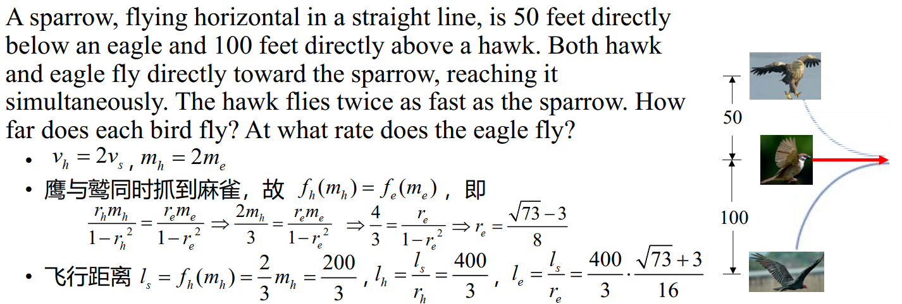

# 13 追逐问题

!!! question "问题背景"

    两艘船在平静的海面上相向而行，海盗船的速度为 $v_p$，商船的速度为 $v_m$
    
    1. 两船速度不变。
    2. 海盗船的航向始终指向商船。

    问：海盗船是否能追上商船？追上时，两船的位置分别在哪里？

## 两船速度不变

{width=20%}

若在某一时刻，海盗船与商船位于同一地点 $A(x,y)$，则$\frac{|AO|}{|MO|} = k$，即

$$\frac{\sqrt{x^2+y^2}}{\sqrt{(x-m)^2+y^2}} = k$$

所以 $A$ 的轨迹为圆

$$(x-\frac{k^2m}{k^2-1})^2+y^2 = (\frac{km}{k^2-1})^2$$

!!! note ""
    阿波罗尼奥斯圆

## 两船速率不变，一船方向改变

**商船沿直线**航行，航向垂直于连接商船与海盗船初始位置的直线。在任意时刻，**海盗船的航行方向**为连接商船与海盗船此时位置的直线的方向。

以海盗船初始位置为原点，商船初始位置为 $M(m,0)$，建立直角坐标系，记 $\frac{v_m}{v_p}=r$。设海盗船在与商船相遇前的轨迹为函数 $y=f(x)$，则

{width=20%}

在 $t$ 时刻

- 商船位置 $M_t\left(m,v_mt\right)$，海盗船位置 $P_t\left(x(t),y(t)\right)$
- 连接海盗船与商船当前位置的直线斜率为 $\frac{y-v_mt}{x-m}=f^{\prime}(x)$
    - 直线方程为 $y-v_mt = f'(x)(x - m)$
- 海盗船的轨迹自原点至 $P_t$ 的弧长为 $v_pt=\int_0^x\sqrt{1+{f^\prime}^2(z)}dz$

所以，我们可以得到

$$\frac1{v_p}\int_0^x\sqrt{1+f^{\prime{2}}(z)}dz=t=\frac1{v_m}\left(y-\left(x-m\right)f^{\prime}(x)\right)$$

对两边求导，我们有

$$
\begin{aligned}
\frac1{v_p}\sqrt{1+{f^{\prime}}^2(x)}&=\frac1{v_m}\Big(f^{\prime}(x)-f^{\prime}(x)-\left(x-m\right)f^{\prime\prime}(x)\Big)\\
-\frac{v_m}{v_p}\sqrt{1+{f^{\prime}}^2(x)}&=\left(x-m\right)f^{\prime\prime}(x)\\
\frac{\mathrm{d}f^{\prime}(x)}{\sqrt{1+{f^{\prime}}^2(x)}}&=-\frac r{x-m}\mathrm{d}x \\
\ln\left|f^{\prime}(x)+\sqrt{1+f^{\prime2}(x)}\right\|_{0}^{x}&=-r\ln\left|x-m|\right|_{0}^{x}\\
\quad\Rightarrow\ln\left|f^{\prime}(x)+\sqrt{1+f^{\prime2}(x)}\right|&=-r\ln\left|1-\frac{x}{m}\right| \\
\quad\Rightarrow f^{\prime}(x)+\sqrt{1+f^{\prime2}(x)}&=\left(1-\frac{x}{m}\right)^{-r} \\
\end{aligned}
$$

对两边取倒数，我们有

$$
\begin{cases}
 f^{\prime}(x)+\sqrt{1+f^{\prime2}(x)}&=\left(1-\frac{x}{m}\right)^{-r}\\
    f^{\prime}(x)-\sqrt{1+f^{\prime2}(x)}&=\left(1-\frac{x}{m}\right)^{r}
\end{cases}
$$

所以

$$
f^{\prime}(x)=\frac12\left(\left(1-\frac{x}{m}\right)^{-r}-\left(1-\frac{x}{m}\right)^{r}\right)
$$

对两边积分，我们有

$$
f(x)=\frac{rm}{1-r^2}+\frac{m-x}2{\left(\frac1{1+r}\left(1-\frac xm\right)^r-\frac1{1-r}{\left(1-\frac xm\right)^{-r}}\right)}
$$  

所以追上时的纵坐标为

$$
f(m)=\frac{rm}{1-r^2}
$$

### 同类问题

