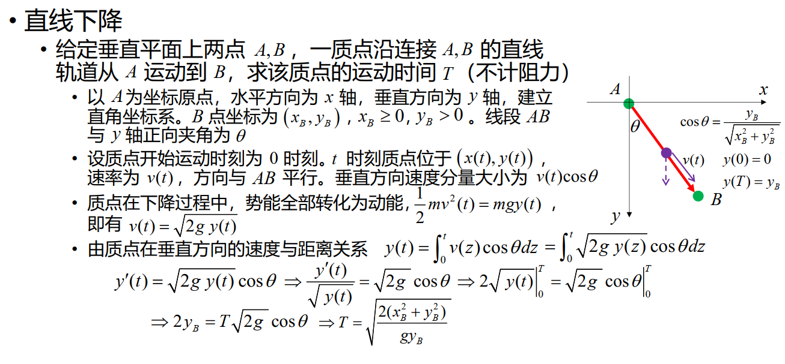

# 14 最速降线问题

!!! question "问题背景"

    给定垂直平面上两点 $A,B$，一质点以何路径从 $A$ 运动到 $B$，可使运动时间最短？

## 直线下降

{width=30%}

就是斜坡下滑问题，有

$$\frac{1}{2}g\cos\theta T^2 = l$$

所以

$$T = \sqrt{\frac{2l}{g\cos\theta}}=\sqrt{\frac{2\sqrt{x_B^2+y_B^2}}{g\frac{y_B}{\sqrt{x_B^2+y_B^2}}}}=\sqrt{\frac{2(x_B^2+y_B^2)}{gy_B}}$$

如果用常微分方程来解，我们有

## 圆弧下降

## 最速降线

### 光

#### Fermat 原理

光线在两点之间传播的路径是使得两点之间的传播时间最短的路径。

#### Snell 定律

$$\frac{\sin\theta_1}{\sin\theta_2}=\frac{v_1}{v_2}$$

可由 Fermat 原理 推出。

### 推导最速降线

将平行于 $x$ 轴的直线视作折射率逐渐减小的不同介质的分界面。

{width=30%}

由 Snell 定律，可知 $\frac{sin\theta}{v}$ 为常数，记

$$\frac{\sin \theta}{v}=C$$

因为

$$\sin \theta = \cos \phi = \frac{1}{\sqrt{1+\tan^2\phi}}= \frac{1}{\sqrt{1+y'^2}}$$

$$\frac12mv^2 = mgy \Rightarrow v = \sqrt{2gy}$$

所以

$$
\begin{aligned}
\frac{\sin \theta}{v} = \frac{1}{\sqrt{1+y'^2}}\frac{1}{\sqrt{2gy}} &= C\\
\Rightarrow y' &= \sqrt{\frac{1-2gCy}{2gCy}}\triangleq\sqrt{\frac{C_2-y}{y}}\\
\Rightarrow \sqrt{\frac{y}{C_2-y}}dy &= dx\\
\text{令}y=C_2\sin^2\beta&\text{，有}\\
2C_2\sin^2\beta d\beta &= dx\\
\Rightarrow dx &= C_2(1-cos2\beta)d\beta \\
\end{aligned}
$$

所以

$$
\begin{cases}
x &= R(\gamma-\sin\gamma)\\
y &= R(1-\cos\gamma)
\end{cases}
$$

或者

$$
x=R\arccos\left(1-\frac{y}{R}\right)-\sqrt{y(2R-y)}
$$

## 摆线

实际上，最速降线就是摆线。

## 变分法

求出最速降线的严格做法——变分法。

变分法是研究泛函的极值的方法

{width=80%}

可用 Euler-Lagrange 方程求解。