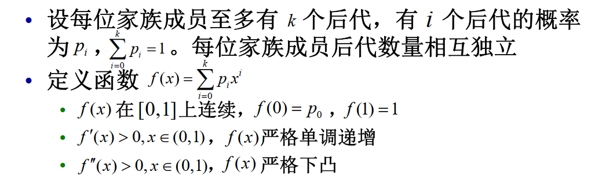
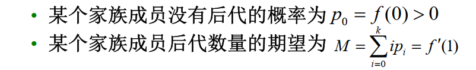
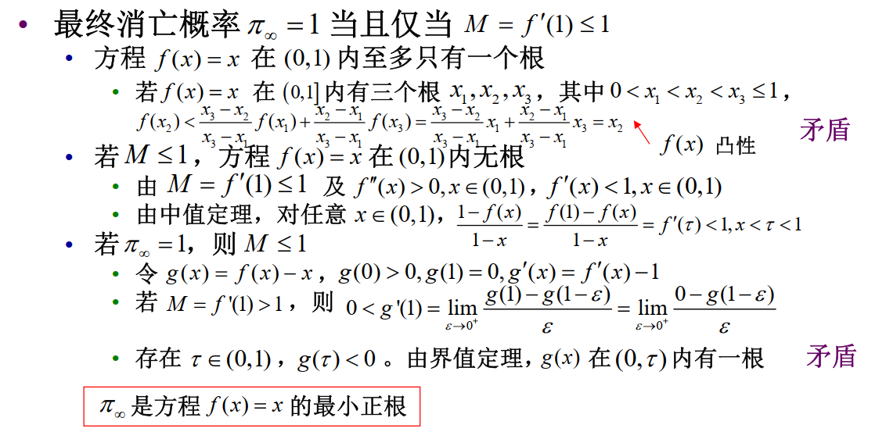

# 15 种群数量变化模型

## 指数增长模型

我们给出假设：

- 环境承载容量无限，所有个体独立生活，彼此间不存在竞争
- 种群处于封闭（closed）状态，不存在迁入（immigration）和迁出（emigration）
- 记人均出生/死亡/增长率为：$b, \mu, r=b-\mu$
    - 存在常数 $b$ 和 $\mu$，对任意 $t$ ，在自 $t$ 至 $t+\Delta t $内，出生的个体数量为 $bx(t)\Delta t$，死亡的个体数量为 $\mu x(t)\Delta t$
  
所以

$$x(t+\Delta t)-x(t)=(b-\mu)x(t)\Delta t$$

即

$$\frac{x(t+\Delta t)-x(t)}{\Delta t}=rx(t) \Rightarrow \frac{dx}{dt}=rx$$

所以

$$ x(t) = x_0e^{rt}$$

指数增长模型不适于描述较长时期的人口演变过程，但某地一个较短时间内的人口统计数据可能符合指数增长模型.

## Logistic模型

种群人均增长率仅与种群数量有关，且是种群数量的递减函数：

$$\frac{dx}{dt}=rx\left(1-\frac{x}{K}\right)$$

其中 $K$ 为环境承载量，$r$ 为内禀增长率，$x$ 为种群数量

所以

$$x(t)=\frac{Kx_0}{x_0+(K-x_0)e^{-rt}}$$

### 性质

{width=80%}

- 当 $0<x(0)<K$ 时，种群数量随时间单调递增；当 $x_0>K$ 时，种群数量随时间单调递减；当 $x_0=K$ 时，种群数量保持不变。
- $x(t)$ 在 $t=\frac{1}{2}K$ 时有拐点。
- 当 $r<0$ 时，种群数量随时间单调递减至 $0$；当 $r>0$ 时，种群数量随时间单调递增至 $K$；当 $r=0$ 时，种群数量保持不变。

## 小总结

多数情况下，指数模型与 Logistic 模型并不是基于生物学机理，而是一种经验模型模型及其参数应根据实际数据进行估计和检验

除此之外，还有很多别的模型，如

$$
\begin{aligned}
&\frac{dx}{dt} =rx\ln\frac Kx  \\
& \begin{aligned}\frac{dx}{dt}&=rx\frac{K-x}{K+ax}\end{aligned}  \\
&\frac{dx}{dt}=rx\Bigg(1-\Bigg(\frac{x}{K}\Bigg)^\theta\Bigg) \\
&\frac{dx}{dt}=\left(re^{1-\left(\frac xK\right)}-d\right)x
\end{aligned}
$$

## 自洽系统

对一阶常微分方程 $x'(t)=f(x)$，若 $f(x)$ 不显含变量 $t$，则称该方程为**自洽系统（autonomous system）**。

满足 $f(x_\infty)=0$ 的 $x_\infty$ 称为**平衡点（equilibrium point）**。

对一阶常微分方程 $x'(t)=f(x)$ ，或者 $x(t)$ 无界，或者 $\lim\limits_{t\to\infty}x(t)=x_{\infty}$。但不是所有平衡点均为某个非零解的极限

可用线性化（linearization）方法研究平衡点附近解的性态

## 随机模型

记 $x(t)$ 为 $t$ 时刻一种群个体数量

- $x(t)$ 是一个取非负整数值的随机变量，$\{x(t),t\geq0\}$为一随机过程
- $x(t)$为连续时间齐次 Markov 链

    - $P\{x(t+s)=j\mid x(s)=i,x(u)=x_u,0\leq u<s\}=P\{x(t+s)=j\mid x(s)=i\}$
    - $P\{x(t+s)=j\mid x(s)=i\}$值与 s 无关，记其为 $p_{ij}(t)$

- 设 $x(t)=n$ , 种群在$(t,t+\Delta t)$ 时段内
    - 出生 1 人的概率为 $\lambda_n\Delta t+o\left(\Delta t\right)$
    - 死亡 1 人的概率为 $\mu_n\Delta t+o\left(\Delta t\right)$
    - 出生和死亡事件总发生两次或以上的概率很小，忽略不计

### 生灭过程

生灭过程

离散状态空间连续时间齐次Markov链称为**生灭过程**(birth-death process),若对充分小的 $\Delta t$ ,

!!! note ""
    $p_{i,j}$表示在$\Delta t$时间内，从状态 $i$ 转移到状态 $j$ 的概率

$\begin{cases}p_{i,i+1}(\Delta t)=\lambda_i\Delta t+o(\Delta t),\quad\lambda_i\geq0,i\geq0\\p_{i,i-1}(\Delta t)=\mu_i\Delta t+o(\Delta t),\quad\mu_i\geq0,i\geq1
\\p_{i,i}\left(\Delta t\right)=1-(\lambda_i+\mu_i)\Delta t+o(\Delta t)\end{cases}\Rightarrow\sum\limits_{|j-i|\geq2}p_{ij}(\Delta t)=o(\Delta t)$

- 纯生过程 (pure birth process) : $\mu_i=0,i\geq0$
- 纯灭过程 (pure death process) : $\lambda_i=0,i\geq0$
- Poisson过程： $\mu_i=0,i\geq0$ , $\lambda_i=\lambda,i\geq0$

## 家族消亡问题

!!! note ""

    - 分支过程（branching process）是用于描述与某一群体繁殖和转换相关的现象的随机过程，其基本假定是个体的繁殖是相互独立的
    -  分支过程可用于描述传染病从极少感染者经过逐级传播到爆发的过程
    -  Fisher和Haldane曾用分支过程研究基因变异后的形成的不利基因通过自然选择在后代中的保留问题

!!! question "问题背景"

    设每位家族成员之多有 $k$ 个后代，有 $i$ 个后代的概率为 $p_i$，什么情况下家族会消亡？

假设：

我们有

记 $x_n$ 为家族在第 $n$ 代的成员数。假设 $x_{0}=1$（此时显然有 $0\leq x_{n}\leq k^{n}$ ）。

记 $p_{j,n}=P\{x_n=j\}$，为家族到了第 $n$ 代，后代个数为 $j$ 的概率。定义 $f_n(x)=\sum\limits_{j=0}^{k^n}p_{j,n}x^j$。记 $p_{j,1}=p_j$， $f_1(x)=f(x)$

显然：

- 若$x_{n-1}=s$，其中第 $i$ 位成员的后代数为 $j_i\in[0,k],i=1,2,\cdots,s$，则有 $x_n=\sum\limits_{i=1}^s j_i$，
- 所以 $p_{j,n}=\sum\limits_{s=0}^{k^{n-1}}(p_{s,n-1}\cdot\sum\limits_{\sum\limits_{i=1}^{s}j_i=j}(p_{j_1}p_{j_2}\cdots p_{j_s}))$，其中 $j_i\in[0,k],i=1,2,\cdots,s$。

将上式代入 $f_n(x)$ 的定义式，得到

$$
\begin{aligned}f_{n}(x)=\sum_{j=0}^{k^{n}}p_{j,n}x^{j}&=\sum_{j=0}^{k^{n}}x^{j}\sum_{s=0}^{k^{n-1}}p_{s,n-1}\sum_{\sum\limits_{i=1}^{s}j_i=j}p_{j_{1}}p_{j_{2}}...p_{j_{s}}\\
&=\sum_{s=0}^{k^{n-1}}p_{s,n-1}\sum_{j=0}^{k^{n}}\sum_{\sum\limits_{i=1}^{s}j_i=j}x^{j}p_{j_{1}}p_{j_{2}}...p_{j_{s}}\\
&=\sum_{s=0}^{k^{n-1}}p_{s,n-1}(\sum_{j_{1}=0}^{k}\sum_{j_{2}=0}^{k}\cdots\sum_{j_{s}=0}^{k}x^{\sum\limits_{i=1}^{s}j_i}p_{j_{1}}p_{j_{2}}...p_{j_{s}})\\
&=\sum_{s=0}^{k^{n-1}}p_{s,n-1}(\sum_{j_{1}=0}^{k}x^{j_{1}}p_{j_{1}})(\sum_{j_{2}=0}^{k}x^{j_{2}}p_{j_{2}})\cdots(\sum_{j_{s}=0}^{k}x^{j_{s}}p_{j_{s}})\\
&=\sum_{s=0}^{k^{n-1}}p_{s,n-1}f_{1}(x)^{s}\\
&=f_{n-1}(f_{1}(x))
\end{aligned}
$$

所以

$$f_{n}(x)=f_{n-1}(f_{1}(x))=f_{n-2}(f_{1}(f_{1}(x)))=\cdots=f(f(\cdots f(x)\cdots))$$

$f_n(x)$ 是 $f(x)$ 的 $n$ 次复合函数。

### 例子

现在有一个家族，第一代有零个后代的概率为四分之一，有一个后代的概率为二分之一，有两个后代的概率为四分之一。（后代期望为1）

$$f(x)=\frac{1}{4}+\frac{1}{2}x+\frac{1}{4}x^2$$

$$
\begin{aligned}
f(x)=&{\frac{1}{4}}+{\frac{1}{2}}x+{\frac{1}{4}}x^{2} \\
f_{2}(x)=&\frac{25}{64}+\frac{5}{16}x+\frac{7}{32}x^{2}+\frac{3}{16}x^{3}+\frac{1}{64}x^{4} \\
f_3(x)=&\frac{7921}{16384}+\frac{445}{2048}x+\frac{723}{4096}x^2 \\
&+\frac{159}{2048}x^{3}+\frac{267}{8192}x^{4}+\frac{19}{2048}x^{5} \\
&+\frac{11}{4096}x^6+\frac1{2048}x^7+\frac1{16384}x^8 \\
\end{aligned}
$$

不断迭代下去，我们可以得到

$$
\begin{aligned}
&f_1(0)=0.250,f_2(0)=0.391,f_3(0)=0.483 \\
&f_{4}(0)=0.550,f_{5}(0)=0.601,f_{6}(0)=0.641
\end{aligned}
$$

可见，没有后代的概率会越来越大，家族最终会消亡。

同样，对于 $f(x)=\frac{1}{8}+\frac{1}{2}x+\frac{1}{4}x^{2}+\frac{1}{8}x^{3}$，我们可以得到

$$
\begin{aligned}
&f_{1}(0)=0.125,f_{2}(0)=0.192,f_{3}(0)=0.231 \\
&f_{4}(0)=0.255,f_{5}(0)=0.271,f_{6}(0)=0.281
\end{aligned}
$$

### 期望

第 $n$ 代后代数的期望为

$$E(x_n)=\sum\limits_{j=0}^{k^n}jp_{j,n}=f'_n(1)$$

根据复合函数的性质

$$f'_n(x)=f'_{n-1}(f_1(x))f'_1(x)$$

所以

$$E(x_n)=f'_n(1)=f'_{n-1}(f_1(1))f'_1(1)=f'_{n-1}(1)f'_1(1)=\cdots=f'_1(1)^n$$

### 消亡概率

记 $\pi_n$ 为第 $n$ 代家族消亡的概率，即 $\pi_n=P\{x_n=0\}$

$$\pi_n=p_{0,n}=f_n(0)=f(f_{n-1}(0))=f(\pi_{n-1})$$

如果家族在第 $n-1$ 代消亡，那么第 $n$ 代也一定消亡，所以 $\pi_{n-1}\leq\pi_n$，又 $\pi_n\leq1$，所以 $\{\pi_n\}$ 单调递增有上界，故 $\lim\limits_{n\to\infty}\pi_n$ 存在，记为 $\pi_\infty$。

$\pi_\infty$ 是方程 $x=f(x)$ 的最小正根。

!!! note "证明"

    1. $\pi_\infty$ 是方程 $x=f(x)$ 的根
    
        由于 $\pi_n=f(\pi_{n-1})$，所以 $\pi_\infty=f(\pi_\infty)$，即 $\pi_\infty$ 是方程 $x=f(x)$ 的根。

    2. $\pi_\infty$ 是方程 $x=f(x)$ 的最小正根

        设另有一个正根 $\pi^*$，由于 $f(x)$ 的单调性，有 $\pi_1=f(0)<f(x_0)=x_0$，所以 $\pi_2=f(\pi_1)<f(x_0)=x_0$，所以 $\pi_3=f(\pi_2)<f(x_0)=x_0$，以此类推，可得 $\pi_n<x_0$。由极限的保号性， $\pi_\infty\leq x_0$。

可以证明，最终消亡概率 $\pi_\infty=1$ 当且仅当 $f'(1)\leq1$。

!!! note "证明"
    

由此，我们知道了家族在什么情况下会消亡。
