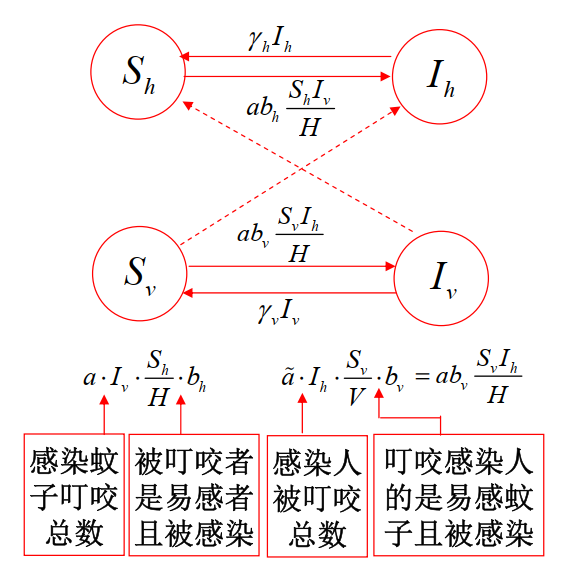

# 16 传染病模型

## 传染病的基本概念

传染病得以在某一人群中发生和传播，必须具备**传染源**、**传播途径**和**易感人群**三个基本环节

## 基本模型

### SIR模型

假设疾病传播期内所考察地区总人数保持不变，没有新增人口和因疾病以外的原因造成的死亡。

我们将人群分为三类：

- 易感者（Susceptible）：未得病者，但缺乏免疫力，与感染者接触后会被感染
- 感染者（Infectious）：已经感染病原体的人，可以传播疾病
- 移出者（Removed）：不会再感染疾病，也不会再传播疾病，可能是因为死亡或者获得了免疫力或者被隔离

记 $t$ 时刻易感者、感染者、移出者的人数分别为 $S(t)$、$I(t)$、$R(t)$

#### 接触和移出

- 接触率：记为 $\beta$，表示单位时间内一个感染者与易感者接触的人数
- 移出率：记为 $\alpha$，表示单位时间内一个感染者被移出的人数

单位时间内每人与 $\beta N$ 个人接触，其中 $N$ 为总人数，易感者占比为 $\frac{S(t)}{N}$，所以单位时间内一个感染者接触的易感者人数为 $\beta N \frac{S(t)}{N}=\beta S(t)$，**单位时间内新增感染者数量**为 $\beta S(t)I(t)$。

单位时间内移出感染者数量为 $\alpha I(t)$

此时每个感染者处于感染期的时间服从参数为 $\alpha$ 的指数分布，那么单位时间内移出感染者数量为 $\alpha I(t)$，我们有

{width=50%}

- $P(X\leq t)=1-e^{-\alpha t}$，$E(X)=\frac{1}{\alpha}$
- 感染者经过长度至多为 $t$ 的感染期后被移出的概率为 $P(X\leq t)=1-e^{-\alpha t}$
- 若不计新增感染者，$\frac{I(t)}{I(0)}=e^{-\alpha t}$
- 若不计新增感染者，$\frac{\mathrm{d}I(t)}{\mathrm{d}t}=-\alpha I(t)$

所以我们可以得到微分方程组

$$\begin{cases}
\frac{\mathrm{d}S}{\mathrm{d}t}=-\beta SI\\
\frac{\mathrm{d}I}{\mathrm{d}t}=\beta SI-\alpha I\\
\frac{\mathrm{d}R}{\mathrm{d}t}=\alpha I
\end{cases}$$

!!! note ""
    其中，$\beta$ 和 $\alpha$ 为常数，$S(0)=S_0$，$I(0)=I_0$，$R(0)=R_0$，$S_0+I_0+R_0=N$

我们考察 $S$ 和 $I$ 的关系，有

$$\frac{\mathrm{d}I}{\mathrm{d}S}=\frac{\beta S-\alpha}{-\beta S}=\frac{1}{\frac{\alpha}{\beta}S}-1\triangleq \frac{1}{\sigma S}-1$$

其中，$\sigma=\frac{\beta}{\alpha}$

可以解得

$$I(t)=S_0+I_0-S(t)+\frac{1}{\sigma}\ln\frac{S(t)}{S_0}$$

我们可以得到如下图像：

其中，横坐标为 $S$，纵坐标为 $I$。斜线上的点为 $S_0$ 和 $I_0$，是初始点。上图所述的先增后减，实际上可以理解为疫情的爆发和衰退。

#### $I$ 总会衰减到0吗？

因为 $S(t)\geq 0,\frac{dS}{dt}\leq0$，所以 $S(t)$ 单调递减有下界，$\lim\limits_{t\to\infty}S(t)$存在，记为 $S_\infty$。

因为 $R(t)\leq N,\frac{dR}{dt}\geq0$，所以 $R(t)$ 单调递增有上界，$\lim\limits_{t\to\infty}R(t)$存在，记为 $R_\infty$。

因为 $I(t)=N-S(t)-R(t)$，所以 $\lim\limits_{t\to\infty}I(t)=N-S_\infty-R_\infty=I_\infty$存在。

若 $I_\infty=\epsilon >0$ ，则对充分大的 $t$，$\frac{\mathrm{d}R}{\mathrm{d}t}=\alpha I(t)\geq \alpha \epsilon$，所以 $R(t)\geq \alpha \epsilon t$，$\lim\limits_{t\to\infty}R(t)=\infty$，矛盾。

所以 $I_\infty=0$，即 $I(t)$ 会衰减到0。

!!! note ""
    但是，$I(t)$ 会衰减到0，不代表一定是好事，可能是因为所有人都痊愈了，也可能是因为所有人都寄了。

#### 估计 $\sigma$

{width=50%}

由该图可知，$S_\infty$ 即为 $S_0+I_0-S(t)+\frac{1}{\sigma}\ln\frac{S(t)}{S_0}=0$ 的根

我们可以用 $\sigma \approx \frac{\ln S_0 - \ln S_\infty}{S_0-S_\infty}$ 来估计 $\sigma$。

#### $I(t)$ 的增减性

!!! note ""
    
    $$\begin{cases}
    \frac{\mathrm{d}S}{\mathrm{d}t}=-\beta SI\\
    \frac{\mathrm{d}I}{\mathrm{d}t}=\beta (S-\sigma )I\\
    \frac{\mathrm{d}R}{\mathrm{d}t}=\alpha I
    \end{cases}$$

若 $S_0 > \frac{1}{\sigma}$

-   $\frac{1}{\sigma}<S(t)<S_0$，$\frac{\mathrm{d}I}{\mathrm{d}t}>0$，$I(t)$ 单调递增
-   $S(t)=\frac{1}{\sigma}$，$\frac{\mathrm{d}I}{\mathrm{d}t}=0$，$I(t)$ 达到最大值 $S_0+I_0-\frac{1}{\sigma}(1+\ln\sigma S_0)$
-   $S(t)<\frac{1}{\sigma}$，$\frac{\mathrm{d}I}{\mathrm{d}t}<0$，$I(t)$ 单调递减至0

若 $S_0 \leq \frac{1}{\sigma}$，$I(t)$ 单调递减至0，传染病不会爆发。

#### 基本再生数

将上述增减性的分析应用过来，记 $\mathcal{R}_0=S_0\sigma$，则前文分析情况就对应 $\mathcal{R}_0>1$ 和 $\mathcal{R}_0\leq 1$。

$$\mathcal{R}_0=S_0\sigma=S_0\frac{\beta}{\alpha}=\frac{1}{\alpha}\cdot \beta N \cdot \frac{S_0}{N}$$

- $\frac{1}{\alpha}$：每个感染者感染时间的期望值
- $\beta N$：单位时间内一个感染者接触的人数
- $\frac{S_0}{N}$：易感者占总人数的比例

所以这个式子表示每个感染者在感染期内感染的易感者平均数。

我们称 $\mathcal{R}_0$ 为**基本再生数**。

### SIS模型

假设疾病传播期内所考察地区总人数保持不变，没有新增人口和因疾病以外的原因造成的死亡。

我们将人群分为两类：

- 易感者（Susceptible）：未得病者，但缺乏免疫力，与感染者接触后会被感染
- 感染者（Infectious）：已经感染病原体的人，可以传播疾病

假设单位时间内每人与 $\beta N$ 个人接触，并使其中的易感者受到感染。单位时间内 $\gamma I(t)$ 个感染者被治愈，重新成为易感者。

!!! note ""
    其中，$\beta$ 和 $\gamma$ 为常数，$S(0)=S_0$，$I(0)=I_0$，$S_0+I_0=N$

我们给出微分方程组

$$\begin{cases}
\frac{\mathrm{d}S}{\mathrm{d}t}=-\beta SI+\gamma I\\
\frac{\mathrm{d}I}{\mathrm{d}t}=\beta SI-\gamma I
\end{cases}$$

所以

$$\frac{\mathrm{d}I}{\mathrm{d}t}=\beta (N-I)I-\gamma I=(\beta N-\gamma-\beta I)I=(\beta N-\gamma)I(1-\frac{\beta}{\beta N-\gamma}I)$$

感觉是不是和 Logistic 模型很像？

!!! note "Logistic 模型"
    $$\frac{\mathrm{d}x}{\mathrm{d}t}=rx\left(1-\frac{x}{K}\right)$$

- 若 $\beta N-\gamma>0$，$\forall I_0\in (0,N)$，$I(t)$ 单调递增趋向于 $N-\frac{\gamma}{\beta}$
- 若 $\beta N-\gamma<0$，$\forall I_0\in (0,N)$，$I(t)$ 单调递减趋向于 $0$

记 $\mathcal{R}_0=\frac{\beta}{\gamma}N$，即当 $\mathcal{R}_0>1$ 时，$I(t)$ 单调递增趋向于 $N-\frac{\gamma}{\beta}$，当 $\mathcal{R}_0<1$ 时，$I(t)$ 单调递减趋向于 $0$。

#### 平衡点

自治系统有两个可能平衡点 $P_1=(N,0)$ 和 $P_2=(\frac{\gamma}{\beta},N-\frac{\gamma}{\beta})$

- 当 $\mathcal{R}_0>1$ 时，$(S(t),I(t))$ 趋向于 $P_1$，人群中不再有感染者
- 当 $\mathcal{R}_0<1$ 时，$(S(t),I(t))$ 趋向于 $P_2$，传染病成为地方性疾病

### 防控传染病对策

- 减少人群接触，减小 $\beta$ 值
- 提高治疗水平，使感染者尽早治愈，即增大 $\gamma$值
- 在存在移出者 (SIR) 情况下，通过预防免疫办法提高初始移出者 $R_{0}$ 至 $N-\frac{\alpha}{\beta}$

!!! note "为什么是 $N-\frac{\alpha}{\beta}$"
    因为 $\frac{\mathrm{d}I}{\mathrm{d}t}=(\beta S-\alpha) I$，所以我们让未被感染的人群 $S<\frac{\alpha}{\beta}$，这样就可以让 $\frac{\mathrm{d}I}{\mathrm{d}t}<0$，即 $I$ 单调递减，疾病不会爆发。

## Ross疟疾传播模型

!!! note ""
    其实还是 SIS 模型。

疟疾只会在人类和蚊子，或者蚊子和蚊子之间传播，我们做出如下假设：

- 某区域在一段时间内人的数量 $H$ 与（雌性）蚊子的数量 $V$ 保持不变
- 记 $t$ 时刻人群中易感者和感染者数量分别为 $S_h(t)$ 和 $I_h(t)$，蚊子中易感者和感染者数量分别为 $S_v(t)$ 和 $I_v(t)$
- 单位时间内每只蚊子会叮咬 $a$ 个（不同的）人，每个人被 $\tilde{a}$ 只（不同的）蚊子叮咬，$aV=\tilde{a}H$
- 发生叮咬时，从已感染疟疾的人传染给未感染疟疾的蚊子的概率为 $b_h$，从已感染疟疾的蚊子传染给未感染疟疾的人的概率为 $b_v$
- 单位时间内，有数量为 $\gamma_h I_h(t)$ 的已感染疟疾的人康复，数量为 $\gamma_v I_v(t)$ 的已感染疟疾的蚊子康复

通过分析，我们可以得到下图：

{width=50%}

可以得到微分方程组

$$
\begin{cases}\frac{dS_h}{dt}=-ab_h\frac{S_hI_v}H+\gamma_hI_h\\\frac{dI_h}{dt}=ab_h\frac{S_hI_v}H-\gamma_hI_h\\\frac{dS_v}{dt}=-ab_v\frac{S_v I_h}H+\gamma_v I_v\\\frac{dI_v}{dt}=ab_v\frac{S_v I_h}H-\gamma_v I_v&\end{cases}
$$

记

$$\begin{aligned}x(t)&=\frac{I_h(t)}H=1-\frac{S_h(t)}H\\y(t)&=\frac{I_v(t)}V=1-\frac{S_v(t)}V\\m&=\frac{V}{H}\end{aligned}$$

则有

$$
\begin{cases}\dfrac{dx}{dt}=ab_h(1-x)my-\gamma_hx\\\dfrac{dy}{dt}=ab_v x(1-y)-\gamma_v y\end{cases}
$$

### 平衡点

令 $\frac{dx}{dt}=\frac{dy}{dt}=0$，则可以解得平衡点

$$(0,0),\left(\frac{a^2mb_hb_v-\gamma_h\gamma_v}{ab_v(amb_h+\gamma_h)},\frac{a^2mb_hb_v-\gamma_h\gamma_v}{amb_h(ab_v+\gamma_v)}\right)$$

因为分子决定了平衡点的存在性，我们定义

$$\mathcal{R}_0=\frac{a^2mb_hb_v}{\gamma_h\gamma_v}=\frac{ab_v}{\gamma_h}\cdot \frac{amb_h}{\gamma_h}$$

- 当 $\mathcal{R}_0>1$ 时，平衡点 $(0,0)$ 不稳定，平衡点 $\left(\frac{a^2mb_hb_v-\gamma_h\gamma_v}{ab_v(amb_h+\gamma_h)},\frac{a^2mb_hb_v-\gamma_h\gamma_v}{amb_h(ab_v+\gamma_v)}\right)$ 稳定，疟疾会爆发
