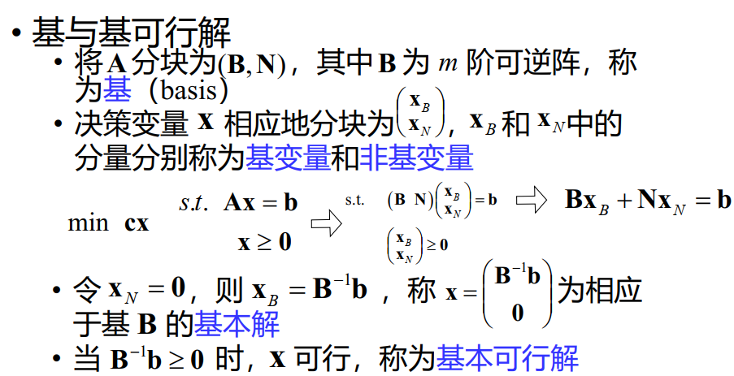
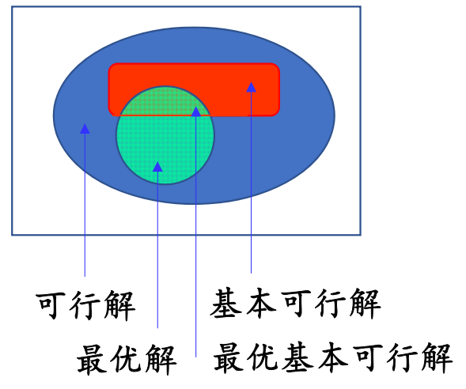

# 21 数学规划求解

## 线性规划

### 矩阵形式

$$\begin{aligned}
&\min \mathbf{c}\mathbf{x}\\
s.t.\qquad&\mathbf{A}\mathbf{x}=\mathbf{b}\\&\mathbf{x}\geq\mathbf{0}\end{aligned}$$

不妨设系数矩阵 $\mathbf{A}=(a_{ij})_{m\times n} $ 为行满秩矩阵，即 $\text{rank}(\mathbf{A})=m$

- 若 $\text{rank}( \mathbf{A} ) < m$ ,则存在冗余约束 

不妨设 $\mathbf{A}$ 的前 $m$ 列线性无关

-  重排 $\mathbf{A}$ 的列，并相应调整决策变量的顺序

### 标准型

- 目标函数极小化
- 决策变量取非负值
    - $x_j$ 无限制 $\Leftrightarrow x_j=x_j^+-x_j^-,x_j^+,x_j^-\geq0$
- 所有约束均为等式约束
    - $\mathbf{A}\mathbf{x}\leq\mathbf{b}\Leftrightarrow\mathbf{A}\mathbf{x}+\mathbf{y}=\mathbf{b},\mathbf{y}\geq\mathbf{0}$
    - $\mathbf{A}\mathbf{x}\geq\mathbf{b}\Leftrightarrow\mathbf{A}\mathbf{x}-\mathbf{y}=\mathbf{b},\mathbf{y}\geq\mathbf{0}$
- 等式约束右端均为非负常数

### 最优解的类型

线性规划有四种最优解的类型：唯一最优解、无穷多最优解、无可行解、无界解（有可行解，但最优值无下界）。

### 基与基可行解

### 线性规划基本定理

{width=60%}

- 若线性规划有可行解，必有基本可行解
- 若线性规划有最优解，必有最优基本可行解
    - 线性规划最优解，只需在所有基本可行解中去寻找

### 求解算法

#### 单纯形法

从一个基本可行解转到另一个基本可行解，并使目标值下降。迭代有限次，找到最优解或判断最优值无界

!!! note ""

    单纯形法是指数时间算法。存在含 $m$ 个变量 $m$ 个约束的线性规划，单纯形法需要进行 $2^m-1$ 次迭代

    实践表明，对多数线性规划问题，单纯形法迭代次数为变量和约束数的多项式函数

#### 多项式时间算法

1979年，Khachiyan给出了求解线性规划的第一个多项式时间算法 —— **椭球算法**。

1984年，Karmarkar给出了实际效果更好的多项式时间算法——**内点法**，产生了深远的影响

## 整数线性规划

### 分枝定界法

**分枝定界法** 是求解整数规划最常用的算法，算法思想可用于其它离散优化问题的求解。它是一种指数时间算法。

#### 分枝定界法的基本思想

- 用线性规划求解松弛问题，得到松弛问题的最优解
  - 若最优解为整数解，则该整数解为整数规划的最优解
  - 若最优解不是整数解，则将松弛问题的可行域分为两个子可行域，分别求解这两个子问题
- 重复上述过程，直到找到整数解或判断无整数解

!!! example "例子"

    IP: $\min -30x_1-36x_2, s.t.\begin{cases}x_1+x_2\leq 6\\5x_1+9x_2\leq 45\\x_1,x_2\geq 0,x_1,x_2\in\mathbb{Z}\end{cases}$

    我们先求解松弛问题：

    LP: $\min -30x_1-36x_2, s.t.\begin{cases}x_1+x_2\leq 6\\5x_1+9x_2\leq 45\\x_1,x_2\geq 0\end{cases}$

    画图易得，松弛问题的最优解为 $(x_1,x_2)=(\frac{9}{4},\frac{15}{4})$，目标函数值为 $-202.5$

    由于最优解不是整数解，我们将松弛问题的可行域分为两个子可行域：

    $x_1\geq 3,x_1\leq 2$

    !!! note ""
        对于第一个子可行域，我们有：

        IP: $\min -30x_1-36x_2, s.t.\begin{cases}x_1+x_2\leq 6\\5x_1+9x_2\leq 45\\x_1\geq 3\\x_1,x_2\geq 0,x_1,x_2\in\mathbb{Z}\end{cases}$

        LP: $\min -30x_1-36x_2, s.t.\begin{cases}x_1+x_2\leq 6\\5x_1+9x_2\leq 45\\x_1\geq 3\\x_1,x_2\geq 0\end{cases}$

        画图易得，松弛问题的最优解为 $(x_1,x_2)=(3,3)$，目标函数值为 $-198$。此时为整数解，停止迭代。

    !!! note ""
        对于第二个子可行域，我们有：

        IP: $\min -30x_1-36x_2, s.t.\begin{cases}x_1+x_2\leq 6\\5x_1+9x_2\leq 45\\x_1\leq 2\\x_1,x_2\geq 0,x_1,x_2\in\mathbb{Z}\end{cases}$

        LP: $\min -30x_1-36x_2, s.t.\begin{cases}x_1+x_2\leq 6\\5x_1+9x_2\leq 45\\x_1\leq 2\\x_1,x_2\geq 0\end{cases}$

        画图易得，松弛问题的最优解为 $(x_1,x_2)=(2,\frac{35}{9})$，目标函数值为 $-200$，此时 $x_2$ 不是整数，我们将松弛问题的可行域分为两个子可行域：

        $x_2\geq 4,x_2\leq 3$

        !!! note ""
            对于第一个子可行域，我们有：

            IP: $\min -30x_1-36x_2, s.t.\begin{cases}x_1+x_2\leq 6\\5x_1+9x_2\leq 45\\x_1\leq 2\\x_2\geq 4\\x_1,x_2\geq 0,x_1,x_2\in\mathbb{Z}\end{cases}$

            LP: $\min -30x_1-36x_2, s.t.\begin{cases}x_1+x_2\leq 6\\5x_1+9x_2\leq 45\\x_1\leq 2\\x_2\geq 4\\x_1,x_2\geq 0\end{cases}$

            画图易得，松弛问题的最优解为 $(x_1,x_2)=(\frac{5}{9},4)$，目标函数值为 $-198$。此时不为整数解，但是继续做下去，函数值只会更大，所以停止迭代。

        !!! note ""
            对于第二个子可行域，我们有：

            IP: $\min -30x_1-36x_2, s.t.\begin{cases}x_1+x_2\leq 6\\5x_1+9x_2\leq 45\\x_1\leq 2\\x_2\leq 3\\x_1,x_2\geq 0,x_1,x_2\in\mathbb{Z}\end{cases}$

            LP: $\min -30x_1-36x_2, s.t.\begin{cases}x_1+x_2\leq 6\\5x_1+9x_2\leq 45\\x_1\leq 2\\x_2\leq 3\\x_1,x_2\geq 0\end{cases}$

            画图易得，松弛问题的最优解为 $(x_1,x_2)=(2,3)$，目标函数值为 $-168$。此时为整数解，停止迭代。

    所以，整数规划的最优解为 $(x_1,x_2)=(3,3)$，目标函数值为 $-198$。

