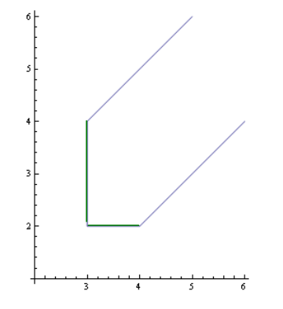
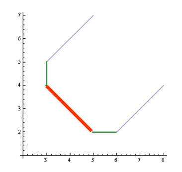
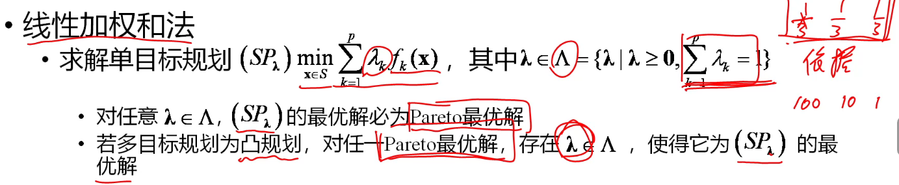
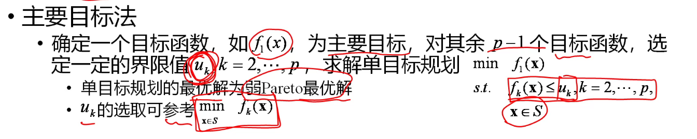
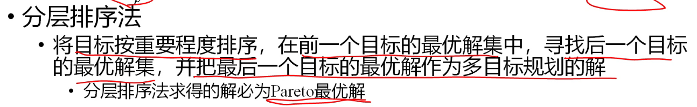
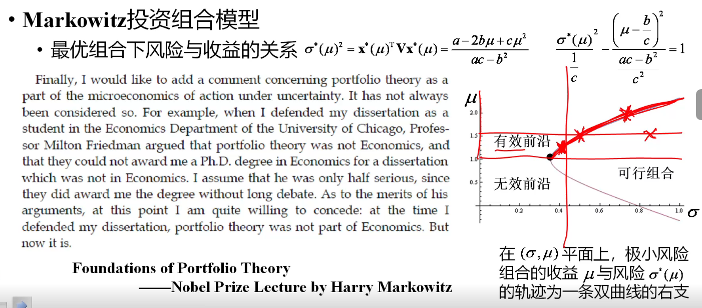
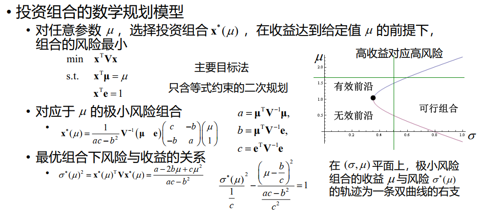

# 22 多目标规划

## 多目标规划的概念

多目标规划研究变量在满足给定约束条件下，多个可数值化的目标函数同时极小化的问题：

$$
\min f(x)=\begin{pmatrix}f_1(x)\\f_2(x)\\\vdots\\f_m(x)\end{pmatrix},s.t.\mathbf{x}\in S,\quad S = \{\mathbf{x}|\begin{cases}g_i(\mathbf{x})\leq 0,i=1,2,\cdots,s\\h_j(\mathbf{x})=0,j=1,2,\cdots,t\end{cases}\}
$$

## 多目标规划解的类型

**绝对最优解 $S_a$**：在所有可行解中，同时使所有目标函数取得最小值的解

- 对任意 $\mathbf{x}\in S$ ，有 $f_i(\mathbf{x}^*)\geq f_i(\mathbf{x}),i=1,2,\cdots,p$

**Pareto最优解（有效解/非劣解）$S_p$**：

- 不存在 $\mathbf{x}\in S$ ，使得所有 $f_i(\mathbf{x})\leq f_i(\mathbf{x}^*),i=1,2,\cdots,p$ ，且至少有一个 $f_i(\mathbf{x})<f_i(\mathbf{x}^*)$（非严格不等号）

**弱Pareto最优解 $S_{wp}$**：

- 不存在 $\mathbf{x}\in S$ ，使得所有 $f_i(\mathbf{x})< f_i(\mathbf{x}^*),i=1,2,\cdots,p$ （非严格不等号）

### 解的关系

!!! note "$S_a$ 与 $S_{wp}$ 之间的关系"

    $S_a$ 与 $S_{wp}$ 之间的关系（横坐标为 $x$，纵坐标红线为 $f_1$，蓝线为 $f_2$）：

    

    我们通常将其画为（纵坐标为 $f_1$，横坐标为 $f_2$）：

    

    其中，左下角的交点为 $S_a$ ，绿线为 $S_{wp}$

!!! note "$S_{wp}$ 与 $S_p$ 之间的关系"

    $S_{wp}$ 与 $S_p$ 之间的关系（横坐标为 $x$，纵坐标红线为 $f_1$，蓝线为 $f_2$）：

    

    我们通常将其画为（纵坐标为 $f_1$，横坐标为 $f_2$）：

    

    其中，红线为 $S_{p}$ ，绿线为 $S_{wp}$

可以证明 $S_a\subseteq S_{wp}\subseteq S_p\subseteq S$ 

!!! note "证明"

    - 若 $\mathbf{x}^*\in S_a$，但 $\mathbf{x}^*\notin S_p$，则存在 $\overline{\mathbf{x}}\in S$ 和某个$k$，使得$f_k(\overline{\mathbf{x}})<f_k(\mathbf{x}^*)，f_l(\overline{\mathbf{x}})\leq f_l(\mathbf{x}^*)，l\neq k$，与$\mathbf{x}^*\in S_a$矛盾

    - 若 $\mathbf{x}^*\in S_p$，但 $\mathbf{x}^*\notin S_{wp}$，则存在 $\overline{\mathbf{x}}\in S$，使得$f_k(\overline{\mathbf{x}})<f_k(\mathbf{x}^*),k=1,\cdots,p$，与 $\mathbf{x}^*\in S_p$矛盾。

若 $S_a=S_{wp}$ ，则称 $S_a$ 为**Pareto最优解**，此时 $S_a=S_{wp}=S_p$

## 多目标规划的求解

### 线性加权和法

### 主要目标法

### 理想点法

对任意$k$，取$f_k^0\leq\min_{z\in S}f_k(\mathbf{x})$，$\lambda \in\Lambda=\{\lambda\mid \lambda \geq{0},\sum\limits_{k-1}^p \lambda _ k =1\}$，求解单目标规划 $\quad\left(P_{i}(\alpha)\right)\min\limits_{\mathbf{x}\in S}\left(\sum\limits_{k=1}^{p}\lambda_{k}\left(f_{k}(\mathbf{x})-f_{k}^{0}\right)^{\alpha}\right)^{\frac1\alpha}$

!!! note ""
    在实际情况下，我们可以将 $\lambda$ 取为 $1$，$\alpha$ 取为 $2$

- 对任意 $\alpha\geq1，P_{\lambda}(\alpha)$ 的最优解为弱Pareto最优解
- 若$\lambda_k \equiv \frac1p$，对任意 $\alpha\geq1$，$P_{\lambda}(\alpha)$ 的最优解为Pareto最优解

### 分层排序法

## 例子：投资组合

采用主要目标法

??? note "简略版"
    