# 24 图论模型

## 图的基本概念

### 图

**图**是一个有序二元组 $G=(V,E)$，其中 $V$ 是**顶点（vertex）**集合，$E$ 是**边（edge）**的集合。$E$ 中每条边 $e$ 与 $V$ 中两个顶点**关联（incident）**。

- 若与边关联的两个顶点有序，则称图为**有向图（digraph）**，否则称为**无向图**

**度**：无向图 $G$ 中与顶点 $v$ 关联的边的数目称为 $v$ 的度，记为 $d(v)$($deg_G(v)$)

- 图的所有顶点的度的最大值与最小值分别称为最大度和最小度， 记为 $\Delta(G)$ 和 $\delta(G)$
- （握手定理）所有顶点的度之和等于边数的两倍，即 $\sum_{v\in V}d(v)=2|E|$

#### 简单图

两端点相同的边称为**环（loop）**，两端点分别相同的多条边称为**平行边（parallel edges）**

既没有环，也没有平行边的图称为**简单图（simple
graph）**。不是简单图的图称为**多重图（multigraph）**

##### 完全图

任何两个不同顶点之间都有边相连的简单图称为**完全图（complete graph）**

- $n$ 个顶点的完全图记为 $K_n$， $K_n$的边数为 $\frac{n(n-1)}{2}$

##### 简单图的顶点数与边数

- 若 $G=(V,E)$ 为简单图，则边数的上界为 $\frac{|V|(|V|-1)}{2}$，下界为 $|V|-1$
- 边数接近上界的称为**稠密图（dense graph）**，边数远离上界的称为**稀疏图（sparse graph）**

#### 二部图与连通

#### 子图

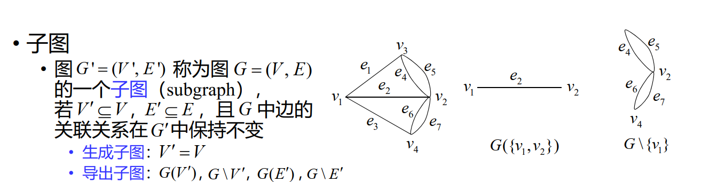

#### 路

顶点和边交替出现的序列 $v_{i_0}e_{i_1}v_{i_1}e_{i_2}\cdots e_{i_k}v_{i_k}$，且序列中与每条边相邻的两个顶点为该边的两个端点，称为连接顶点 $v_{i_0}$ 和 $v_{i_k}$ 的**途径（walk）**

- 若图为简单图，可省略途径中边的符号

经过边互不相同的途径称为**迹（trail）**

- 起点和终点相同的迹称为闭迹

经过顶点互不相同的途径称为**路（path）**

- 起点和终点相同，其余顶点互不相同，也不与起点和终点相同的途径称为**圈（cycle）**

##### 路的长度

- 边赋权图中一条路所含边的权之和称为它的长度

#### 树

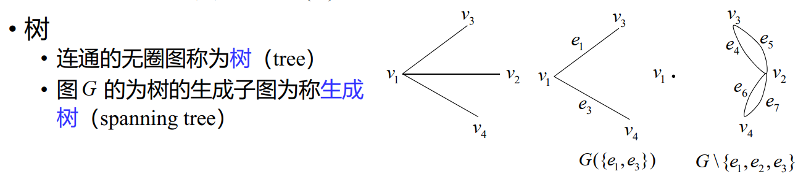

##### 最小生成树

最小生成树（MST）是赋权图所有生成树中总权和最少的生成树

###### Kruskal 算法

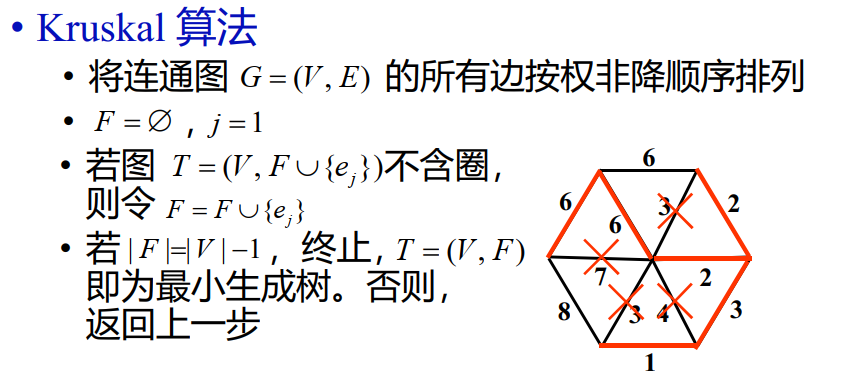

#### 最短路

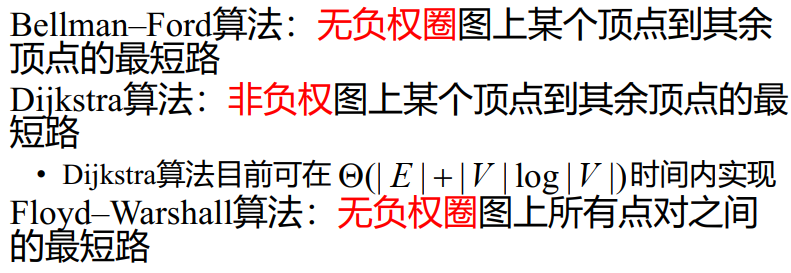

#### 最短连接

给定Euclidean平面上 $n$ 个点，如何用总长度最短的若干条线段将它们连接起来？

用最小生成树解决最短连接问题：构造 $n$ 个顶点的赋权完全图 $K_n$，边的权为它的两个端点的Euclidean距离。问题的解即为 $K_n$ 的最小生成树

##### 最小 Steiner 树

允许增加任意多个Steiner点的最短连接（就是说，可以在原有的点集中增加任意多个点，使得最后的连接线段总长度最短）

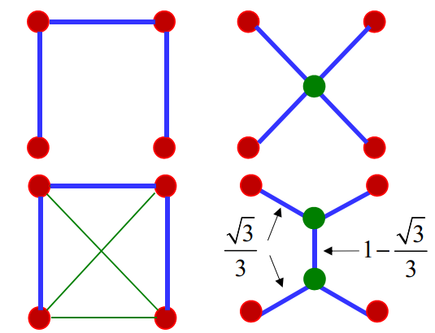{width=50%}

###### Gilbert-Pollak猜想

最小Steiner树长度不小于最小生成树长度的 $\frac{\sqrt{3}}{2}$倍

!!! note ""
    $n=3,4,5,6$ 时，猜想成立

#### Hamilton 圈 与 Hamilton 图

经过图的所有顶点恰好一次的圈称为 **Hamilton圈（Hamiltion cycle）**

存在Hamilton圈的图称为**Hamilton图**

##### Icosian game

一个正十二面体的二十个顶点各代表一个城市，是否有一条从某个城市出发，沿正十二面体的棱行走，经过每个城市恰好一次，最后回到出发城市的路线？

{width=50%}

##### 骑士环游 | Knight’s tour

在 $8\times8$ 国际象棋棋盘上，马能否按其走子规则，从一个格子出发，经过其它格子恰好一次，最后回到起点？

- 构造“跳马图”，每一格子为图的一个顶点，两个格子之间有
边相连当且仅当马可按走子规则从一个格子跳到另一个格子

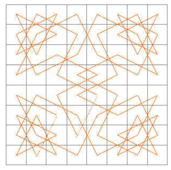{width=50%}

推广为 $m\times n$ 棋盘上的骑士环游问题

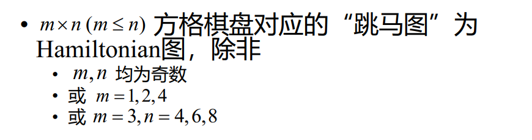

### 特殊顶点集

#### 皇后问题

### 匹配（边集）

#### Hall 定理 与 Frobenius 定理

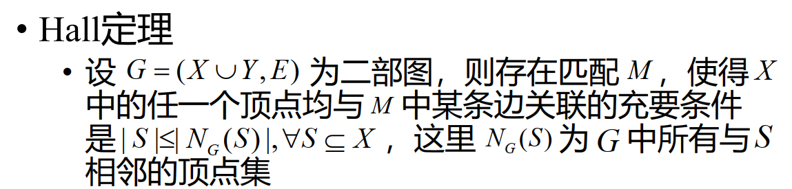

!!! note ""

    例如：

    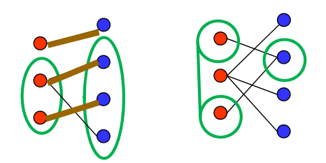

    左图中，$|S|=2 \leq 3=|N(S)|$

    右图中，$|S|=2 \nleq 1=|N(S)|$

    因为二者 左右顶点数不同，所以不能完美匹配

##### Hall定理的等价定理

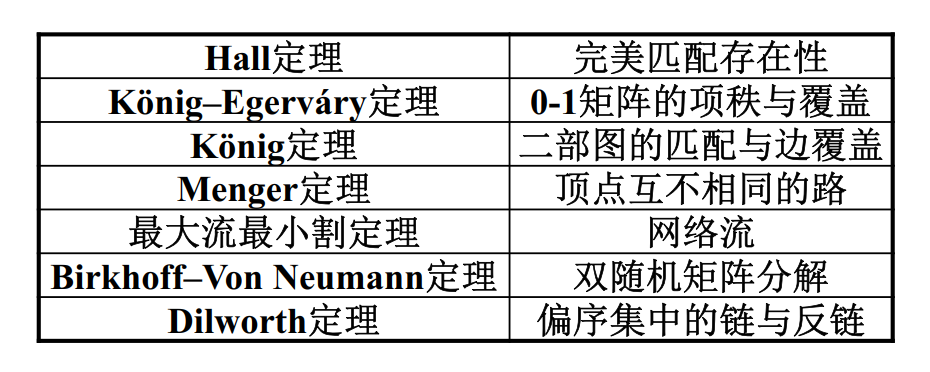

## 图的问题

### 选址问题

!!! question "问题背景"

    {width=70%}

#### 无回环情况

!!! note "口诀"
    道路无回环，

    抓各端，
    
    最小的进一站

- 若只有两站，应在产量多的麦田建站

=== "第一步"

    {width=50%}

=== "第二步"

    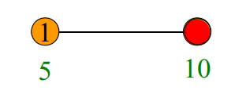{width=50%}

- 若①是各端产量最小者，②是①的邻点

    {width=30%}
    - 在①处或①②之间建场，不如在②处建场
    - 若不在①处或①②之间建场， ①的麦子进入麦场必经过②

    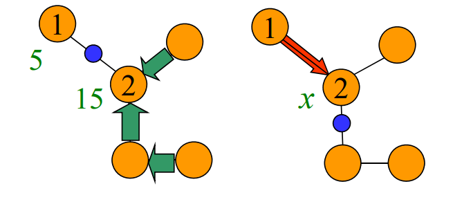{width=50%}

    所以我们说“最小的进一站”，把①的麦子并入②的麦子

!!! note "例子"

    

#### 有回环情况

!!! note "口诀"

    道路有回环，每圈甩一段，

    化为无回环，然后照样算。
    
    甩法有不同，结果一一算，
    
    算后再比较，最优可立断。

例如：

{width=50%}

将圈甩为：

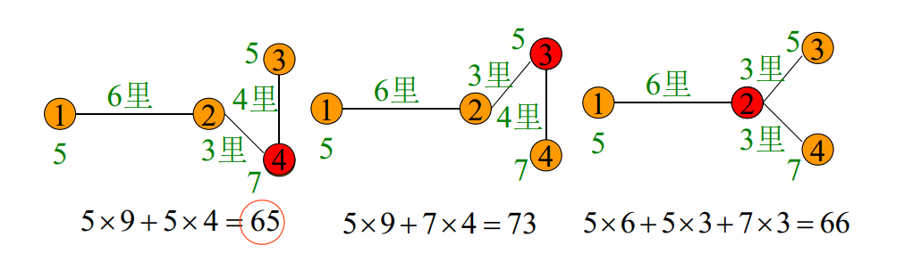

### 七桥问题

!!! question "问题背景"

    在 Konigsberg 城，有七座桥梁建在 Pregel 河上，是否有一条从城中某处出发，经过每座桥梁恰好一次，最后回到出发点的路线？

#### Euler 图

经过图的所有边恰好一次的闭迹称为 **Euler 回路（Eulerian circuit）**。存在 Euler 回路的图为 **Euler 图（Eulerian graph）**。

一连通图是 Euler 图的充要条件是图中没有奇度顶点。

以河流分割而成的城市区域为顶点，桥梁为边，边的端点为该桥梁连接的两片区域。七桥问题等价于在该图中寻找一条闭迹。

可以证明，七桥问题无解。

### 中国邮递员问题（Chinese postman problem | CPP）

!!! question "问题背景"

    一个投递员每次上班，要走遍他负责送信的段，然后回到邮局。问应该怎样走才能使所走的路程最短？

- 将邮递员走过的区域建模为赋权图。街道为边，街道交汇
处为顶点，边的权为街道的长度。
- 若赋权图是 Euler 图，任何一条 Euler 回路都是中国邮递员
问题的最优解。
- 若赋权图不是 Euler 图，寻找一条总长度最短的回路，该回
路可能经过某些边两次以上。

### 着色

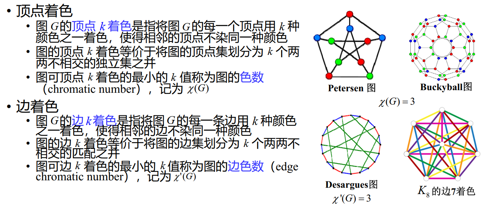

#### Ramsey 数

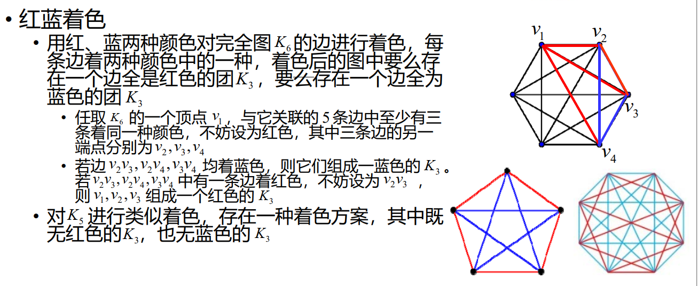

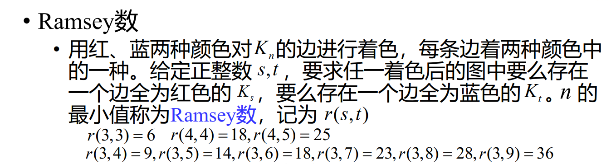

!!! question ""

    （IMO 1964） 17 位科学家中每一位和其余 16 位通信，在他们的通信中所讨论的仅有三个问题，而任两位科学家通信时所讨论的是同一问题，证明至少有三位科学家通信时所讨论的是同一问题。

    

    推广 Ramsey 数到三维，在这题就是 $R(3,3,3)=17$

### 割

#### 网络流

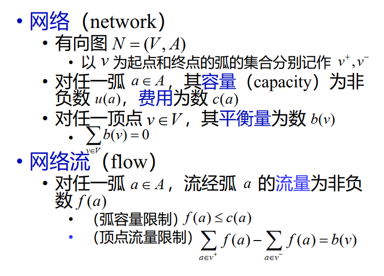{width=70%}

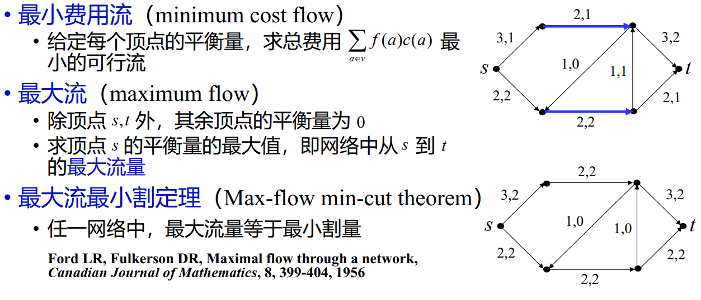

### 算法与复杂性

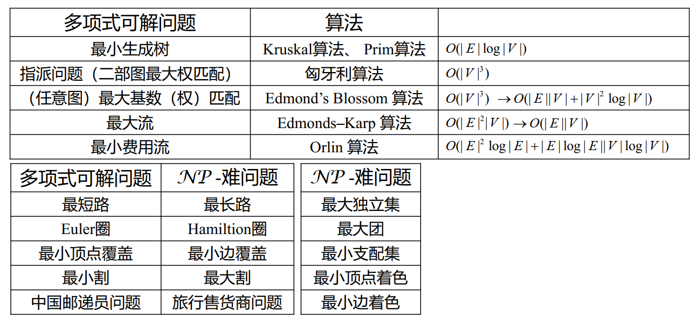

## 图的应用

### 搭档方法

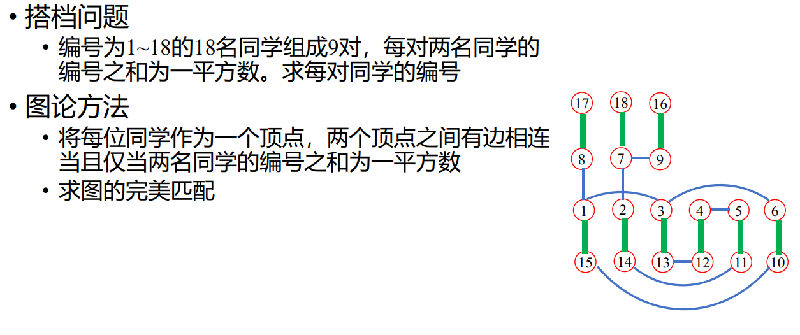

### 获胜队伍

!!! question ""

    一个 $2n$ 个队伍的循环赛持续了 $2n-1$ 天，每天每个队伍都和另一个队伍比赛，每场比赛都有一个队伍获胜，一个队伍失败。在整个比赛中，每个队伍都和其他队伍比赛了一次。我们能不能在每天都选择一个获胜的队伍，而且每个队伍只能被选择一次？

### 黑白异位

### 分水问题

!!! question ""

    现有A,B,C三个水瓶，其容积分别为12,8,5升。 A瓶装满水， B,C为空瓶。现欲利用B,C两瓶，将A瓶中的水均分，并使倾倒次数最少

!!! note ""

    好像是列出了所有的情况，然后找到最短的路径。从中间的 $(12,0,0)$ 到左边的 $(6,6,0)$

### 代表问题

!!! question ""

    某校共有 $m$ 个专业，为调研 $n$ 门课程的教学情况，邀请部分同学参加座谈
    
    - 每门课程有一名同学参加
    - 各门课程邀请的学生各不相同
    - 来自专业 $i$ 的学生数不超过 $a_i$

可以用网络流解决

### 电缆与管道问题

!!! question ""

    中心配电房位于某幢建筑内，一些主干用户位于其
    他不同的建筑内。为避免相互干扰，中心配电房与
    每个主干用户需有一条专门的电缆相连

    - 电缆需铺设在地下管道内，多条电缆可以共用一条
    地下管道，有些建筑之间的道路可能不允许开挖管
    道
    - 铺设电缆的单位长度费用为 $\gamma$ ，开挖管道的单位长
    度费用为 $\tau$
    - 寻找一种方案，使总费用尽可能少

对电缆来说是最短路问题，对管道来说是最小生成树问题

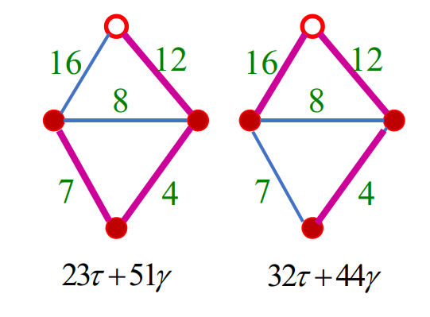

### 未来网络 · 寻路

