# 25 博弈论

## 博弈论的基本概念

博弈论研究由一些带有**相互竞争性质**的主体所构成的体系的理论。它能以数字表示人的行为或为人的行为建立模式，研究对抗局势中**最优的对抗策略和稳定局势**，以及如何追求各方的最优策略和决定对策的结果，协助人们在一定规则范围内寻求**最合理的行为方式**

!!! note "博弈 vs 优化"

    博弈是多主体，优化是单主体

### 博弈的要素

- **参与者**（player）：参与博弈的决策主体
- **策略**（strategy）：参与者可以采取的行动方案
- **策略组合**（strategy profile）：所有参与者选择的策略的集合
- **收益**（payoff）：参与者在某一策略组合下的收益
    - **费用**（cost）：参与者在某一策略组合下需付出的代价

### 博弈论的假设

参与者是理性的，以最大化他的收益或最小化他的费用作为选择策略的准则

### 博弈的分类

**合作博弈(cooperative game)**：局中人之间可以结成联盟，协调彼此的策略，并对获得的收益进行再分配

**静态博弈(static game)**：所有参与者同时选择策略并行动，且只能行动一次，参与者选择策略时不知道其他参与者的选择。

**完全信息(complete information)**：参与者掌握其他参与者的可选策略和收益等信息

**完美信息(perfect information)**：在动态博弈中，参与者掌握其他参与者已选择的策略

### 简单例子

#### 囚徒困境（Prisoner's Dilemma）

甲、乙两人共同犯罪，警方掌握了一部分犯罪事实，将他们带到警局分别讯问

- 若两人均承认所有罪行，则各被判处6个月徒刑
- 若一人认罪，一人不认罪，前者被轻判1个月徒刑，后者被重判9个月徒刑
- 若两人均不认罪，则以部分罪行各被判处2个月徒刑

|  | 乙认罪 | 乙不认罪 |
| :---: | :---: | :---: |
| **甲认罪** | 甲6个月，乙6个月 | 甲1个月，乙9个月 |
| **甲不认罪** | 甲9个月，乙1个月 | 甲2个月，乙2个月 |

## Nash 均衡

Nash 均衡（Nash equilibrium）

- （完全信息静态）博弈的某个局势，每一个理性的参与者都不会单独偏离它
    - 对每一个参与者，在其他参与者策略不变情况下，单独采取其他策略，收益不会增加

### 纯策略与混合策略

**纯策略（pure strategy）**：参与者每次行动都选择某个确定的策略

**混合策略（mixed strategy）**：参与者可以以一定的概率分布选择若干个不同的策略

### Nash 定理

若参与者有限，每位参与者的策略集均有限，收益函数均为实值函数，则博弈必存在混合策略意义下的 Nash 均衡

### 最优反应函数

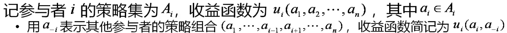

对其他参与者的任一策略组合，参与者的最优反应函数为可使其收益达到最大的策略集合，记为 $B_i(a_{-i})$，即 $B_i(a_{-i})=\{a_i^*|u_i(a_i^*,a_{-i})\geq u_i(a_i^*,a_{-i}), \forall a_i\in A_i\}$

{width=80%}

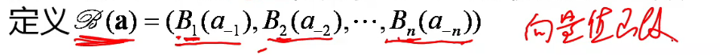

则充要条件可写为 $\mathbf{a}^*\in \mathscr{B}(\mathbf{a}^*)$

!!! note ""
    如果只有一个的话，那就是 $\mathbf{a}^* =  \mathscr{B}(\mathbf{a}^*)$，我们可以由此想到不动点定理

#### 不动点定理

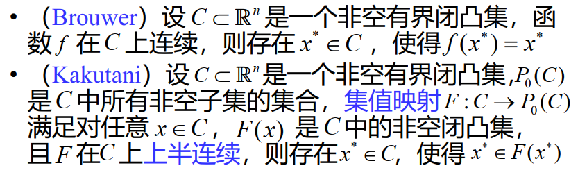{width=80%}

### Nash 均衡的例子

#### Battle of Sexes

♂️：一起看球赛，收益为3；一起逛街，收益为1；各自行动，收益为0

♀️：一起看球赛，收益为1；一起逛街，收益为3；各自行动，收益为0

| (♂️,♀️) | ♂️ 看球赛 | ♂️ 逛街 |
| :---: | :---: | :---: |
| **♀️ 看球赛** | (3,1) | (0,0) |
| **♀️ 逛街** | (0,0) | (1,3) |

可见，双方看球或双方逛街都是均衡状态

#### 鸽鹰博弈（Hawk-Dove Game）

| (A,B) | B:鸽子 | B:鹰 |
| :---: | :---: | :---: |
| **A:鸽子** | (0,0) | (-1,1) |
| **A:鹰** | (1,-1) | (-5,-5) |

可见，一方鹰，另一方鸽子是均衡状态

!!! note ""
    在这里，第一个分量列最大，第二个分量行最大。

#### 石头剪刀布

{width=50%}

不存在 Nash 均衡

#### 让座

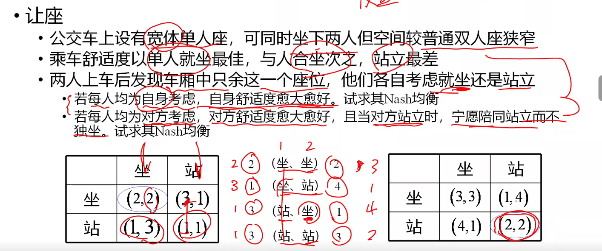

#### Braess 悖论

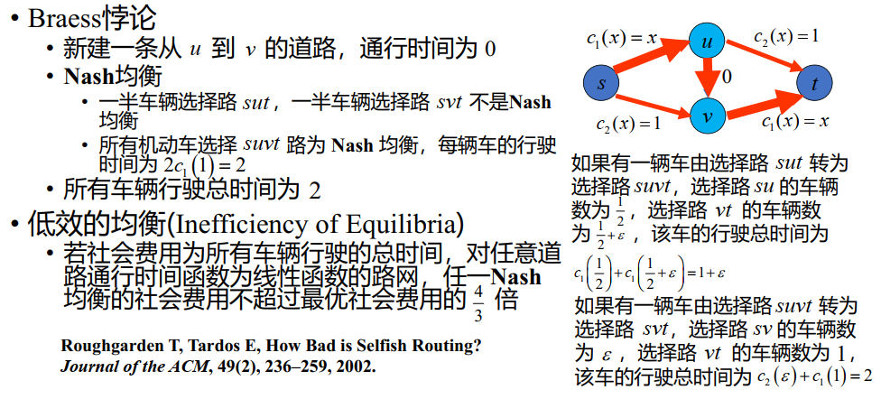

这体现出了 **低效的均衡**（inefficient of Equilibrium）

#### 网络设计博弈

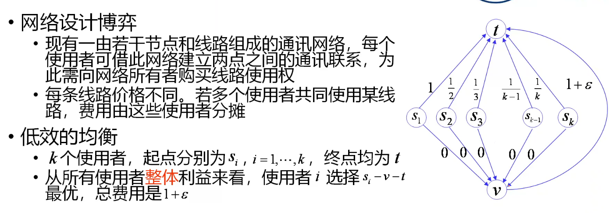

从单个使用者的利益来看，使用者 $i$ 选择道路 $s_i-t$ 是唯一的一个 Nash 均衡，总费用为 $\sum\limits_{i=1}^k \frac1i=O(\ln k)$

## 矩阵博弈

二人零和（zero-sum）有限博弈（完全信息静态博弈）

- 每人的可行策略集为有限集，设甲、乙的策略集分别为 $\{X_1,X_2,\cdots,X_m\}$ 和 $\{Y_1,Y_2,\cdots,Y_n\}$，所有的局势形如 $(X_i,Y_j)$
- 零和：甲的收益为 $a_{ij}$，乙的收益为 $-a_{ij}$

矩阵 $\mathbf{A}=(a_{ij})_{m\times n}$ 称为博弈的收益矩阵

### 极小极大原则

若甲选择策略 $X_i$，不论乙如何选择，其收益至少为 $\min\limits_{1\leq j\leq n}a_{ij}$。

甲的最佳策略是 $\max\limits_{1\leq i\leq m}\min\limits_{1\leq j\leq n}a_{ij}$（每行最小值的最大值）

乙的最佳策略是 $\min\limits_{1\leq j\leq n}\max\limits_{1\leq i\leq m}a_{ij}$（每列最大值的最小值）

可以证明 $\max\limits_{1\leq i\leq m}\min\limits_{1\leq j\leq n}a_{ij}\leq\min\limits_{1\leq j\leq n}\max\limits_{1\leq i\leq m}a_{ij}$

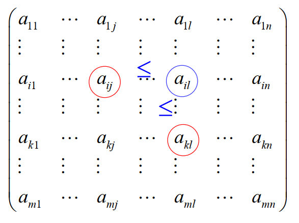{width=50%}

如果 $\max\limits_{1\leq i\leq m}\min\limits_{1\leq j\leq n}a_{ij}=\min\limits_{1\leq j\leq n}\max\limits_{1\leq i\leq m}a_{ij}$，其为**鞍点**（saddle point）

- 若 $a_{st}$ 为鞍点，则 $(X_s,Y_t)$ 是博弈的 Nash 均衡
- 若鞍点不存在，则博弈不存在纯策略 Nash 均衡
    - 例如石头剪刀布：$\begin{pmatrix}0&-1&1\\1&0&-1\\-1&1&0\end{pmatrix}$ 不存在鞍点，所以不存在纯策略 Nash 均衡

### 混合策略与期望收益

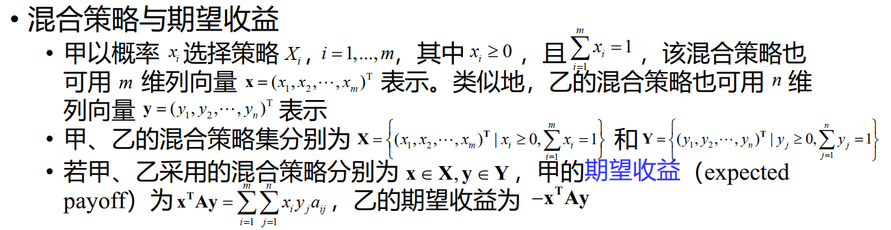

#### von Neumann 极小极大定理

## 数理经济学

### Cournot 模型

### Stackelberg 模型

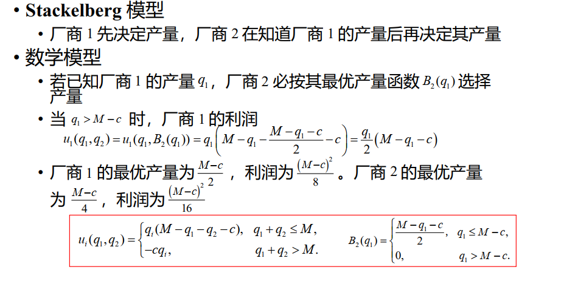

#### Cournot vs Stackelberg

### Bertrand 模型

!!! note ""
    Bertrand 认为 Cournot 模型中的假设不合理，因为他认为价格是市场的决定因素，而不是产量

{width=50%}

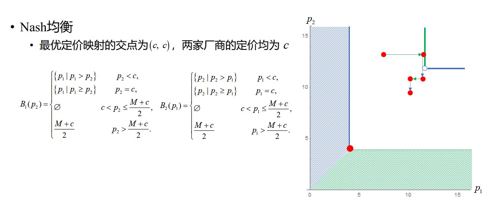

#### Cournot vs Bertrand

Cournot 模型与Bertrand 模型

- Bertrand 模型的均衡价格低于 Cournot 模型的均衡价格
- Cournot 模型以产量为策略变量， Bertrand 模型以价格为策略变量
- Cournot 模型与 Bertrand 模型基于不同的假设，适用于不同的市场环境，也存在各自的局限性

## 稳定婚姻问题

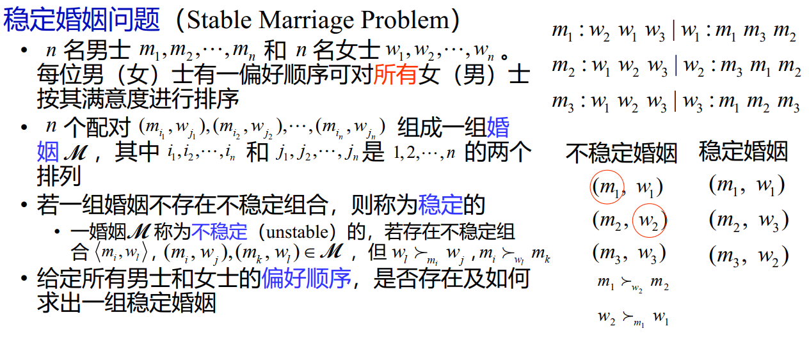

- 每位男士都选择他最钟爱的女士
- 如果有女士被两位或者以上的男士选择，则这几
位男士中除了她最喜欢的之外，对其他男士都表
示拒绝
- 被拒绝的那些男士转而考虑他（们）的除被拒绝
之外的最满意女士。如果存在冲突（包括和之前
选择某女士的男士发生冲突），则再由相应的女
士决定拒绝哪些男士
- 以上过程持续进行，直至不再出现冲突为止

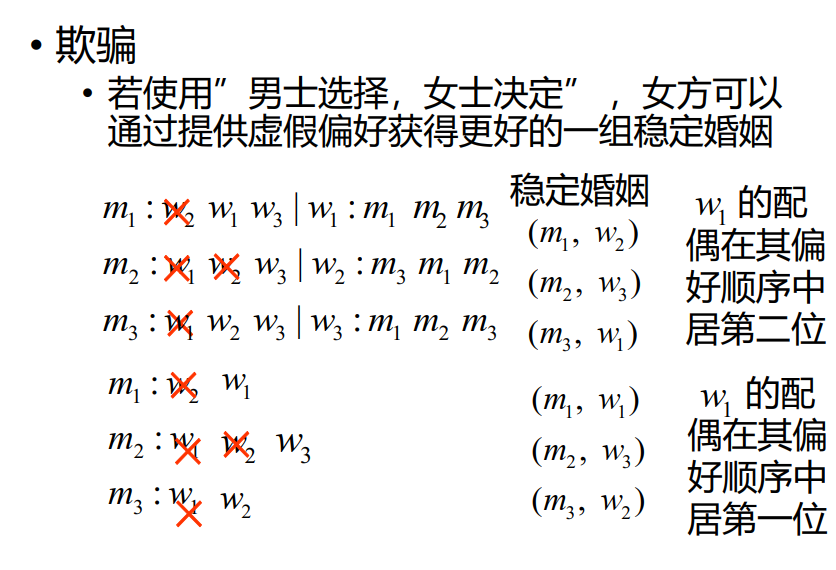{width=50%}

### 推广 - 稳定室友问题

!!! note ""
    关系变多了~

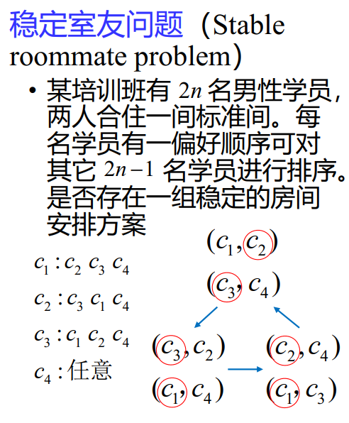{width=50%}

## 合作博弈

### 讨价还价

!!! question ""

    两人协商分配一笔总额为1万元的资金，约定如果达成协议，双方可以按协议取走各自应得的部分；若未达成协议，则两人分文不得，资金收归他用。

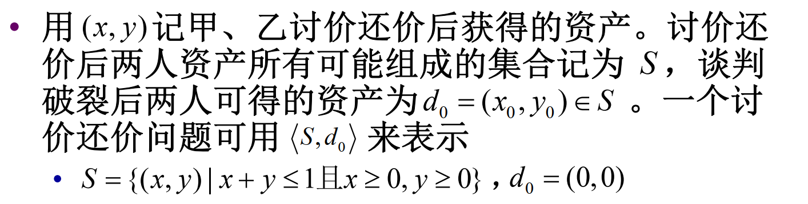

{width=60%}

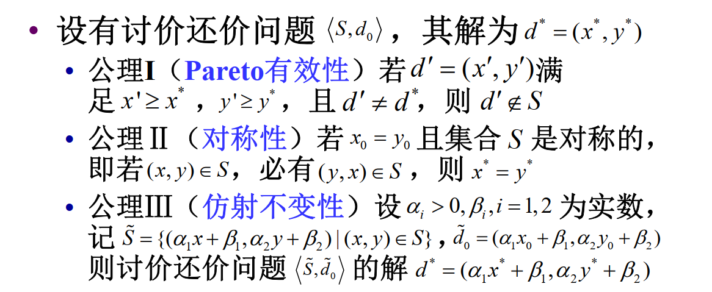

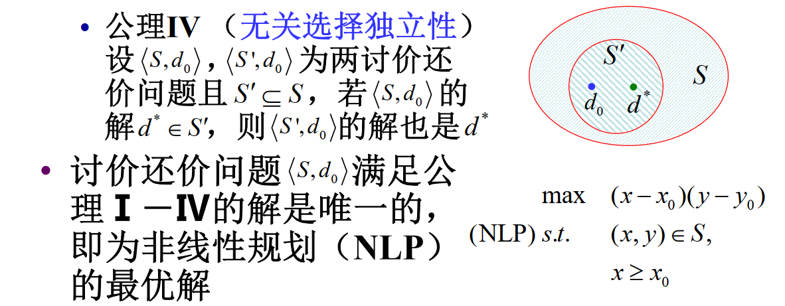

!!! note "证明存在唯一性"

    

!!! note "证明满足公理"

    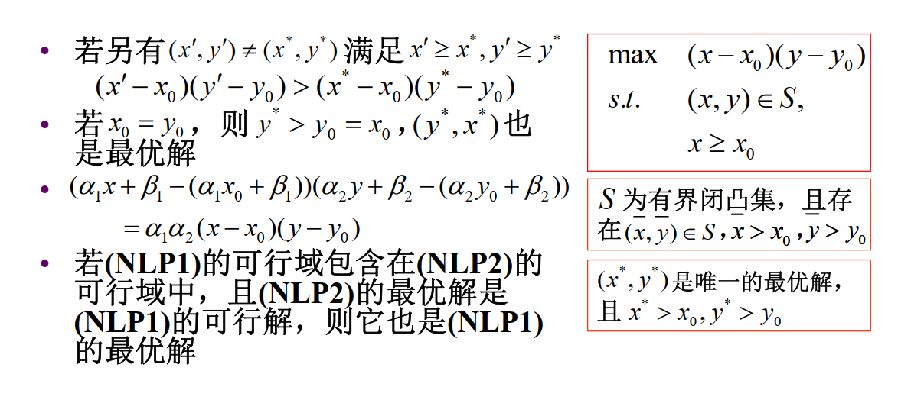

!!! note "最优解的性质"

    

    

### 破产清偿

#### 两人 - CG问题 | Contested Garment

两人财产争议（CG问题）

- 甲方声称拥有某物品全部产权，乙方声称拥有该物品一半产权
    - 双方对该物品的一半产权属于甲方均无异议，对另一半产权双方均认为属于自己
- 双方各获得争议部分产权的一半，无异议部分归属甲方
- 甲方获得该物品产权的四分之三，乙方获得四分之一

!!! note "推广"
    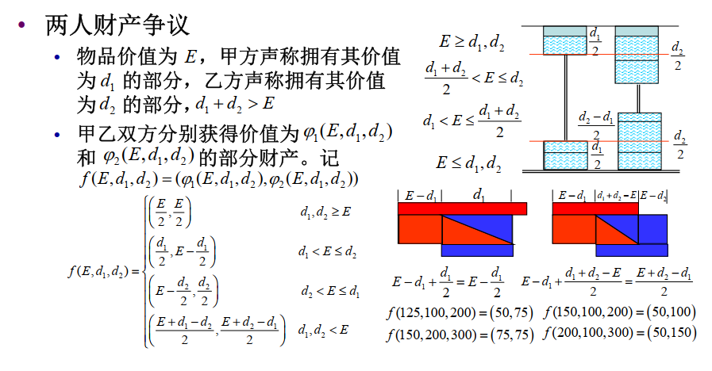

    !!! note ""
        右侧引入容器，两个容器中水平面等高，细管内忽略不计。可以以此列出各个情况。

#### $n$ 人 - 破产清偿

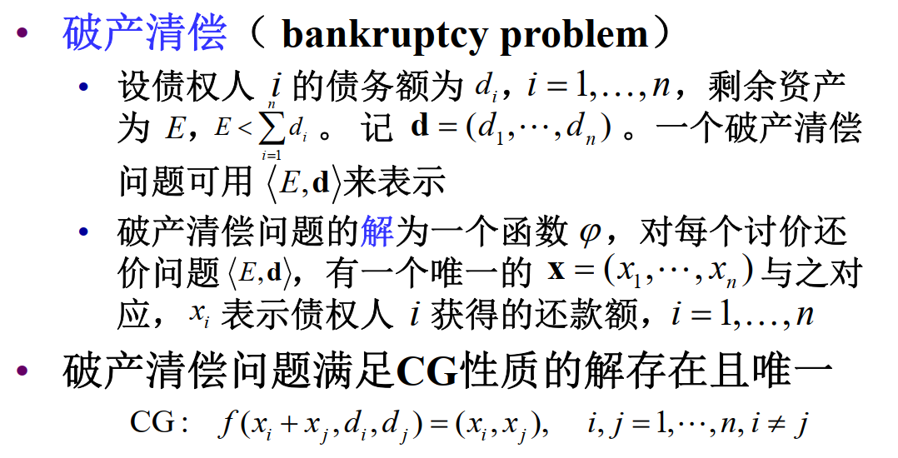

!!! note ""

    **CG性质**：将任意两位债权人所得的还款额之和按CG问题的解重新分配，每位债权人所得的还款额保持不变

    **CG问题的解**：两组连通容器中水平面等高

!!! note "存在性唯一性证明"
    !!! note "存在性"
        - 向 $n$ 组连通容器中注水，所有容器的水平面等高，即得一组解
        - 任取两组容器，断开与其他各组容器的连接，将注入其中的水取出重注，注入每组容器中的水量不变

    !!! note "唯一性"
        - 对任一满足CG性质的解，将各组容器断开，向每组容器中注入相应的水量
        - 为满足CG性质，任意两组容器的水平面等高，否则连通这两组容器重注后，容器中水量会有变化

    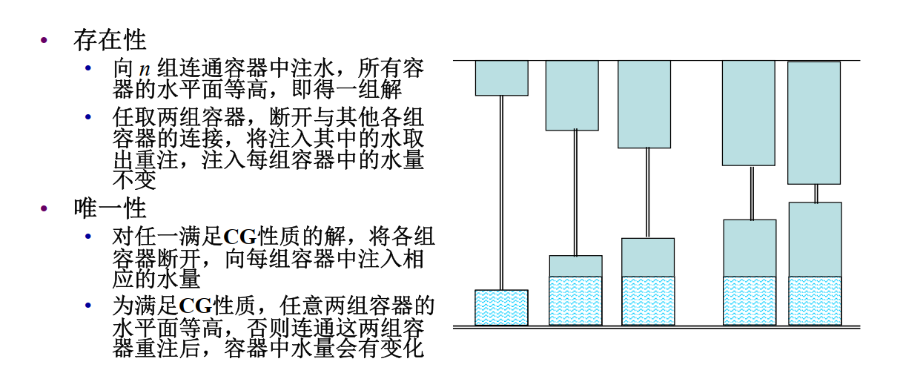

!!! note "情况枚举"

    

    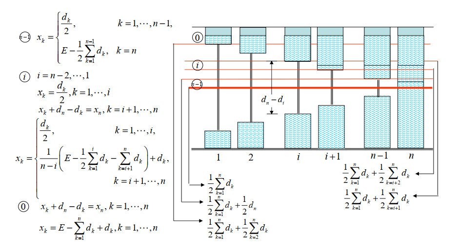