# 数学建模

!!! info "课程信息"

    - 授课：谈之奕
    - 智云课堂：[🔗](https://classroom.zju.edu.cn/coursedetail?course_id=55596&tenant_code=112)
    - 学在浙大：[🔗](https://courses.zju.edu.cn/course/63322/content#/)

## 01 秘密共享

### 数学建模的第一个例子

!!! question 问题背景
    11名科学家正在进行一个秘密项目。他们希望把文件锁在一个柜子里，只有当6名或更多的科学家在场时，柜子才能被打开。问：需要的最小锁数是多少？每个科学家必须携带的最小钥匙数量是多少？

#### 秘密共享-组合数学

首先，你想到了高中学过的组合数学！你决定先从基数比较少的情况入手，即只有5名科学家的情况。

##### 特殊情况

!!! question "问题背景"
    5人在保险柜内存放秘密文件，只有3人及以上在场才能打开，至少几把锁？每个人至少要带多少钥匙？

    !!! note "分析"

        - 两个人过来的时候，必然至少有一把锁不能被打开。
            - 因为我们此时考虑最少锁的情况，所以取任意二人组合不能打开锁的数量为 $1$。
            - 所以每把锁与一对（没有钥匙的）两人组合对应，要有$C_{5}^{2}=10$把锁
                - 为什么不能是两对？
                - ——因为两对都不能打开同一把锁的情况下，三个人过来的时候，就不能打开保险柜了。 
        - 三个人过来的时候，必然能打开其中的一把锁。
            - 所以每人拥有他不在的两人组合对应的锁的钥匙，每人有$C_4^2=6$把钥匙

        - 记录如下：

        | |A|B|C|D|E|谁没有钥匙？|
        |:-:|:-:|:-:|:-:|:-:|:-:|:-:|
        |1| | |√|√|√|AB|
        |2| |√| |√|√|AC|
        |3| |√|√| |√|AD|
        |4| |√|√|√| |AE|
        |5|√| | |√|√|BC|
        |6|√| |√| |√|BD|
        |7|√| |√|√| |BE|
        |8|√|√| | |√|CD|
        |9|√|√| |√| |CE|
        |10|√|√|√| | |DE|

    $\therefore$ 至少要有$10$把锁，每人有$6$把钥匙。

然后我们来考虑一般情况，即有$2n+1$名科学家的情况。

##### 一般情况

设相关人共有$2n+1$人，其中$n$人组成的“少数”团体不能打开安全门，任意$n+1$人组成的“多数”团体可以打开安全门。

!!! note "少数与多数"

    - 两个不同的“少数”团体联合可成为多数团体
    - 任一“少数”团体和不属该团体的任一人联合可成为多数团体

!!! question "需要几把锁？需要多少钥匙？"
    每把锁与一个“少数”团体对应，至少要有$C_{2n+1}^n$把锁。

    每人拥有他不在的“少数”团体对应的锁的钥匙，每人有$C_{2n}^n$把钥匙。

#### 秘密共享-密码学

在密码学里，有专业术语来表示这种情况，叫做**门限机制**$(t,n)$: 在$n$人之间共享秘密，其中任意 $t$ 人可以重构出秘密，而任意 $t-1$ 人都不能重构出秘密。

##### Shamir 门限机制 $(t,n)$

!!! note "基本思想"
    通过秘密多项式，将秘密$s$分解为$n$个秘密，分发给持有者，其中任意不少于$t$个秘密均能恢复密文，而任意少于$t$个秘密均无法得到密文的任何信息。

!!! note "分发方法"

    假设有秘密 $K$ 要保护，任意取$t-1$个随机整数$\{x_1,\cdots,x_{t-1}\}$，构造如下多项式：

    $$
    f(c)=K+x_1c+x_2c^2+\cdots+x_{t-1}c^{t-1}
    $$

    其中，$K \in \mathbb{Z}$，就是我们的秘密。

    取$n$个不同的整数$\{c_1,\cdots,c_n\}$，取公开大素数$p>n+1,K$。计算$b_j\equiv f(c_j)(\mod p)$，将$(c_j,b_j)$发送给第$j$个持有者。

!!! note "证明可行性"
    就是判断任意$t$个方程是否有唯一解，任意$t-1$个方程是否有无穷多解。

    !!! note "任意$t$个方程是否有唯一解"
        取$t$个方程，则有解对应的行列式：

        $$
        \begin{vmatrix}
        1 & c_1 & c_1^2 & \cdots & c_1^{t-1} \\
        1 & c_2 & c_2^2 & \cdots & c_2^{t-1} \\
        \vdots & \vdots & \vdots & \ddots & \vdots \\
        1 & c_t & c_t^2 & \cdots & c_t^{t-1} \\
        \end{vmatrix}
        $$

        由于$c_i$互不相同，所以行列式不为零，有唯一解。

    !!! note "任意$t-1$个方程是否有无穷多解"
        对于任意$t-1$个方程，由于我们有$t$个未知数，所以有无穷多解。

!!! note "恢复秘密"
    任意$t$个持有者联合，可以构造$t$个方程，从而可以恢复出秘密。

!!! example "例子：Secret:$123$; Shamir$(3,5)$"

    !!! note "分配步骤"
        1. 首先确定 $t$ 和 $n$，这里 $t=3,n=5$。
        2. 确定秘密 $K=123$，取模数 $p=127$，
        3. 秘密选择 $t-1=2$ 个随机数 $x_1=2,x_2=3$，构造多项式：

            $$
            f(c)=123+2c+3c^2
            $$
        
        4. 选择 $n=5$ 个不同的整数 $c_1=1,c_2=2,c_3=3,c_4=4,c_5=5$，计算 $b_j\equiv f(c_j)(\mod p)$，然后将 $(c_j,b_j)$ 发送给第 $j$ 个持有者：
        
            |$c_j$|$f(c_j)$|$b_j$|
            |:-:|:-:|:-:|
            |1|128|1|
            |2|139|12|
            |3|156|29|
            |4|179|52|
            |5|208|81|
    
    !!! note "恢复秘密"
        5. 集齐任意$t$个钥匙，例如第一个人的$(c_1,b_1)$，第二个人的$(c_2,b_2)$，第五个人的$(c_5,b_5)$，则可以构造如下方程组：

            $$
            \begin{cases}
            K+1\cdot x_1+1^2\cdot x_2\equiv 1(\mod 127) \\
            K+2\cdot x_1+2^2\cdot x_2\equiv 12(\mod 127) \\
            K+5\cdot x_1+5^2\cdot x_2\equiv 81(\mod 127) \\
            \end{cases}
            $$
        
        解得
        
        $$
        \begin{cases}
        K(\mod 127)=-4\\
        x_1(\mod 127)=2\\
        x_2(\mod 127)=3
        \end{cases}
        $$
        
        所以密码$K=123$。

#### 秘密共享-数论

!!! note "线性同余方程"

    线性同余方程是指形如 $ax\equiv b(\mod m)$ 的方程，其中 $a,b,m$ 为整数，$m>0$。

    - 当且仅当 $gcd(a,m)|b$ 时，线性同余方程有解。
    - 当 $gcd(a,m)=1$ 时，方程的解为 $a^{-1}b$，且小于 $m$的非负整数解唯一。
    - $gcd(a,m)\neq 1$的情况，例如$6\cdot x \equiv 3(\mod 8)$，解为 $x=3$ 和 $x=7$。
    -  $a^{-1}$ 是 $a$ 在模 $m$ 意义下的逆元。
    
    !!! question "什么是逆？"
        设 $a,b$ 为整数，$m$ 为正整数，若 $ab\equiv 1(\mod m)$，则称 $a$ 模 $m$ 可逆，且 $b$ 是 $a$ 在模 $m$ 意义下的逆元，记为 $a^{-1}$。

        !!! question "如何求逆？"
            
            !!! note "大衍求一术"
                求$27^{-1}(\mod 64)$

                $$
                \begin{vmatrix}
                1 & 27 \\
                0 & 64 \\
                \end{vmatrix}
                $$

                其中,$64=2\cdot 27+10$，所以

                $$
                \begin{vmatrix}
                1 & 27 \\
                2 & 10 \\
                \end{vmatrix}
                $$

                其中,$27=2\cdot 10+7$，所以

                $$
                \begin{vmatrix}
                5 & 7 \\
                2 & 10 \\
                \end{vmatrix}
                $$

                其中,$10=1\cdot 7+3$，所以

                $$
                \begin{vmatrix}
                5 & 7 \\
                7 & 3 \\
                \end{vmatrix}
                $$

                其中,$7=2\cdot 3+1$，所以

                $$
                \begin{vmatrix}
                19 & 1 \\
                7 & 3 \\
                \end{vmatrix}
                $$

                所以 $27^{-1}\equiv 19(\mod 64)$。

            !!! note "扩展欧几里得算法"
                用欧拉公式列出一系列等式，直到出现末尾的1。然后从最后一个等式开始，依次代入前面的等式，直到把$gcd(a, b)$写成$sa + tm$。其中，$a$的系数就是$a^{-1}$。

                例如，求$27^{-1}(\mod 64)$：
                
                $$
                \begin{aligned}
                64&=2\cdot 27+10\\
                27&=2\cdot 10+7\\
                10&=1\cdot 7+3\\
                7&=2\cdot 3+1  
                \end{aligned}
                $$

                所以 
                
                $$
                \begin{aligned}
                1&=7-2\cdot 3=7-2\cdot (10-1\cdot 7)\\
                &=3\cdot 7-2\cdot 10=3\cdot (27-2\cdot 10)-2\cdot 10\\
                &=3\cdot 27-8\cdot 10=3\cdot 27-8\cdot (64-2\cdot 27)\\
                &=19\cdot 27-8\cdot 64
                \end{aligned}
                $$

                所以 $27^{-1}\equiv 19(\mod 64)$。

!!! note "中国剩余定理"

    设 $m_1,m_2,\cdots,m_k$ 为两两互质的正整数，$a_1,a_2,\cdots,a_k$ 为任意整数，记$M = m_1m_2\cdots m_k$，则同余方程组

    $$
    \begin{cases}
    x\equiv a_1(\mod m_1)\\
    x\equiv a_2(\mod m_2)\\
    \vdots\\
    x\equiv a_k(\mod m_k)\\
    \end{cases}
    $$

    有小于 $M$ 的唯一正整数解$x=M_1M_1^{-1}a_1+M_2M_2^{-1}a_2+\cdots+M_kM_k^{-1}a_k(\mod M)$，其中$M_i=M/m_i$，$M_i^{-1}$是$M_i$在模$m_i$意义下的逆元。

    !!! question "如何求解？"
        1. 计算 $M=m_1m_2\cdots m_k$。
        2. 计算 $M_i=M/m_i$。
        3. 计算 $M_i^{-1}$。
        4. 解为 $x=M_1M_1^{-1}a_1+M_2M_2^{-1}a_2+\cdots+M_kM_k^{-1}a_k(\mod M)$。

        例如，求解 $x\equiv 2(\mod 3),x\equiv 3(\mod 5),x\equiv 2(\mod 7)$：

        $$
        \begin{aligned}
        M&=3\cdot 5\cdot 7=105\\
        M_1&=5\cdot 7=35,M_2=3\cdot 7=21,M_3=3\cdot 5=15\\
        35M_1^{-1}&\equiv 1(\mod 3),21M_2^{-1}\equiv 1(\mod 5),15M_3^{-1}\equiv 1(\mod 7)\\
        M_1^{-1}&=2,M_2^{-1}=1,M_3^{-1}=1\\
        x&=35\cdot 2\cdot 2+21\cdot 1\cdot 3+15\cdot 1\cdot 2=233\equiv 23(\mod 105)
        \end{aligned}
        $$

##### Asmuth-Bloom 门限机制

!!! note "参数选取"

    记秘密为$K$，$n$个人，$t$个人可以恢复秘密。

    选取两两互素的整数$p$和$m_1,m_2,\cdots,m_n$，满足$p>K$以及$m_1<m_2<\cdots<m_n$，且

    $$
    \frac{m_1\cdots m_t}{m_{n-t+2}\cdots m_n}>p
    $$

    !!! note ""
        也就是说任意$t$个整数的乘积都大于$p$乘以任意$t-1$个整数的乘积。

!!! note "秘密分割"

    为了选出一个能代表$K$的数$K'<m_1\cdots m_t$，我们选取一个随机数$r\in \mathbb{N}$，满足$0\leq r \leq \frac{m_1\cdots m_t}{p}-1$。记$K'=K+rp$。

    !!! note ""

        $K'=K+rp\leq K+(\frac{m_1\cdots m_t}{p}-1)p=K+m_1\cdots m_t-p\leq m_1\cdots m_t$。

    令$k_j \equiv K'(\mod m_j),1\leq j\leq n$，将秘密份额$(k_j,m_j)$分发给第$j$个持有者。

!!! note "秘密恢复"

    当$t$个持有者联合时，由$(k_j,m_j)$，可构建方程组

    !!! note ""
        $k_j \equiv K'(\mod m_j)$也就意味着$K'\equiv k_j(\mod m_j)$

    $$
    \begin{cases}
    x\equiv k_1(\mod m_1)\\
    x\equiv k_2(\mod m_2)\\
    \vdots\\
    x\equiv k_t(\mod m_t)\\
    \end{cases}
    $$

    然后可由中国剩余定理求解$x$，

!!! note "证明可行性"

    判断任意$t$个方程可行，任意$t-1$个方程不可行。

    !!! question "为什么任意$t$个方程可行？"

        由于中国剩余定理，所以任意$t$个方程都有小于$m_{k_1}m_{k_2}\cdots m_{k_t}$的唯一解$x$。

        当我们限制了$K'<m_1\cdots m_t$
        
        那么$n$个方程解出来有唯一解$K'<m_1\cdots m_t \leq m_{k_1}m_{k_2}\cdots m_{k_t}$

        而对任意$t$个方程能解出唯一解$x \leq m_{k_1}m_{k_2}\cdots m_{k_t}$，由于区间的限制以及解的唯一性，所以$x=K'$。

        !!! note ""
            如果$x\neq K'$，则$t$个方程的解不唯一，与中国剩余定理矛盾。

            
    
    !!! question "为什么任意$t-1$个方程不可行？"

        因为对任意$t-1$个方程，我们解出的那个唯一解$x<m_{k_1}m_{k_2}\cdots m_{k_{t-1}}$的。
        
        而$m_{k_1}m_{k_2}\cdots m_{k_{t-1}}<q*m_{k_1}m_{k_2}\cdots m_{k_t}$。
        
        所以在$m_{k_1}m_{k_2}\cdots m_{k_{t-1}}$和$q*m_{k_1}m_{k_2}\cdots m_{k_t}$之间，仍有数解，所以不可行。

## 02 搜索引擎的PageRank模型

!!! question "问题背景："
    如何给出一种<u>合理、客观、定量、可操作</u>的网页排序规则，使“重要”的网页排在前面？

### 随机矩阵

我们先对矩阵的一些概念进行定义：

- 各行（列）元素之和均为1的非负方阵称为**行（列）随机矩阵**
- 各行和各列元素之和均为1的非负方阵称为**双随机矩阵**

任一随机矩阵的模最大特征值为 1

!!! note "证明"

    1. 证明 $1$ 是随机矩阵的特征值。

          1. 对行随机矩阵，我们很容易就能取到特征向量为全为1的列向量，此时特征值为1。
          2. 对列随机矩阵，因为转置前后特征值相同，所以也是1。

    2. 证明 $1$ 是随机矩阵的模最大特征值。
    
          1. 设 $\lambda$ 是行随机矩阵$\mathbf{P}=P_{ij}$的特征值，非零向量 $\mathbf{x}=(x_1,x_2,\cdots,x_n)^T$ 为属于特征值$\lambda$的特征向量。设$|x_i|=\max\{|x_1|,|x_2|,\cdots,|x_n|\}$
          2. 由 $\mathbf{P}\mathbf{x}=\lambda\mathbf{x}$，可得 $\lambda x_i = \sum_{j=1}^np_{ij}x_j$。
          3. 对上式两边取模，$|\lambda||x_i| = |\sum_{j=1}^np_{ij}x_j| \leq \sum_{j=1}^n|p_{ij}||x_j| \leq \sum_{j=1}^n|p_{ij}||x_i| = |x_i|\sum_{j=1}^n|p_{ij}| = |x_i|$，即 $|\lambda| \leq 1$。

    所以，1是随机矩阵的特征值，且模最大。

### 网页重要度

为了排序网页，我们首先肯定需要定量地描述网页的重要度。于是，我们给出以下网页重要度的原则与假设：

!!! note "某网页重要，是因为有其他重要的网页链接到它"

    - 传递性：重要度大的网页链接到网页A时，它对A重要度的贡献大于重要度小的网页
        - 某网页对其他网页重要度的贡献之和等于它自身的重要度
    - 等效性：网页对它所链接的每个网页的重要度贡献相等
        - 某网页对其他网页的重要度贡献与它所链接的网页数量成反比
    - 叠加性：链接到网页A的网页越多，A越重要
        - 网页A的重要度是所有链接到它的网页的重要度贡献之和
    - 无关性：网页链接其它网页的多少，与其本身的重要度无关

#### 网络链接图

我们用<u>有向图</u>来表示互联网中网页之间的连接关系，并称之为**网络链接图**，我们定义顶点为网页$V=\{v_1,v_2,\cdots,v_n\}$，弧为网页之间的有向链接。

!!! note "例子"

    如图所示，我们记网页A、B、C、D为$v_1,v_2,v_3,v_4$，则有$v_1$指向$v_2, v_3,v_4$; $v_2$指向$v_3,v_4$; $v_3$指向$v_1$; $v_4$指向$v_1,v_3$。
    
    {:height="20%" width="20%"}

#### 网页重要度的矩阵表示

记网页$v_i$的重要度为$x_i$，出度为$q_i$，根据网页重要度中的假设，我们有

- 网页$v_i$对其他网页重要度贡献之和等于它自身的重要度$x_i$
- 网页$v_i$对它链接的$q_i$个网页的重要度贡献相等，为$\frac{x_i}{q_i}$
- 若链接到$v_i$的网页有$v_{j_1},v_{j_2},\cdots,v_{j_{q_i}}$，则有

    $$x_i=\frac{x_{j_1}}{q_{j_1}}+\frac{x_{j_2}}{q_{j_2}}+\cdots+\frac{x_{j_{q_i}}}{q_{j_{q_i}}}$$

记$p_{ij}$为网页$v_i$到$v_j$的链接概率，即$v_i$链接到$v_j$的概率，我们有

$$p_{ij}=\begin{cases}
\frac{1}{q_i},&\text{若}v_i\text{链接到}v_j\\
0,&\text{若}v_i\text{不链接到}v_j
\end{cases}$$

所以，我们可以将上式改写为

$$x_i=\sum_{j=1}^np_{ij}x_j$$

记矩阵$\mathbf{P}=(p_{ij})_{n\times n}$为初始链接矩阵，$\mathbf{x}=(x_1,x_2,\cdots,x_n)^T$为网页重要度向量，我们有

$$\mathbf{x}=\mathbf{P}\mathbf{x}$$

显然，$\mathbf{x}$是$\mathbf{P}$的特征向量，对应的特征值为1。且$\text{Rank}(\mathbf{I}-\mathbf{P})<n$（其实$\mathbf{I}-\mathbf{P}$的每一列和为0，将最后一行前的所有行相加至最后一行，得到$\mathbf{0}$，所以$\text{Rank}(\mathbf{I}-\mathbf{P})<n$）。

因为初始链接矩阵$\mathbf{P}$的每一列和为1，所以$\mathbf{P}$是**列随机矩阵**。

!!! note "例子"

    如图所示，我们记网页A、B、C、D为$v_1,v_2,v_3,v_4$，则有$v_1$指向$v_2, v_3,v_4$; $v_2$指向$v_3,v_4$; $v_3$指向$v_1$; $v_4$指向$v_1,v_3$。
    
    {:height="20%" width="20%"}

    我们有（$p_{ij}$是从$v_j$到$v_i$的概率）

    $$
    \mathbf{P}=\begin{bmatrix}
    0&0&1&\frac{1}{2}\\
    \frac{1}{3}&0&0&0\\
    \frac{1}{3}&\frac{1}{2}&0&\frac{1}{2}\\
    \frac{1}{3}&\frac{1}{2}&0&0
    \end{bmatrix}
    $$

    所以：

    $$
    \mathbf{I}-\mathbf{P}=\begin{bmatrix}
    1&0&-1&-\frac{1}{2}\\
    -\frac{1}{3}&1&0&0\\
    -\frac{1}{3}&-\frac{1}{2}&1&-\frac{1}{2}\\
    -\frac{1}{3}&-\frac{1}{2}&0&1
    \end{bmatrix}
    $$

    可以解得：

    $$
    \mathbf{x}=\begin{bmatrix}
    \frac{12}{31}\\
    \frac{4}{31}\\
    \frac{9}{31}\\
    \frac{6}{31}
    \end{bmatrix}
    $$

但是，线性方程组$\mathbf{x}=\mathbf{P}\mathbf{x}$还会有特殊情况：

!!! note ""
    !!! question "节点没有出度"
        [悬挂网页](#_5)

        {:height="40%" width="40%"}

    !!! question "这个线性方程组有多个解"
        若$\overline{\mathbf{P}}$有两个属于特征值$1$的线性无关的特征向量，我们就无法得到唯一的网页重要度向量$\mathbf{x}$。如下图。
        {:height="40%" width="40%"}

#### 悬挂网页

若某网页不链接到任意其它网页，我们称之为**悬挂网页**。显然，悬挂网页的出度为0，但它的重要度不为0，因为有其他网页链接到它。所以我们需要对初始链接矩阵$\mathbf{P}$进行修正。

将链接矩阵$\mathbf{P}$的该列所有元素由$0$修改为$\frac{1}{n}$，得到（修正）链接矩阵$\overline{\mathbf{P}}$。

我们记悬挂网页为第$i$个网页，记$\mathbf{d}^T=(0,0,\cdots,0,1,0,\cdots,0)$，其中索引至悬挂网页的值为1，其余为0。则有

$$\overline{\mathbf{P}}=\mathbf{P}+\frac{1}{n}\mathbf{1}\mathbf{d}^T$$

!!! note "悬挂网页例子"

    !!! note  "图"
        
        如下图中，修正的链接矩阵为多少？

        

    !!! note  "修正连接矩阵"

        

#### 多解修正

若$\overline{\mathbf{P}}$有两个属于特征值$1$的线性无关的特征向量，我们就无法得到唯一的网页重要度向量$\mathbf{x}$。

于是，我们对$\overline{\mathbf{P}}$进行修正，使得$\overline{\mathbf{P}}$成为**完全正矩阵**，即$\overline{\mathbf{P}}$的所有方阵子式的行列式都大于0。

我们先给出修正的方法：

$$\overline{\overline{\mathbf{P}}}=\alpha\overline{\mathbf{P}}+(1-\alpha)\frac{1}{n}\mathbf{1}\mathbf{1}^T$$

其中，$\alpha$为修正系数，$\alpha=0.85$。$\overline{\overline{\mathbf{P}}}$是完全正矩阵与列随机矩阵的结合。

!!! note "证明$\overline{\overline{\mathbf{P}}}$是列随机矩阵"

    $\mathbf{1}^T\overline{\overline{\mathbf{P}}}=\alpha\mathbf{1}^T\overline{\mathbf{P}}+(1-\alpha)\mathbf{1}^T\frac{1}{n}\mathbf{1}\mathbf{1}^T=\alpha\mathbf{1}^T+(1-\alpha)\mathbf{1}^T=\mathbf{1}^T$

    所以，$\overline{\overline{\mathbf{P}}}$是列随机矩阵。

注意，我们说的是$\overline{\overline{\mathbf{P}}}$是列随机矩阵，而我们要求的是$\overline{\overline{\mathbf{P}}}\mathbf{x}=\mathbf{x}$，所以这里的$\mathbf{1}^T$并不是$\overline{\overline{\mathbf{P}}}$的特征向量。

!!! note "证明$\overline{\overline{\mathbf{P}}}$关于特征值1的特征向量有且只有一个"

    1. 存在性：$\overline{\overline{\mathbf{P}}}$是列随机矩阵，所以1是$\overline{\overline{\mathbf{P}}}$的特征值，且$\mathbf{1}$是属于特征值1的特征向量。
    2. 唯一性：用反证法：
    
    设$\mathbf{v}=(v_1,v_2,\cdots,v_n)^T, \mathbf{w}=(w_1,w_2,\cdots,w_n)^T$是完全正、列随机矩阵$\overline{\overline{\mathbf{P}}}$的属于特征值1的特征向量，且$\mathbf{v}\neq\mathbf{w}$。令$x_i = -\frac{W}{V}v_i+w_i, i = 1,2,\cdots,n$，其中$W=\sum_{i=1}^nw_i, V=\sum_{i=1}^nv_i\neq 0$，因为$\mathbf{v}$和$\mathbf{w}$线性无关，且

    $$\sum\limits_{j=i}^n\overline{\overline{p}}_{ij}x_j=\sum\limits_{j=i}^n\overline{\overline{p}}_{ij}(-\frac{W}{V}v_j+w_j)=-\frac{W}{V}\sum\limits_{j=i}^n\overline{\overline{p}}_{ij}v_j+\sum\limits_{j=i}^n\overline{\overline{p}}_{ij}w_j=-\frac{W}{V}v_i+w_i=x_i$$

    !!! note ""
        $\sum\limits_{j=i}^n\overline{\overline{p}}_{ij}v_j=v_i$，是因为$\mathbf{v}=(v_1,v_2,\cdots,v_n)^T$是属于特征值1的特征向量，经计算可得。

    所以有$\sum\limits_{i=1}^nx_i = \sum\limits_{i=1}^n(-\frac{W}{V}v_i+w_i) = -\frac{W}{V}\sum\limits_{i=1}^nv_i+\sum\limits_{i=1}^nw_i = -\frac{W}{V}V+W = 0$，即$\mathbf{x}$是$\overline{\overline{\mathbf{P}}}$的属于特征值1的特征向量，所以$\mathbf{x}$的分量之和为0。

    我们接下来尝试证明：如果$\mathbf{x}$是$\overline{\overline{\mathbf{P}}}$的属于特征值1的特征向量，那么$\mathbf{x}$的分量之和不为零，从而与上面的结论矛盾。这也就证明了属于特征值1的特征向量有且只有一个。

    !!! note ""
    
        证明：
        设$\mathbf{x}$是$\overline{\overline{\mathbf{P}}}$的属于特征值1的特征向量，则$x_i=\sum\limits_{j=1}^n\overline{\overline{p}}_{ij}x_j$
        
        如果$\sum\limits_{i=1}^nx_i=0$，则$\mathbf{x}$的分量有正有负，所以
        
        $$|x_i|=|\sum\limits_{j=1}^n\overline{\overline{p}}_{ij}x_j|<\sum\limits_{j=1}^n\overline{\overline{p}}_{ij}|x_i|$$

        所以

        $$\sum\limits_{i=1}^n|x_i|<\sum\limits_{i=1}^n\sum\limits_{j=1}^n\overline{\overline{p}}_{ij}|x_j|=\sum\limits_{j=1}^n\sum\limits_{i=1}^n\overline{\overline{p}}_{ij}|x_j|=\sum\limits_{j=1}^n(|x_j|\sum\limits_{i=1}^n\overline{\overline{p}}_{ij})=\sum\limits_{j=1}^n|x_j|$$

        矛盾，所以$\mathbf{x}$的分量之和不为零。

    所以，$\overline{\overline{\mathbf{P}}}$关于特征值1的特征向量有且只有一个。

##### Perron-Frobenius定理

把上述结论一般化，我们有：

!!! note "Perron定理"
    若矩阵 $\mathbf{A}$是完全正矩阵，则
    - $\mathbf{A}$的模最大特征值唯一，且为正实数
    - 该特征值代数重数为1
    - 存在该特征值的一个特征向量，其分量全为正

!!! note "Perron—Frobenius定理"
    若矩阵 $\mathbf{A}$是非负不可约（irreducible）矩阵，则
    - $\mathbf{A}$的模最大特征值为正实数
    - 该特征值代数重数为1
    - 存在该特征值的一个特征向量，其分量全为正

    !!! note "不可约矩阵"
        不可约矩阵当且仅当矩阵对应的有向图是强连通图。

        强连通图是指在有向图$G$中，如果对于每一对$v_i,v_j$，$v_i\neq v_j$，从$v_i$到$v_j$和从$v_j$到$v_i$都存在路径，则称$G$是强连通图。

        

    !!! note "不可约矩阵的代数描述"
        若干个初等对换矩阵的乘积称为置换矩阵（permutation matrix）
        - 置换矩阵每行和每列都恰有一个元素为 1，其余元素都为 0
        - 若存在置换矩阵 $\mathbf{Q}$，使得 $\mathbf{Q}^T\mathbf{A}\mathbf{Q}= \begin{pmatrix}\mathbf{X}&0\\\mathbf{Y}&\mathbf{Z}\end{pmatrix}$，其中 $\mathbf{X}$ 和 $\mathbf{Z}$ 均为方阵，则称 $\mathbf{A}$ 为可约矩阵（reducible matrix），否则 $\mathbf{A}$ 为不可约矩阵

### PageRank中的矩阵求解

整个互联网有相当多且稀疏的网页，所以我们需要一个好的算法来求解网页重要度向量$\mathbf{x}$。

#### 幂法

幂法是计算矩阵模最大特征值和对应的特征向量的一种迭代算法

任取初始向量$\mathbf{x}^{(0)}>0$，且$\sum\limits_{i=1}^nx_i^{(0)}=1$，我们通过迭代计算$\mathbf{x}^{(k)}=\overline{\overline{\mathbf{P}}}\mathbf{x}^{(k-1)}$，直到$\mathbf{x}^{(k)}$收敛

!!! note ""
    $\mathbf{1}^T\mathbf{x}^{(k)}=\mathbf{1}^T\overline{\overline{\mathbf{P}}}\mathbf{x}^{(k-1)}=\mathbf{1}^T\mathbf{x}^{(k-1)}=1$

我们展开$\mathbf{x}^{(k)}=\overline{\overline{\mathbf{P}}}\mathbf{x}^{(k-1)}$

!!! note ""

    $$\overline{\mathbf{P}}=\mathbf{P}+\frac{1}{n}\mathbf{1}\mathbf{d}^T$$

    $$\overline{\overline{\mathbf{P}}}=\alpha\overline{\mathbf{P}}+(1-\alpha)\frac{1}{n}\mathbf{1}\mathbf{1}^T$$

$$\begin{aligned}
\mathbf{x}^{(k)}&=\overline{\overline{\mathbf{P}}}\mathbf{x}^{(k-1)}\\
&=\alpha\overline{\mathbf{P}}\mathbf{x}^{(k-1)}+(1-\alpha)\frac{1}{n}\mathbf{1}\mathbf{1}^T\mathbf{x}^{(k-1)}\\
&=\alpha\overline{\mathbf{P}}\mathbf{x}^{(k-1)}+(1-\alpha)\frac{1}{n}\mathbf{1}\\
&=\alpha(\mathbf{P}+\frac{1}{n}\mathbf{1}\mathbf{d}^T)\mathbf{x}^{(k-1)}+(1-\alpha)\frac{1}{n}\mathbf{1}\\
&=\alpha\mathbf{P}\mathbf{x}^{(k-1)}+\alpha\frac{1}{n}\mathbf{1}\mathbf{d}^T\mathbf{x}^{(k-1)}+(1-\alpha)\frac{1}{n}\mathbf{1}\\
\end{aligned}$$

##### 完全正、列随机矩阵幂法的收敛性

!!! note ""
    $$\mathbf{1}^T\overline{\overline{\mathbf{P}}}=\mathbf{1}^T$$

    $$\overline{\overline{\mathbf{P}}}=(\overline{\overline{p_{ij}}})_{n\times n}$$

记$\mathbf{V}$为满足$\mathbf{1}^T\mathbf{v}=1$的$n$维列向量$\mathbf{v}=\{v_1,v_2,\cdots,v_n\}$全体组成的集合。记$\|\mathbf{v}\|_1=\sum\limits_{i=1}^n|v_i|$。

对任意的$\mathbf{v}\in\mathbf{V}$，我们取$\mathbf{w}=\overline{\overline{\mathbf{P}}}\mathbf{v}$，因为

$$\mathbf{1}^T\mathbf{w}=\mathbf{1}^T\overline{\overline{\mathbf{P}}}\mathbf{v}=\mathbf{1}^T\mathbf{v}=0$$

所以$\mathbf{w}\in\mathbf{V}$。

我们接下来尝试证明$\|\mathbf{w}\|_1=\|\overline{\overline{\mathbf{P}}}\mathbf{v}\|_1\leq c\|\mathbf{v}\|_1$，其中$c<1$。

1. $\mathbf{w}=0$，显然成立。
2. $\mathbf{w}\neq0$，记$\mathbf{w}=(w_1,w_2,\cdots,w_n)^T$，$e_i = \text{sgn}(w_i)$，则有

$$\begin{aligned}
\|\mathbf{w}\|_1&=\sum\limits_{i=1}^n|w_i|\\
&=\sum\limits_{i=1}^ne_iw_i\\
&=\sum\limits_{i=1}^n(e_i\sum\limits_{j=1}^n\overline{\overline{p_{ij}}}v_j)\\
&=\sum\limits_{i=1}^n(\sum\limits_{j=1}^ne_i\overline{\overline{p_{ij}}}v_j)\\
&=\sum\limits_{j=1}^n(\sum\limits_{i=1}^ne_i\overline{\overline{p_{ij}}}v_j)\\
&=\sum\limits_{j=1}^n(v_j\sum\limits_{i=1}^ne_i\overline{\overline{p_{ij}}})\\
&\leq\sum\limits_{j=1}^n(|v_j||\sum\limits_{i=1}^ne_i\overline{\overline{p_{ij}}}|)\\
\end{aligned}$$

记$c = \max \limits_{1\leq j\leq n}|\sum\limits_{i=1}^ne_i\overline{\overline{p_{ij}}}|<1$，则有

$$\begin{aligned}
\|\mathbf{w}\|_1&\leq\sum\limits_{j=1}^n(|v_j||\sum\limits_{i=1}^ne_i\overline{\overline{p_{ij}}}|)\\
&\leq\sum\limits_{j=1}^n(|v_j|c)\\
&=c\sum\limits_{j=1}^n|v_j|\\
&=c\|\mathbf{v}\|_1\\
\end{aligned}$$

所以，$\|\mathbf{w}\|_1\leq c\|\mathbf{v}\|_1$，其中$c<1$。

---

记$\mathbf{v}_0=\mathbf{x}^{(0)}-\mathbf{X}\in \mathbf{V}$，我们有

$$\mathbf{1}^T\mathbf{v}_0=\mathbf{1}^T\mathbf{x}^{(0)}-\mathbf{1}^T\mathbf{X}=1-1=0$$

所以$\mathbf{v}_0\in \mathbf{V}$。

由于$\overline{\overline{\mathbf{P}}}\mathbf{X}=\mathbf{X}$，

$$\mathbf{x}^{(k)}=\overline{\overline{\mathbf{P}}}^k\mathbf{x}^{(0)}=\overline{\overline{\mathbf{P}}}^k(\mathbf{X}+\mathbf{v}_0)=\mathbf{X}+\overline{\overline{\mathbf{P}}}^k\mathbf{v}_0$$

由于$\|\overline{\overline{\mathbf{P}}}^k\mathbf{v}_0\|_1\leq c^k\|\mathbf{v}_0\|_1$，所以

$$\|\mathbf{x}^{(k)}-\mathbf{X}\|_1\leq c^k\|\mathbf{v}_0\|_1$$

所以，$\mathbf{x}^{(k)}$收敛到$\mathbf{X}$，得证。

### 随机浏览

按以下模式浏览互联网的网页

- 有时从当前网页的链接中随机打开一个网页
- 有时键入网址新建一个网页
- 从任一网页开始，充分长时间后，访问各网页的概率即为网页重要度

经过统计，随机打开网页的次数与键入网址新建网页的次数之比约为$5:1$，这就是$\alpha=0.85$的来源。

### 随机概率

记事件 $\{X_m=j\}$ 为时刻 $m$ 访问网页 $v_j$，则$P\{X_m=i | X_{m-1}=j\}=p_{ij}$

若  $P\{X_m=j\}=x_j$，则$P\{X_{m}=i\}=\sum\limits_{j=1}^nP\{X_m=i | X_{m-1}=j\}P\{X_{m-1}=j\}=\sum\limits_{j=1}^np_{ij}x_j$

记 $\mathbf{x}^{(m)}=(P\{X_m=1\},P\{X_m=2\},\cdots,P\{X_m=n\})^T$，则有$\mathbf{x}^{(m)}=\overline{\overline{\mathbf{P}}}\mathbf{x}^{(m-1)}$

### 随机过程

随机过程是描述随机现象随时间推移而演化的一类数学模型。

在**一族随机变量**$\{X(t),t\in T\}$中$T$为参数集，$t$是参数。$\{X(t),t\in T\}$称为参数为$t$的随机变量。

- $T$为整数集的随机过程称为随机序列

#### Markov过程

在已知目前的状态（现在）的条件下，它未来的演变（将来）不依赖于它以往的演变（过去）。

在随机序列$\{X(n),n=0,1,2,\cdots\}$中($X_n$有限或可列)，我们对于任意的$n\geq0$，有

$$P\{X_{n+1}=j | X_n=i,X_{n-1}=i_{n-1},\cdots,X_0=i_0\}=P\{X_{n+1}=j | X_n=i\}$$

## 03 Nim游戏

!!! question "问题背景"

    现有$n$堆硬币，每堆数量一定。两人轮流取硬币，每次只能从其中一堆中取，且每次取至少一枚。取到最后一枚硬币的一方获胜。

    那么，这个游戏是否有必胜策略？若有，应如何取胜？

### 特殊情况

我们先从考虑一下这个游戏的特殊情况。

!!! note "两堆硬币"

    !!! note  "1 1"
        

    !!! note  "k 1"
        先手第一步将硬币数转换为 1 1

        

    !!! note  "k k"
        

    !!! note  "k l"
        先手第一步将硬币数转换为 l l 形式

        

!!! note "三堆硬币"

    !!! note  "1 1 1"
        

    !!! note  "l k k"
        

    !!! note  "复杂情况"
        
        
        

但是，这些复杂情况我们就不能一一列举了。我们需要找到一种方法，能够将任意情况转换为上述的特殊情况。

### 安全状态

我们先来定义一下什么是安全状态。

若无论对方如何取均不会获胜，或者无论对方如何取，己方下一次取后均可变为一个安全状态的，称为安全状态。

若对方至少存在一种获胜的取法，己方下一次取无法变为一个安全状态的，称为不安全状态。

必胜策略：己方取法使得下一状态为安全状态。

### Nim游戏的必胜策略

#### 二进制与位和

将每堆硬币数表示为二进制。将所有二进制数的每一位数字分别求和，其尾数称为位和。（其实就是异或）

- 只有一堆硬币时，位和不可能全为0
- 每次从某一堆中取若干枚硬币，该堆硬币的二进制数发生变化，且至少有一位位和发生变化

#### 位和与安全状态

若所有位和均为 0 ，则当前状态为安全的，否则为不安全

- 若当前状态安全，对任意取法，状态变为不安全
- 若当前状态不安全，存在一种取法，状态变为安全
    - 按自左至右的顺序确定第一个数字之和不为 0 的位，寻找该位数字为 1 的堆，从该堆中取走若干枚使得状态变为安全

{: width="40%" height="50%"}

## 04 组合群式 - 伪币辨识

!!! question "问题背景"
    12枚外观相同的硬币中有一枚是伪币，伪币质量与真币不同。天平一次称量只能比较两端质量大小，不能读出质量数值。能否用天平称量三次找出伪币，并说明伪币相对真币偏轻或偏重。

### 组合群式

群式分为组合群试和概率群式。

- 组合群式：假定$n$枚硬币中有$k$枚是伪币，如何用尽可能少的检测次数（在任何情况下）找出全部的伪币
- 概率群试：假定$n$枚硬币相互独立地以概率$p$可能是伪币，如何找出全部的伪币，使平均检测次数尽可能少

这个问题是组合群试的问题。概率群式我们将在[疾病检测](./Disease.md)中讨论。

### 特殊情况

后一次称量依赖于之前称量结果的方案为自适应（adaptive）的，否则称为非自适应（non-adaptive）的

#### 自适应方案

硬币真伪的可能性共有$12\times 2 = 24$种。每一种称量结果对应一种可能性，不同称量结果对应的可能性各不相同

#### 非自适应方案

自适应方案缺点在于三次实验不能同时进行，这对一些称量周期大的实验来说是不可接受的。因此我们考虑非自适应方案。

我们先给出十二枚硬币三种称量

!!! note ""

    !!! note  "第一次"
    

    如果伪币为重，则在1、4、9、10中，如果伪币为轻，则在2、5、7、12中

    !!! note  "第二次"
    

    此时不知伪币轻重，但是可以确定伪币在补集3、5、9、11中

    !!! note  "第三次"
    

    如果伪币为重，则在3、4、7、11中，如果伪币为轻，则在1、5、8、12中

    !!! note  "总结"
    把我们判断轻重的部分放在一起，可以得到如下的判断表
    
    {: width="50%"}

    每个判断中取三组的交集，即可得到伪币的位置

### 一般结论

对任意整数$w>2$
    - 若 $3\leq n\leq \frac{3^w-3}{2}$，则存在一种非自适应的称量方案，使用 $w$ 次称量可从 $n$ 枚硬币中辨别伪币并确定轻重。
    - 若 $n>\frac{3^w-3}{2}$，则不存在自适应的称量方案，用 $w$ 次称量即可从 $n$ 枚硬币中辨别伪币并确定轻重。

### 一般情况的非自适应方案

构造要能实现非自适应方案，需要满足Dyson集，即满足以下条件的$w$元向量子集$S\subseteq \{-1,0,1\}^w$

- $\sum_{\mathbf{v}\in S}\mathbf{v}=\mathbf{0}$，确保天平两端硬币数相等
- 若$\mathbf{v}\in S$，则$-\mathbf{v}\notin S$，确保伪币唯一且确定轻重

我们要先构造出这样的向量集，然后再放上去称。例如，对于$w=3$，我们可以构造出如下的集合

$$
\begin{aligned}
S=\{&(1,1,-1)&,&(-1,-1,0)&,&(0,0,1)&,&(1,-1,1)&,\\
&(-1,0,-1)&,&(0,1,0)&,&(-1,1,1)&,&(0,-1,-1)&,\\
&(1,0,0)&,&(1,-1,0)&,&(-1,0,1)&,&(0,1,-1)&\}
\end{aligned}
$$

对应到那12个硬币，$1$表示在天平左侧，$-1$表示在天平右侧，$0$表示不在天平上。我们可以验证，这个集合满足Dyson集的条件。

如果最后的结果如下图所示，

{: width="50%"}

那么我们可以得到1,0,1(1表示为重)这样的向量，这个向量就与伪币有关。如果我们硬币的标记为1,0,1，那它就是重伪币；如果为-1,0,-1，那它就是轻伪币。

#### 构造Dyson集

构造映射$f:\{-1,0,1\}\rightarrow \{-1,0,1\}$，使得$f(-1)=0$，$f(0)=1$，$f(1)=-1$。例如$(-1,0,1,1)\rightarrow (0,1,-1,-1)$。

记集合$\mathbf{S}(\mathbf{x})=\{\mathbf{x},f(\mathbf{x}),f(f(\mathbf{x})),-\mathbf{x},-f(\mathbf{x}),-f(f(\mathbf{x}))\}$，$\mathbf{S}(\mathbf{x})^+ = \{\mathbf{x},f(\mathbf{x}),f(f(\mathbf{x}))\}$。我们要选取的就是属于$\mathbf{S}(\mathbf{x})^+$的向量。

因为我们不要$\{1,1,\cdots,1\}$，$\{0,0,\cdots,0\}$，$\{-1,-1,\cdots,-1\}$，且不要$\mathbf{S}(\mathbf{x})^- = \{-\mathbf{x},-f(\mathbf{x}),-f(f(\mathbf{x}))\}$中的向量，所以我们可选取的向量个数为$\frac{3^w-3}{2}$个，也就印证了一般结论中的第一个结论。

那么如何选取$\mathbf{v}\in \mathbf{S}(\mathbf{x})$使得$\sum_{\mathbf{v}\in S}\mathbf{v}=\mathbf{0}$呢？我们先寻找$\{-1,0,1\}^w$中$\frac{3^w-3}{6}$个基本向量，每个对应着不同的$\mathbf{S}(\mathbf{x})^+$。

然后需要分情况讨论。

!!! note ""
    $w$ 次称量可从 $n$ 枚硬币中辨别伪币并确定轻重

- $n=3k$时，因为$\mathbf{x}+f(\mathbf{x})+f(f(\mathbf{x}))=0$，所以我们选取：$S^+(\mathbf{v_1})\cup S^+(\mathbf{v_2})\cup S^+(\mathbf{v_3})\cup \cdots \cup S^+(\mathbf{v_k})$
- $n=3k+1$时
    {: width="50%"}
- $n=3k+2$时
    {: width="50%"}

至此，我们给出了一般情况下的非自适应方案。这就是为什么我们在第一次称量中要把硬币分成三组的原因。

## 05 概率群式 - 疾病检测

!!! question "问题背景"
    假定 $n$ 个人相互独立地以概率 $p$ 患病，如何找出全部的病人，使平均检测次数尽可能少？

### 名词介绍

记 $A$ 为患病，$B$ 为检测结果为阳性，疾病检测方法的性能指标为

- **灵敏度（sensitivity）**$p=P(B|A)$ ：患病者被检测为阳性（positive）的概率
- **特异度（specificity）**$q=P(\overline{B}|\overline{A})$ ：未患病者被检测为阴性（negative）的概率

设疾病的发病率为 $r$ ，则被检测出阳性的情况下患病的概率为

$$
P(A|B)=\frac{P(B|A)P(A)}{P(B|A)P(A)+P(B|\overline{A})P(\overline{A})}=\frac{pr}{pr+(1-q)(1-r)}
$$

### 概率群式

概率群式：假定 $n$ 个人相互独立地以概率 $p$ 患病，如何找出全部的病人，使平均检测次数尽可能少？

如何选择群式方案？我们要考虑平均检测次数、检测阶段数、每人最大检测次数、每组最多样本数、方案的可操作性、检测的灵敏度与特异度等多个因素

#### 两阶段群式

将 $n$ 人的样本混合后检测。若结果为阴性，说明这 $n$ 人均未感染。若结果为阳性，说明这 $n$ 人中至少有一人已感染。此时逐个检测每个人样本。

##### 检测次数

- 混合样本阴性概率为 $(1-p)^n$ ，总检测次数为 $1$ ；
- 混合样本阳性概率为 $1-(1-p)^n$ ，总检测次数为 $n+1$ 。
- 检测次数的数学期望为 $1\cdot(1-p)^n+(n+1)\cdot(1-(1-p)^n)$ ；
- 平均检测次数的数学期望为 $\frac{1\cdot(1-p)^n+(n+1)\cdot(1-(1-p)^n)}{n}$ 。

#### 矩阵检测方案

##### 自适应思路

将 $m\times n$($m\leq n$)个人按矩阵排好，先检测每行样本，若结果为阴性，说明这 $m$ 人均未感染。若结果为阳性，说明这 $m$ 人中至少有一人已感染。此时逐个检测每列样本。

###### 检测次数

这里的每行就相当于两阶段群式中的混合样本，每列就相当于两阶段群式中的每个人样本。

##### 非自适应思路

将 $m\times n$($m\leq n$)个人按矩阵排好，对每行每列分别进行检测。通过检测结果确定感染者的位置。

###### 检测次数

总检测次数均为 $m+n$ 。

#### 三阶段检测方案

第一阶段：有 $n$ 个人，进行总体的混合检测，若结果为阴性，说明这 $n$ 人均未感染。若结果为阳性，说明这 $n$ 人中至少有一人已感染。进入第二阶段。

第二阶段：将这 $n$ 人分成 $A$ ，$B$ 两组，每组 $n/2$ 人，先对 $A$ 组进行检测，若结果为阴性，说明这 $n/2$ 人均未感染，且确定感染者在 $B$ 组。若结果为阳性，说明这 $n/2$ 人中至少有一人已感染，但仍需确定 $B$ 组是否有感染者，此时对 $B$ 组进行总体的混合检测。

第三阶段：对有感染者的组进行逐个检测，确定感染者的位置。

计算概率：

第一阶段

- 结果为阴性的概率为 $(1-p)^n$ ，总检测次数为 $1$ ；

第二阶段

- $A$ 组结果为阴性的概率为 $(1-p)^{n/2}$ ；则$B$组肯定为阳性，这发生的概率为 $1-(1-p)^{n/2}$ 
  
    $$
    \begin{aligned}
    &第一阶段总体检测+检测A组+逐个检测B组\\
    =&1+1+n/2
    \\=&2+n/2
    \end{aligned}
    $$ 

- $A$ 组结果为阳性的概率为 $1-(1-p)^{n/2}$ ，$B$ 组结果为阴性的概率为 $(1-p)^{n/2}$ ，总检测次数为

    $$
    \begin{aligned}
    &第一阶段总体检测+总体检测A组+逐个检测A组+总体检测B组\\
    =&1+1+n/2+1\\
    =&3+n/2
    \end{aligned}
    $$

- $A$ 组结果为阳性的概率为 $1-(1-p)^{n/2}$ ，$B$ 组结果为阳性的概率为 $1-(1-p)^{n/2}$ ，总检测次数为

    $$
    \begin{aligned}
    &第一阶段总体检测+总体检测A组+逐个检测A组+总体检测B组+逐个检测B组\\
    =&1+1+n/2+1+n/2
    \\
    =&3+n
    \end{aligned}
    $$

所以总检测次数的数学期望为

$$
\begin{aligned}
&(1-p)^n\cdot 1+(1-p)^{\frac{n}{2}}(1-(1-p)^{\frac{n}{2}})\cdot(2+\frac{n}{2})+(1-(1-p)^{\frac{n}{2}})(1-p)^{\frac{n}{2}}\cdot(3+\frac{n}{2})+(1-(1-p)^{\frac{n}{2}})^2\cdot(3+n)\\
=&n+3-(n+1)(1-p)^{\frac{n}{2}}-(1-p)^n
\end{aligned}
$$

平均检测次数的数学期望为

$$
1+\frac{n}{3}-(1+\frac{1}{n})(1-p)^{\frac{n}{2}}-\frac{1}{n}(1-p)^n
$$

## 06 Monty Hall问题

!!! question "问题背景"
    舞台上有三扇道具门，其中一扇门后置有一辆汽车，另两扇门后各置有一头山羊。竞猜者可任选其中一扇门并获赠门后物品。当竞猜者选择了其中一扇门后，主持人打开了另两扇门中的一扇，门后面是一头山羊。

    - 主持人知道汽车所在位置。他打开的门既不是竞猜者选择的，也不是后置汽车的。若有两扇门符合以上要求，他以相同概率选择其中一扇
    - 主持人允许竞猜者改变之前的选择，竞猜者为增加获得汽车的可能性，是否应该改变当前的选择？

初次见到这个问题的人，大多数都会认为改变选择不会增加获得汽车的可能性。但是事实上，改变选择会使获得汽车的概率提高一倍。

### 枚举法

我们不妨用枚举法来验证一下。

可见，若改变选择，获得汽车的概率为 $\frac{2}{3}$ ；若不改变选择，获得汽车的概率为 $\frac{1}{3}$ 。

### 概率论方法

我们再用概率论的知识来计算一下这个问题。

假设竞猜者初次选择1号门，记 $C_i$ 为汽车在 $i$ 号门后的事件，$M$ 为主持人打开 $2$ 号门的事件，则有

$$
P(M|C_1)=\frac{1}{2}\;\;;
P(M|C_2)=0\;\;;
P(M|C_3)=1
$$

若竞猜者改变选择，则获得汽车的概率为

$$
\begin{aligned}
P(C_3|M)=&\frac{P(M|C_3)P(C_3)}{P(M|C_1)P(C_1)+P(M|C_2)P(C_2)+P(M|C_3)P(C_3)}\\
=&\frac{1\cdot\frac{1}{3}}{\frac{1}{2}\cdot\frac{1}{3}+0\cdot\frac{1}{3}+1\cdot\frac{1}{3}}\\
=&\frac{2}{3}
\end{aligned}
$$

若竞猜者不改变选择，则获得汽车的概率为

$$
\begin{aligned}
P(C_1|M)=&\frac{P(M|C_1)P(C_1)}{P(M|C_1)P(C_1)+P(M|C_2)P(C_2)+P(M|C_3)P(C_3)}\\
=&\frac{\frac{1}{2}\cdot\frac{1}{3}}{\frac{1}{2}\cdot\frac{1}{3}+0\cdot\frac{1}{3}+1\cdot\frac{1}{3}}\\
=&\frac{1}{3}
\end{aligned}
$$

可见，若改变选择，获得汽车的概率为 $\frac{2}{3}$ ；若不改变选择，获得汽车的概率为 $\frac{1}{3}$ 。

### 变种

#### 被蒙在鼓里的主持人

如果主持人不知道汽车在哪扇门后，那么他打开的门后面有可能是汽车，也有可能是山羊。此时，改变选择和不改变选择的获得汽车的概率均为 $\frac{1}{2}$ 。

因为此时，如果我们再
假设竞猜者初次选择1号门，记 $C_i$ 为汽车在 $i$ 号门后的事件，记$M$ 为主持人打开 $2$ 号门<u>后是山羊</u>的事件，则有

$$
P(M|C_1)=\frac{1}{2}\;\;;
P(M|C_2)=0\;\;;
P(M|C_3)=\underline{\frac{1}{2}}
$$

通过计算可得，若改变选择，获得汽车的概率为 $\frac{1}{2}$ ；若不改变选择，获得汽车的概率为 $\frac{1}{2}$ 。

!!! note ""
    由此我们可以看出，在之前的问题中，主持人是有额外信息的，他知道汽车在哪扇门后，这导致了改变选择和不改变选择的获得汽车的概率不同。

#### $n$ 扇门

有 $n$ 扇道具门，其中一扇门后置有一辆汽车，其他 $n-1$ 扇门后各置有一头山羊

- 当至少有三扇门还未打开时，竞猜者选择其中一扇未打开的门，主持人以相同概率打开竞猜者未选择且后面是山羊的门中的任意一扇，并允许竞猜者改变之前的选择。继续上述过程直至只有两扇门还未打开
- 在游戏进行过程中每次允许竞猜者改变选择时，竞猜者应采取怎样的策略

#### $n$ 扇门，$k$ 辆车

有 $n$ 扇道具门，其中 $k$ 扇门后置有一辆汽车，其他 $n-k$ 扇门后各置有一头山羊

- 竞猜者选择其中一扇门后，主持人以相同概率打开了其他 $n-1$ 扇门中的 $m$ 扇，$1\leq m\leq n-2$ ，其中 $j$ 扇门后各有一辆汽车， $m-j$ 扇门后各有一头山羊
- 主持人允许竞猜者改变之前的选择，竞猜者是否应该改变当前的选择

#### $n$ 扇门，多种奖品

有 $n$ 扇道具门，其中 $n_i$ 扇门后各置有价值为 $v_i$ 的奖品，$i=1,2,\cdots,m$

- 竞猜者选择其中一扇门后，主持人以相同概率打开了其他 $n-1$ 扇门中的一扇，并允许竞猜者改变之前的选择。竞猜者看到打开的门后的奖品后，是否应该改变当前的选择

## 07 赠券收集问题

!!! question "问题背景"

    一套赠券共有 $N$ 种，商家在每件商品中随机放入一张赠券。假设每件商品中放入各种赠券的概率相同，那么集齐全套赠券平均需购买多少件商品？

### 方法一：德摩根定律

定义随机变量 $X$ 为“集齐全套赠券需购买的商品件数”，$E(X)=\sum\limits_{i=1}^N i\cdot P(X=i)$。记 $B_i$为事件“购买 $i$ 件商品后集齐全套赠券”，记 $A_i^j$为事件“购买 $i$ 件商品后收集到第 $j$ 种赠券”。则有

$$
\begin{aligned}
P(A_i^j)=&1-P(\overline{A_i^j})=1-\left(1-\frac{1}{N}\right)^i\\
P(B_i)=&P(A_i^1\cap A_i^2\cap\cdots\cap A_i^N)\\
=&1-P(\overline{A_i^1\cap A_i^2\cap\cdots\cap A_i^N})\\
=&1-P(\overline{A_i^1}\cup\overline{A_i^2}\cup\cdots\cup\overline{A_i^N})\\
=&1-(\sum\limits_{j=1}^N P(\overline{A_i^j})-\sum\limits_{1\leq j_1<j_2\leq N}P(\overline{A_i^{j}}\cap\overline{A_i^{k}})+\cdots+(-1)^{N-1}P(\overline{A_i^1}\cap\overline{A_i^2}\cap\cdots\cap\overline{A_i^N}))\\
\end{aligned}
$$

分析括号中的第二项，对任意固定的$j,k$，$1 \leq j < k \leq N$，$\overline{A_i^{j}}\cap\overline{A_i^{k}}$表示购买 $i$ 件商品后未收集到第 $j$ 种和第 $k$ 种赠券，有$P(\overline{A_i^{j}}\cap\overline{A_i^{k}})=\left(1-\frac{2}{N}\right)^i$。

同理，对任意$1 \leq j_1 < j_2 < \cdots < j_k \leq N$，$\overline{A_i^{j_1}}\cap\overline{A_i^{j_2}}\cap\cdots\cap\overline{A_i^{j_k}}$表示购买 $i$ 件商品后未收集到第 $j_1$ 种、第 $j_2$ 种、$\cdots$、第 $j_k$ 种赠券，有$P(\overline{A_i^{j_1}}\cap\overline{A_i^{j_2}}\cap\cdots\cap\overline{A_i^{j_k}})=\left(1-\frac{k}{N}\right)^i$。因此，有

$$
\begin{aligned}
P(B_i)=&1-(\sum\limits_{j=1}^N P(\overline{A_i^j})-\sum\limits_{1\leq j_1<j_2\leq N}P(\overline{A_i^{j}}\cap\overline{A_i^{k}})+\cdots+(-1)^{N-1}P(\overline{A_i^1}\cap\overline{A_i^2}\cap\cdots\cap\overline{A_i^N}))\\
=&1-\left(\sum\limits_{j=1}^N \left(1-\frac{1}{N}\right)^i-\sum\limits_{1\leq j_1<j_2\leq N}\left(1-\frac{2}{N}\right)^i+\cdots+(-1)^{N-1}\left(1-\frac{N}{N}\right)^i\right)\\
=&1-\left(\begin{pmatrix}N\\1\end{pmatrix}\left(1-\frac{1}{N}\right)^i-\begin{pmatrix}N\\2\end{pmatrix}\left(1-\frac{2}{N}\right)^i+\cdots+(-1)^{N-1}\begin{pmatrix}N\\N\end{pmatrix}\left(1-\frac{N}{N}\right)^i\right)\\
=&1-\sum\limits_{j=1}^N (-1)^{j-1}\begin{pmatrix}N\\j\end{pmatrix}\left(1-\frac{j}{N}\right)^i\\
=&\sum\limits_{j=0}^N (-1)^{j}\begin{pmatrix}N\\j\end{pmatrix}\left(1-\frac{j}{N}\right)^i
\end{aligned}
$$

所以其期望为：

$$\sum\limits_{i=1}^N i\cdot P(X=i)=\sum\limits_{i=1}^N i\cdot\sum\limits_{j=0}^N (-1)^{j}\begin{pmatrix}N\\j\end{pmatrix}\left(1-\frac{j}{N}\right)^i$$

### 方法二：几何分布

记随机变量 $X$ 为“集齐全套赠券购买的商品件数”，定义随机变量 $Y$ 为“从收集到 $k-1$ 种赠券到 $k$种赠券购买的商品件数”，则有： 

$$X = Y_1 + Y_2 + \cdots + Y_N$$

我们考察$Y_k$。$Y_k = j$ 意味着先购买的 $j-1$ 件商品中的赠券均为已收集到的 $k-1$ 种中的一种，第 $j$ 件商品中有未收集到的 $N-k+1$ 种赠券中的一种。可知，$Y_k$ 服从参数为 $\frac{N-k+1}{N}$ 的几何分布

!!! note "分布回忆"

       

所以，根据几何分布的性质，有$E(Y_k) = \frac{N}{N-k+1}$。因此，$E(X) = \sum\limits_{k=1}^N E(Y_k) = \sum\limits_{k=1}^N \frac{N}{N-k+1} = N\sum\limits_{k=1}^N \frac{1}{k}$。

!!! note ""
    显然，方法二的计算量要小于方法一。而且，方法二的思路更加简单，更加容易理解。

## 08 赌徒破产问题与Pascal问题

!!! question "问题背景"

    - 赌徒破产问题：

        一个赌徒在初始时拥有 $h$ 个单位财富。在每局赌博中以概率 $p$ 赢一个单位财富，以概率 $q=1-p$ 输一个单位财富。各局赌博结果独立。当赌徒的财富达到 $N$ 个单位或 $0$ 个单位（破产）时停止赌博。求赌徒破产的概率。
    - Pascal问题：
        
        A,B两人玩一种游戏，初始时两人各有12分。一次掷三枚骰子，若点数恰为11则A胜B负，点数恰为14则B胜A负，其他点数不分胜负。对出现胜负的一次投掷，胜一方增1分，负一方减1分。分数先为0分的一方失败。求双方获胜的概率之比

### 随机过程

#### 随机过程

随机过程是描述随机现象随时间推移而演化的一类数学模型。

• 一族随机变量$\{X(t),t\in T\}$ ，其中 $t$ 是参数，$T$ 为参数集。
• $T$ 为整数集的随机过程称为随机序列。

#### Markov 过程

Markov 过程意味着：在已知目前的状态（现在）的条件下，它未来的演变（将来）不依赖于它以往的演变（过去）

对随机序列 $\{X_n,n=0,1,2\cdots\}$（$X_n$为有限个或可数个），$P(X_{n+1}=i_{n+1})$只与 $X_n$ 有关， 而与 $X_{n-1},X_{n-2},\cdots$ 无关，则称 $\{X_n,n=0,1,2\cdots\}$ 为 Markov 链。用数学语言描述为：

$$P(X_{n+1}=i_{n+1}|X_n=i_n,X_{n-1}=i_{n-1},\cdots,X_0=i_0)=P(X_{n+1}=i_{n+1}|X_n=i_n)$$

### 递推关系

已知$A_0$，$A_n$及以下相邻两项之间的递推关系，求$A_n$的通项公式。

$$\begin{cases}A_0, A_N已知\\A_h-A_{h-1}=r(A_{h-1}-A_{h-2}), 1\leq h\leq N-1\end{cases}$$

很简单的高中数列题，我们有：

$$
\begin{aligned}
A_0-A_1 &= r^0(A_0-A_1)\\
A_1-A_2 &= r^1(A_0-A_1)\\
A_2-A_3 &= r^2(A_0-A_1)\\
\cdots\\
A_h-A_{h+1} &= r^{h}(A_0-A_1)\\
\cdots\\
A_{N-1}-A_{N} &= r^{N-1}(A_0-A_1)\\
\end{aligned}
$$

当$r\neq 1$时，将上述等式相加，得到：

$$A_0-A_N=(1+r+r^2+\cdots+r^{N-1})(A_0-A_1)=\frac{1-r^N}{1-r}(A_0-A_1)$$

将$A_h$开始的式子相加，得到：

$$A_h-A_N=(r^h+r^{h+1}+\cdots+r^{N-1})(A_0-A_1)=\frac{r^h-r^N}{1-r}(A_0-A_1)$$

所以：

$$\frac{A_h-A_N}{A_0-A_N}=\frac{r^h-r^N}{1-r^N}$$

因此我们可以得到：

$$A_h=A_N+\frac{A_0-A_N}{1-r^N}(r^h-r^N)=\frac{r^h-r^N}{1-r^N}A_0+\frac{1-r^h}{1-r^N}A_N$$

当$r=1$时，将上述等式相加，得到：

$$A_0-A_N=N(A_0-A_1)$$

将$A_h$开始的式子相加，得到：

$$A_h-A_N=(N-h)(A_0-A_1)$$

所以：

$$\frac{A_h-A_N}{A_0-A_N}=\frac{N-h}{N}$$

因此我们可以得到：

$$A_h=A_N+\frac{A_0-A_N}{N}(N-h)=\frac{N-h}{N}A_0+\frac{h}{N}A_N$$

综上所述，我们可以得到：

$$A_h=\begin{cases}\frac{r^h-r^N}{1-r^N}A_0+\frac{1-r^h}{1-r^N}A_N, r\neq 1\\ \frac{N-h}{N}A_0+\frac{h}{N}A_N, r=1\end{cases}$$

### 赌徒破产问题

!!! question ""
    一个赌徒在初始时拥有 $h$ 个单位财富。在每局赌博中以概率 $p$ 赢一个单位财富，以概率 $q=1-p$ 输一个单位财富。各局赌博结果独立。当赌徒的财富达到 $N$ 个单位或 $0$ 个单位（破产）时停止赌博。求赌徒破产的概率。

记 $P_h$ 和 $Q_h$ 分别为赌徒初始财富为 $h$ 个单位时，财富最终达到 $N$ 个单位的和 $0$ 个单位的概率，显然有初始条件 $P_N=1$ ，$P_0=0$ ，$Q_N=0$ ，$Q_0=1$ 。

#### 求 $P_h$

对每一个 $P_h$ ，可以由如下Markov链得到：

{width=30%}

!!! note ""
    以概率 $p$ 赢一个单位财富，以概率 $q=1-p$ 输一个单位财富

$$P_h=pP_{h+1}+qP_{h-1}, 1\leq h\leq N-1$$

我们把这个式子转换为我们刚刚递推公式的形式：

$$
\begin{cases}
P_0 = 0, P_N = 1\\
P_h - P_{h+1}= \frac{q}{p}(P_{h-1}-P_h), 1\leq h\leq N-1
\end{cases}
$$

!!! note ""
    $$A_h=\begin{cases}\frac{r^h-r^N}{1-r^N}A_0+\frac{1-r^h}{1-r^N}A_N, r\neq 1\\ \frac{N-h}{N}A_0+\frac{h}{N}A_N, r=1\end{cases}$$

    其中 $r= \frac{q}{p}$，$A_0=0$，$A_N=1$，$A_h=P_h$

所以：

$$P_h=\begin{cases}\frac{1-(\frac{q}{p})^h}{1-(\frac{q}{p})^N}, &q\neq p \\ \frac{h}{N}, &q=p\end{cases}$$

#### 求 $Q_h$

设想赌徒与另一位在初始时拥有 $N-h$ 个单位财富的虚拟赌徒赌博。在每局赌博中虚拟赌徒以概率 $q$ 赢一个单位财富，以概率 $p$ 输一个单位财富。赌徒破产时，虚拟赌徒财富达到 $N$ 个单位。

所以真实赌徒从 $h$ 输到破产 就相当于 虚拟赌徒 从 $N-h$ 的赚到 $N$ 个单位，即 $Q_h = P_{N-h}'$ 

因为$P'_h=\begin{cases}\frac{1-(\frac{p}{q})^h}{1-(\frac{p}{q})^N}, &p\neq q \\ \frac{h}{N}, &p=q\end{cases}$，（和 $P_h$ 的输赢概率对调）

所以

$$ Q_h =P_{N-h}'= \begin{cases}\frac{1-(\frac{p}{q})^{N-h} }{1-(\frac{p}{q})^N}=\frac{(\frac{q}{p})^N-(\frac{q}{p})^h}{(\frac{q}{p})^N-1}, &p\neq q \\ \frac{N-h}{N}, &p=q\end{cases}$$

### Pascal问题

!!! question ""
    A,B两人玩一种游戏，初始时两人各有12分。一次掷三枚骰子，若点数恰为11则A胜B负，点数恰为14则B胜A负，其他点数不分胜负。对出现胜负的一次投掷，胜一方增1分，负一方减1分。分数先为0分的一方失败。求双方获胜的概率之比

掷三枚骰子，点数恰为 $j$ 的概率如何计算？我们采用多项式的方法。

$$\begin{aligned}
&(x+x^2+x^3+x^4+x^5+x^6)(x+x^2+x^3+x^4+x^5+x^6)(x+x^2+x^3+x^4+x^5+x^6)\\
=&x^{18}+3x^{17}+6x^{16}+10x^{15}+15x^{14}+21x^{13}+25x^{12}+27x^{11}\\&+27x^{10}+25x^9+21x^8+15x^7+10x^6+6x^5+3x^4+x^3
\end{aligned}$$

总可能性为 $6^3=216$ ，所以点数恰为 $j$ 的概率为 $\frac{a_j}{216}$ ，其中 $a_j$ 为上式中 $x^j$ 的系数。

一次投掷，A胜的概率为 $p=\frac{a_{11}}{216}=\frac{27}{216}$ ，B胜的概率为 $q=\frac{a_{14}}{216}=\frac{15}{216}$ ，不分胜负的概率为 $1-p-q=\frac{1-a_{11}-a_{14}}{216}=\frac{174}{216}$ 。

我们从获胜的角度来看，就是判断从12分到24分的概率。我们可以用Markov链来解决这个问题。

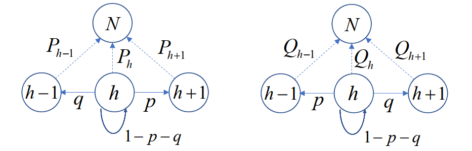

记$P_h$为A从$h$分到$24$分的概率，$Q_h$为B从$h$分到$24$分的概率，显然有初始条件$P_{24}=1$，$P_{0}=0$，$Q_{24}=1$，$Q_{0}=0$。

根据Markov链，我们可以得到如下递推关系：

$$\begin{cases}P_h&=pP_{h+1}+qP_{h-1}+(1-p-q)P_h, &1\leq h\leq 23\\Q_h&=qQ_{h+1}+pQ_{h-1}+(1-p-q)Q_h, &1\leq h\leq 23\end{cases}$$

即

$$\begin{cases}P_h-P_{h+1}&=\frac{q}{p}(P_{h-1}-P_{h}), &1\leq h\leq 23\\Q_h-Q_{h+1}&=\frac{p}{q}(Q_{h-1}-Q_{h}), &1\leq h\leq 23\end{cases}$$

!!! note ""
    $$
    \begin{aligned}
    &\begin{cases}A_0, A_N已知\\A_h-A_{h-1}=r(A_{h-1}-A_{h-2}), 1\leq h\leq N-1\end{cases}\\
    \Rightarrow&
    A_h=\begin{cases}\frac{r^h-r^N}{1-r^N}A_0+\frac{1-r^h}{1-r^N}A_N, r\neq 1\\ \frac{N-h}{N}A_0+\frac{h}{N}A_N, r=1\end{cases}
    \end{aligned}
    $$

所以

$$P_h = \frac{1-(\frac{q}{p})^h}{1-(\frac{q}{p})^{24}},\;\;Q_h = \frac{1-(\frac{p}{q})^h}{1-(\frac{p}{q})^{24}}$$

代入 $h=12$ ，得到

$$P_{12}=\frac{1-(\frac{q}{p})^{12}}{1-(\frac{q}{p})^{24}}=\frac{1-(\frac{15}{27})^{12}}{1-(\frac{15}{27})^{24}}=\frac{1-\frac{5^{12}}{3^{24}}}{1-\frac{5^{24}}{3^{48}}}=\frac{3^{48}-3^{24} 5^{12}}{3^{48}-5^{24}}$$

$$Q_{12}=
\frac{1-(\frac{p}{q})^{12}}{1-(\frac{p}{q})^{24}}
=\frac{1-(\frac{27}{15})^{12}}{1-(\frac{27}{15})^{24}}
=\frac{1-\frac{3^{24}}{5^{12}}}{1-\frac{3^{48}}{5^{24}}}
=\frac{5^{24}-3^{24} 5^{12}}{5^{24}-3^{48}}$$

所以

$$\frac{P_{12}}{Q_{12}}=\frac{3^{48}-3^{24} 5^{12}}{3^{24}5^{12}-5^{24}}=\frac{3^{24}}{5^{12}}=\frac{282429536481}{244140625}$$

显然，A获胜的概率要远大于B获胜的概率。

## 09 秘书问题

!!! question "问题背景"
    $n$位求职者应聘秘书职位，招聘方通过逐个面试予以考察。应聘者的综合能力各不相同，通过面试可给出已面试的应聘者的综合能力大小顺序，且有如下要求。

    - 应聘者以某一顺序接受面试，某个应聘者是否被录用必须在他面试结束后<u>立即决定</u>
    - 若录用，招聘即告结束，不再面试其他应聘者
    - 若不录用，招聘方继续面试下一位应聘者
    - 招聘方不得录用曾作出过不录用决定的应聘者

    提问：招聘方采用何种策略可使招聘到第一名的应聘者的概率最大？

### 问题求解

#### 数学描述与假设

为了更好地分析问题，我们给出以下数学描述：

**绝对名次**：用 $j$ 表示在所有应聘者中居于第 $j$ 名的应聘者，$j$ 为他的绝对名次。第 $i$ 位接受面试的应聘者为 $A_i$，$1\leq A_i\leq n$。$A_i=j$ 表示其绝对名次为 $j$。

但招聘方在面试的过程中是无法知道每位应聘者的绝对名次的，只知道每位应聘者在面试过程中的局部名次，即相对名次。

**相对名次**：设$A_i$ 在前 $i$ 位接受面试的应聘者 $A_1,A_2,\cdots,A_i$ 中综合能力名次排名记为 $y_i$，称为他的相对名次，$1\leq y_i\leq \min\{i,A_i\}$（$y_i$ 不会比绝对名次来的大）。

- 我们记相对名次 $y_i=1$ 的应聘者称为备选者，备选者是不唯一的。

根据问题背景，招聘方只能根据每位应聘者的相对名次进行决策。

对 $1,2,\cdots,n$ 的任一固定排列，应聘者以该排列的顺序面试的概率均为 $\frac{1}{n!}$。

#### 策略 $s$

由于招聘到绝对名次第一的应聘者的必要条件是录用相对名次第一的备选者。

为了尽可能招到第一名，招聘方应采用“从第 $s$ 位应聘者开始，录用首次出现的一名备选者”的策略 $s$ 来决定录用哪位应聘者。

此时，我们就要去选取更好的 $s$ 使得招聘到第一名的概率最大。

##### 特殊情况

假设目前有 $n=4$ 个人，记上方栏为采用的策略$s=1,2,3,4$ 为绝对排名，侧边栏的每个数字代表参与者的绝对排名。我们将其全排列和采用的策略结果列出来：

!!! note ""
    刚开始看的话可能看不懂，我们举 `2314` 的例子：

    - 策略 $1$：从第 $1$ 位开始录用，此时为 `2`
    - 策略 $2$：从第 $2$ 位开始录用，此时由于第二位的`3`不如第一位的`2`，所以继续面试下一个，并录用第三位的`1`
    - 策略 $3$：从第 $3$ 位开始录用，此时由于第三位的`1`是备选者，所以录用第三位的`1`
    - 策略 $4$：从第 $4$ 位开始录用，此时由于第四位的`4`不是备选者，而此时又没有面试者了，所以本次招聘失败。

通过上述分析可知，策略 $2$ 在24种可能顺序中有11次可录用到第一名，为最优策略

!!! note ""
    其实我们通过分析还可以知道，策略 $s$ 就是从第 $s$ 位开始，向后找比前方数字都小的数字，如果找到了就录用，如果没有找到就失败。

记 $p_n(s)$为采用策略 $s$ 录用到第一名的概率。

!!! note ""
    例如，若采用策略 $1$ ，则必录取 $A_1$ ， $p_n(1)=\frac{1}{n}$

为了更好地处理，我们把这个问题分成多个子问题，然后再把子问题的结果合并起来。

记 $p_n^k(s)$ 为采用策略 $s$ 录用 $A_k(k\geq s)$，且 $A_k$ 为第一名的概率。则有

$$p_n(s)=\sum_{k=s}^n p_n^k(s)$$

#### 计算 $p_n^k(s)$

我们考察每一个 $p_n^k(s)$ 。经分析可知：

- $A_s,\cdots,A_{k-1}$ 均不是备选者，否则选不到 $A_k$
- 前 $k-1$ 位应聘者中的最佳者出现在前 $s-1$ 位应聘者中，否则他将先于 $A_k$ 被录用

{width=50%}

##### 组合方法

我们可以通过组合的方法来计算 $p_n^k(s)$ 。

假设目前第一名在 $k$ 位上，我们先选取 $k-1$ 个人，并对其进行排列。因为前 $k-1$ 位应聘者中的最佳者要出现在前 $s-1$ 位应聘者中，所以最佳者的可能位置数为 $s-1$，而其他 $k-2$ 个人没有约束条件，可能位置数为 $(k-1)!$ 。在 $k$ 位之后的人也可以随意排列，其排列数为 $(n-k)!$ 。所以总的可能数有

$$
\begin{aligned}
N &= \begin{pmatrix}n-1\\k-1\end{pmatrix}(s-1)(k-2)!(n-k)!\\
&=\frac{(n-1)!}{(k-1)!(n-k)!}(s-1)(k-2)!(n-k)!\\
&=\frac{(n-1)!}{(k-1)}(s-1)\\
\end{aligned}
$$

由此，我们可以得到 $p_n^k(s)$ 为

$$p_n^k(s)=\frac{N}{n!}=\frac{\frac{(n-1)!}{(k-1)}(s-1)}{n!}=\frac{1}{n}\cdot \frac{s-1}{k-1}$$

##### 概率论方法

我们也可以通过概率论的方法来计算 $p_n^k(s)$ 。

第一名出现在 $k$ 位上的概率为 $\frac{1}{n}$ ，而前 $k-1$ 位应聘者中的最佳者出现在前 $s-1$ 位应聘者中的概率为 $\frac{s-1}{k-1}$ 。所以

$$p_n^k(s)=\frac{1}{n}\cdot \frac{s-1}{k-1}$$

#### 计算 $p_n(s)$

由于 $p_n(s)=\sum_{k=s}^n p_n^k(s)$ ，所以

$$\begin{aligned}
p_n(s)&=\sum_{k=s}^n p_n^k(s)\\
&=\sum_{k=s}^n \frac{1}{n}\cdot \frac{s-1}{k-1}\\
&=\frac{s-1}{n}\cdot \sum_{k=s}^n \frac{1}{k-1}\\
&=\frac{s-1}{n}\cdot \sum_{k=s-1}^{n-1} \frac{1}{k}\\
\end{aligned}$$

我们得到了 $p_n(s)$ 的表达式，由于我们希望用策略 $s$ 来招聘到第一名的概率最大，所以我们需要找到最优的 $s$ 使得 $p_n(s)$ 最大。

#### 最优策略 $s^*$

因为 $p_n(s)$ 是关于 $s$ 的离散数列，所以我们可以通过隔项相减的方法来求出最优策略。

$$
\begin{aligned}
p_n(s)-p_n(s-1)&=\frac{s-1}{n}\cdot \sum_{k=s-1}^{n-1} \frac{1}{k}-\frac{s-2}{n}\cdot \sum_{k=s-2}^{n-1} \frac{1}{k}\\
&=\frac{s-1}{n}\cdot \sum_{k=s-1}^{n-1} \frac{1}{k}-\frac{s-2}{n}\cdot (\frac{1}{s-2}+\sum_{k=s-1}^{n-1} \frac{1}{k})\\
&=\frac{1}{n}\cdot \sum_{k=s-1}^{n-1} \frac{1}{k}-\frac{1}{n}\\
p_n(s)-p_n(s+1)&=\frac{s-1}{n}\cdot \sum_{k=s-1}^{n-1} \frac{1}{k}-\frac{s}{n}\cdot \sum_{k=s}^{n-1} \frac{1}{k}\\
&=\frac{s-1}{n}\cdot (\frac{1}{s-1}+\sum_{k=s}^{n-1} \frac{1}{k})-\frac{s}{n}\cdot \sum_{k=s}^{n-1} \frac{1}{k}\\
&=\frac{1}{n}-\frac{1}{n}\cdot \sum_{k=s}^{n-1} \frac{1}{k}\\
\end{aligned}$$

分析差值，我们记 $s^*$ 为使 $\sum\limits_{k=s}^{n-1} \frac{1}{k} < 1$ 的最小的 $s$ ，则

1. 当 $s\geq s^*$ 时，则$\sum\limits_{k=s}^{n-1} \frac{1}{k} < 1$ ，所以 $p_n(s)-p_n(s+1)=\frac{1}{n}-\frac{1}{n}\cdot \sum\limits_{k=s}^{n-1} \frac{1}{k}>0$ ，所以 $p_n(s^*)>p_n(s^*+1)>\cdots>p_n(n)$
2. 当 $s \leq s^*$ 时，则$\sum\limits_{k=s-1}^{n-1} \frac{1}{k} \geq 1$ （注意，此时的下标为 $s-1$ ，其必然小于 $s^*$ ，所以是 $\geq$ ） ，所以 $p_n(s)-p_n(s-1)=\frac{1}{n}\cdot \sum\limits_{k=s-1}^{n-1} \frac{1}{k}-\frac{1}{n}>0$ ，所以 $p_n(s^*)>p_n(s^*-1)>\cdots>p_n(1)$

所以当 $s=s^*$ 时，$p_n(s)$ 取得最大值，此时的 $s$ 是最优策略。

#### 最优策略的上下界

我们已知

$$
\sum\limits_{k=s^*}^{n-1} \frac{1}{k} < 1\quad \;\; ; \;\; \sum\limits_{k=s^*-1}^{n-1} \frac{1}{k} \geq 1
$$

尝试将其放缩为可以逐项相消求和的形式，我们引入不等式：

$$\int_k^{k+1}\frac{1}{x}dx+\frac{1}{2}(\frac{1}{k}-\frac{1}{k+1})
<\frac{1}{k}<
\int_{k-\frac{1}{2}}^{k+\frac{1}{2}}\frac{1}{x}dx
$$

!!! note "证明不等式"
    左侧不等式：

    $$\int_k^{k+1}\frac{1}{x}dx+\frac{1}{2}(\frac{1}{k}-\frac{1}{k+1})
    <\frac{1}{k}
    $$

    通过下图。 红斜线的表示 $\int_k^{k+1}\frac{1}{x}dx$ ，绿色的表示 $\frac{1}{2}(\frac{1}{k}-\frac{1}{k+1})$ ，红色大框里的就是 $\frac{1}{k}$ 。因为 $\frac{1}{x}$是凸函数，显然有红斜线的面积加上绿色的面积红色大框里的面积小于红色大框里的面积。

    {width=50%}

    右侧不等式：

    这边就不能通过图形来证明了，我们就用最基本的方法来计算：

    要证：

    $$
    \begin{aligned}
    &\frac{1}{k}<\int_{k-\frac{1}{2}}^{k+\frac{1}{2}}\frac{1}{x}dx\;(k\geq 1)\\
    \Leftrightarrow&\frac{1}{k}<\ln(k+\frac{1}{2})-\ln(k-\frac{1}{2})=\ln\frac{2k+1}{2k-1}\\
    (令t=\frac{1}{k}\in (0,1]) \Leftrightarrow&t<\ln\frac{2+t}{2-t}=\ln(\frac{4}{2-t}-1)
    \end{aligned}
    $$

    记 $g(t)=t-\ln(\frac{4}{2-t}-1)$ ，则 $g'(t)=1-\frac{4}{(2-t)^2}\cdot \frac{2-t}{2+t}=\frac{t^2}{t^2-4}<0$ ，所以 $g(t)$ 单调递减，所以 $g(t)<g(0)=0-\ln1=0$ ，所以 $t<\ln\frac{2+t}{2-t}$ ，因此 $\frac{1}{k}<\int_{k-\frac{1}{2}}^{k+\frac{1}{2}}\frac{1}{x}dx$ ，得证。

对$1 \leq \sum\limits_{k=s^*-1}^{n-1}$，有：

$$
\begin{aligned}
1 \leq \sum\limits_{k=s^*-1}^{n-1} \frac{1}{k} &< \sum\limits_{k=s^*-1}^{n-1} \int_{k-\frac{1}{2}}^{k+\frac{1}{2}}\frac{1}{x}dx\\
&=\int_{s^*-\frac{3}{2}}^{n-\frac{1}{2}}\frac{1}{x}dx\\
&=\ln(\frac{2n-1}{2s^*-3})\\
\end{aligned}
$$

我们可以得出 $s^*$ 的上界为 

$$s^*<\frac{1}{e}(n-\frac{1}{2})+\frac{3}{2}$$

对 $1 \leq \sum\limits_{k=s^*}^{n-1}$，有：

$$
\begin{aligned}
1 > \sum\limits_{k=s^*}^{n-1} \frac{1}{k} &> \sum\limits_{k=s^*}^{n-1} \int_{k}^{k+1}\frac{1}{x}dx+\frac{1}{2}(\frac{1}{s^*}-\frac{1}{n})\\
&=\int_{s^*}^{n}\frac{1}{x}dx+\frac{1}{2}(\frac{1}{s^*}-\frac{1}{n})\\
&=\ln(\frac{n}{s^*})+\frac{1}{2}(\frac{1}{s^*}-\frac{1}{n})\\
\Rightarrow e&>\frac{n}{s^*}e^{\frac{1}{2}(\frac{1}{s^*}-\frac{1}{n})}
\\&> \frac{n}{s^*}(1+\frac{1}{2}(\frac{1}{s^*}-\frac{1}{n}))\\
&> \frac{n}{s^*}(1+\frac{1}{2}(\frac{1}{\frac{1}{e}(\frac{1}{n}-\frac{1}{2})+\frac{3}{2}}-\frac{1}{n}))\\
\end{aligned}
$$

所以 $s^*$ 的下界为 

$$s^*>\frac{n}{e}(1+\frac{1}{2}(\frac{1}{\frac{1}{e}(\frac{1}{n}-\frac{1}{2})+\frac{3}{2}}-\frac{1}{n}))=\frac{1}{e}(n-\frac{1}{2})+\frac{1}{2}-\frac{3e-1}{2(2n+3e-1)}$$

综上，我们得到了 $s^*$ 的上下界：

$$\frac{1}{e}(n-\frac{1}{2})+\frac{1}{2}-\frac{3e-1}{2(2n+3e-1)}<s^*<\frac{1}{e}(n-\frac{1}{2})+\frac{3}{2}$$

上下界的差距不超过 $1+\frac{3e-1}{2(2n+3e-1)}\approx 1+\frac{1.79}{n+1.79}$ ，当 $n$ 足够大时，上下界的差距趋近于 $1$ 。

且

$$\lim_{n\to \infty} \frac{s^*}{n}=\frac{1}{e}$$

#### $p_n(s^*)$ 的渐进性质

因为 $p_n(s^*)=\frac{s^*-1}{n}\cdot \sum\limits_{k=s^*-1}^{n-1} \frac{1}{k}$ ，且

$$\ln(\frac{n}{s^*-1})=\int_{s^*-1}^{n}\frac{1}{x}dx<\sum\limits_{k=s^*-1}^{n-1} \frac{1}{k}<\int_{s^*-\frac{1}{2}}^{n-\frac{1}{2}}\frac{1}{x}dx=\ln(\frac{2n-1}{2s^*-1})$$

所以

$$\frac{s^*-1}{n}\cdot \ln(\frac{n}{s^*-1})<\frac{s^*-1}{n}\cdot \sum\limits_{k=s^*-1}^{n-1} \frac{1}{k}<\frac{s^*-1}{n}\cdot \ln(\frac{2n-1}{2s^*-1})$$

因为$\lim\limits_{n\to \infty} \frac{s^*}{n}=\frac{1}{e}$，我们有

$$\lim\limits_{n\to \infty} \frac{s^*-1}{n}\cdot \ln(\frac{n}{s^*-1})=\lim\limits_{n\to \infty} \frac{s^*-1}{n}\cdot \ln(\frac{2n-1}{2s^*-1})=\frac{1}{e}$$

所以$\lim\limits_{n\to \infty} p_n(s^*)=\frac{1}{e}$

### 变式 1 分布不均

!!! question "问题背景"

    如果 $A_i$ 不再是上文的均匀分布，而是另一种已知的分布，那么招聘方录用一位应聘者时，应采用何种策略？

### 变式 2 双保险

!!! question "问题背景"

    招聘方可录用两名应聘者，但对每位应聘者聘用与否的决定仍需在该应聘者面试结束时给出，此时招聘方采用何种策略可使招聘到第一名的应聘者的概率最大？

我们记策略 $(r,s)$ 为：

1. 录用自 $A_r$ 起首次出现的一名备选者
2. 若已录用一人，录用不早于 $A_s$的一名备选者

那么，采用策略 $(r,s)$ 录用到第一名的可能情形

- 第一名是第一个被录用者
- 第一名是第二个被录用者，且第一个被录用者先于 $A_s$
- 第一名是第二个被录用者，且第一个被录用者不早于 $A_s$

### 变式 3 期望策略

!!! question "问题背景"

    招聘方录用一名应聘者，此时招聘方采用何种策略可使录用者的绝对名次的期望值尽可能小？

#### 问题求解

此时就不要求一定要录用备选者了，只要期望值最小即可。

我们记 录用相对名次为 $y_i  = j$ 的应聘者 $A_i$ 情况下，其绝对名次的期望值为

$$E(A_i|y_i=j)=\sum_{k=1}^n k\cdot P(A_i=k|y_i=j)=\sum_{k=1}^n k\cdot \frac{P(A_i=k,y_i=j)}{P(y_i=j)}$$

分析式子中的两个概率：

分母：$P(y_i=j) = \frac{1}{i}$

分子：$P(A_i=k,y_i=j)=P(y_i=j|A_i=k)\cdot P(A_i=k)$

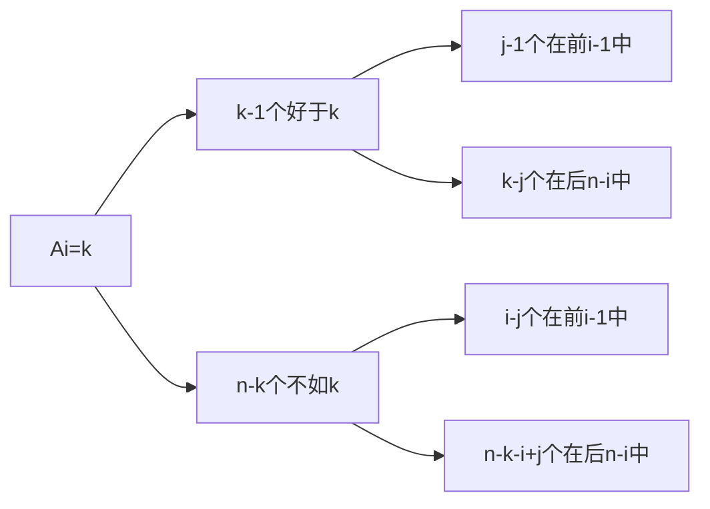

所以在 $A_i = k$ ，$j\leq k$ 的条件下，我们对前 $i-1$ 进行选择，选择$k-1$中的$j-1$个，选择$n-k$中的$i-j$个，即$\begin{pmatrix}k-1\\j-1\end{pmatrix}\begin{pmatrix}n-k\\i-j\end{pmatrix}$种可能。再对前$i-1$个和后$n-i$个分别进行全排列，即$(i-1)!(n-i)!$种可能。而总的可能情况为$(n-1)!$种（我们已经确定了$A_i=k$，只剩下$n-1$个人需要排列）。所以

$$P(y_i=j|A_i=k)=\frac{\begin{pmatrix}k-1\\j-1\end{pmatrix}\begin{pmatrix}n-k\\i-j\end{pmatrix}(i-1)!(n-i)!}{(n-1)!}$$

又$P(A_i=k)=\frac{1}{n}$，所以

$$
\begin{aligned}
P(A_i=k,y_i=j)&=\frac{\begin{pmatrix}k-1\\j-1\end{pmatrix}\begin{pmatrix}n-k\\i-j\end{pmatrix}(i-1)!(n-i)!}{(n-1)!}\cdot \frac{1}{n}\\&= \frac{\begin{pmatrix}k-1\\j-1\end{pmatrix}\begin{pmatrix}n-k\\i-j\end{pmatrix}(i-1)!(n-i)!}{n!}\\
&=\frac{\begin{pmatrix}k-1\\j-1\end{pmatrix}\begin{pmatrix}n-k\\i-j\end{pmatrix}}{i\begin{pmatrix}n\\i\end{pmatrix}}\\
\end{aligned}
$$

如果 $j>k$ ，则 $P(A_i=k,y_i=j)=0$ ，

所以

$$
\begin{aligned}
E(A_i|y_i=j)&=\sum_{k=1}^n k\cdot \frac{P(A_i=k,y_i=j)}{P(y_i=j)}\\
&=\sum_{k=j}^n k\cdot \frac{\begin{pmatrix}k-1\\j-1\end{pmatrix}\begin{pmatrix}n-k\\i-j\end{pmatrix}}{i\begin{pmatrix}n\\i\end{pmatrix}}\cdot i\\
&=\sum_{k=j}^n k\cdot \frac{\begin{pmatrix}k-1\\j-1\end{pmatrix}\begin{pmatrix}n-k\\i-j\end{pmatrix}}{\begin{pmatrix}n\\i\end{pmatrix}}\\
&=\sum_{k=j}^n j\cdot \frac{\begin{pmatrix}k\\j\end{pmatrix}\begin{pmatrix}n-k\\i-j\end{pmatrix}}{\begin{pmatrix}n\\i\end{pmatrix}}\\
&=\frac{j}{\begin{pmatrix}n\\i\end{pmatrix}}\sum_{k=j}^n \begin{pmatrix}k\\j\end{pmatrix}\begin{pmatrix}n-k\\i-j\end{pmatrix}\\
\end{aligned}
$$

!!! note ""
    $$ k \begin{pmatrix}k-1\\j-1\end{pmatrix} = j \begin{pmatrix}k\\j\end{pmatrix} $$

##### 组合恒等式

如何对上式进行化简呢？我们先举一些组合恒等式的例子：

!!! note ""
    $$\begin{aligned}
    &\sum_{k}\binom{r}{k}\binom{s}{n-k}=\binom{r+s}{n},\text{integer }n. \\
    &\sum_{k}\binom{r}{m+k}\binom{s}{n+k}=\binom{r+s}{r-m+n}, \text{integer }m,\text{integer }n,\text{integer }r\geq0.\\
    &\sum_{k}{\binom{r}{k}}{\binom{s+k}{n}}(-1)^{r-k}={\binom{s}{n-r}},\text{integer }n,\text{integer }r\geq0. \\
    &\sum_{k=0}\binom{r-k}{m}\binom{s}{k-t}(-1)^{k-t}=\binom{r-t-s}{r-t-m},\text{integer }t\geq0,\text{ integer }r\geq0,\text{ integer }m\geq0. \\
    &\sum_{k=0}^{r}\binom{r-k}m\binom{s+k}n=\binom{r+s+1}{m+n+1},\text{integer }n\geq\text{integer }s\geq0,\text{ integer }m\geq0,\text{ integer }r\geq0. \\
    &\sum_{k\geq0}\binom{r-tk}k\binom{s-t(n-k)}{n-k}\frac{r}{r-tk}=\binom{r+s-tn}n,\quad\text{integer }n.
    \end{aligned}$$

我们可以用生成函数来解决组合恒等式的问题，例如：

$$
\begin{aligned}
\frac{1}{1-x}&=1+x+x^2+x^3+\cdots=\sum_{l=0}^{\infty}x^l\\
\frac{1}{(1-x)^{p+1}}&=\sum_{l=0}^{\infty}\frac{(l+p)(l+p-1)\cdots(l+1)}{p!}x^l=\sum_{l=0}^{\infty}\binom{l+p}{p}x^l\;\;\quad\text{即上式的p阶导数}\\
\end{aligned}
$$

所以

$$
\begin{aligned}
\frac{1}{(1-x)^{i+2}}&=\frac{1}{(1-x)^{j+1}}\cdot \frac{1}{(1-x)^{i-j+1}}\\
\Rightarrow
\sum_{l=0}^{\infty}\binom{l+i+1}{i+1}x^l&=\sum_{l=0}^{\infty}\binom{l+j}{j}x^l\cdot \sum_{l=0}^{\infty}\binom{l+i-j}{i-j}x^l
\end{aligned}
$$

因为两端的 $x^{n-i}$ 的系数相等，所以

$$\binom{n+1}{i+1}=\sum_{k=0}^{i}\binom{k+j}{j}\binom{n-k-j}{i-j}=
\sum_{k=j}^{i}\binom{k}{j}\binom{n-k}{i-j}$$

##### 期望计算结果

所以

$$
\begin{aligned}
E(A_i|y_i=j)&=\frac{j}{\begin{pmatrix}n\\i\end{pmatrix}}\sum_{k=j}^n \begin{pmatrix}k\\j\end{pmatrix}\begin{pmatrix}n-k\\i-j\end{pmatrix}\\
&=\frac{j}{\begin{pmatrix}n\\i\end{pmatrix}}\binom{n+1}{i+1}\\
&=\frac{n+1}{i+1}j
\end{aligned}
$$

##### 动态规划

令 $U(j,i)$ 为面试相对名次 $y_i=j$ 的 $A_i$ 时可能取得的最优绝对名次期望值。这意味着自首位应聘者面试起，招聘方采用正确决策所能得到的最优绝对名次期望值为 $U(1,1)$ 。

根据 $U$ 之间的关系，我们有如下流程图：

取 

$$U(j,i)=\min \{\frac{n+1}{i+1}j,\frac{1}{i+1}\sum\limits_{k=1}^{i+1}U(k,i+1)\}$$

面试 $A_n$ 时，相对名次即为绝对名次，招聘方必定录用，那么我们有 $U$ 的末端条件$U(j,n)=j$。

!!! note "举个例子"
    有四个人前来面试，他们的绝对名次分别为 $1,2,3,4$（顺序是无所谓的，末端顺序的作用只体现在前一项的“平均”） ，那么我们可以得到如下的表格：

    | $U(j,i)$ | $i=1$ | $i=2$ | $i=3$ | $i=4$ |
    | -------- | ----- | ----- | ----- | ----- |
    | $j=1$    | $\min\{\frac{5}{2}\cdot 1,\frac{15}{8}\}=\frac{15}{8}$   | $\min\{\frac{5}{3}\cdot 1,\frac{25}{12}\}=\frac{5}{3}$   | $\min\{\frac{5}{4}\cdot 1,\frac{5}{2}\}=\frac{5}{4}$   | $4$   |
    | $j=2$    |   | $\min\{\frac{5}{3}\cdot 2,\frac{25}{12}\}=\frac{25}{12}$   | $\min\{\frac{5}{4}\cdot 2,\frac{5}{2}\}=\frac{5}{2}$   | $1$   |
    | $j=3$    |  |    | $\min\{\frac{5}{4}\cdot 3,\frac{5}{2}\}=\frac{5}{2}$   | $3$   |
    | $j=4$    |  |  |   | $2$   |
    | $\frac{1}{i+1}\sum\limits_{k=1}^{i+1}U(k,i+1)$ | $\frac{15}{8}$ | $\frac{25}{12}$ | $\frac{5}{2}$ |  |

    从上表中可以看出，招聘方采用正确决策所能得到的最优绝对名次期望值为 $\frac{15}{8}$ 。

所以，给定 $n$ ，我们就能求出招聘方采用正确决策所能得到的最优绝对名次期望值为 $U(1,1)$ 。

##### 策略

记 $C_i=\frac{1}{i+1}\sum\limits_{k=1}^{i+1}U(k,i+1)$ ，则 $U(j,i)=\min \{\frac{n+1}{i+1}j,C_i\}$ 。

为让 $U(j,i)$ 尽可能小，我们需要让 $\frac{n+1}{i+1}j$ 和 $C_i$ 进行比较，取得小值。所以当 $\frac{n+1}{i+1}j<C_i$ ，即 $j<C_i\cdot \frac{i+1}{n+1}$ 时，我们应该录用 $A_i$ 。否则，继续面试。

此时的策略 $s_i = \lfloor C_i\cdot \frac{i+1}{n+1}\rfloor$ 。

!!! note ""
    动态规划的思想是从末端开始，逐步向前推进，每一步都是最优的。所以我们可以从末端开始，逐步向前推进，每一步都更改策略，且是最优的。

根据每一步的策略，我们可以给出 $C_i$ 的递推式：

$$
\begin{aligned}
C_{i-1}&=\frac{1}{i}\sum_{k=1}^{i}U(k,i)\\&=\frac{1}{i}\sum_{k=1}^{i}\min \{\frac{n+1}{i+1}k,C_i\}\\
&=\frac{1}{i}(\frac{n+1}{i+1}\sum_{k=1}^{s_i}k+\sum_{k=s_i+1}^{i}C_i)\\
&=\frac{1}{i}(\frac{n+1}{i+1}\frac{s_i(s_i+1)}{2}+(i-s_i)C_i)\\
\end{aligned}
$$

尾部条件为 $C_{n-1}=\frac{1}{n}\sum\limits_{k=1}^{n}U(k,n)=\frac{1}{n}\sum\limits_{k=1}^{n}k=\frac{n+1}{2}$

所以我们可以通过递推式来求出 $C_i$ ，然后再求出 $s_i$ ，最后求出 $U(1,1)$ 。

### 变式 4 分布不均的期望策略

!!! question "问题背景"

    如果 $A_i$ 不再是变式3的均匀分布，而是另一种已知的分布，那么招聘方录用一位应聘者时，应采用何种策略使得录用者的绝对名次的期望值尽可能小？

### 问题推广

!!! question "问题背景"

    - 招聘方录用一位应聘者，采用何种策略可使他为第 $k$ 名的概率尽可能大
    - 招聘方录用一位应聘者，采用何种策略可使他为前 $k$ 名的概率尽可能大
    - 招聘方录用 $k$ 位应聘者，采用何种策略可使其中包含第一名的概率尽可能大
    - 应聘者数目为一随机变量

## 10 安全观演

!!! question "问题背景"

    广场某处正在进行一场露天表演，若干人先后到达附近并选择一个地点观看表演。

    - 观众选择地点有如下要求：
        - 与舞台中心的距离不小于 $L$
        - 与之前到达的任一观众的距离不小于 $r$
        - 在满足上述要求的情况下，观众选择与舞台中心距离最近的某个点
    - 观众选择地点的方式有两种：
      - 有引导：观众在工作人员引导下到达满足要求的地点
      - 无引导：观众自行选择满足要求的地点
    
    提问，第 $n$ 个到达的观众与舞台中心的距离 $d_n$ 大概是多少？

    !!! info "题源：阿里巴巴数学竞赛"
        

记舞台中心为 $O$ 。以 $O$ 为圆心，半径为 $L$ 的圆为 $C$，记第 $i$ 个到达的观众为 $A_i$ ，所选位置为 $P_i$ 。以 $P_i$ 为圆心，$r$ 为半径的圆为 $C_i$，我们有

- $d_i = |OP_i|\geq L$
- $P_i$ 不在圆 $C$ 内，也不在圆 $C_1, C_2 \cdots C_{i-1}$内
- $d_1\leq d_2\leq \cdots \leq d_n$，否则若 $d_i > d_{i+1}$，则 $A_i$  到达时可选择 $d_{i+1}$ ，矛盾

{: width="30%"}

### 观演距离上界

观众 $A_n$ 无法选到与点 $O$ 距离小于 $d_n$ 的点，也就是说，以 $O$ 为圆心，半径为 $d_n$ 的园内的所有店均在圆 $C$  或 $C_1, C_2 \cdots C_{n-1}$ 内。因此：

$$
\begin{aligned}
    \pi \cdot d_n^2
    &\leq \pi L^2 + (n-1)\cdot \pi  r^2\\
    \Rightarrow d_n
    &\leq \sqrt{L^2 + (n-1) r^2}
\end{aligned}
$$

!!! note "阿里巴巴 2(1) 上界"

    此时 $r= 1,L = 10$ ，所以 $d_n \leq \sqrt{10^2 + (n-1)1^2}= \sqrt{99 + n }\leq \sqrt{100n} =10\sqrt{n}$

### 观演距离下界

{: width="30%"}

记以 $P_i$ 为圆心，$\frac{r}{2}$ 为半径的圆为 $Q_i$，则 $Q_1, Q_2 \cdots Q_{n-1}$ 两两不相交，且均在以 $O$ 为圆心，半径为 $d_n + \frac{r}{2}$ 的圆内。因此：

$$
\begin{aligned}
    \pi \cdot (d_n + \frac{r}{2})^2
    &\geq n \cdot \pi \cdot (\frac{r}{2})^2\\
    \Rightarrow d_n
    &\geq (\frac{\sqrt{n}}{2} - \frac{1}{2}) \cdot r
\end{aligned}
$$

!!! note "阿里巴巴 2(1) 下界"

    此时 $r= 1,L = 10$ ，所以 $n \geq 2$ 时， $d_n \geq (\frac{\sqrt{n}}{2} - \frac{1}{2}) \cdot 1 \geq \frac{\sqrt{n}}{2} - \frac{2\sqrt{n}}{5}= \frac{\sqrt{n}}{10}$。
    
    $n=1$ 时，$d_1 = 10$，不等式仍然成立。

    所以 2(1) 选B。

### 考虑遮挡

若以 $P_i$ 为圆心，$\rho$ 为半径的圆周与线段 $OP_j$ 相交，则 $A_j$ 会被 $A_i$ 遮挡。如下图所示：

{: width="20%"}

#### 圆周引导 - 无遮人数的上界

如果在工作人员引导下，人们都恰好站在圆周 $C$ 上，即：

{: width="20%"}

此时每个人排在$C$的内接正 $n$ 边形的顶点上，所以 $\theta = \frac{2\pi}{n}$，且 $n$ 需满足下列条件：

$$
\begin{aligned}
|P_iP_{i+1}| &= 2L\cdot \sin \frac{\theta}{2} = 2L\cdot \sin \frac{\pi}{n}\geq r\\
d_{P_i,OP_{i+1}} &= L\cdot \sin \theta = L\cdot \sin \frac{2\pi}{n}\geq \rho
\end{aligned}
$$

#### 最优引导 - 无遮人数的上界

最优的时候就不该是圆周：

{: width="20%"}

$n$ 条线段在点 $C$ 将周角分为 $n$ 个角 $\angle P_{\sigma(i)}O\angle P_{\sigma(i+1)}$，这里 $\sigma(1),\sigma(2),..,\sigma(n)$是1,2,..,n 的一个排列，并记$\sigma(n+1)=\sigma(1)$，则有$\sum\limits_{i=1}^n \angle P_{\sigma(i)}O\angle P_{\sigma(i+1)} = 2\pi$，且：

$$\sin \angle P_{\sigma(i)}O\angle P_{\sigma(i+1)} \geq \frac{\rho}{2}(\frac{1}{d_{\sigma(i)}}+\frac{1}{d_{\sigma(i+1)}})$$

!!! note ""
    否则，不妨设$d_{\sigma(i)} \leq d_{\sigma(i+1)}$，则

    $$d_{\sigma(i)}\sin \angle P_{\sigma(i)}O\angle P_{\sigma(i+1)} < d_{\sigma(i)}\frac{\rho}{2}(\frac{1}{d_{\sigma(i)}}+\frac{1}{d_{\sigma(i+1)}})\leq d_{\sigma(i)}\frac{\rho}{2}\frac{2}{d_{\sigma(i)}}=\rho$$

    将产生遮挡。

所以

$$
\begin{aligned}
2\pi &= \sum\limits_{i=1}^n \angle P_{\sigma(i)}O\angle P_{\sigma(i+1)}\\
&\geq \sum\limits_{i=1}^n \sin \angle P_{\sigma(i)}O\angle P_{\sigma(i+1)}\\
&\geq \frac{\rho}{2}\sum\limits_{i=1}^n (\frac{1}{d_{\sigma(i)}}+\frac{1}{d_{\sigma(i+1)}})\\
&= \rho\sum\limits_{i=1}^n \frac{1}{d_{i}}\\
\end{aligned}
$$

又因为观演距离的上界为 $d_n \leq \sqrt{L^2 + (n-1) r^2}$，所以：

$$
\begin{aligned}
2\pi &\geq \rho\sum\limits_{i=1}^n \frac{1}{d_{i}}\\
&\geq \rho\sum\limits_{i=1}^n \frac{1}{\sqrt{L^2 + (i-1) r^2}}\\
&\geq \rho\sum\limits_{i=1}^n \int_i^{i+1} \frac{dx}{\sqrt{L^2 + (x-1) r^2}}\\
&= \rho\int_1^{n+1} \frac{dx}{\sqrt{L^2 + (x-1) r^2}}\\
&= \frac{2\rho}{r}\int_1^{n+1} \frac{d((\frac{L}{r})^2 + (x-1))}{2\sqrt{(\frac{L}{r})^2 + (x-1)}}\\
&= \frac{2\rho}{r}(\sqrt{(\frac{L}{r})^2 + (n+1-1)}-\sqrt{(\frac{L}{r})^2 + (1-1)})\\
&= \frac{2\rho}{r}(\sqrt{(\frac{L}{r})^2 + n}-\frac{L}{r})\\
\Rightarrow \frac{\pi r}{\rho} + \frac{L}{r} &\geq \sqrt{(\frac{L}{r})^2 + n}\\
\Rightarrow \frac{\pi^2 r^2}{\rho^2} + \frac{2\pi L}{\rho} + \frac{L^2}{r^2} &\geq (\frac{L}{r})^2 + n\\
\Rightarrow n &\leq \frac{\pi^2 r^2}{\rho^2} + \frac{2\pi L}{\rho} \\
\end{aligned}
$$

!!! note "第三行"
    

!!! note "阿里巴巴 2(2) "

    此时 $r= 1,L = 10,\rho= 1/6$ ，所以 $n \leq \frac{\pi^2 r^2}{\rho^2} + \frac{2\pi L}{\rho} = \frac{\pi^2}{1/36} + \frac{2\pi \cdot 10}{1/6} = 36\pi^2 + 120\pi \approx 732.3$。

    所以 2(2) 选B。

## 11 蛛网模型

!!! question "问题背景"

    如何解释某些生产周期较长的商品在失去均衡时发生的不同波动情况？

### 差分方程

设 $y(n)=y_n$，是依赖于整数变量 $n = 0,\pm 1,\pm 2,\cdots$ 的函数，则称$\Delta y(n) = y(n+1)-y(n)$ 为 $y(n)$ 的**一阶差分**，$\Delta^2 y(n) = \Delta[\Delta y(n)] = \Delta y(n+1)-\Delta y(n)$ 为 $y(n)$ 的**二阶差分**，以此类推，$\Delta^k y(n)$ 为 $y(n)$ 的 **$k$ 阶差分**。

含有未知函数的有限差分的方程称为**差分方程**：

$$
F(n,y_n,\Delta y_n,\Delta^2 y_n,\cdots,\Delta^k y_n) = 0
$$

如果将 $\Delta y_n$ 等同于 $y_{n+1}-y_n$，将 $\Delta^2 y_n$ 等同于 $y_{n+2}-2y_{n+1}+y_n$，以此类推，将 $\Delta^k y_n$ 等同于 $y_{n+k}-ky_{n+k-1}+\cdots+(-1)^k y_n$，则上式可写成

$$
F(n,y_n,y_{n+1},\cdots,y_{n+k}) = 0
$$

所以差分方程本质上就是数列的递推。

$m$ 阶线性差分方程表示为：

$$
a_m(n)y_{n+m}+a_{m-1}(n)y_{n+m-1}+\cdots+a_1(n)y_{n+1}+a_0(n)y_n = f_n
$$

- 齐次：$f_n = 0$
- 常系数：$a_i(n) = a_i\; (i=0,1,\cdots,m)$

### 二阶线性常系数齐次差分方程的解

二阶线性常系数齐次差分方程表示为

$$
x_{n+2}+a_1x_{n+1}+a_2x_n = 0
$$

!!! note ""

    若 $x_n = f(n)$是差分方程的解，则 $x_n = cf(n)$ 也是差分方程的解；若 $x_n = f(n)$ 和 $x_n = g(n)$ 都是差分方程的解，则 $x_n = f(n)+g(n)$ 也是差分方程的解。

若 $x_n = \lambda^n$ 是差分方程的解，则

$$ \lambda^{n+2}+a_1\lambda^{n+1}+a_2\lambda^n = 0 $$

即（计算非零解）

$$
\lambda^2+a_1\lambda+a_2 = 0
$$

称为差分方程的**特征方程**，它的根称为差分方程的**特征根**。

若特征方程有两个不同的实根 $\lambda_1$ 和 $\lambda_2$，则 $x_n = c_1\lambda_1^n+c_2\lambda_2^n$ 是差分方程的解。

若特征方程有两个相等的实根 $\lambda$，则 $x_n = c_1\lambda^n+c_2n\lambda^n$ 是差分方程的解。

### 经济学与经济模型

**经济学**是研究人类社会各个发展阶段之各种经济活动、经济关系、经济运行
规律的科学

**经济数学模型**是广泛用于经济研究、经济分析的数学模型。是用数学形式，对经济理论假说进行数量化，以探讨客观经济过程的本质联系及其规律的一种经济研究与管理的工具。

#### 微观经济学

微观经济学通过对个体经济单位的经济行为的分析，说明在现代经济社会中市场机制的运行及其对经济资源的配置

##### 商品、货币与价格

**商品**（commodities）：在社会分工的体系中，经济上相互独立的生产者所生产的、以自己的属性满足人的某种需要、为他人（即为社会）消费、通过交换进入把它当作使用价值的人的手里的劳动产品和服务。

**货币**（money）：在商品交换中逐渐分离出来的固定地充当一般等价物的特殊商品。是价值量发展到一般价值形式的产物。

**价格**（price）：市场经济和商品交换中最常用的范畴，是商品与货币交换的比例，直接表明单位商品交换价值的实际货币量。

##### 需求

一种商品的**需求**是消费者在一定时期内在各种可能的价格水平下，愿意并且能够购买的该商品的数量。

决定需求数量的主要因素有商品的价格、消费者的收入水平、相关商品的价格（最基本的因素）、消费者的偏好、消费者对该商品的价格预期。

**需求函数**表示一种商品的需求数量和影响该需求数量的各种因素之间的相互关系（往往是减函数）

$$Q^d = f(P)$$

其中 $Q^d$ 表示需求数量，$P$ 表示商品的价格。

我们往往用其反函数 $P = f^{-1}(Q^d)$ 来表示需求函数。

{width=50%}

!!! note ""
    - 需求量的变动：其他条件不变，由价格的变动所引起
    - 需求的变动：价格不变，由其他因素变动所引起

##### 供给

一种商品的**供给**是指生产者在一定时期内在各种可能的价格水平下，愿意并且能够提供出售的该商品的数量。

决定供给数量的主要因素有商品的价格、生产的成本、相关商品的价格、生产的技术水平、生产者对未来的价格预期。

**供给函数**表示一种商品的供给量与影响该商品供给量的各种因素之间的相互关系（往往是增函数）

$$Q^s = f(P)$$

其中 $Q^s$ 表示供给数量，$P$ 表示商品的价格。

我们往往用其反函数 $P = f^{-1}(Q^s)$ 来表示供给函数。

{width=50%}

##### 均衡

经济学中的**均衡**指经济系统中变动着的各种力量在相互作用之后所
达到的“平衡”状态，即相对静止状态。如果没有外界扰动因素，这种状态会持续下去。

**均衡价格**是市场上某种商品的需求量和供给量相等时的价格。均衡价格水平下的相等的供求数量称为**均衡数量**。

均衡价格是市场上商品的需求和供给这两种相反力量共同作用的结果，是在市场供求力量自发作用下形成的。一旦市场价格偏离均衡价格，需求量和供给量就会出现不一致的非均衡状态，这种非均衡状态在市场机制的作用下会逐步消失，从而恢复到均衡价格水平。

### 动态模型

#### 静态与动态

静态模型与静态分析：

- 变量没有时间先后的差别
- 变量的调整时间被假设为零
- 考察既定条件下变量相互作用下所呈现的状态

动态模型与动态分析：

- 区分变量在时间上的先后差别
- 研究不同时点上变量之间的相互关系
- 考察不同时点上变量的相互作用在状态形成和变化过程中所起的作用和在时间变化过程中状态的实际变化过程

#### 动态均衡价格模型

对生产周期较长的商品，商品的供给量通常由前一生产周期的价格决定：

$$Q^s_{n} = g(P_{n-1})$$

但需求还是由当前价格决定：

$$Q^d_{n} = f(P_{n})$$

因此，均衡价格模型为：

$$
Q^s_{n} = g(P_{n-1}) = Q^d_{n} = f(P_{n})
$$

!!! note "有如下的情况"

    {: width="50%"}

    {: width="50%"}

上图长得像蛛网，因此称为**蛛网模型**。

### 蛛网模型

**蛛网模型**是研究某些生产周期较长且不宜储存的商品均衡价格的动态稳定性的模型

- 当商品的市场实际价格偏离均衡价格后，在市场机制的作用下，实际价格是否能回到原有的均衡价格水平，即均衡价格是否动态稳定，并考察它所需要具备的条件

记在周期 $n$ 中，某种商品的供求量为 $x_n$，价格为 $y_n$

!!! note ""
    这里的供求量是指周期 $n$ 中的供给量与需求量，此时的供给量是由周期 $n-1$ 的价格决定的，需求量是由周期 $n$ 的价格决定的，设此时二者相等。

- 需求由当前价格决定，有需求函数 $x_n = f(y_n)$，其反函数为 $y_n = h(x_n)$
- 供给由周期 $n-1$ 的价格决定，有供给函数 $x_{n+1} = g(y_n)$
- 均衡点 $(x_0,y_0)$ 满足 $x_0 = g(y_0)$ 和 $y_0 = h(x_0)$，即需求函数与供给函数的交点

假设需求函数与供给函数为线性函数，其过均衡点 $(x_0,y_0)$ 的方程为

$$
y_n-y_0 = -\alpha(x_n-x_0),\quad x_{n+1}-x_0 = \beta(y_n-y_0)
$$

其中，$\alpha$ 是商品需求量减少一个单位时价格的上涨量，$1/\alpha$ 是商品价格上涨一个单位时需求量的减少量。$\beta$ 是商品价格上涨一个单位时（下一周期）供给量的增加量。  

由此可得，递推关系为

$$
x_{n+1} -x_0 = \beta(y_n-y_0) = -\alpha\beta(x_n-x_0)
$$

所以

$$
x_{n}-x_0 = (-\alpha\beta)^{n-1}(x_1-x_0)
$$

所以，数列 $\{x_n\}$ 收敛的充要条件为 $\alpha\beta < 1$。

!!! note ""

    若需求函数 $h$ 或供给函数 $g$ 不为线性函数，可在均衡点附近用线性函数近似，即令 $a = -h'(x_0)$ 与 $b = g'(y_0)$。

#### 均衡的稳定性

当一个均衡价格体系在受到干扰而偏离均衡点时，如果这个体系在市场机制的作用下能回到均衡点，则称这个均衡价格体系是稳定均衡，否则是不稳定均衡。

根据以上分析，均衡价格体系的稳定性取决于 $\alpha\beta$ 的大小，我们可以得到三种情况：

### 改进的蛛网模型

假设商品的供求量由前两个周期的价格决定

- 记需求函数为 $x_n = f(y_n)$，其反函数为 $y_n = h(x_n)$
- 记供给函数为 $x_{n+2} = g_2(y_{n+1},y_n)$
    - 供给函数简化为 $x_{n+2} =g(\frac{y_{n+1}+y_n}{2})$，即供给量由前两个周期的价格的平均值决定
- 均衡点 $(x_0,y_0)$ 满足 $y_0 = h(x_0)$ 和 $x_0 = g(y_0)$

假设需求函数与供给函数为线性函数，其过均衡点 $(x_0,y_0)$ 的方程为

$$
y_n-y_0 = -\alpha(x_n-x_0),\quad x_{n+2}-x_0 = \beta(\frac{y_{n+1}+y_n}{2}-y_0)
$$

则递推关系为

$$
\begin{aligned}
2x_{n+2}-2x_0 &= \beta(y_{n+1}+y_n-2y_0) \\
&= \beta(y_{n+1}-y_0+y_n-y_0) \\
&= \beta(-\alpha(x_{n+1}-x_0)-\alpha(x_n-x_0))
\end{aligned}
$$

记 $z_n = x_n-x_0$，则

$$
2z_{n+2} = -\alpha\beta(z_{n+1}+z_n)
$$

可以发现 $\lim\limits_{n\to\infty}z_n = 0$ 当且仅当 $\lim\limits_{n\to\infty}x_n = x_0$。

#### 通项求解

我们现在得到了差分方程

$$
2z_{n+2} + \alpha\beta z_{n+1} + \alpha\beta z_n = 0
$$

其特征方程为

$$
2\lambda^2 + \alpha\beta\lambda + \alpha\beta = 0
$$

解得

$$
\lambda_1 = \frac{-\alpha\beta+\sqrt{\alpha^2\beta^2-8\alpha\beta}}{4},\quad \lambda_2 = \frac{-\alpha\beta-\sqrt{\alpha^2\beta^2-8\alpha\beta}}{4}
$$

!!! note ""
    - $\lambda_1$ 和 $\lambda_2$ 可以是虚数

要使得 $\lim\limits_{n\to\infty}z_n = 0$，则 $\lambda_1$ 和 $\lambda_2$ 的模都小于 $1$，即

- $\alpha\beta \geq 8$ 时，$\lambda_1$ 和 $\lambda_2$ 都是实数，此时$\lambda_2 = \frac{-\alpha\beta-\sqrt{\alpha^2\beta^2-8\alpha\beta}}{4} < \frac{-\alpha\beta}{4} < -1$，所以不收敛
- $0 < \alpha\beta < 8$ 时，$\lambda_1$ 和 $\lambda_2$ 都是复数，此时 $\lambda_{1,2} = \frac{-\alpha\beta}{4}\pm\frac{\sqrt{8\alpha\beta-\alpha^2\beta^2}}{4}i$，其模 $|\lambda_{1,2}| = \sqrt{(\frac{-\alpha\beta}{4})^2+(\frac{\sqrt{8\alpha\beta-\alpha^2\beta^2}}{4})^2} = \frac{\sqrt{8\alpha\beta}}{4} $。
- 所以当 $0<\alpha\beta<2$ 时，$\lim\limits_{n\to\infty}z_n = 0$，即 $\lim\limits_{n\to\infty}x_n = x_0$，此时均衡价格是稳定的；
- 当 $2<\alpha\beta$ 时，$\lim\limits_{n\to\infty}z_n \neq 0$，即 $\lim\limits_{n\to\infty}x_n \neq x_0$，此时均衡价格是不稳定的。

!!! note ""
    与供给量由前一个周期的价格决定相比，价格体系是稳定均衡的条件有所放宽。

## 12 种群增长模型

!!! question "问题背景"

    一种生物种群的增长过程，可以用一个差分方程来描述。假设种群的增长率与种群数量成正比，且种群的增长受到环境的限制，即种群的增长率随种群数量的增加而减小，那么种群的增长率应该是种群数量的函数。试建立种群增长模型，分析种群的增长规律。

### 生态学概念

**生态学（ecology）**是研究生物与环境及生物与生物之间相互关系的生物学分支学科。其主要研究对象为：

- **种群（population）**：同种生物在一定空间范围内同时生活着所有个体的集群
- **生物群落（biological community）**：生活在一定生境中全部物种及其相互作用、彼此影响所构成的整体
- **生态系统（ecosystem）**：一定空间中的生物群落与其环境组成的系统，其中各成员借助能流和物质循环，形成一个有组织的功能复合体

**种群动态（population dynamics）** 表示种群的消长以及种群消长与种群参数（如出生、死亡、迁入、迁出等）间的数量关系

### 离散单种种群模型

假设现实种群只由一个世代构成，相继世代之间没有重叠，那么每一代的个体数量只与上一代的个体数量有关，这样的种群称为**单种种群（single-species population）**。

记 $x_n$ 为第 $n$ 代个体数量，数列$\{x_n\}$ 满足递推关系式：

$$
x_{n+1} = f(x_n)
$$

#### 指数增长模型

每一代个体繁殖的个体数量与该代个体数量之比是一个常数

$$
\frac{x_{n+1}}{x_n} = r
$$

所以

$$
x_n=r^n x_0
$$

其中，$r$ 为**增长率（growth rate）**，$x_0$ 为初始个体数量

指数增长模型不适于描述较长时期的人口演变过程，但某地一个较短时间内的人口统计数据可能符合指数增长模型

#### Logistic模型

考虑到种群的增长受到环境的限制，即种群的增长率随种群数量的增加而减小，因此，种群的增长率应该是种群数量的函数，即

$$
x_{n+1} = f(x_n) = x_n+r x_n(1-\frac{x_n}{K})
$$

或者

$$
\frac{\Delta x_n}{x_n} = r(1-\frac{x_n}{K})
$$

其中，$K$ 为**环境承载量（carrying capacity）**，$r(\geq -1)$ 为**内禀增长率（innate rate of increase）** 

##### 平衡点

差分方程的平衡点是指满足 $x_{n+1}=x_n$ 的点，即满足 $f(x^*)=x^*$ 的点，其中 $x^*$ 为平衡点。

若只要初始点 $x_0$ 与平衡点 $x^*$ 充分接近，即有 $\lim\limits_{n\to\infty}x_n = x^*$，则称平衡点 $x^*$ **渐近稳定（asymptotically stable）**

渐进稳定的判别：

| |渐进稳定|不稳定|
|:-:|:-:|:-:|
| | $\lvert f'(x^*)\rvert <1$ |$\lvert f'(x^*)\rvert$ >1 |
|$f'(x^*)=1$| $f''(x^*)= 0$ 且 $f'''(x^*)<0$ | $f''(x^*)\neq 0$ 且 $f'''(x^*)>0$ |
|$f'(x^*)= -1$| $-2f'''(x^*)<3(f'''(x^*))^2$ | $-2f'''(x^*)>3(f'''(x^*))^2$ |
|$\cdots$|$\cdots$|$\cdots$|

考察 Logistic模型的渐近稳定性，即考察 $x_{n+1}  = x_n+r x_n(1-\frac{x_n}{K})$ 的平衡点 $x^*$ 的渐近稳定性。取 $f(x)=(1+r)x-\frac{r}{K}x^2$。

$f(x)=x$ 的解为 $x=0$ 和 $x=K$，所以平衡点为 $x_1^*=0$ 和 $x_1^*=K$。

$f'(x)=1+r-\frac{2r}{K}x$，所以 $f'(0)=1+r$，$f'(K)=1-r$。

- 当 $-1\leq r < 0$ 时，$|f'(0)|<1$，$|f'(K)|>1$，所以 $x_1^*=0$ 渐进稳定，$x_1^*=K$ 不稳定
- 当 $0 < r \leq 2$ 时，$|f'(0)|>1$，$|f'(K)|<1$，所以 $x_1^*=0$ 不稳定，$x_1^*=K$ 渐进稳定
- 当 $r > 2$ 时，$|f'(0)|>1$，$|f'(K)|>1$，所以 $x_1^*=0$ 不稳定，$x_1^*=K$ 不稳定

{width=50%}

##### 周期点

$r>2$ 时，我们会得到这样的结果：

差分方程 $x_{n+1} = f(x_n)$ 的周期点是指满足 $f_k(x^*)=x^*$ 的点，其中 $k$ 为正整数，$x^*$ 为 $k$ 周期点。这里 $f_k(x)$可通过
以下方式定义：

$$
f_k(x) = f(f_{k-1}(x)),\quad f_1(x)=f(x)
$$

- 差分方程 $x_{n+1} = f(x_n)$ 的 $k$ 周期点即为差分方程  $x_{n+1} = f_k(x_n)$ 的平衡点，前者的渐进稳定性也由后者决定

#### Logistic模型的 2-周期点

我们有：

$$ f(x) =(1+r)x-\frac{r}{K}x^2$$

且

$$
\begin{aligned}
f_{2}(x)&=f(f(x))=(1+r)\bigg((1+r)x-\frac{r}{K}x^2\bigg)-\frac{r}{K}\bigg((1+r)x-\frac{r}{K}x^2\bigg)^2  \\
&=(1+r)^2x-\frac{r(1+r)(2+r)}Kx^2+\frac{2r^2}{K^2}(1+r)x^3-\frac{r^3}{K^3}x^4 \end{aligned}
$$

因为我们要找的是 2-周期点，所以我们要求解 $x=f_2(x)$，即

$$
\begin{aligned}
 x& =(1+r)^{2}x-\frac{r(1+r)(2+r)}{K}x^{2}+\frac{2r^{2}}{K^{2}}(1+r)x^{3}-\frac{r^{3}}{K^{3}}x^{4}  \\
 &\Rightarrow x\bigg(\frac xK-1\bigg)\bigg(r^2\bigg(\frac xK\bigg)^2-r(r+2)\frac xK+(r+2)\bigg)=0\\
&\Rightarrow x_{+}=\frac{(r+2)+\sqrt{r^{2}-4}}{2r}K,x_{-}=\frac{(r+2)-\sqrt{r^{2}-4}}{2r}K
\end{aligned}
$$

所以，根据2-周期点的性质，我们有$f(f(x_+))=x_+$，两边再作用 $f$，我们有 $f(f(f(x_+)))=f(x_+)$，所以 $f(x_+)$ 也是 2-周期点，又由于我们只有两个 2-周期点，且 $x_+$ 不是平衡点，所以 $f(x_+)=x_-$。同理，我们有 $f(x_-)=x_+$。

##### 稳定性分析

判断 $|f'_2(x)|$ 是否小于 1，即判断 $|f'(x_+)|$ 和 $|f'(x_-)|$ 是否小于 1。

$$
\begin{aligned}
f_{2}^{\prime}\bigl(x_{+}\bigr)& =f'\Big(f\big(x_+\big)\Big)f'\big(x_+\big)  \\
&=f'\bigl(x_-\bigr)f'\bigl(x_+\bigr) \\
&=\left((1+r)-\frac{2r}Kx_-\right)\left((1+r)-\frac{2r}Kx_+\right) \\
&=(1+r)^2-\frac{2r(1+r)}K(x_++x_-)+\frac{4r^2}{K^2}x_+x_- \\
&=(1+r)^2-\frac{2r(1+r)}K\frac{r(r+2)K}{r^2}+\frac{4r^2}{K^2}\frac{(r+2)K^2}{r^2} \\
&=(1+r)^2-2(1+r)(r+2)+4(r+2)\\&=5-r^2
\end{aligned}$$

同理，我们有 $f'_2(x_-)=5-r^2$。

所以，当 $2< r < \sqrt{6}$ 时，$|f'_2(x_+)|<1$，$|f'_2(x_-)|<1$，此时 2-周期点是渐进稳定的。

#### 混沌

##### Li-Yorke 定理

若实数轴一区间到其自身的连续函数，有一个 $3-$周期点，则对任意正整数 $k$ ，$f$ 有一个 $k-$周期点

##### Sharkovsky 定理

任意正整数 $n$ 可唯一表示成 $n=2^s(2p+1)$，其中$s,p \in N$。所有正整数可据此排列，称为 $S$ 型排序。

!!! note ""

    $3,5,7,9,11,\cdots$
    $2\cdot 3,2\cdot 5,2\cdot 7,2\cdot 9,2\cdot 11,\cdots$
    $2^2\cdot 3,2^2\cdot 5,2^2\cdot 7,2^2\cdot 9,2^2\cdot 11,\cdots$
    $\cdots$
    $2^s\cdot 3,2^s\cdot 5,2^s\cdot 7,2^s\cdot 9,2^s\cdot 11,\cdots$
    $\cdots$

若实数轴一区间到其自身的连续函数 $f$ 具有 $k-$周期点，在 $S$ 型排序中，如果 $k$ 在 $m$ 的前面，则必有 $m$ 周期点

## 13 追逐问题

!!! question "问题背景"

    两艘船在平静的海面上相向而行，海盗船的速度为 $v_p$，商船的速度为 $v_m$
    
    1. 两船速度不变。
    2. 海盗船的航向始终指向商船。

    问：海盗船是否能追上商船？追上时，两船的位置分别在哪里？

### 两船速度不变

{width=20%}

若在某一时刻，海盗船与商船位于同一地点 $A(x,y)$，则$\frac{|AO|}{|MO|} = k$，即

$$\frac{\sqrt{x^2+y^2}}{\sqrt{(x-m)^2+y^2}} = k$$

所以 $A$ 的轨迹为圆

$$(x-\frac{k^2m}{k^2-1})^2+y^2 = (\frac{km}{k^2-1})^2$$

!!! note ""
    阿波罗尼奥斯圆

### 两船速率不变，一船方向改变

**商船沿直线**航行，航向垂直于连接商船与海盗船初始位置的直线。在任意时刻，**海盗船的航行方向**为连接商船与海盗船此时位置的直线的方向。

以海盗船初始位置为原点，商船初始位置为 $M(m,0)$，建立直角坐标系，记 $\frac{v_m}{v_p}=r$。设海盗船在与商船相遇前的轨迹为函数 $y=f(x)$，则

{width=20%}

在 $t$ 时刻

- 商船位置 $M_t\left(m,v_mt\right)$，海盗船位置 $P_t\left(x(t),y(t)\right)$
- 连接海盗船与商船当前位置的直线斜率为 $\frac{y-v_mt}{x-m}=f^{\prime}(x)$
    - 直线方程为 $y-v_mt = f'(x)(x - m)$
- 海盗船的轨迹自原点至 $P_t$ 的弧长为 $v_pt=\int_0^x\sqrt{1+{f^\prime}^2(z)}dz$

所以，我们可以得到

$$\frac1{v_p}\int_0^x\sqrt{1+f^{\prime{2}}(z)}dz=t=\frac1{v_m}\left(y-\left(x-m\right)f^{\prime}(x)\right)$$

对两边求导，我们有

$$
\begin{aligned}
\frac1{v_p}\sqrt{1+{f^{\prime}}^2(x)}&=\frac1{v_m}\Big(f^{\prime}(x)-f^{\prime}(x)-\left(x-m\right)f^{\prime\prime}(x)\Big)\\
-\frac{v_m}{v_p}\sqrt{1+{f^{\prime}}^2(x)}&=\left(x-m\right)f^{\prime\prime}(x)\\
\frac{\mathrm{d}f^{\prime}(x)}{\sqrt{1+{f^{\prime}}^2(x)}}&=-\frac r{x-m}\mathrm{d}x \\
\ln\left|f^{\prime}(x)+\sqrt{1+f^{\prime2}(x)}\right\|_{0}^{x}&=-r\ln\left|x-m|\right|_{0}^{x}\\
\quad\Rightarrow\ln\left|f^{\prime}(x)+\sqrt{1+f^{\prime2}(x)}\right|&=-r\ln\left|1-\frac{x}{m}\right| \\
\quad\Rightarrow f^{\prime}(x)+\sqrt{1+f^{\prime2}(x)}&=\left(1-\frac{x}{m}\right)^{-r} \\
\end{aligned}
$$

对两边取倒数，我们有

$$
\begin{cases}
 f^{\prime}(x)+\sqrt{1+f^{\prime2}(x)}&=\left(1-\frac{x}{m}\right)^{-r}\\
    f^{\prime}(x)-\sqrt{1+f^{\prime2}(x)}&=\left(1-\frac{x}{m}\right)^{r}
\end{cases}
$$

所以

$$
f^{\prime}(x)=\frac12\left(\left(1-\frac{x}{m}\right)^{-r}-\left(1-\frac{x}{m}\right)^{r}\right)
$$

对两边积分，我们有

$$
f(x)=\frac{rm}{1-r^2}+\frac{m-x}2{\left(\frac1{1+r}\left(1-\frac xm\right)^r-\frac1{1-r}{\left(1-\frac xm\right)^{-r}}\right)}
$$  

所以追上时的纵坐标为

$$
f(m)=\frac{rm}{1-r^2}
$$

#### 同类问题

## 14 最速降线问题

!!! question "问题背景"

    给定垂直平面上两点 $A,B$，一质点以何路径从 $A$ 运动到 $B$，可使运动时间最短？

### 直线下降

{width=30%}

就是斜坡下滑问题，有

$$\frac{1}{2}g\cos\theta T^2 = l$$

所以

$$T = \sqrt{\frac{2l}{g\cos\theta}}=\sqrt{\frac{2\sqrt{x_B^2+y_B^2}}{g\frac{y_B}{\sqrt{x_B^2+y_B^2}}}}=\sqrt{\frac{2(x_B^2+y_B^2)}{gy_B}}$$

如果用常微分方程来解，我们有

### 圆弧下降

### 最速降线

#### 光

##### Fermat 原理

光线在两点之间传播的路径是使得两点之间的传播时间最短的路径。

##### Snell 定律

$$\frac{\sin\theta_1}{\sin\theta_2}=\frac{v_1}{v_2}$$

可由 Fermat 原理 推出。

#### 推导最速降线

将平行于 $x$ 轴的直线视作折射率逐渐减小的不同介质的分界面。

{width=30%}

由 Snell 定律，可知 $\frac{sin\theta}{v}$ 为常数，记

$$\frac{\sin \theta}{v}=C$$

因为

$$\sin \theta = \cos \phi = \frac{1}{\sqrt{1+\tan^2\phi}}= \frac{1}{\sqrt{1+y'^2}}$$

$$\frac12mv^2 = mgy \Rightarrow v = \sqrt{2gy}$$

所以

$$
\begin{aligned}
\frac{\sin \theta}{v} = \frac{1}{\sqrt{1+y'^2}}\frac{1}{\sqrt{2gy}} &= C\\
\Rightarrow y' &= \sqrt{\frac{1-2gCy}{2gCy}}\triangleq\sqrt{\frac{C_2-y}{y}}\\
\Rightarrow \sqrt{\frac{y}{C_2-y}}dy &= dx\\
\text{令}y=C_2\sin^2\beta&\text{，有}\\
2C_2\sin^2\beta d\beta &= dx\\
\Rightarrow dx &= C_2(1-cos2\beta)d\beta \\
\end{aligned}
$$

所以

$$
\begin{cases}
x &= R(\gamma-\sin\gamma)\\
y &= R(1-\cos\gamma)
\end{cases}
$$

或者

$$
x=R\arccos\left(1-\frac{y}{R}\right)-\sqrt{y(2R-y)}
$$

### 摆线

实际上，最速降线就是摆线。

### 变分法

求出最速降线的严格做法——变分法。

变分法是研究泛函的极值的方法

{width=80%}

可用 Euler-Lagrange 方程求解。

## 15 种群数量变化模型

### 指数增长模型

我们给出假设：

- 环境承载容量无限，所有个体独立生活，彼此间不存在竞争
- 种群处于封闭（closed）状态，不存在迁入（immigration）和迁出（emigration）
- 记人均出生/死亡/增长率为：$b, \mu, r=b-\mu$
    - 存在常数 $b$ 和 $\mu$，对任意 $t$ ，在自 $t$ 至 $t+\Delta t $内，出生的个体数量为 $bx(t)\Delta t$，死亡的个体数量为 $\mu x(t)\Delta t$
  
所以

$$x(t+\Delta t)-x(t)=(b-\mu)x(t)\Delta t$$

即

$$\frac{x(t+\Delta t)-x(t)}{\Delta t}=rx(t) \Rightarrow \frac{dx}{dt}=rx$$

所以

$$ x(t) = x_0e^{rt}$$

指数增长模型不适于描述较长时期的人口演变过程，但某地一个较短时间内的人口统计数据可能符合指数增长模型.

### Logistic模型

种群人均增长率仅与种群数量有关，且是种群数量的递减函数：

$$\frac{dx}{dt}=rx\left(1-\frac{x}{K}\right)$$

其中 $K$ 为环境承载量，$r$ 为内禀增长率，$x$ 为种群数量

所以

$$x(t)=\frac{Kx_0}{x_0+(K-x_0)e^{-rt}}$$

#### 性质

{width=80%}

- 当 $0<x(0)<K$ 时，种群数量随时间单调递增；当 $x_0>K$ 时，种群数量随时间单调递减；当 $x_0=K$ 时，种群数量保持不变。
- $x(t)$ 在 $t=\frac{1}{2}K$ 时有拐点。
- 当 $r<0$ 时，种群数量随时间单调递减至 $0$；当 $r>0$ 时，种群数量随时间单调递增至 $K$；当 $r=0$ 时，种群数量保持不变。

### 小总结

多数情况下，指数模型与 Logistic 模型并不是基于生物学机理，而是一种经验模型模型及其参数应根据实际数据进行估计和检验

除此之外，还有很多别的模型，如

$$
\begin{aligned}
&\frac{dx}{dt} =rx\ln\frac Kx  \\
& \begin{aligned}\frac{dx}{dt}&=rx\frac{K-x}{K+ax}\end{aligned}  \\
&\frac{dx}{dt}=rx\Bigg(1-\Bigg(\frac{x}{K}\Bigg)^\theta\Bigg) \\
&\frac{dx}{dt}=\left(re^{1-\left(\frac xK\right)}-d\right)x
\end{aligned}
$$

### 自洽系统

对一阶常微分方程 $x'(t)=f(x)$，若 $f(x)$ 不显含变量 $t$，则称该方程为**自洽系统（autonomous system）**。

满足 $f(x_\infty)=0$ 的 $x_\infty$ 称为**平衡点（equilibrium point）**。

对一阶常微分方程 $x'(t)=f(x)$ ，或者 $x(t)$ 无界，或者 $\lim\limits_{t\to\infty}x(t)=x_{\infty}$。但不是所有平衡点均为某个非零解的极限

可用线性化（linearization）方法研究平衡点附近解的性态

### 随机模型

记 $x(t)$ 为 $t$ 时刻一种群个体数量

- $x(t)$ 是一个取非负整数值的随机变量，$\{x(t),t\geq0\}$为一随机过程
- $x(t)$为连续时间齐次 Markov 链

    - $P\{x(t+s)=j\mid x(s)=i,x(u)=x_u,0\leq u<s\}=P\{x(t+s)=j\mid x(s)=i\}$
    - $P\{x(t+s)=j\mid x(s)=i\}$值与 s 无关，记其为 $p_{ij}(t)$

- 设 $x(t)=n$ , 种群在$(t,t+\Delta t)$ 时段内
    - 出生 1 人的概率为 $\lambda_n\Delta t+o\left(\Delta t\right)$
    - 死亡 1 人的概率为 $\mu_n\Delta t+o\left(\Delta t\right)$
    - 出生和死亡事件总发生两次或以上的概率很小，忽略不计

#### 生灭过程

生灭过程

离散状态空间连续时间齐次Markov链称为**生灭过程**(birth-death process),若对充分小的 $\Delta t$ ,

!!! note ""
    $p_{i,j}$表示在$\Delta t$时间内，从状态 $i$ 转移到状态 $j$ 的概率

$\begin{cases}p_{i,i+1}(\Delta t)=\lambda_i\Delta t+o(\Delta t),\quad\lambda_i\geq0,i\geq0\\p_{i,i-1}(\Delta t)=\mu_i\Delta t+o(\Delta t),\quad\mu_i\geq0,i\geq1
\\p_{i,i}\left(\Delta t\right)=1-(\lambda_i+\mu_i)\Delta t+o(\Delta t)\end{cases}\Rightarrow\sum\limits_{|j-i|\geq2}p_{ij}(\Delta t)=o(\Delta t)$

- 纯生过程 (pure birth process) : $\mu_i=0,i\geq0$
- 纯灭过程 (pure death process) : $\lambda_i=0,i\geq0$
- Poisson过程： $\mu_i=0,i\geq0$ , $\lambda_i=\lambda,i\geq0$

### 家族消亡问题

!!! note ""

    - 分支过程（branching process）是用于描述与某一群体繁殖和转换相关的现象的随机过程，其基本假定是个体的繁殖是相互独立的
    -  分支过程可用于描述传染病从极少感染者经过逐级传播到爆发的过程
    -  Fisher和Haldane曾用分支过程研究基因变异后的形成的不利基因通过自然选择在后代中的保留问题

!!! question "问题背景"

    设每位家族成员之多有 $k$ 个后代，有 $i$ 个后代的概率为 $p_i$，什么情况下家族会消亡？

假设：

我们有

记 $x_n$ 为家族在第 $n$ 代的成员数。假设 $x_{0}=1$（此时显然有 $0\leq x_{n}\leq k^{n}$ ）。

记 $p_{j,n}=P\{x_n=j\}$，为家族到了第 $n$ 代，后代个数为 $j$ 的概率。定义 $f_n(x)=\sum\limits_{j=0}^{k^n}p_{j,n}x^j$。记 $p_{j,1}=p_j$， $f_1(x)=f(x)$

显然：

- 若$x_{n-1}=s$，其中第 $i$ 位成员的后代数为 $j_i\in[0,k],i=1,2,\cdots,s$，则有 $x_n=\sum\limits_{i=1}^s j_i$，
- 所以 $p_{j,n}=\sum\limits_{s=0}^{k^{n-1}}(p_{s,n-1}\cdot\sum\limits_{\sum\limits_{i=1}^{s}j_i=j}(p_{j_1}p_{j_2}\cdots p_{j_s}))$，其中 $j_i\in[0,k],i=1,2,\cdots,s$。

将上式代入 $f_n(x)$ 的定义式，得到

$$
\begin{aligned}f_{n}(x)=\sum_{j=0}^{k^{n}}p_{j,n}x^{j}&=\sum_{j=0}^{k^{n}}x^{j}\sum_{s=0}^{k^{n-1}}p_{s,n-1}\sum_{\sum\limits_{i=1}^{s}j_i=j}p_{j_{1}}p_{j_{2}}...p_{j_{s}}\\
&=\sum_{s=0}^{k^{n-1}}p_{s,n-1}\sum_{j=0}^{k^{n}}\sum_{\sum\limits_{i=1}^{s}j_i=j}x^{j}p_{j_{1}}p_{j_{2}}...p_{j_{s}}\\
&=\sum_{s=0}^{k^{n-1}}p_{s,n-1}(\sum_{j_{1}=0}^{k}\sum_{j_{2}=0}^{k}\cdots\sum_{j_{s}=0}^{k}x^{\sum\limits_{i=1}^{s}j_i}p_{j_{1}}p_{j_{2}}...p_{j_{s}})\\
&=\sum_{s=0}^{k^{n-1}}p_{s,n-1}(\sum_{j_{1}=0}^{k}x^{j_{1}}p_{j_{1}})(\sum_{j_{2}=0}^{k}x^{j_{2}}p_{j_{2}})\cdots(\sum_{j_{s}=0}^{k}x^{j_{s}}p_{j_{s}})\\
&=\sum_{s=0}^{k^{n-1}}p_{s,n-1}f_{1}(x)^{s}\\
&=f_{n-1}(f_{1}(x))
\end{aligned}
$$

所以

$$f_{n}(x)=f_{n-1}(f_{1}(x))=f_{n-2}(f_{1}(f_{1}(x)))=\cdots=f(f(\cdots f(x)\cdots))$$

$f_n(x)$ 是 $f(x)$ 的 $n$ 次复合函数。

#### 例子

现在有一个家族，第一代有零个后代的概率为四分之一，有一个后代的概率为二分之一，有两个后代的概率为四分之一。（后代期望为1）

$$f(x)=\frac{1}{4}+\frac{1}{2}x+\frac{1}{4}x^2$$

$$
\begin{aligned}
f(x)=&{\frac{1}{4}}+{\frac{1}{2}}x+{\frac{1}{4}}x^{2} \\
f_{2}(x)=&\frac{25}{64}+\frac{5}{16}x+\frac{7}{32}x^{2}+\frac{3}{16}x^{3}+\frac{1}{64}x^{4} \\
f_3(x)=&\frac{7921}{16384}+\frac{445}{2048}x+\frac{723}{4096}x^2 \\
&+\frac{159}{2048}x^{3}+\frac{267}{8192}x^{4}+\frac{19}{2048}x^{5} \\
&+\frac{11}{4096}x^6+\frac1{2048}x^7+\frac1{16384}x^8 \\
\end{aligned}
$$

不断迭代下去，我们可以得到

$$
\begin{aligned}
&f_1(0)=0.250,f_2(0)=0.391,f_3(0)=0.483 \\
&f_{4}(0)=0.550,f_{5}(0)=0.601,f_{6}(0)=0.641
\end{aligned}
$$

可见，没有后代的概率会越来越大，家族最终会消亡。

同样，对于 $f(x)=\frac{1}{8}+\frac{1}{2}x+\frac{1}{4}x^{2}+\frac{1}{8}x^{3}$，我们可以得到

$$
\begin{aligned}
&f_{1}(0)=0.125,f_{2}(0)=0.192,f_{3}(0)=0.231 \\
&f_{4}(0)=0.255,f_{5}(0)=0.271,f_{6}(0)=0.281
\end{aligned}
$$

#### 期望

第 $n$ 代后代数的期望为

$$E(x_n)=\sum\limits_{j=0}^{k^n}jp_{j,n}=f'_n(1)$$

根据复合函数的性质

$$f'_n(x)=f'_{n-1}(f_1(x))f'_1(x)$$

所以

$$E(x_n)=f'_n(1)=f'_{n-1}(f_1(1))f'_1(1)=f'_{n-1}(1)f'_1(1)=\cdots=f'_1(1)^n$$

#### 消亡概率

记 $\pi_n$ 为第 $n$ 代家族消亡的概率，即 $\pi_n=P\{x_n=0\}$

$$\pi_n=p_{0,n}=f_n(0)=f(f_{n-1}(0))=f(\pi_{n-1})$$

如果家族在第 $n-1$ 代消亡，那么第 $n$ 代也一定消亡，所以 $\pi_{n-1}\leq\pi_n$，又 $\pi_n\leq1$，所以 $\{\pi_n\}$ 单调递增有上界，故 $\lim\limits_{n\to\infty}\pi_n$ 存在，记为 $\pi_\infty$。

$\pi_\infty$ 是方程 $x=f(x)$ 的最小正根。

!!! note "证明"

    1. $\pi_\infty$ 是方程 $x=f(x)$ 的根
    
        由于 $\pi_n=f(\pi_{n-1})$，所以 $\pi_\infty=f(\pi_\infty)$，即 $\pi_\infty$ 是方程 $x=f(x)$ 的根。

    2. $\pi_\infty$ 是方程 $x=f(x)$ 的最小正根

        设另有一个正根 $\pi^*$，由于 $f(x)$ 的单调性，有 $\pi_1=f(0)<f(x_0)=x_0$，所以 $\pi_2=f(\pi_1)<f(x_0)=x_0$，所以 $\pi_3=f(\pi_2)<f(x_0)=x_0$，以此类推，可得 $\pi_n<x_0$。由极限的保号性， $\pi_\infty\leq x_0$。

可以证明，最终消亡概率 $\pi_\infty=1$ 当且仅当 $f'(1)\leq1$。

!!! note "证明"
    

由此，我们知道了家族在什么情况下会消亡。

## 16 传染病模型

### 传染病的基本概念

传染病得以在某一人群中发生和传播，必须具备**传染源**、**传播途径**和**易感人群**三个基本环节

### 基本模型

#### SIR模型

假设疾病传播期内所考察地区总人数保持不变，没有新增人口和因疾病以外的原因造成的死亡。

我们将人群分为三类：

- 易感者（Susceptible）：未得病者，但缺乏免疫力，与感染者接触后会被感染
- 感染者（Infectious）：已经感染病原体的人，可以传播疾病
- 移出者（Removed）：不会再感染疾病，也不会再传播疾病，可能是因为死亡或者获得了免疫力或者被隔离

记 $t$ 时刻易感者、感染者、移出者的人数分别为 $S(t)$、$I(t)$、$R(t)$

##### 接触和移出

- 接触率：记为 $\beta$，表示单位时间内一个感染者与易感者接触的人数
- 移出率：记为 $\alpha$，表示单位时间内一个感染者被移出的人数

单位时间内每人与 $\beta N$ 个人接触，其中 $N$ 为总人数，易感者占比为 $\frac{S(t)}{N}$，所以单位时间内一个感染者接触的易感者人数为 $\beta N \frac{S(t)}{N}=\beta S(t)$，**单位时间内新增感染者数量**为 $\beta S(t)I(t)$。

单位时间内移出感染者数量为 $\alpha I(t)$

此时每个感染者处于感染期的时间服从参数为 $\alpha$ 的指数分布，那么单位时间内移出感染者数量为 $\alpha I(t)$，我们有

{width=50%}

- $P(X\leq t)=1-e^{-\alpha t}$，$E(X)=\frac{1}{\alpha}$
- 感染者经过长度至多为 $t$ 的感染期后被移出的概率为 $P(X\leq t)=1-e^{-\alpha t}$
- 若不计新增感染者，$\frac{I(t)}{I(0)}=e^{-\alpha t}$
- 若不计新增感染者，$\frac{\mathrm{d}I(t)}{\mathrm{d}t}=-\alpha I(t)$

所以我们可以得到微分方程组

$$\begin{cases}
\frac{\mathrm{d}S}{\mathrm{d}t}=-\beta SI\\
\frac{\mathrm{d}I}{\mathrm{d}t}=\beta SI-\alpha I\\
\frac{\mathrm{d}R}{\mathrm{d}t}=\alpha I
\end{cases}$$

!!! note ""
    其中，$\beta$ 和 $\alpha$ 为常数，$S(0)=S_0$，$I(0)=I_0$，$R(0)=R_0$，$S_0+I_0+R_0=N$

我们考察 $S$ 和 $I$ 的关系，有

$$\frac{\mathrm{d}I}{\mathrm{d}S}=\frac{\beta S-\alpha}{-\beta S}=\frac{1}{\frac{\alpha}{\beta}S}-1\triangleq \frac{1}{\sigma S}-1$$

其中，$\sigma=\frac{\beta}{\alpha}$

可以解得

$$I(t)=S_0+I_0-S(t)+\frac{1}{\sigma}\ln\frac{S(t)}{S_0}$$

我们可以得到如下图像：

其中，横坐标为 $S$，纵坐标为 $I$。斜线上的点为 $S_0$ 和 $I_0$，是初始点。上图所述的先增后减，实际上可以理解为疫情的爆发和衰退。

##### $I$ 总会衰减到0吗？

因为 $S(t)\geq 0,\frac{dS}{dt}\leq0$，所以 $S(t)$ 单调递减有下界，$\lim\limits_{t\to\infty}S(t)$存在，记为 $S_\infty$。

因为 $R(t)\leq N,\frac{dR}{dt}\geq0$，所以 $R(t)$ 单调递增有上界，$\lim\limits_{t\to\infty}R(t)$存在，记为 $R_\infty$。

因为 $I(t)=N-S(t)-R(t)$，所以 $\lim\limits_{t\to\infty}I(t)=N-S_\infty-R_\infty=I_\infty$存在。

若 $I_\infty=\epsilon >0$ ，则对充分大的 $t$，$\frac{\mathrm{d}R}{\mathrm{d}t}=\alpha I(t)\geq \alpha \epsilon$，所以 $R(t)\geq \alpha \epsilon t$，$\lim\limits_{t\to\infty}R(t)=\infty$，矛盾。

所以 $I_\infty=0$，即 $I(t)$ 会衰减到0。

!!! note ""
    但是，$I(t)$ 会衰减到0，不代表一定是好事，可能是因为所有人都痊愈了，也可能是因为所有人都寄了。

##### 估计 $\sigma$

{width=50%}

由该图可知，$S_\infty$ 即为 $S_0+I_0-S(t)+\frac{1}{\sigma}\ln\frac{S(t)}{S_0}=0$ 的根

我们可以用 $\sigma \approx \frac{\ln S_0 - \ln S_\infty}{S_0-S_\infty}$ 来估计 $\sigma$。

##### $I(t)$ 的增减性

!!! note ""
    
    $$\begin{cases}
    \frac{\mathrm{d}S}{\mathrm{d}t}=-\beta SI\\
    \frac{\mathrm{d}I}{\mathrm{d}t}=\beta (S-\sigma )I\\
    \frac{\mathrm{d}R}{\mathrm{d}t}=\alpha I
    \end{cases}$$

若 $S_0 > \frac{1}{\sigma}$

-   $\frac{1}{\sigma}<S(t)<S_0$，$\frac{\mathrm{d}I}{\mathrm{d}t}>0$，$I(t)$ 单调递增
-   $S(t)=\frac{1}{\sigma}$，$\frac{\mathrm{d}I}{\mathrm{d}t}=0$，$I(t)$ 达到最大值 $S_0+I_0-\frac{1}{\sigma}(1+\ln\sigma S_0)$
-   $S(t)<\frac{1}{\sigma}$，$\frac{\mathrm{d}I}{\mathrm{d}t}<0$，$I(t)$ 单调递减至0

若 $S_0 \leq \frac{1}{\sigma}$，$I(t)$ 单调递减至0，传染病不会爆发。

##### 基本再生数

将上述增减性的分析应用过来，记 $\mathcal{R}_0=S_0\sigma$，则前文分析情况就对应 $\mathcal{R}_0>1$ 和 $\mathcal{R}_0\leq 1$。

$$\mathcal{R}_0=S_0\sigma=S_0\frac{\beta}{\alpha}=\frac{1}{\alpha}\cdot \beta N \cdot \frac{S_0}{N}$$

- $\frac{1}{\alpha}$：每个感染者感染时间的期望值
- $\beta N$：单位时间内一个感染者接触的人数
- $\frac{S_0}{N}$：易感者占总人数的比例

所以这个式子表示每个感染者在感染期内感染的易感者平均数。

我们称 $\mathcal{R}_0$ 为**基本再生数**。

#### SIS模型

假设疾病传播期内所考察地区总人数保持不变，没有新增人口和因疾病以外的原因造成的死亡。

我们将人群分为两类：

- 易感者（Susceptible）：未得病者，但缺乏免疫力，与感染者接触后会被感染
- 感染者（Infectious）：已经感染病原体的人，可以传播疾病

假设单位时间内每人与 $\beta N$ 个人接触，并使其中的易感者受到感染。单位时间内 $\gamma I(t)$ 个感染者被治愈，重新成为易感者。

!!! note ""
    其中，$\beta$ 和 $\gamma$ 为常数，$S(0)=S_0$，$I(0)=I_0$，$S_0+I_0=N$

我们给出微分方程组

$$\begin{cases}
\frac{\mathrm{d}S}{\mathrm{d}t}=-\beta SI+\gamma I\\
\frac{\mathrm{d}I}{\mathrm{d}t}=\beta SI-\gamma I
\end{cases}$$

所以

$$\frac{\mathrm{d}I}{\mathrm{d}t}=\beta (N-I)I-\gamma I=(\beta N-\gamma-\beta I)I=(\beta N-\gamma)I(1-\frac{\beta}{\beta N-\gamma}I)$$

感觉是不是和 Logistic 模型很像？

!!! note "Logistic 模型"
    $$\frac{\mathrm{d}x}{\mathrm{d}t}=rx\left(1-\frac{x}{K}\right)$$

- 若 $\beta N-\gamma>0$，$\forall I_0\in (0,N)$，$I(t)$ 单调递增趋向于 $N-\frac{\gamma}{\beta}$
- 若 $\beta N-\gamma<0$，$\forall I_0\in (0,N)$，$I(t)$ 单调递减趋向于 $0$

记 $\mathcal{R}_0=\frac{\beta}{\gamma}N$，即当 $\mathcal{R}_0>1$ 时，$I(t)$ 单调递增趋向于 $N-\frac{\gamma}{\beta}$，当 $\mathcal{R}_0<1$ 时，$I(t)$ 单调递减趋向于 $0$。

##### 平衡点

自治系统有两个可能平衡点 $P_1=(N,0)$ 和 $P_2=(\frac{\gamma}{\beta},N-\frac{\gamma}{\beta})$

- 当 $\mathcal{R}_0>1$ 时，$(S(t),I(t))$ 趋向于 $P_1$，人群中不再有感染者
- 当 $\mathcal{R}_0<1$ 时，$(S(t),I(t))$ 趋向于 $P_2$，传染病成为地方性疾病

#### 防控传染病对策

- 减少人群接触，减小 $\beta$ 值
- 提高治疗水平，使感染者尽早治愈，即增大 $\gamma$值
- 在存在移出者 (SIR) 情况下，通过预防免疫办法提高初始移出者 $R_{0}$ 至 $N-\frac{\alpha}{\beta}$

!!! note "为什么是 $N-\frac{\alpha}{\beta}$"
    因为 $\frac{\mathrm{d}I}{\mathrm{d}t}=(\beta S-\alpha) I$，所以我们让未被感染的人群 $S<\frac{\alpha}{\beta}$，这样就可以让 $\frac{\mathrm{d}I}{\mathrm{d}t}<0$，即 $I$ 单调递减，疾病不会爆发。

### Ross疟疾传播模型

!!! note ""
    其实还是 SIS 模型。

疟疾只会在人类和蚊子，或者蚊子和蚊子之间传播，我们做出如下假设：

- 某区域在一段时间内人的数量 $H$ 与（雌性）蚊子的数量 $V$ 保持不变
- 记 $t$ 时刻人群中易感者和感染者数量分别为 $S_h(t)$ 和 $I_h(t)$，蚊子中易感者和感染者数量分别为 $S_v(t)$ 和 $I_v(t)$
- 单位时间内每只蚊子会叮咬 $a$ 个（不同的）人，每个人被 $\tilde{a}$ 只（不同的）蚊子叮咬，$aV=\tilde{a}H$
- 发生叮咬时，从已感染疟疾的人传染给未感染疟疾的蚊子的概率为 $b_h$，从已感染疟疾的蚊子传染给未感染疟疾的人的概率为 $b_v$
- 单位时间内，有数量为 $\gamma_h I_h(t)$ 的已感染疟疾的人康复，数量为 $\gamma_v I_v(t)$ 的已感染疟疾的蚊子康复

通过分析，我们可以得到下图：

{width=50%}

可以得到微分方程组

$$
\begin{cases}\frac{dS_h}{dt}=-ab_h\frac{S_hI_v}H+\gamma_hI_h\\\frac{dI_h}{dt}=ab_h\frac{S_hI_v}H-\gamma_hI_h\\\frac{dS_v}{dt}=-ab_v\frac{S_v I_h}H+\gamma_v I_v\\\frac{dI_v}{dt}=ab_v\frac{S_v I_h}H-\gamma_v I_v&\end{cases}
$$

记

$$\begin{aligned}x(t)&=\frac{I_h(t)}H=1-\frac{S_h(t)}H\\y(t)&=\frac{I_v(t)}V=1-\frac{S_v(t)}V\\m&=\frac{V}{H}\end{aligned}$$

则有

$$
\begin{cases}\dfrac{dx}{dt}=ab_h(1-x)my-\gamma_hx\\\dfrac{dy}{dt}=ab_v x(1-y)-\gamma_v y\end{cases}
$$

#### 平衡点

令 $\frac{dx}{dt}=\frac{dy}{dt}=0$，则可以解得平衡点

$$(0,0),\left(\frac{a^2mb_hb_v-\gamma_h\gamma_v}{ab_v(amb_h+\gamma_h)},\frac{a^2mb_hb_v-\gamma_h\gamma_v}{amb_h(ab_v+\gamma_v)}\right)$$

因为分子决定了平衡点的存在性，我们定义

$$\mathcal{R}_0=\frac{a^2mb_hb_v}{\gamma_h\gamma_v}=\frac{ab_v}{\gamma_h}\cdot \frac{amb_h}{\gamma_h}$$

- 当 $\mathcal{R}_0>1$ 时，平衡点 $(0,0)$ 不稳定，平衡点 $\left(\frac{a^2mb_hb_v-\gamma_h\gamma_v}{ab_v(amb_h+\gamma_h)},\frac{a^2mb_hb_v-\gamma_h\gamma_v}{amb_h(ab_v+\gamma_v)}\right)$ 稳定，疟疾会爆发

## 17 种间关系

!!! question "问题背景"

    我们知道，生物种群之间存在着相互作用关系，比如食饵与捕食者之间的关系，竞争关系等等。那么，两个种群之间的相互作用关系该如何描述？

### Lotka-Volterra 模型

记 $x(t),y(t)$ 分别为 $t$ 时刻食用鱼 (食饵) 和鲨鱼（捕食者）的种群数量。

假设海洋资源丰富，且：

- 食用鱼独立生存时以常数增长率增长；
- 而由于鲨鱼存在，使得食用鱼增长率减少，减少的程度与鲨鱼数量呈正比；
- 鲨鱼缺乏食用鱼时死亡率为常数；
- 食用鱼的存在使鲨鱼死亡率降低，降低的程度与食饵数量呈正比

我们可以列出如下的微分方程：

$$
\begin{cases}
\frac{\mathrm{d}x}{\mathrm{d}t} = (r - ay) x \\
\frac{\mathrm{d}y}{\mathrm{d}t} = (- d +bx)y 
\end{cases}
$$

!!! note ""
    其中，$r,a,d,b$ 为正常数，分别表示食用鱼的原生增长率、鲨鱼捕食食用鱼的能力、鲨鱼死亡率、食用鱼对鲨鱼死亡的抑制能力。

所以，我们可以得到：

$$
\frac{\mathrm{d}y}{\mathrm{d}x} = \frac{(- d +bx)y}{(r - ay) x}
$$

这是一个分式微分方程，我们可以通过分离变量的方法求解：

$$
\begin{aligned}
\frac{\mathrm{d}y}{\mathrm{d}x} &= \frac{(- d +bx)y}{(r - ay) x} \\
\frac{r - ay}{y} \mathrm{d}y &= \frac{- d +bx}{x} \mathrm{d}x \\
\int (\frac{r}{y} - a) \mathrm{d}y &= \int (\frac{- d}{x} + b) \mathrm{d}x \\
r \ln y - ay &= - d \ln x + bx + c \\
(x^d e^{-bx}) (y^r e^{-ay}) &= C 
\end{aligned}
$$

!!! note ""

    - 若 $x(0)=x_0,y(0)=y_0$， 则 $C=(x_0^de^{-bx_0})(y_0^re^{-ay_0})$  

    - 令$f(x)=x^de^{-bx}$，$f(x)$ 在 $x_m=\frac db$ 处取得极大值$f_\mathrm{max}$；令$g(y)=y^re^{-ay}$，$g(y)$ 在$y_m=\frac ra$ 处取得极大值 $g_\mathrm{max}$

        - $f(x)$ 和 $g(y)$ 都是单峰函数，图像如下：

            {width=50%}

    - $0\leq C=f(x)g(y)\leq f_{\max}g_{\max}$，若$C=f_{\max}g_{\max}$，则 $x=x_m,y=y_m$， 相轨线退化为点 $(x_m,y_m)$

给定一些参数，我们可以画出相轨线：

{width=50%}

这是 $C<f_{\max}g_{\max}$ 的情况。

!!! question "为什么相轨线是一个圈？"

    

我们可以通过分析相轨线来分析种群的数量变化：

!!! note ""

    这里的害虫相当于食用鱼，而害虫的天敌相当于鲨鱼。

### 一般双种群模型

一般双种群模型的微分方程为：

$$
\begin{cases}\frac{dx}{dt}=x(a_{10}+a_{11}x+a_{12}y)\\\frac{dy}{dt}=y(a_{20}+a_{21}x+a_{22}y)&\end{cases}
$$

- 记种群 $X,Y$ 的增长率为 $a_{10},a_{20}$

    - $a_{10}>0$ 表示 $X$ 可依靠系统外食物为生 
    - $a_{20}<0$ 表示 $Y$ 必须依赖 $X$ 为食才能生存
- 记种群 $X,Y$ 的密度制约项为 $a_{11},a_{22}$
    - $a_{11}=0$ 表示$X$是非密度制约的
    - $a_{11}<0$ 表示 $X$是密度制约的
- 种间关系
    - 利用 (Exploitation) : $a_{12}<0,a_{21}>0$
        - $X$为食饵，$Y$为捕食者，$X$为寄主，$Y$ 为寄生物
    - 种间竞争 (Interspecific competition) : $a_{12}<0,a_{21}<0$ 
    - 共生 (Mutualism) : $a_{12}>0,a_{21}>0$

## 18 数学规划

### 运筹学

运筹学的主要分支：

- 数学规划（Mathematical Programming）
    - 线性规划（Linear Programming）
    - 非线性规划（Nonlinear Programming）
    - 整数规划（Integer Programming）
    - 多目标规划（Multiobjective Programming）
- 组合优化（Combinatorial Optimization）
- 随机运筹
    - 排队论（Queuing Theory）
    - 库存论（Inventory theory）
    - 可靠性理论（Reliability Theory）
- 博弈论（Game Theory）与决策理论（Decision Theory）

### 数学规划

- 若干个变量在满足一些等式或不等式限制条件下，使目标函数取得最大值或最小值
- 研究问题的数学性质，构造求解问题的方法，实现求解问题的算法，以及将算法应用于实际问题

{width=50%}

!!! note "数学规划分类"

    !!! note "按函数性质"

        - 线性规划（linear programming）
            - 目标函数为线性函数，约束条件为线性等式或不等式
        - 非线性规划（nonlinear programming）
            - 目标函数为非线性函数，或至少有一个约束条件为非线性等式或不等式
                - 二次规划（Quadratic Programming, QP）：目标函数为二次函数，约束条件为线性等式或不等式
                - 带二次约束的二次规划（Quadratically Constrained Quadratic Program， QCQP）：目标函数为二次函数，约束条件为线性或二次等式或不等式
                - 线性分式规划（linear fractional programming）：目标函数为两个线性函数的商，约束条件为线性等式或不等式

    !!! note "按变量性质"
        整数规划（integer programming）：至少有一个决策变量限定取整数值
        - 整数决策变量意义
            - 用于表示只能取离散值的对象的数量
            - 用于表示约束条件之间的逻辑关系或复杂的函数形式
            - 用于表示非数值的优化或可行性问题
        - 特殊整数规划
            - 部分决策变量取整数值的数学规划特称为混合整数规划（Mixed Integer Programming, MIP）
            - 0-1规划：决策变量仅取值0或1的数学规划

    !!! note "按约束条件"
        - 无约束优化
        - 约束优化

#### 数学规划建模的基本要求

- 数学规划模型是问题要求和限制的真实反映
    - 数学规划模型的最优解（可行解）与问题最优解（可行解）是否一致或对应
    - 是否遗漏问题的隐含约束、决策变量的必然要求、多组决策变量间的联系等约束条件
- 数学规划模型应符合数学规划的内容规范和形式要求
    - 要素完整、变量指标运用准确。逻辑关系、集合运算等一般不在数学规划中出现
- 问题可能存在多个数学规划描述，需根据实际情况进行选择和不断完善
    - 复杂目标函数和约束条件的简化， 0-1变量的灵活运用
    - 可行域约简、数学规划的重构、分解与松弛

#### 数学规划建模的适用范围

- 具有简单最优算法或可转化为已知多项式时间可解问题，不需运用数学规划求解
- 最优解不具必要性，或求解时间要求高于精度要求等问题，不宜盲目运用数学规划求解
- 建立数学规划模型困难，因实例规模或问题结构等原因使求解不具现实可能性的问题，不能直接运用数学规划求解

### 食谱问题

也就是说，我们要找到在约束条件下的 $\vec{x}$，使得到 $\min\sum\limits_{i=1}^n c_{i}x_{i}$。（大概是多元线性规划？）

例如：

$$\begin{array}{rl}\min&60x_1+30x_2+20x_3\\s.t.&120x_1+180x_2+160x_3\geq50\\&300x_1+90x_2+30x_3\geq90\\&x_1,x_2,x_3\geq0\end{array}$$

### 运输问题

### 数独

!!! note ""
    $\sum\limits_{k=1}^9kx_{ijk}$ 的值为在这个格子里填的数字。

{width=60%}

### 下料问题

!!! question "问题背景"
    现有 $W$ 米长的钢管若干。生产某产品需长为 $w_i$ 米的短管 $b_i$ 根，$i=1,2,\cdots,n$。如何截取能使材料最省？

我们构造数学规划模型：

决策变量：$x_{ji}$ 表示第 $j$ 根钢管截取第 $i$ 种短管的数量，$i=1,2,\cdots,k$，$j=1,2,\cdots,n$。（$n=\sum\limits_{i=1}^k b_{i}$）

约束条件：

1. 每根钢管截取的短管总长度不超过钢管长度 $W$，即 $\sum\limits_{i=1}^n w_ix_{ji}\leq W$，$j=1,2,\cdots,n$
2. 每种短管截取的数量不低于需求量，即 $\sum\limits_{j=1}^n x_{ji}\geq b_i$，$i=1,2,\cdots,k$

我们的目标是使得截取的钢管最少，即 $\min n$。但这个 $n$ 是出现在求和号上的，在线代的数学规划中我们往往不会直接去求解这个 $n$，而是将其转化。

我们构造一个 0-1变量 $y_j$，表示第 $j$ 根钢管是否被截取，即 $y_j=1$ 表示第 $j$ 根钢管被截取，$y_j=0$ 表示第 $j$ 根钢管未被截取，$j=1,2,\cdots,n$。

所以我们的目标函数可以写成 $\min\sum\limits_{j=1}^n y_j$。

但现在有一个问题：$y_j$ 与 $x_{ji}$ 之间的关系是什么呢？

$$\exists i,x_{ji}>0\rightarrow y_j=1 \Rightarrow \sum\limits_{i=1}^k x_{ji}> 0 \rightarrow y_j=1$$

约束条件1可以写成 $\sum\limits_{i=1}^k w_ix_{ji}\leq Wy_j$，$j=1,2,\cdots,n$。

所以我们有：

$$\begin{array}{rl}\min&\sum\limits_{j=1}^n y_j\\s.t.&\sum\limits_{i=1}^k w_ix_{ji}\leq Wy_j\\&\sum\limits_{j=1}^n x_{ji}\geq b_i\\&x_{ji}\geq0,y_j\in\{0,1\}\end{array}$$

当 $y_j=1\rightarrow \exists i,x_{ji}> 0$。给定目标下，最优解自动满足。

#### 另一种决策变量

同样，这个解法可以用于解决装箱问题。

#### 装箱问题

两个问题实际上是同一个问题，只是描述的方式不同。

装箱问题指的是给定一系列大小已知的物品和若干个容量相同的箱子，如何将物品放入箱子中，使所用箱子数尽可能少。

!!! note ""
    三维的情况往往不使用数学规划，而是使用启发式算法。

### 选址问题

!!! question "问题背景"
    平面上有 $n$ 个点，求一个面积最小的圆，使得这 $n$ 个点都在圆内。

记第 $j$ 个点的坐标为 $(x_j,y_j)$，$j=1,2,\cdots,n$。我们给出一个带二次约束的二次规划模型：

!!! note ""

    **决策变量**：圆心坐标 $(x_0,y_0)$，圆半径 $r$

    **目标函数**：$\min r^2$

    **约束条件**：$(x_j-x_0)^2+(y_j-y_0)^2\leq r^2$，$j=1,2,\cdots,n$

约束为二次时，比较难写，我们可以将其转化成更简单的形式：

!!! note ""

    **决策变量**改为 $\lambda=r^2-(x_0^2+y_0^2)$

    **目标函数**改为 $\min\lambda+(x_0^2+y_0^2)$

    **约束条件**改为 $\lambda+2x_0x_j+2y_0y_j\geq x_j^2+y_j^2$，$j=1,2,\cdots,n$

### 时间分配问题

!!! question "问题背景"
    有 $T$ 天时间可用于安排复习 $n$ 门课程，每天只能复习一门课程，每门课程至少复习一天。用 $t$ 天时间复习第 $j$ 门课程可使该门课程提高 $p_{jt}$ 分。如何制定复习计划可使所有课程提高的总分尽可能大？

!!! note ""

    **决策变量**：$x_{jt}$ 表示第 $j$ 门课程是否复习 $t$ 天，$j=1,2,\cdots,n$，$t=1,2,\cdots,T$

    $$x_{jt}=\left\{\begin{array}{ll}1,&\text{第 $j$ 门课程复习 $t$ 天}\\0,&\text{其他}\end{array}\right.$$

    **目标函数**：$\max\sum\limits_{j=1}^n\sum\limits_{t=1}^Tp_{jt}x_{jt}$

    **约束条件**：$\sum\limits_{t=1}^Tx_{jt}=1$；$\sum\limits_{j=1}^n\sum\limits_{t=1}^Ttx_{jt}\leq T$

## 19 赛程编制

!!! note ""
    - Symmetry and separation(对称性和分离性)
    - Breaks(出现连续的客场或主场比赛--这是我们不愿看到的)
    - The carry-over effect

### 图的因子分解

图 $G$ 的因子分解，指将 $G$ 分解为若干边不重的因子之并——因子指至少包含G的一条边的生成子图。

一个图G的 $n$ 因子，是指图G的 $n$ 度正则因子——正则因子指所有顶点的度数都是 $n$ 的因子。

一个 $K-8$ 完全图的 1 - 因子分解如下（不同颜色的边表示不同的因子）：

{width=50%}

根据因子分解，我们可以给出赛程编制的一种方法：

{width=70%}

同时，我们也可以根据因子分解，给出主客场的安排（尽量不安排连续的客场或主场比赛），例如第一轮和第二轮中：

{width=50%}

根据这条路的开头和结尾，我们给出了主客场的安排。

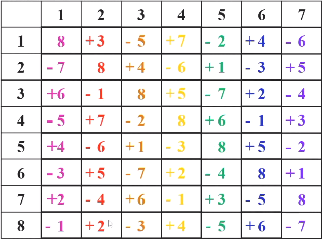{width=70%}

但我们的第八支队伍还没有安排，但无论怎么安排，都会出现breaks：

{width=70%}

这时排出来 6 种break，而这已经是最少的break了，接下来我们给出一般情况下至少有的break数。

### breaks数

对 $n$（偶数）支队伍的赛程，用形如 HAH…HA，长度为 $n-1$（奇数）的字符串表示每支队伍的主客场安排，称为**模式**（pattern）

- 任何两支队伍的模式互不相同

!!! note "单循环赛程"

    $n$ 支队伍的单循环赛程，全程所有队伍总break数至少为 $n-2$
    
    !!! note ""
        因为任意两支队伍的模式是互不相同，而只有HAHA…HAH 和 AHAH…AHA 两种模式没有break，其它模式的break数至少为 $1$，所以总break数至少为 $n-2$

!!! note "镜像双循环赛程"

    $n$ 支队伍的镜像双循环赛程，全程所有队伍总break数至少为 $3n-6$

    1. 若半程没有break，则全程也没有break，这样的队伍至多有两支（HAHAH-AHAHA，AHAHA-HAHAH）
    2. 若半程有且仅有一个break，由于模式字符串长度为奇数，在前后半程之间有一个break（H **A A** H **A - A** **H H** A H），break数为 $3$
    3. 若半程有至少两个break，全程break数至少为 $4$
    
    
    所以总break数至少为 $3(n-2)$

!!! note "$n$（偶数）支队的镜像赛程中的double-round break"

    此时赛程分成多个阶段，我们只考虑每个阶段中的 double-round break。

    因为队伍为偶数支，所以每支队伍的模式字符串长度为奇数。

    - 若半程没有break，则全程也没有break，这样的队伍至多有两支（HAHAH-AHAHA，AHAHA-HAHAH）
    - 若半程至少有1个break，全程至少有2个double-round break（H A | A H |**A - A** | **H H** | A H），根据奇数长度的模式字符串，我们可以得到：
        - 前后半程之间若有break，必为double-round
        - 若前半程的break不为double-round，后半程的break必为double-round
    
    所以总double-round break数至少为 $2(n-2)$

!!! note "其他方案"

    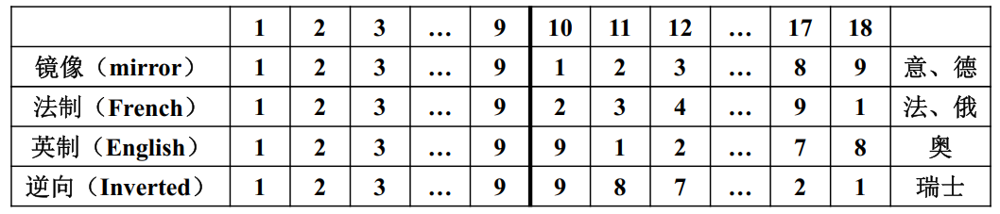

    法制的 break 数可以到 0 ，最终我们采用法制。

### 数学规划

我们来到实际问题：有 $10$ 支队伍，每阶段两场比赛

**决策变量**：$x_{ijk}=\begin{cases}1,&\text{第}k\text{轮第}i\text{支队伍在主场对阵第}j\text{支队伍}\\0,&\text{其他}\end{cases}$

!!! note "例子"
    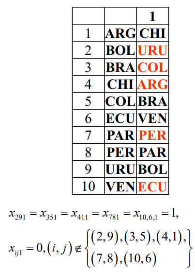{width=50%}

**约束条件（部分）**：

- 每轮各队恰有一场比赛：$\sum\limits_{i=1}^{10} (x_{ijk}+x_{jik})=1$，$j=1,2,\cdots,{10}$，$k=1,2,\cdots,18$
- 任意两队在前后半程各交手一次：$\sum\limits_{k=1}^{18}x_{ijk}=1$，$i,j=1,2,\cdots,10$，$i\neq j$
- 任意两队之间的两场比赛中每队均有一个主场：$\sum\limits_{k=1}^{9}(x_{ijk}+x_{jik})=1$,$\sum\limits_{k={9}}^{18}(x_{ijk}+x_{jik})=1$，$i,j=1,2,\cdots,10$，$i\neq j$
- 任一队不连续与种子队（用 $I_s$ 表示）对阵：$\sum\limits_{j\in I_s}\left(x_{ijk}+x_{jik}+x_{i,j,k+1}+x_{j,i,k+1}\right)\leq1,\mathrm{~}i\in I\setminus I_s,k=1,\cdots,18$

#### 均衡各阶段主场次数

每支队伍各阶段先主后客（先客后主）的次数尽可能均衡：

定义辅助变量 $y_{il}=\begin{cases}1,&\text{第}l\text{阶段第}i\text{支队伍先主后客}\\0,&\text{第}l\text{阶段第}i\text{支队伍先客后主}\end{cases}$

$x_{ijk}$ 与 $y_{il}$ 之间的关系：

$$y_{il}=1\Leftrightarrow\sum\limits_{j=1}^{10}x_{i,j,2l-1}=1\text{且}\sum\limits_{j=1}^{10}x_{j,i,2l}=1$$

改写一下就是：

$$
\begin{cases}\sum\limits_{j=1}^{10}\left(x_{i,j,2l-1}+x_{j,i,2l}\right)\leq1+y_{il}\\y_{il}\leq\sum\limits_{j=1}^{10}x_{i,j,2l-1}\\y_{il}\leq\sum\limits_{j=1}^{10}x_{j,i,2l}\end{cases}
$$

每支队伍先主后客的总次数尽可能均衡时，$4\leq\sum\limits_{l=1}^{9}y_{il}\leq5$，$i=1,2,\cdots,10$

#### 各阶段连续客场的次数尽可能少

在法制双循环赛制中 $x_{i,j,1}=x_{j,i,18}$, $x_{i,j,k}=x_{j,i,k+8}$, $k=2,3,\cdots,9$，$i,j=1,2,\cdots,10$，$i\neq j$

定义辅助变量 $w_{il}=\begin{cases}1,&\text{第}l\text{阶段第}i\text{支队伍两场比赛均为客场}\\0,&\text{其他}\end{cases}$，$i=1,2,\cdots,10$，$l=1,2,\cdots,9$

$x_{i,j,k}$ 与 $w_{il}$ 之间的关系：

$$w_{il}=1\Leftrightarrow\sum\limits_{j=1}^{10}x_{j,i,2l-1}=1 \text{且} \sum\limits_{j=1}^{10}x_{j,i,2l}=1$$

改写一下就是：

$$
\begin{cases}\sum\limits_{j=1}^{10}\left(x_{j,i,2l-1}+x_{j,i,2l}\right)\leq1+w_{il}\\w_{il}\leq\sum\limits_{j=1}^{10}x_{j,i,2l-1}\\w_{il}\leq\sum\limits_{j=1}^{10}x_{j,i,2l}\end{cases}
$$

**目标函数** 为：$\min \sum\limits_{i=1}^{10}\sum\limits_{l=1}^{9}w_{il}$

最后的结果为：

{width=70%}

## 20 支持向量机

!!! note "问题背景"

    将一数据集 $S$ 分为 $C_1,C_2$ 两类，每个数据有 $n$ 个特征。我们应该如何通过训练集来找出一个超平面，使得它判别效果最好？

### 问题描述

我们拟将一数据集 $S$ 分为 $C_1,C_2$ 两类。每个数据有 $n$ 个特征，用 $n$ 维实向量表示，我们有训练集 $S'=\{\mathbf{x}_1,\cdots,\mathbf{x}_m\}$，其中 $\mathbf{x}_i\in \mathbb{R}^n$，记 $y_i=\begin{cases}1, \mathbf{x}_i\in C_1\\-1, \mathbf{x}_i\in C_2\end{cases}$。

假设训练集可线性分离，即存在超平面 $\mathbf{w}\cdot\mathbf{x}+b=0$，使得对于所有 $i$，有 $y_i(\mathbf{w}\cdot\mathbf{x}_i+b)>0$。

!!! note "超平面"

    设 $\mathbf{w}$ 为 $n$ 维实向量，$b$ 为实数，$\mathbf{w}\cdot\mathbf{x}+b=0$ 称为 $\mathbb{R}^n$ 中的超平面。

    - $\mathbb{R}^n$ 中的点 $\mathbf{x}$ 到超平面 $\mathbf{w}\cdot\mathbf{x}+b=0$ 的距离为 $\frac{|\mathbf{w}\cdot\mathbf{x}+b|}{\|\mathbf{w}\|}$。
    - 若 $\mathbf{w} \cdot \mathbf{w} =1$，则距离为 $|\mathbf{w}\cdot\mathbf{x}+b|$。

我们现在要做的是找到一个超平面，使得它到两类数据的距离最大（判别效果最好）。

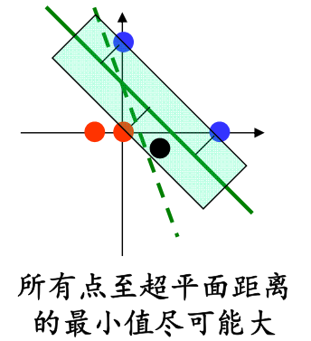{: width="50%"}

### 数学规划

根据上面的描述，我们可以得到如下的数学规划问题：

$$
\begin{aligned}
&\max \min\limits_{i=1,\cdots,m} |\mathbf{w}\cdot\mathbf{x}_i+b|\\s.t.\quad&y_i(\mathbf{w}\cdot\mathbf{x}_i+b)\geq 0,i=1,\cdots,m\\&\|\mathbf{w}\|=1
\end{aligned}
$$

本目标含绝对值与极小值，约束含二次函数，极难计算。我们将绝对值去掉，得到如下的数学规划问题：

$$
\begin{aligned}
&\max \min\limits_{i=1,\cdots,m} y_i(\mathbf{w}\cdot\mathbf{x}_i+b)\\s.t.\quad &\|\mathbf{w}\|=1
\end{aligned}
$$

!!! note "证明可以转换"

    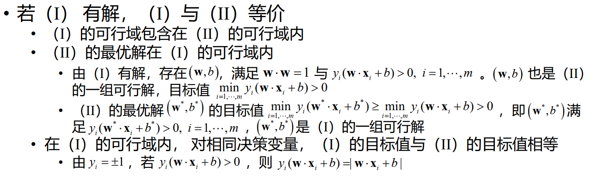

但此时目标含极小值，约束含二次函数，依旧难以计算。我们将极小值去掉，得到如下的数学规划问题：

$$
\begin{aligned}
&\min \|\mathbf{w}\| \\s.t.\quad &y_i(\mathbf{w}\cdot\mathbf{x}_i+b)\geq1
\end{aligned}
$$

!!! note "证明可以转换"

    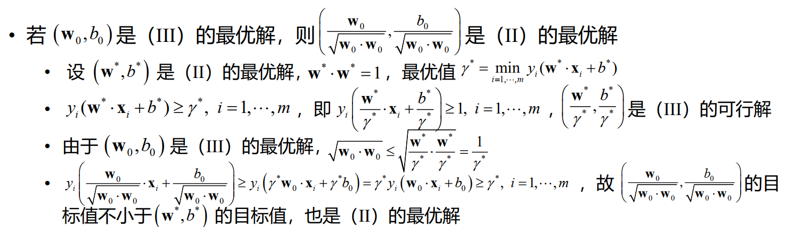

## 21 数学规划求解

### 线性规划

#### 矩阵形式

$$\begin{aligned}
&\min \mathbf{c}\mathbf{x}\\
s.t.\qquad&\mathbf{A}\mathbf{x}=\mathbf{b}\\&\mathbf{x}\geq\mathbf{0}\end{aligned}$$

不妨设系数矩阵 $\mathbf{A}=(a_{ij})_{m\times n} $ 为行满秩矩阵，即 $\text{rank}(\mathbf{A})=m$

- 若 $\text{rank}( \mathbf{A} ) < m$ ,则存在冗余约束 

不妨设 $\mathbf{A}$ 的前 $m$ 列线性无关

-  重排 $\mathbf{A}$ 的列，并相应调整决策变量的顺序

#### 标准型

- 目标函数极小化
- 决策变量取非负值
    - $x_j$ 无限制 $\Leftrightarrow x_j=x_j^+-x_j^-,x_j^+,x_j^-\geq0$
- 所有约束均为等式约束
    - $\mathbf{A}\mathbf{x}\leq\mathbf{b}\Leftrightarrow\mathbf{A}\mathbf{x}+\mathbf{y}=\mathbf{b},\mathbf{y}\geq\mathbf{0}$
    - $\mathbf{A}\mathbf{x}\geq\mathbf{b}\Leftrightarrow\mathbf{A}\mathbf{x}-\mathbf{y}=\mathbf{b},\mathbf{y}\geq\mathbf{0}$
- 等式约束右端均为非负常数

#### 最优解的类型

线性规划有四种最优解的类型：唯一最优解、无穷多最优解、无可行解、无界解（有可行解，但最优值无下界）。

#### 基与基可行解

#### 线性规划基本定理

{width=60%}

- 若线性规划有可行解，必有基本可行解
- 若线性规划有最优解，必有最优基本可行解
    - 线性规划最优解，只需在所有基本可行解中去寻找

#### 求解算法

##### 单纯形法

从一个基本可行解转到另一个基本可行解，并使目标值下降。迭代有限次，找到最优解或判断最优值无界

!!! note ""

    单纯形法是指数时间算法。存在含 $m$ 个变量 $m$ 个约束的线性规划，单纯形法需要进行 $2^m-1$ 次迭代

    实践表明，对多数线性规划问题，单纯形法迭代次数为变量和约束数的多项式函数

##### 多项式时间算法

1979年，Khachiyan给出了求解线性规划的第一个多项式时间算法 —— **椭球算法**。

1984年，Karmarkar给出了实际效果更好的多项式时间算法——**内点法**，产生了深远的影响

### 整数线性规划

#### 分枝定界法

**分枝定界法** 是求解整数规划最常用的算法，算法思想可用于其它离散优化问题的求解。它是一种指数时间算法。

##### 分枝定界法的基本思想

- 用线性规划求解松弛问题，得到松弛问题的最优解
  - 若最优解为整数解，则该整数解为整数规划的最优解
  - 若最优解不是整数解，则将松弛问题的可行域分为两个子可行域，分别求解这两个子问题
- 重复上述过程，直到找到整数解或判断无整数解

!!! example "例子"

    IP: $\min -30x_1-36x_2, s.t.\begin{cases}x_1+x_2\leq 6\\5x_1+9x_2\leq 45\\x_1,x_2\geq 0,x_1,x_2\in\mathbb{Z}\end{cases}$

    我们先求解松弛问题：

    LP: $\min -30x_1-36x_2, s.t.\begin{cases}x_1+x_2\leq 6\\5x_1+9x_2\leq 45\\x_1,x_2\geq 0\end{cases}$

    画图易得，松弛问题的最优解为 $(x_1,x_2)=(\frac{9}{4},\frac{15}{4})$，目标函数值为 $-202.5$

    由于最优解不是整数解，我们将松弛问题的可行域分为两个子可行域：

    $x_1\geq 3,x_1\leq 2$

    !!! note ""
        对于第一个子可行域，我们有：

        IP: $\min -30x_1-36x_2, s.t.\begin{cases}x_1+x_2\leq 6\\5x_1+9x_2\leq 45\\x_1\geq 3\\x_1,x_2\geq 0,x_1,x_2\in\mathbb{Z}\end{cases}$

        LP: $\min -30x_1-36x_2, s.t.\begin{cases}x_1+x_2\leq 6\\5x_1+9x_2\leq 45\\x_1\geq 3\\x_1,x_2\geq 0\end{cases}$

        画图易得，松弛问题的最优解为 $(x_1,x_2)=(3,3)$，目标函数值为 $-198$。此时为整数解，停止迭代。

    !!! note ""
        对于第二个子可行域，我们有：

        IP: $\min -30x_1-36x_2, s.t.\begin{cases}x_1+x_2\leq 6\\5x_1+9x_2\leq 45\\x_1\leq 2\\x_1,x_2\geq 0,x_1,x_2\in\mathbb{Z}\end{cases}$

        LP: $\min -30x_1-36x_2, s.t.\begin{cases}x_1+x_2\leq 6\\5x_1+9x_2\leq 45\\x_1\leq 2\\x_1,x_2\geq 0\end{cases}$

        画图易得，松弛问题的最优解为 $(x_1,x_2)=(2,\frac{35}{9})$，目标函数值为 $-200$，此时 $x_2$ 不是整数，我们将松弛问题的可行域分为两个子可行域：

        $x_2\geq 4,x_2\leq 3$

        !!! note ""
            对于第一个子可行域，我们有：

            IP: $\min -30x_1-36x_2, s.t.\begin{cases}x_1+x_2\leq 6\\5x_1+9x_2\leq 45\\x_1\leq 2\\x_2\geq 4\\x_1,x_2\geq 0,x_1,x_2\in\mathbb{Z}\end{cases}$

            LP: $\min -30x_1-36x_2, s.t.\begin{cases}x_1+x_2\leq 6\\5x_1+9x_2\leq 45\\x_1\leq 2\\x_2\geq 4\\x_1,x_2\geq 0\end{cases}$

            画图易得，松弛问题的最优解为 $(x_1,x_2)=(\frac{5}{9},4)$，目标函数值为 $-198$。此时不为整数解，但是继续做下去，函数值只会更大，所以停止迭代。

        !!! note ""
            对于第二个子可行域，我们有：

            IP: $\min -30x_1-36x_2, s.t.\begin{cases}x_1+x_2\leq 6\\5x_1+9x_2\leq 45\\x_1\leq 2\\x_2\leq 3\\x_1,x_2\geq 0,x_1,x_2\in\mathbb{Z}\end{cases}$

            LP: $\min -30x_1-36x_2, s.t.\begin{cases}x_1+x_2\leq 6\\5x_1+9x_2\leq 45\\x_1\leq 2\\x_2\leq 3\\x_1,x_2\geq 0\end{cases}$

            画图易得，松弛问题的最优解为 $(x_1,x_2)=(2,3)$，目标函数值为 $-168$。此时为整数解，停止迭代。

    所以，整数规划的最优解为 $(x_1,x_2)=(3,3)$，目标函数值为 $-198$。

## 22 多目标规划

### 多目标规划的概念

多目标规划研究变量在满足给定约束条件下，多个可数值化的目标函数同时极小化的问题：

$$
\min f(x)=\begin{pmatrix}f_1(x)\\f_2(x)\\\vdots\\f_m(x)\end{pmatrix},s.t.\mathbf{x}\in S,\quad S = \{\mathbf{x}|\begin{cases}g_i(\mathbf{x})\leq 0,i=1,2,\cdots,s\\h_j(\mathbf{x})=0,j=1,2,\cdots,t\end{cases}\}
$$

### 多目标规划解的类型

**绝对最优解 $S_a$**：在所有可行解中，同时使所有目标函数取得最小值的解

- 对任意 $\mathbf{x}\in S$ ，有 $f_i(\mathbf{x}^*)\geq f_i(\mathbf{x}),i=1,2,\cdots,p$

**Pareto最优解（有效解/非劣解）$S_p$**：

- 不存在 $\mathbf{x}\in S$ ，使得所有 $f_i(\mathbf{x})\leq f_i(\mathbf{x}^*),i=1,2,\cdots,p$ ，且至少有一个 $f_i(\mathbf{x})<f_i(\mathbf{x}^*)$（非严格不等号）

**弱Pareto最优解 $S_{wp}$**：

- 不存在 $\mathbf{x}\in S$ ，使得所有 $f_i(\mathbf{x})< f_i(\mathbf{x}^*),i=1,2,\cdots,p$ （非严格不等号）

#### 解的关系

!!! note "$S_a$ 与 $S_{wp}$ 之间的关系"

    $S_a$ 与 $S_{wp}$ 之间的关系（横坐标为 $x$，纵坐标红线为 $f_1$，蓝线为 $f_2$）：

    

    我们通常将其画为（纵坐标为 $f_1$，横坐标为 $f_2$）：

    

    其中，左下角的交点为 $S_a$ ，绿线为 $S_{wp}$

!!! note "$S_{wp}$ 与 $S_p$ 之间的关系"

    $S_{wp}$ 与 $S_p$ 之间的关系（横坐标为 $x$，纵坐标红线为 $f_1$，蓝线为 $f_2$）：

    

    我们通常将其画为（纵坐标为 $f_1$，横坐标为 $f_2$）：

    

    其中，红线为 $S_{p}$ ，绿线为 $S_{wp}$

可以证明 $S_a\subseteq S_{wp}\subseteq S_p\subseteq S$ 

!!! note "证明"

    - 若 $\mathbf{x}^*\in S_a$，但 $\mathbf{x}^*\notin S_p$，则存在 $\overline{\mathbf{x}}\in S$ 和某个$k$，使得$f_k(\overline{\mathbf{x}})<f_k(\mathbf{x}^*)，f_l(\overline{\mathbf{x}})\leq f_l(\mathbf{x}^*)，l\neq k$，与$\mathbf{x}^*\in S_a$矛盾

    - 若 $\mathbf{x}^*\in S_p$，但 $\mathbf{x}^*\notin S_{wp}$，则存在 $\overline{\mathbf{x}}\in S$，使得$f_k(\overline{\mathbf{x}})<f_k(\mathbf{x}^*),k=1,\cdots,p$，与 $\mathbf{x}^*\in S_p$矛盾。

若 $S_a=S_{wp}$ ，则称 $S_a$ 为**Pareto最优解**，此时 $S_a=S_{wp}=S_p$

### 多目标规划的求解

#### 线性加权和法

#### 主要目标法

#### 理想点法

对任意$k$，取$f_k^0\leq\min_{z\in S}f_k(\mathbf{x})$，$\lambda \in\Lambda=\{\lambda\mid \lambda \geq{0},\sum\limits_{k-1}^p \lambda _ k =1\}$，求解单目标规划 $\quad\left(P_{i}(\alpha)\right)\min\limits_{\mathbf{x}\in S}\left(\sum\limits_{k=1}^{p}\lambda_{k}\left(f_{k}(\mathbf{x})-f_{k}^{0}\right)^{\alpha}\right)^{\frac1\alpha}$

!!! note ""
    在实际情况下，我们可以将 $\lambda$ 取为 $1$，$\alpha$ 取为 $2$

- 对任意 $\alpha\geq1，P_{\lambda}(\alpha)$ 的最优解为弱Pareto最优解
- 若$\lambda_k \equiv \frac1p$，对任意 $\alpha\geq1$，$P_{\lambda}(\alpha)$ 的最优解为Pareto最优解

#### 分层排序法

### 例子：投资组合

采用主要目标法

!!! note "简略版"
    

## 23 组合优化

### 组合优化的基本概念

组合优化是应用于离散对象的，从有限多个可行解中找出使某个目标函数达到最优的解的优化问题

- 组合优化是离散数学（Discrete Mathematics）与最优化的交叉学科分支

### 组合优化与连续优化

!!! note "连续优化"

    

    连续优化是应用于连续对象的，从无限多个可行解中找出使某个目标函数达到最优的解的优化问题

相对决策变量为连续变量的连续优化（Continuous Optimization）问题，组合优化问题的最优解缺少好的性质，求解缺少好的工具

### 组合优化例子

#### 背包问题

##### 连续背包问题

现有 $n$ 件物品，物品 $j$ 的价值为$p_j$,大小为 $w_j$。 物品质地均匀，可任意切割

{width=50%}

##### 离散背包问题

现有 $n$ 件物品，物品 $j$ 的价值为$p_j$,大小为 $w_j$。 物品不可切割

#### 旅行商问题 - TSP

**旅行售货商问题**（TravelingSalesman Problem， TSP）

- 一推销员想在若干个城市中推销自己的产品。计划从某个城市出发，经过每个城市恰好一次，最后回到出发的城市
- 城市之间距离已知
- 如何选择环游路线，使推销员走的路程最短

可行解（环游）

- 每一条环游路线由 $n$ 段两个城市之间的旅行路线连接而成，对应于 $1,2,\cdots,n$ 的一个圆周排列

#### 车辆路径问题 - VRP

#### 指派问题

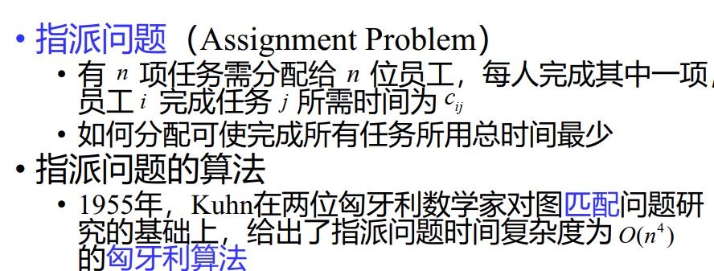

#### 排序问题

### 算法与计算复杂性

#### $P\;v.s.\;NP$ 问题

$P$ 和 $NP$ 问题的通俗解释：

- $P$：有（确定性）多项式时间算法的问题
- $NP$：有非确定性多项式时间算法的问题

!!! note ""
    确定性算法是一种特殊的非确定性算法，故 $P\subseteq NP$

所谓 $P\;v.s.\;NP$ 问题是指 $P=NP$ 还是 $P\subset NP$ ？

!!! note ""
    - $P\;v.s.\;NP$ 问题是数学和计算机科学中的重大未解决难题之一
    - 目前多数人相信 $P\subset NP$。此时背包问题等，不存在多项式时间内求得最优解的算法

#### $NP$ - 完全性理论

**$NP$ – 完全**与 **$NP$ – 难** 的通俗解释：

- $NP – C$：$NP$ 类中最难的问题
    - 若一个 $NP – C$ 问题有多项式时间算法，所有 $NP$ 问题都有多项式时间算法
- $NP – hard$：不比 $NP – C$ 问题容易的问题
    - 在 $P\neq NP$ 假设下， $NP$ - 难 问题不存在多项式时间最优算法

!!! note ""
    $NP – hard$ 可以是 $NP$ 问题，也可以不是 $NP$ 问题

    {width=50%}

在 $P\neq NP$ 假设下，多数组合优化问题分属 $P$ 问题 和 $NP – hard$ 问题

#### NP-完全问题举例

!!! note ""
    线性规划和素性检验问题都是 $P$ 问题

##### SAT 问题

**SAT 问题**（Satisfiability Problem）

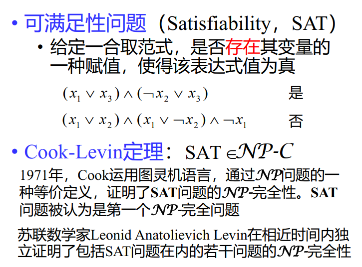{width=50%}

##### 图同构问题（目前还没完全证明）

{width=50%}

### 组合优化的求解

组合优化问题通常不能通过穷举所有可能的解加以比较来求解，因为可行解的数目可能是一很大的数，以致于当前或相当长的一段时间内人力或计算机不能承受

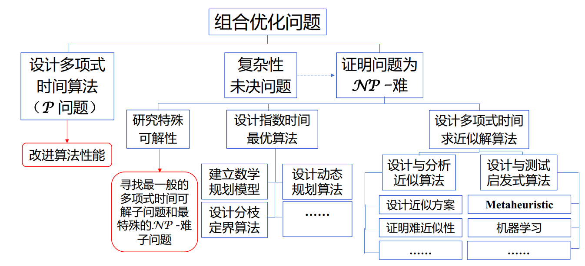

#### 贪心算法

**贪心算法**：在每一次决策时，选择当前可行且最有利的决策

##### 场馆安排问题

贪心算法：按结束时间从小到大的顺序排列最优

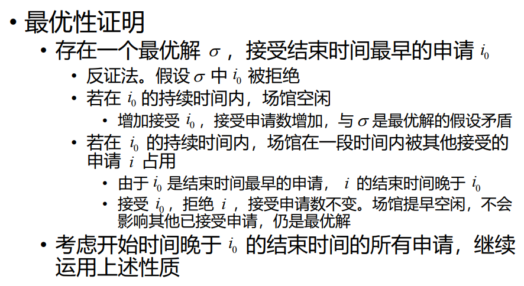

##### 排序悖论

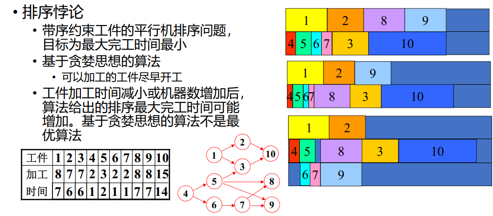

!!! note ""

    右边第二个是所有加工时间-1，第三个是增加一条线。可见，后面两个竟然不如前面的好，这就是贪婪思想的局限性

实际上，这个问题是 $NP$ - 难问题，没有多项式时间算法

#### 动态规划

**动态规划**是求解多阶段决策优化问题的一种数学方法和算法思想

##### 背包问题的动态规划算法

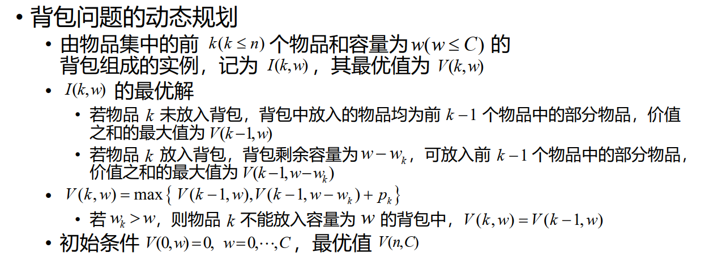

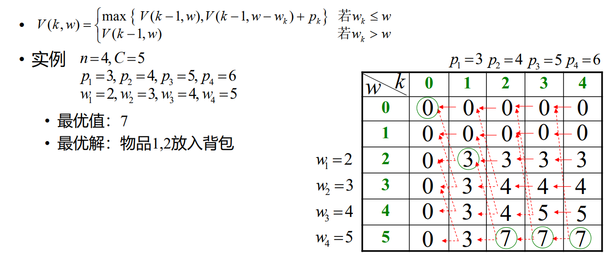

##### 麦子收集

一 $n$ 行 $m$ 列的棋盘，在棋盘的部分格子中各放有一颗麦子

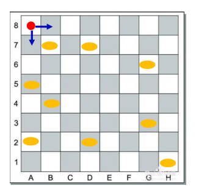{width=50%}

- 一机器人从棋盘左上角的格子出发收集麦子。机器人只能从当前所
在格子向下或向右移动一格，到达放有麦子的格子后，即能收集该
格子中的麦子
- 如何使机器人到达棋盘右下角的格子时，收集的麦子数量尽可能多

我们给出动态规划解法：

#### 启发式算法

**启发式算法**（heuristic）是基于某种直观想法、合理假定，或者借助物理、化学、生命科学中的一些原理而设计的算法，体现了在求解的最优性、精确性与求解资源之间的权衡。启发式算法的有效性一般需通过计算机模拟验证。

!!! note ""
    - 遗传算法（genetic algorithm）
    - 模拟退火算法（simulated annealing）
    - 禁忌搜索（tabu search）
    - 蚁群算法（ant colony optimization）
    - 粒子群优化算法（partial swarm optimization）

##### 元启发式算法

元启发式算法是一种高层次的问题无关的算法框架，它提供了一组指导方针或策略来开发启发式优化算法

#### 近似算法

算法的时间复杂性可通过分析确定（一般要求多项式时间），且算法给出的近似解与最优解目标值之间的差距可通过证明来严格估计

##### 装箱问题

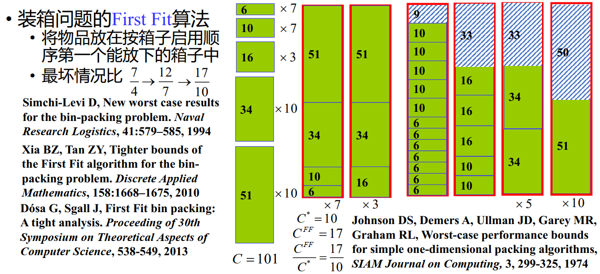

## 24 图论模型

### 图的基本概念

#### 图

**图**是一个有序二元组 $G=(V,E)$，其中 $V$ 是**顶点（vertex）**集合，$E$ 是**边（edge）**的集合。$E$ 中每条边 $e$ 与 $V$ 中两个顶点**关联（incident）**。

- 若与边关联的两个顶点有序，则称图为**有向图（digraph）**，否则称为**无向图**

**度**：无向图 $G$ 中与顶点 $v$ 关联的边的数目称为 $v$ 的度，记为 $d(v)$($deg_G(v)$)

- 图的所有顶点的度的最大值与最小值分别称为最大度和最小度， 记为 $\Delta(G)$ 和 $\delta(G)$
- （握手定理）所有顶点的度之和等于边数的两倍，即 $\sum_{v\in V}d(v)=2|E|$

##### 简单图

两端点相同的边称为**环（loop）**，两端点分别相同的多条边称为**平行边（parallel edges）**

既没有环，也没有平行边的图称为**简单图（simple
graph）**。不是简单图的图称为**多重图（multigraph）**

###### 完全图

任何两个不同顶点之间都有边相连的简单图称为**完全图（complete graph）**

- $n$ 个顶点的完全图记为 $K_n$， $K_n$的边数为 $\frac{n(n-1)}{2}$

###### 简单图的顶点数与边数

- 若 $G=(V,E)$ 为简单图，则边数的上界为 $\frac{|V|(|V|-1)}{2}$，下界为 $|V|-1$
- 边数接近上界的称为**稠密图（dense graph）**，边数远离上界的称为**稀疏图（sparse graph）**

##### 二部图与连通

##### 子图

##### 路

顶点和边交替出现的序列 $v_{i_0}e_{i_1}v_{i_1}e_{i_2}\cdots e_{i_k}v_{i_k}$，且序列中与每条边相邻的两个顶点为该边的两个端点，称为连接顶点 $v_{i_0}$ 和 $v_{i_k}$ 的**途径（walk）**

- 若图为简单图，可省略途径中边的符号

经过边互不相同的途径称为**迹（trail）**

- 起点和终点相同的迹称为闭迹

经过顶点互不相同的途径称为**路（path）**

- 起点和终点相同，其余顶点互不相同，也不与起点和终点相同的途径称为**圈（cycle）**

###### 路的长度

- 边赋权图中一条路所含边的权之和称为它的长度

##### 树

###### 最小生成树

最小生成树（MST）是赋权图所有生成树中总权和最少的生成树

####### Kruskal 算法

##### 最短路

##### 最短连接

给定Euclidean平面上 $n$ 个点，如何用总长度最短的若干条线段将它们连接起来？

用最小生成树解决最短连接问题：构造 $n$ 个顶点的赋权完全图 $K_n$，边的权为它的两个端点的Euclidean距离。问题的解即为 $K_n$ 的最小生成树

###### 最小 Steiner 树

允许增加任意多个Steiner点的最短连接（就是说，可以在原有的点集中增加任意多个点，使得最后的连接线段总长度最短）

{width=50%}

####### Gilbert-Pollak猜想

最小Steiner树长度不小于最小生成树长度的 $\frac{\sqrt{3}}{2}$倍

!!! note ""
    $n=3,4,5,6$ 时，猜想成立

##### Hamilton 圈 与 Hamilton 图

经过图的所有顶点恰好一次的圈称为 **Hamilton圈（Hamiltion cycle）**

存在Hamilton圈的图称为**Hamilton图**

###### Icosian game

一个正十二面体的二十个顶点各代表一个城市，是否有一条从某个城市出发，沿正十二面体的棱行走，经过每个城市恰好一次，最后回到出发城市的路线？

{width=50%}

###### 骑士环游 | Knight’s tour

在 $8\times8$ 国际象棋棋盘上，马能否按其走子规则，从一个格子出发，经过其它格子恰好一次，最后回到起点？

- 构造“跳马图”，每一格子为图的一个顶点，两个格子之间有
边相连当且仅当马可按走子规则从一个格子跳到另一个格子

{width=50%}

推广为 $m\times n$ 棋盘上的骑士环游问题

#### 特殊顶点集

##### 皇后问题

#### 匹配（边集）

##### Hall 定理 与 Frobenius 定理

!!! note ""

    例如：

    

    左图中，$|S|=2 \leq 3=|N(S)|$

    右图中，$|S|=2 \nleq 1=|N(S)|$

    因为二者 左右顶点数不同，所以不能完美匹配

###### Hall定理的等价定理

### 图的问题

#### 选址问题

!!! question "问题背景"

    {width=70%}

##### 无回环情况

!!! note "口诀"
    道路无回环，

    抓各端，
    
    最小的进一站

- 若只有两站，应在产量多的麦田建站

!!! note  "第一步"

    {width=50%}

!!! note  "第二步"

    {width=50%}

- 若①是各端产量最小者，②是①的邻点

    {width=30%}
    - 在①处或①②之间建场，不如在②处建场
    - 若不在①处或①②之间建场， ①的麦子进入麦场必经过②

    {width=50%}

    所以我们说“最小的进一站”，把①的麦子并入②的麦子

!!! note "例子"

    

##### 有回环情况

!!! note "口诀"

    道路有回环，每圈甩一段，

    化为无回环，然后照样算。
    
    甩法有不同，结果一一算，
    
    算后再比较，最优可立断。

例如：

{width=50%}

将圈甩为：

#### 七桥问题

!!! question "问题背景"

    在 Konigsberg 城，有七座桥梁建在 Pregel 河上，是否有一条从城中某处出发，经过每座桥梁恰好一次，最后回到出发点的路线？

##### Euler 图

经过图的所有边恰好一次的闭迹称为 **Euler 回路（Eulerian circuit）**。存在 Euler 回路的图为 **Euler 图（Eulerian graph）**。

一连通图是 Euler 图的充要条件是图中没有奇度顶点。

以河流分割而成的城市区域为顶点，桥梁为边，边的端点为该桥梁连接的两片区域。七桥问题等价于在该图中寻找一条闭迹。

可以证明，七桥问题无解。

#### 中国邮递员问题（Chinese postman problem | CPP）

!!! question "问题背景"

    一个投递员每次上班，要走遍他负责送信的段，然后回到邮局。问应该怎样走才能使所走的路程最短？

- 将邮递员走过的区域建模为赋权图。街道为边，街道交汇
处为顶点，边的权为街道的长度。
- 若赋权图是 Euler 图，任何一条 Euler 回路都是中国邮递员
问题的最优解。
- 若赋权图不是 Euler 图，寻找一条总长度最短的回路，该回
路可能经过某些边两次以上。

#### 着色

##### Ramsey 数

!!! question ""

    （IMO 1964） 17 位科学家中每一位和其余 16 位通信，在他们的通信中所讨论的仅有三个问题，而任两位科学家通信时所讨论的是同一问题，证明至少有三位科学家通信时所讨论的是同一问题。

    

    推广 Ramsey 数到三维，在这题就是 $R(3,3,3)=17$

#### 割

##### 网络流

{width=70%}

#### 算法与复杂性

### 图的应用

#### 搭档方法

#### 获胜队伍

!!! question ""

    一个 $2n$ 个队伍的循环赛持续了 $2n-1$ 天，每天每个队伍都和另一个队伍比赛，每场比赛都有一个队伍获胜，一个队伍失败。在整个比赛中，每个队伍都和其他队伍比赛了一次。我们能不能在每天都选择一个获胜的队伍，而且每个队伍只能被选择一次？

#### 黑白异位

#### 分水问题

!!! question ""

    现有A,B,C三个水瓶，其容积分别为12,8,5升。 A瓶装满水， B,C为空瓶。现欲利用B,C两瓶，将A瓶中的水均分，并使倾倒次数最少

!!! note ""

    好像是列出了所有的情况，然后找到最短的路径。从中间的 $(12,0,0)$ 到左边的 $(6,6,0)$

#### 代表问题

!!! question ""

    某校共有 $m$ 个专业，为调研 $n$ 门课程的教学情况，邀请部分同学参加座谈
    
    - 每门课程有一名同学参加
    - 各门课程邀请的学生各不相同
    - 来自专业 $i$ 的学生数不超过 $a_i$

可以用网络流解决

#### 电缆与管道问题

!!! question ""

    中心配电房位于某幢建筑内，一些主干用户位于其
    他不同的建筑内。为避免相互干扰，中心配电房与
    每个主干用户需有一条专门的电缆相连

    - 电缆需铺设在地下管道内，多条电缆可以共用一条
    地下管道，有些建筑之间的道路可能不允许开挖管
    道
    - 铺设电缆的单位长度费用为 $\gamma$ ，开挖管道的单位长
    度费用为 $\tau$
    - 寻找一种方案，使总费用尽可能少

对电缆来说是最短路问题，对管道来说是最小生成树问题

#### 未来网络 · 寻路

## 25 博弈论

### 博弈论的基本概念

博弈论研究由一些带有**相互竞争性质**的主体所构成的体系的理论。它能以数字表示人的行为或为人的行为建立模式，研究对抗局势中**最优的对抗策略和稳定局势**，以及如何追求各方的最优策略和决定对策的结果，协助人们在一定规则范围内寻求**最合理的行为方式**

!!! note "博弈 vs 优化"

    博弈是多主体，优化是单主体

#### 博弈的要素

- **参与者**（player）：参与博弈的决策主体
- **策略**（strategy）：参与者可以采取的行动方案
- **策略组合**（strategy profile）：所有参与者选择的策略的集合
- **收益**（payoff）：参与者在某一策略组合下的收益
    - **费用**（cost）：参与者在某一策略组合下需付出的代价

#### 博弈论的假设

参与者是理性的，以最大化他的收益或最小化他的费用作为选择策略的准则

#### 博弈的分类

**合作博弈(cooperative game)**：局中人之间可以结成联盟，协调彼此的策略，并对获得的收益进行再分配

**静态博弈(static game)**：所有参与者同时选择策略并行动，且只能行动一次，参与者选择策略时不知道其他参与者的选择。

**完全信息(complete information)**：参与者掌握其他参与者的可选策略和收益等信息

**完美信息(perfect information)**：在动态博弈中，参与者掌握其他参与者已选择的策略

#### 简单例子

##### 囚徒困境（Prisoner's Dilemma）

甲、乙两人共同犯罪，警方掌握了一部分犯罪事实，将他们带到警局分别讯问

- 若两人均承认所有罪行，则各被判处6个月徒刑
- 若一人认罪，一人不认罪，前者被轻判1个月徒刑，后者被重判9个月徒刑
- 若两人均不认罪，则以部分罪行各被判处2个月徒刑

|  | 乙认罪 | 乙不认罪 |
| :---: | :---: | :---: |
| **甲认罪** | 甲6个月，乙6个月 | 甲1个月，乙9个月 |
| **甲不认罪** | 甲9个月，乙1个月 | 甲2个月，乙2个月 |

### Nash 均衡

Nash 均衡（Nash equilibrium）

- （完全信息静态）博弈的某个局势，每一个理性的参与者都不会单独偏离它
    - 对每一个参与者，在其他参与者策略不变情况下，单独采取其他策略，收益不会增加

#### 纯策略与混合策略

**纯策略（pure strategy）**：参与者每次行动都选择某个确定的策略

**混合策略（mixed strategy）**：参与者可以以一定的概率分布选择若干个不同的策略

#### Nash 定理

若参与者有限，每位参与者的策略集均有限，收益函数均为实值函数，则博弈必存在混合策略意义下的 Nash 均衡

#### 最优反应函数

对其他参与者的任一策略组合，参与者的最优反应函数为可使其收益达到最大的策略集合，记为 $B_i(a_{-i})$，即 $B_i(a_{-i})=\{a_i^*|u_i(a_i^*,a_{-i})\geq u_i(a_i^*,a_{-i}), \forall a_i\in A_i\}$

{width=80%}

则充要条件可写为 $\mathbf{a}^*\in \mathscr{B}(\mathbf{a}^*)$

!!! note ""
    如果只有一个的话，那就是 $\mathbf{a}^* =  \mathscr{B}(\mathbf{a}^*)$，我们可以由此想到不动点定理

##### 不动点定理

{width=80%}

#### Nash 均衡的例子

##### Battle of Sexes

♂️：一起看球赛，收益为3；一起逛街，收益为1；各自行动，收益为0

♀️：一起看球赛，收益为1；一起逛街，收益为3；各自行动，收益为0

| (♂️,♀️) | ♂️ 看球赛 | ♂️ 逛街 |
| :---: | :---: | :---: |
| **♀️ 看球赛** | (3,1) | (0,0) |
| **♀️ 逛街** | (0,0) | (1,3) |

可见，双方看球或双方逛街都是均衡状态

##### 鸽鹰博弈（Hawk-Dove Game）

| (A,B) | B:鸽子 | B:鹰 |
| :---: | :---: | :---: |
| **A:鸽子** | (0,0) | (-1,1) |
| **A:鹰** | (1,-1) | (-5,-5) |

可见，一方鹰，另一方鸽子是均衡状态

!!! note ""
    在这里，第一个分量列最大，第二个分量行最大。

##### 石头剪刀布

{width=50%}

不存在 Nash 均衡

##### 让座

##### Braess 悖论

这体现出了 **低效的均衡**（inefficient of Equilibrium）

##### 网络设计博弈

从单个使用者的利益来看，使用者 $i$ 选择道路 $s_i-t$ 是唯一的一个 Nash 均衡，总费用为 $\sum\limits_{i=1}^k \frac1i=O(\ln k)$

### 矩阵博弈

二人零和（zero-sum）有限博弈（完全信息静态博弈）

- 每人的可行策略集为有限集，设甲、乙的策略集分别为 $\{X_1,X_2,\cdots,X_m\}$ 和 $\{Y_1,Y_2,\cdots,Y_n\}$，所有的局势形如 $(X_i,Y_j)$
- 零和：甲的收益为 $a_{ij}$，乙的收益为 $-a_{ij}$

矩阵 $\mathbf{A}=(a_{ij})_{m\times n}$ 称为博弈的收益矩阵

#### 极小极大原则

若甲选择策略 $X_i$，不论乙如何选择，其收益至少为 $\min\limits_{1\leq j\leq n}a_{ij}$。

甲的最佳策略是 $\max\limits_{1\leq i\leq m}\min\limits_{1\leq j\leq n}a_{ij}$（每行最小值的最大值）

乙的最佳策略是 $\min\limits_{1\leq j\leq n}\max\limits_{1\leq i\leq m}a_{ij}$（每列最大值的最小值）

可以证明 $\max\limits_{1\leq i\leq m}\min\limits_{1\leq j\leq n}a_{ij}\leq\min\limits_{1\leq j\leq n}\max\limits_{1\leq i\leq m}a_{ij}$

{width=50%}

如果 $\max\limits_{1\leq i\leq m}\min\limits_{1\leq j\leq n}a_{ij}=\min\limits_{1\leq j\leq n}\max\limits_{1\leq i\leq m}a_{ij}$，其为**鞍点**（saddle point）

- 若 $a_{st}$ 为鞍点，则 $(X_s,Y_t)$ 是博弈的 Nash 均衡
- 若鞍点不存在，则博弈不存在纯策略 Nash 均衡
    - 例如石头剪刀布：$\begin{pmatrix}0&-1&1\\1&0&-1\\-1&1&0\end{pmatrix}$ 不存在鞍点，所以不存在纯策略 Nash 均衡

#### 混合策略与期望收益

##### von Neumann 极小极大定理

### 数理经济学

#### Cournot 模型

#### Stackelberg 模型

##### Cournot vs Stackelberg

#### Bertrand 模型

!!! note ""
    Bertrand 认为 Cournot 模型中的假设不合理，因为他认为价格是市场的决定因素，而不是产量

{width=50%}

##### Cournot vs Bertrand

Cournot 模型与Bertrand 模型

- Bertrand 模型的均衡价格低于 Cournot 模型的均衡价格
- Cournot 模型以产量为策略变量， Bertrand 模型以价格为策略变量
- Cournot 模型与 Bertrand 模型基于不同的假设，适用于不同的市场环境，也存在各自的局限性

### 稳定婚姻问题

- 每位男士都选择他最钟爱的女士
- 如果有女士被两位或者以上的男士选择，则这几
位男士中除了她最喜欢的之外，对其他男士都表
示拒绝
- 被拒绝的那些男士转而考虑他（们）的除被拒绝
之外的最满意女士。如果存在冲突（包括和之前
选择某女士的男士发生冲突），则再由相应的女
士决定拒绝哪些男士
- 以上过程持续进行，直至不再出现冲突为止

{width=50%}

#### 推广 - 稳定室友问题

!!! note ""
    关系变多了~

{width=50%}

### 合作博弈

#### 讨价还价

!!! question ""

    两人协商分配一笔总额为1万元的资金，约定如果达成协议，双方可以按协议取走各自应得的部分；若未达成协议，则两人分文不得，资金收归他用。

{width=60%}

!!! note "证明存在唯一性"

    

!!! note "证明满足公理"

    

!!! note "最优解的性质"

    

    

#### 破产清偿

##### 两人 - CG问题 | Contested Garment

两人财产争议（CG问题）

- 甲方声称拥有某物品全部产权，乙方声称拥有该物品一半产权
    - 双方对该物品的一半产权属于甲方均无异议，对另一半产权双方均认为属于自己
- 双方各获得争议部分产权的一半，无异议部分归属甲方
- 甲方获得该物品产权的四分之三，乙方获得四分之一

!!! note "推广"
    

    !!! note ""
        右侧引入容器，两个容器中水平面等高，细管内忽略不计。可以以此列出各个情况。

##### $n$ 人 - 破产清偿

!!! note ""

    **CG性质**：将任意两位债权人所得的还款额之和按CG问题的解重新分配，每位债权人所得的还款额保持不变

    **CG问题的解**：两组连通容器中水平面等高

!!! note "存在性唯一性证明"
    !!! note "存在性"
        - 向 $n$ 组连通容器中注水，所有容器的水平面等高，即得一组解
        - 任取两组容器，断开与其他各组容器的连接，将注入其中的水取出重注，注入每组容器中的水量不变

    !!! note "唯一性"
        - 对任一满足CG性质的解，将各组容器断开，向每组容器中注入相应的水量
        - 为满足CG性质，任意两组容器的水平面等高，否则连通这两组容器重注后，容器中水量会有变化

    

!!! note "情况枚举"

    

    