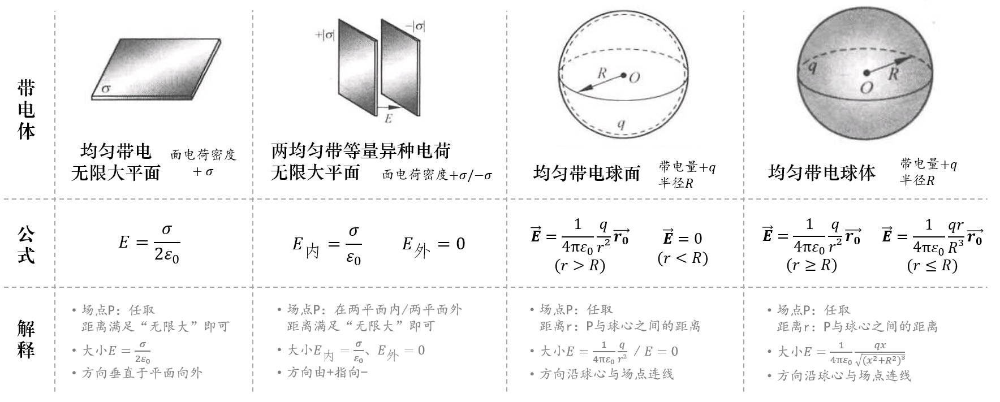
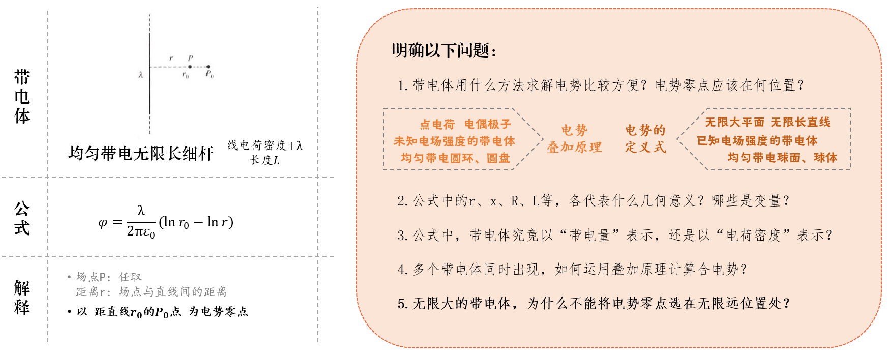

# 重要公式

## 十三 静电场

库仑定律： $\mathbf{F}_{21} = \frac{1}{4\pi\epsilon_0}\frac{q_1q_2}{r_{12}^2}\hat{\mathbf{r}}_{12}$

电场强度定义： $\mathbf{E} = \frac{\mathbf{F}}{q}$ 

点电荷的电场强度： $\mathbf{E} = \frac{1}{4\pi\epsilon_0}\frac{q}{r^2}\hat{\mathbf{r}}$

高斯定理： $\Phi_E = \oint_S \mathbf{E}\cdot d\mathbf{S} = \frac{Q_{enc}}{\epsilon_0}$

!!! note "常用场强结论"

    

    

    

    均匀带电圆柱面(线密度 $\lambda$ )： $E = \frac{\lambda}{2\pi\epsilon_0 r}$

电势： $V = \frac{q}{4\pi\epsilon_0r}$，$V = \int \frac{1}{4\pi\epsilon_0}\frac{dq}{r}$

!!! note "常用电势结论"

    

    

    

电势和电场强度的关系： $\mathbf{E} = -\nabla V$，$V = \int_a^0 \mathbf{E}\cdot d\mathbf{l}$

## 十四 静电场中的导体和电介质

