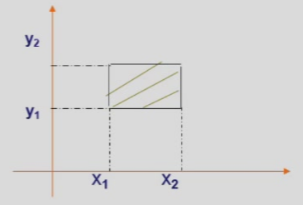

# Chapter 3 多元随机变量及其分布

## 二维离散型随机变量

### 联合分布律（Joint Mass Function）

- $P(X=x_i,Y=y_j)=p_{ij}\;\;i,j=1,2,...$；

亦可使用列表来表示：

### 边际分布律（Marginal Mass Function）

边界分布律即联合分布律的行/列求和

- $P(X=x_i)=P(X=x_1,\bigcup_{j=1}^{\infty}(Y=y_j))=\sum_{j=1}^{\infty}p_{ij}:=p_{i·}$；
- $P(Y=y_j)=P(\bigcup_{j=1}^{\infty}(X=x_i),Y=y_j)=\sum_{i=1}^{\infty}p_{ij}:=p_{·j}$；

### 条件分布律（Conditional Mass Function）

- $P\{X=x_i|Y=y_j\}=\frac{P(X=x_i,Y=y_j)}{P(Y=y_j)}=\frac{p_{ij}}{p_{·j}}\;\;i,j=1,2,...$；
- $P\{X<x|Y<y\}=\frac{P\{X<x,Y<y\}}{P\{Y<y\}}$然后根据联合分布律和边际分布律读表计算；

### 分布函数

#### 联合分布函数

$F(x,y)=P\{X\leq x,Y\leq y\}$为$(X,Y)$的**联合概率分布函数**，简称**联合分布函数（Joint Distribution Function）**，其具有如下性质：

1. **固定**其中一个变量，则该二元函数关于另外一个变量单调**不减**；
2. $0\leq F(x,y)\leq 1$，且$F(x,-\infty)=F(-\infty,y)=F(-\infty,-\infty)=0\;,\;F(+\infty,+\infty)=1$；

3. $F(x,y)$关于$x$和$y$**分别**右连续（离散）；

4. $x_1<x_2\;,\;y_1<y_2$时，有：$P\{x_1<X\leq x_2\;,\;y_1<Y\leq y_2\}=F(x_2,y_2)-F(x_1,y_2)-F(x_2,y_1)+F(x_1,y_1)\geq0$ 这可以由几何意义简单推出。

{: width="40%"}

#### 边际分布函数

$X$关于联合分布函数$F(x,y)$的**边际分布函数**定义为：

$$F_X(x)=P\{X\leq x\}=P\{X\leq x ,Y<+\infty\}=F(x,+\infty)$$

- 对$y$来说同理

#### 条件分布函数

$X=x_i$条件下$Y$的**条件概率分布函数**为：

$$F_{Y|X}(y|x_i)=P\{Y\leq y | X = x_i\}$$

## 二维连续型随机变量

### 联合分布

设二元随机变量$(X,Y)$的联合分布函数为$F(x,y)$，若存在二元函数$f(x,y)\geq0$，则对于任意的实数$x$，$y$有

$$F(x,y)=\int_{-\infty}^x\int_{-\infty}^yf(u,v)\mathrm{d}u\mathrm{d}v$$

则称$(X,Y)$为**二元连续型随机变量（Bivariate Continuous Random Variable）**，称$f(x,y)$为$(X,Y)$的**联合概率密度函数（Joint Probability Density Function）**，简称为**联合密度函数**。 其具有以下性质：

1. $f(x,y)\geq 0$；
2. $F(x,y)=\int_{-\infty}^x\int_{-\infty}^yf(u,v)\mathrm{d}u\mathrm{d}v=F(+\infty,+\infty)=1$；
3. 在$f(x,y)$的连续点上有$\frac{
\partial^2F(x,y)
}{
\partial x\partial y
}=f(x,y)$；
4. $(X,Y)$落入$xOy$平面任意区域$D$的概率为：$P\{(X,Y)\in D\}=\iint \limits_{D} f(x,y)\mathrm{d}x\mathrm{d}y$；
   - 由于其几何意义为落在以$D$为底，以曲面$z=f(x,y)$为顶面的立体体积，所以当$D$面积为$0$时概率为$0$：
   - `eg`：$P(X=1,Y=1)=0$，$P(X+Y=1)=0$，$P(X^2+Y^2=1)=0$；

### 边际分布

二位连续型随机变量$(X,Y)$中单个随机变量$X$的密度函数为$X$的**边际概率密度函数（Marginal Probability Density Function）**，简称**边际密度函数**。由于

$$\begin{aligned}
F_X(x)&=P\{X\leq x\}=P\{X\leq x,Y<+\infty\}\\
&=\int_{-\infty}^x\int_{-\infty}^{+\infty}f(x,y)\mathrm{d}y\mathrm{d}x\\
&=\int_{-\infty}^x[\int_{-\infty}^{+\infty}f(x,y)\mathrm{d}y]\mathrm{d}x
\end{aligned}$$

所以：

$$f_X(x)=\int_{-\infty}^{+\infty}f(x,y)\mathrm{d}y$$

同理：

$$f_Y(y)=\int_{-\infty}^{+\infty}f(x,y)\mathrm{d}x$$

### 条件分布

设$(X,Y)$为二元连续型随机变量，对给定的$x$，若$P\{x<X\leq x+\delta\}>0$，则称对任意的$y$有：

$$F_{Y|X}(y|x)=\lim\limits_{\delta\rightarrow 0^+}P\{Y\leq y|x<X\leq x+\delta\}$$

为$Y$在$X=x$的条件下的**条件分布函数**。

!!! note "一般地"

      设$(X,Y)$为二元随机变量，对给定的$x$，若极限：

      $$\lim\limits_{\delta\rightarrow 0^+}P\{Y\leq y|x-\delta<X\leq x+\delta\}
      =\lim\limits_{\delta\rightarrow 0^+}P\{Y\leq y|x-\delta<X\leq x+\delta\}
      $$

      对任意的$y$都存在，则称$Y$在$X=x$的条件下服从**条件分布函数**

由于对二维连续性随机变量$(X,Y)$有：

$$\begin{aligned}
F_{Y|X}(y|x)&=\lim\limits_{\delta\rightarrow 0^+}P\{Y\leq y|x<X\leq x+\delta\}\\
&=\lim\limits_{\delta\rightarrow 0^+}\frac{P\{Y\leq y,x<X\leq x+\delta\}}{P\{x<X\leq x+\delta\}}\\
&=\lim\limits_{\delta\rightarrow 0^+}\frac{F(x+\delta,y)-F(x,y)}{F_X(x+\delta)-F_X(x)}\\ 
&=\lim\limits_{\delta\rightarrow 0^+}\frac{(F(x+\delta,y)-F(x,y))/\delta}{(F_X(x+\delta)-F_X(x))/\delta}\\ 
\end{aligned}$$

且

$$\begin{aligned}
\lim\limits_{\delta\rightarrow 0^+}\frac{F(x+\delta,y)-F(x,y)}{\delta}
&=\frac{\partial F(x,y)}{\partial x}\\
&=\frac{\partial}{\partial x}\int_{-\infty}^x[\int_{-\infty}^{y}f(u,v)\mathrm{d}v]\mathrm{d}u\\
&=\int_{-\infty}^yf(x,v)\mathrm{d}v\\
\end{aligned}$$

$$\begin{aligned}
\lim\limits_{\delta\rightarrow 0^+}\frac{F_X(x+\delta)-F_X(x)}{\delta}
&=f_X(x)\\
\end{aligned}$$

所以：

$$F_{Y|X}(y|x)=\int_{-\infty}^y\frac{f(x,v)}{f_X(x)}\mathrm{d}v$$

我们由此可给出二维连续型随机变量的**条件概率密度函数**：

$$f_{Y|X}(y|x)=\frac{f(x,y)}{f_X(x)}$$

## 二元均匀分布和二元正态分布

### 均匀分布

如果二元随机变量$(X,Y)$在二维有界区间$D$上取值，且具有联合密度函数

$$f(x,y)=\left\{
\begin{aligned}
&\frac{1}{\text{D的面积}},&(x,y)\in D,\\
&0,&\text{其他}.
\end{aligned}
\right.$$

则称$(X,Y)$服从$D$上的**均匀分布**。

得到：$P\{(X,Y)\in D_1\}=\frac{D_1\text{的面积}}{D\text{的面积}}\;,\;\;\text{且}D_1\subset  D$。

### 正态分布

如果二元随机变量$(X,Y)$具有联合密度函数

$$f(x,y)=\frac{1}{2\pi\sigma_1\sigma_
2\sqrt{1-\rho^2}}\exp\{\frac{-1}{2(1-\rho^2)}[\frac{(x-\mu)^2}{\sigma_1^2}-2\rho\frac{(x-\mu_1)(y-\mu_2)}{\sigma_1\sigma_2}+\frac{(y-\mu_2)^2}{\sigma_2^2}]\}$$

，且有$|\mu_1|<+\infty,|\mu_2|<+\infty,\sigma_1>0,\sigma_2>0,|\rho|<1$

则称$(X,Y)$服从参数为$(\mu_1,\mu_2,\sigma_1^2,\sigma_2^2,\rho)$的**二元正态分布（Bivariate Normal Distribution）**，记做$(X,Y)\sim N(\mu_1,\mu_2,\sigma_1^2,\sigma_2^2,\rho)$。

- 二维正态分布的两个边际分布都是**对应参数的一维正态分布**，与$\rho$无关。

!!! note "二维正态分布的两个边际分布"

      $$\begin{aligned}
      f_X(x)&=\int_{-\infty}^{+\infty}f(x,y)\mathrm{d}y\\
      &=\frac{1}{\sqrt{2\pi}\sigma_1}\exp\{-\frac{(x-\mu_1)^2}{2\sigma_1^2}\}\\
      f_Y(y)&=\int_{-\infty}^{+\infty}f(x,y)\mathrm{d}x\\
      &=\frac{1}{\sqrt{2\pi}\sigma_2}\exp\{-\frac{(y-\mu_2)^2}{2\sigma_2^2}\}\\
      \end{aligned}$$

!!! note "二维正态分布的两个条件分布"

      $$\begin{aligned}
      f_{Y|X}(y|x)&=\frac{f(x,y)}{f_X(x)}\\
      &=\frac{1}{\sqrt{2\pi}\sqrt{1-\rho^2}\sigma_2}\exp\{-\frac{1}{2(1-\rho^2)\sigma_2^2}[y-(\mu_2+\rho\frac{\sigma_2}{\sigma_1}(x-\mu_1))]^2\}\\
      f_{X|Y}(x|y)&=\frac{f(x,y)}{f_Y(y)}\\
      &=\frac{1}{\sqrt{2\pi}\sqrt{1-\rho^2}\sigma_1}\exp\{-\frac{1}{2(1-\rho^2)\sigma_1^2}[x-(\mu_1+\rho\frac{\sigma_1}{\sigma_2}(y-\mu_2))]^2\}\\
      \end{aligned}$$

## 随机变量的独立性

如果对于任意的两个实数集合$D_1,D_2$，有

$$P\{X\in D_1,Y\in D_2\}=P\{X\in D_1\}·P\{Y\in D_2\}$$

则称随机变量$X,Y$**相互独立**，即$X,Y$**独立**。

也可以说：当$P\{X\leq x,Y\leq y\}=P\{X\leq x\}·P\{Y\leq y\}$，即$F(x,y)=F_x(x)·F_y(y)$时，$X,Y$独立。

---

## 多元随机变量函数的分布

### 卷积公式

当$X$和$Y$相互独立时，$Z=X+Y$的条件下：

1. $$\begin{aligned}
   F_Z(z) &= \iint \limits_{x+y\leq z}f(x,y)\mathrm{d}x\mathrm{d}y\\
   &=\int_{-\infty}^{+\infty}[\int_{-\infty}^{z-x}f(x,u-x)\mathrm{d}y]\mathrm{d}x\\
   &= \int_{-\infty}^{+\infty}[\int_{-\infty}^{z}f(x,u-x)\mathrm{d}u]\mathrm{d}x\\
   &=\int_{-\infty}^{z}[\int_{-\infty}^{+\infty}f(x,u-x)\mathrm{d}x]\mathrm{d}u\\
   &=\int_{-\infty}^{z}f_Z(u)\mathrm{d}y
   \end{aligned}$$

2. 其密度函数公式称为**卷积公式**：$f_X*f_Y=\int_{-\infty}^{+\infty}f_X(x)f_Y(z-x)\mathrm{d}x=\int_{-\infty}^{+\infty}f_X(z-y)f_Y(y)\mathrm{d}y$；

### $M=max(X,Y), N=min(X,Y)$的分布

- $F_{max}(z)=P(M\leq z)=P(X\leq z,Y\leq z)\xlongequal{\text{X,Y独立}}P(X\leq z)P(Y\leq z)=F_X(z)F_Y(z)$；
- $F_{min}(z)=P(N\leq z)=1-P(N>z)=1-P(X>z,Y>z)\xlongequal{\text{X,Y独立}}1-P(X>z)P(Y>z)=1-(1-F_X(z))(1-F_Y(z))$；
