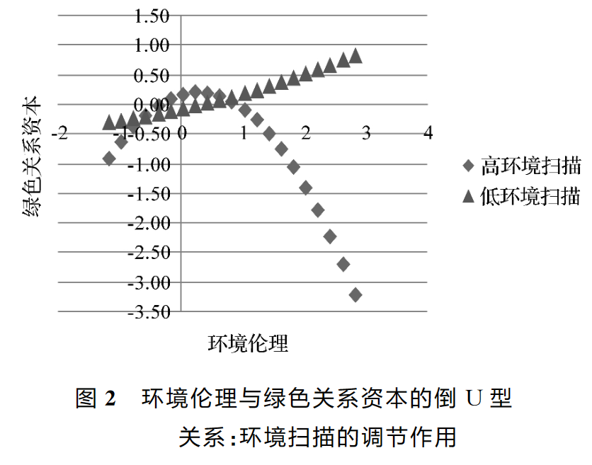
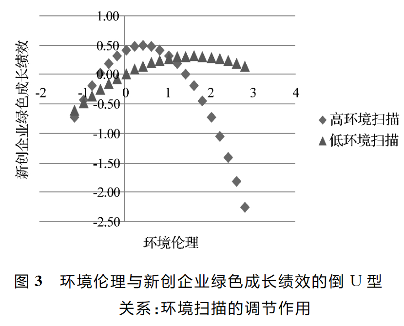

# 商赛论文阅读

!!! tip "目录"
    - [环境伦理与新创企业绿色成长的倒U型关系研究](#u)
    - [产品市场竞争、公司治理与信息披露质量](#_4)
    - [IT能力与企业可持续发展绩效的关系研究](#it)
    - [数字经济、创业活跃度与高质量发展——来自中国城市的经验证据](#_9)
    - [Attention to Attention](#attention-to-attention)
    - [Opportunity Cost Consideration](#opportunity-cost-consideration)
    - [Exploring the dark and unexpected sides of digitalization: Toward a critical agenda](#exploring-the-dark-and-unexpected-sides-of-digitalization-toward-a-critical-agenda)
    - [Digital transformation: A multidisciplinary reflection and research agenda](#digital-transformation-a-multidisciplinary-reflection-and-research-agenda)

## [环境伦理与新创企业绿色成长的倒U型关系研究](https://kns.cnki.net/kcms2/article/abstract?v=lxIxReJOxlcln8NExEceRrkog_Ox2qwqeuUz8ck-rlRb8_iVrJYNqAixK97DuCkGi2hxvYr7HS0CpR627MQBThQFh94Rs0fPhfRzJHSrmwxl3fyNJvwOj9O8rka0hfbYSMV9Ol70gA-wa1VOF5T2dw==&uniplatform=NZKPT&language=CHS)

!!! note "什么是环境扫描"
    环境扫描在阿奎拉(F. J. Aguilar)的著作《商务活动环境扫描》的定义是指获取关于事件、趋势以及组织与环境关系的信息,这些信息将有助于高层管理者识别、理解战略性机会与威胁,标定企业未来的发展路径。

!!! note "什么是环境伦理"
    环境伦理是研究人类在生存发展过程中，人类个体与自然环境系统和社会环境（人类群体）系统，及社会环境系统与自然环境系统之间的伦理道德行为关系的科学

### 结论一

环境伦理对新创企业绿色成长绩效呈倒Ｕ型的关系。该结论不仅清晰地辨析了两者关系，还在一定程度上衍生了“创业的合法性悖论”观点，即新创企业通过遵循环境伦理规范提升合法性，而合法性所暴露的资源紧缺和对环境不确定性感知迟滞等问题影响环境伦理表现，又造成新创企业的成长缺陷。这一观点是对组织合法性视角下环境伦理对新创企业绿色成长绩效的倒Ｕ型关系的有力佐证，也引出环境扫描与绿色关系资本对“环境伦理－新创企业绿色成长绩效”理论逻辑中所扮演的重要角色。

### 结论二

环境扫描是环境伦理非线性影响新创企业绿色成长绩效的重要边界条件，不仅直接调节环境伦理对新创企业绿色成长绩效的倒Ｕ型影响，还通过调节环境伦理与绿色关系资本的倒Ｕ型关系间接影响新创企业绿色成长绩效：

①本研究以环境扫描为调节变量，并将合法性压力视为一种外部环境不确定性，分析在“合法性鸿沟感知”与环境扫描的相互促进与制约前提下，环境扫描能够强化环境伦理对新创企业绿色成长绩效的倒Ｕ型作用。

②本研究揭示了合法性资源视角下绿色关系资本在环境伦理与新创企业绿色成长绩效之间曲线型的中介传导机制。更为关键的是，研究确定环境扫描对环境伦理与新创企业绿色成长绩效倒Ｕ型关系的调节作用有部分通过绿色关系资本的中介作用来实现。

## [产品市场竞争、公司治理与信息披露质量](https://kns.cnki.net/kcms2/article/abstract?v=lxIxReJOxlfwfNslxjOIUtgUXP0lDjlzFdTr_ZNwTMPbjjLhWIMoTS_TDtji0ZNQt8koHfoilcsfIHvUtS7BsezpLPffdUijr5FB9OkGTmxKdIfgI4xoXUuZ6oc0eH8gKgGzoQNA74I=&uniplatform=NZKPT&language=CHS)

### 背景

信息和激励一直是困扰现代资本市场的两大难题。对于迫切需要又快又好发展资本市场的新兴市场国家,如何将由其导致的交易成本降到最低更是一个关键问题。有研究表明,强化上市公司的信息披露是一项可能的解决方案。Healy 和 Palepu(2001)认为,良好的信息披露不仅能够削弱资金供求双方之间的信息不对称、提升资源在整个市场内的配置效率,还能够为外部投资者监督和评价公司管理层提供依据、降低道德风险与机会主义行为,因而对于促进资本市场的有效运转起到了不可忽视的作用。

然而,在中国资本市场上,上市公司的信息披露状况一直令人堪忧。根据普华永道 PWC(2001)的一项调查,中国的信息不透明程度位居被调查的 35 个国家(地区)之首。因信息披露失真、不规范、不及时导致的上市公司破产整顿、高管人员内幕交易、中小投资者利益受损的案例屡屡发生，严重阻碍了上市公司与资本市场的健康发展，甚至为中国的金融与经济安全埋下了隐患。

### 研究分析

信息披露质量低下是当前制约我国资本市场以及上市公司发展的重要问题。中国的证券市场如何才能健康发展,广大投资者利益如何能得到有效保护,已经成为社会各界关注的焦点问题之一。本文在对相关理论进行梳理的基础上，以 2003~2005 年深交所上市公司数据,考察了产品市场竞争、公司治理与信息披露质量之间的关系。

本文的研究表明，公司治理机制的合理安排能够对信息披露产生促进作用,而产品市场竞争与不同的公司治理机制之间具有不同的关系。具体而言,国有产权性质非国有大股东持股比例提升、董事会规模适度独立董事比例提升有利于提升信息披露质量，监事会规模、两职合一没有表现出显著的效应。产品市场竞争主要通过与公司治理机制相互配合产生作用:竞争与大股东持股比例、高管激励之间具有互补关系，与董事会治理机制之间具有完全的替代关系,但是与产权性质、监事会规模、两职合一的关系并不明确。

这一结论意味着，在中国当前的制度背景下要提升信息披露质量、保护投资者利益，有必要继续完善上市公司的治理结构,并综合考虑产品市场的竞争情况为上市公司选择最为合适的公司治理机制。例如,对于那些处于竞争激烈行业的企业而言,可以考虑以较低的控股比例维持国家在国有公司中的控制地位，或适度提升大股东在非国有公司中的持股比例;对于那些处于垄断或寡头竞争行业的企业而言，则可以考虑采取维持国有产权地位合理设计董事会规模(例如限制在 13 人以下)强化完善独立董事制度等具体治理手段有效促进上市公司信息披露质量的提升。

## [IT能力与企业可持续发展绩效的关系研究](https://kns.cnki.net/kcms2/article/abstract?v=lxIxReJOxldORZXR8Sr7XhQsVzWHORat23p7DNP5du69QpBMzDB3uZ3CNoXmoFNlj4u7aeT38Vk9VpStNRNOBwwo_z52-TyZVkmChjId2X3cLVS8rO1OnUZ27iDT6sYRwUEWuujUaIUT8MBTLnHQ2w==&uniplatform=NZKPT&language=CHS)

### 本文概述

本文推进和拓展了 IT 能力与可持续发展绩效之间的关系研究。以往研究仅关注 IT 能力的商业价值，认为 IT 能力可以帮助企业获得更好的经济绩效，然而过分重视财务绩效等短期指标可能会限制企业的长期目标，只顾当前经济效益，容易导致管理局限，最终损害企业可持续发展。本文跳出这一局限，拓展了 IT 能力对企业绩效影响的研究范畴，实证分析表明 IT 能力不仅会对企业的经济绩效造成影响，也会影响企业的社会和环境绩效。另外，研究深入揭示了 IT 能力贡献于企业可持续发展绩效的内在机理。本研究结论说明业务流程敏捷性是信息系统成功实施的关键因素，单纯的 IT 能力，并不一定能贡献于企业的可持续发展绩效。IT 能力必须与企业其他能力、资源相协同，重塑、更新、改进业务流程敏捷性，提升企业快速、准确感知与传递市场信息，提高产品和服务响应市场的能力，才能实现企业的可持续发展绩效。

### 管理启示

首先，企业可以通过提高自身 IT 能力改造业务流程敏捷性，以缓和其所面临的资源困境和社会压力，进而提高可持续发展绩效。企业管理者应该扩展自身对 IT 能力商业价值的认识，更全面地从经济、环境、社会多个层面理解 IT 能力对企业可持续发展绩效的支持。其次，业务流程敏捷性的提升是 IT 能力贡献于可持续发展绩效的关键。业务流程敏捷性是在 IT 能力基础上发展出来的高阶能力，帮助企业不断发展自身以应对外界环境变化，能够促进可持续发展绩效的实现。企业在进行信息技术方面的投资时，要重视 IT 能力提升与业务流程的协同整合。确保企业投资的信息技术资产与业务流程是相契合的，并能贡献于业务流程敏捷性。

## [数字经济、创业活跃度与高质量发展——来自中国城市的经验证据](https://kns.cnki.net/kcms2/article/abstract?v=3uoqIhG8C44YLTlOAiTRKibYlV5Vjs7i8oRR1PAr7RxjuAJk4dHXonelQn2dXxETzoVw9FwKX-SnNOb6NRu1c2wNk9VadT8q&uniplatform=NZKPT)

### 总起

具体来讲，本文结合数字经济特有的属性，以创业活跃度为视角构建理论分析框架，在此基础上，测度了 2011~2016 年全国 222 个地级及以上城市的数字经济和高质量发展水平，并将企业工商注册信息与城市传统变量相匹配，运用多种计量方法实证检验数字经济对城市高质量发展的影响及其作用机制。

研究结果显示，数字经济显著促进了高质量发展，激发大众创业是其中重要的影响机制，同时数字经济对高质量发展显现出“边际效应”非线性递增以及空间溢出的特点。这些结论在进行选取历史数据作为工具变量和“宽带中国”试点作为准自然实验等稳健性检验后仍然成立。

### 结论

本文立足于数字经济极大影响了中国社会经济发展这一典型事实，从创业活跃度的视角切入，基于中国 2011~2016 年的城市层面数据，在构建数字经济综合发展水平指数与高质量发展指数的基础上，运用面板固定效应模型、门槛模型空间模型和中介效应模型，多维度实证检验了数字经济对经济高质量发展的影响及其内在机制。主要结论如下：

第一，数字经济明显地促进了城市经济发展质量的提升，已成为新时代下中国推动高质量发展的重要力量，通过引入工具变量等稳健性检验，该结论仍然成立；在区域异质性上，东部地区享受到的数字经济红利相比中西部地区更大，对发达地区的积极影响也大于欠发达地区。

第二，数字经济的高质量发展溢出效应呈现出“边际效应”递增的非线性变化趋势，这与其网络效应的特点相符，证明了“梅特卡夫法则”在城市经济高质量发展中也是显著存在的，并且创业活跃度这一中介因素还能够强化该效应，表明在城市创业生态系统与数字经济能够对经济高质量发展形成推动合力。

第三，城市高质量发展中数字经济的空间溢出效应也得到了证实，表明数字经济有助于形成地区间协调发展的经济格局。

第四，激发大众创业是数字经济赋能经济高质量发展的作用机制，“互联网+”与“大众创业万众创新”形成的双轮驱动现象对实现中国经济提质增效升级具有重要意义。

### 政策启示

首先，在数字经济能够成为推动经济高质量发展的新动能现实之下，加大对互联网投资力度，推进数字中国建设，特别是通过加快 5G 商用、大数据模式构建和人工智能应用，进一步巩固信息技术为高质量发展带来的红利优势。

其次，考虑数字经济对中西部地区、外围城市经济高质量发展产生的积极效应还有待深化，这预示着应该实施动态化、差异化的数字经济战略，让数字经济成为有效缩减地区发展不平衡的“硬件”技术支撑。

再次，数字经济通过激发创业活跃度对城市高质量发展带来内生动力的路径机制，证明了“互联网+”与“大众创业、万众创新”能够汇聚经济发展新动能，为新时代推动经济高质量发展发挥重要作用。

最后，数字经济活动的空间溢出效应表明，应该通过加大各地区新型基础设施建设的协调力度，充分释放其对经济高质量发展的空间贡献能力。

## [Attention to Attention](https://pubsonline.informs.org/doi/10.1287/orsc.1100.0602)

!!! note ""
    注意力相关的...我感觉不太有关系。。。

### Abstract

组织理论和研究越来越关注组织中注意力的决定因素和后果。然而，注意力并不是一个统一的概念，而是在不同的元理论中以不同的方式使用：行为理论、管理认知、议题销售、基于注意力的观点和生态学。在大脑层面上，神经科学家已经确定了三种注意力的类型：选择性注意力、执行注意力和警觉性。注意力受到自上而下（即基于模式的）和自下而上（即刺激驱动的）过程的影响。受到神经科学研究的启发，我将组织科学中研究的三种注意力类型进行分类和比较：注意力视角（自上而下）、注意力参与（结合自上而下和自下而上的执行注意力和警觉性）和注意力选择（注意力过程的结果）。基于研究结果，我提出了五个命题，说明组织中的注意力类型如何提供一种理论选择，以解释组织的适应和变革，从而对结构决定论或战略选择理论提供了一种理论替代。

## [Opportunity Cost Consideration](https://academic.oup.com/jcr/article/38/4/595/1856292)

!!! note ""
    机会成本...我觉得也什么关系

### Abstract

从规范的角度来看，消费者应该在每个决策中考虑机会成本，然而行为研究表明，消费者很少或根本不考虑机会成本。这项研究探讨了消费者何时考虑机会成本、谁考虑机会成本、哪些机会成本会自动浮现在脑海中，以及考虑机会成本的后果是什么。感知到的限制促使消费者考虑机会成本，而计划倾向较高的消费者即使没有受到直接限制的提示，也会考虑机会成本。在记忆中，具体的替代选择和检索的可能性是类别结构的函数。对于给定的资源，某些用途更符合可能用途的类别，因此更有可能被视为机会成本。当机会成本具有吸引力时，考虑机会成本的消费者购买焦点选项的可能性较低，但当机会成本不具吸引力时，购买焦点选项的可能性并不降低。

## [Exploring the dark and unexpected sides of digitalization: Toward a critical agenda](https://journals.sagepub.com/doi/10.1177/1350508420968184)

### Abstract

数字化对个人、组织和社会产生了深远的影响。尽管现有的管理和组织研究主要关注这一发展的积极方面，但数字化对组织和组织过程的负面和潜在意外影响却受到较少的学术关注。本特刊延伸了这一新兴辩论。通过对平台公司、社会运动和传统公司的实证材料进行研究，八篇文章揭示了数字化对工作和组织过程的各种负面影响，特别是对工人、雇员和活动人士。在本文引言中，我们将这些有价值的贡献置于背景之中，强调数字化的无处不在和同时性的危险，并开始勾勒出数字化在组织研究中全面批判议程的潜在途径。

## [Digital transformation: A multidisciplinary reflection and research agenda](https://www.sciencedirect.com/science/article/pii/S0148296319305478?via%3Dihub)

### Abstract

数字化转型和由此带来的商业模式创新已经从根本上改变了消费者的期望和行为，给传统企业带来了巨大的压力，并扰乱了许多市场。借鉴现有文献，我们确定了数字化转型的三个阶段：数字化、数字化过程和数字化转型。我们确定并界定了数字化企业的增长策略，以及成功进行数字化转型所需的资产和能力。我们认为数字化转型需要特定的组织结构，并对用于校准绩效的指标产生影响。最后，我们提供了一个研究议程，以刺激和指导未来关于数字化转型的研究。