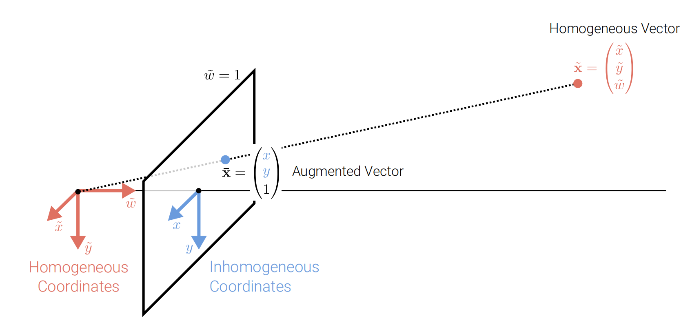
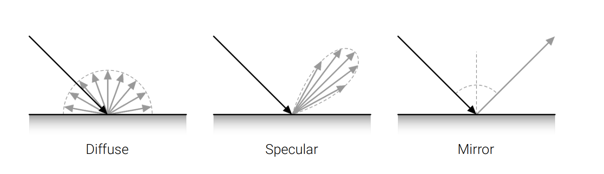

# Image_Formation

## 2.1 Primitives and Transformations

Geometric primitives(几何图元) are the basic building blocks used to describe 3D shapes, such as points, lines, planes, and polygons.

### 2D Primitives

#### 2D Points

**2D points** can be written in **inhomogeneous coordinates**(非齐次坐标) as

$$\mathbf{x} =(x,y)^T\in \mathbb{R}^2$$

or in **homogeneous coordinates**(齐次坐标) as

$$\widetilde{\mathbf{x}} =\left(\widetilde{x},\widetilde{y},\widetilde{w}\right)^T\in \mathbb{P}^2$$

where $ \mathbb{P}^2 ( = \mathbb{R}^3)$ is the **projective plane**(射影空间) and $\widetilde{\mathbf{x}}$ is a **projective point**(投影点).
> The tilde sign (~) is a convention for homogeneous coordinates.
> Homogeneous vectors are defined only up to scale.

**Inhomogeneous vector** $\mathbf{x}$ is converted to a **homogeneous vector** $\widetilde{\mathbf{x}}$ as follows:

$$\widetilde{\mathbf{x} }=\begin{pmatrix}\widetilde{x}\\\widetilde{y}\\\widetilde{w}\end{pmatrix}=\begin{pmatrix}x\\y\\1\end{pmatrix}=\begin{pmatrix}\mathbf{x}\\1\end{pmatrix}= \overline{\mathbf{x} }$$

where $\overline{x}$ is the **augmented vector**(增广向量) of $\mathbf{x}$.
> We say augmented vector $\overline{\mathbf{x} }$ for all homogeneous vectors which last coordinate is equal to 1.
> Special vector: Homogeneous points whose last element is $\widetilde{w}=0$ are called **ideal points** or **points at infinity**. These points can’t be represented with inhomogeneous coordinates!

#### 2D Lines

**2D lines** can also be expressed using **homogeneous coordinates**(齐次坐标) $\mathbf{\widetilde{l}}=(a,b,c)^T$ : $$\{\mathbf{\overline{x}}|{\mathbf{\overline{x}}}^T\mathbf{\widetilde{l}}=0\} \Leftrightarrow \{x,y | ax+by+c=0\}$$

左到右是因为 $\mathbf{\overline{x}}^T\mathbf{\widetilde{l}}=0 \Rightarrow (x,y,1)\begin{pmatrix}a\\b\\c\end{pmatrix}=0 \Rightarrow ax+by+c=0$

标准化 $\mathbf{\widetilde{l}}$：$\mathbf{\widetilde{l}}=(n_x,n_y,d)^T$，
其中 $n_x^2+n_y^2=1$， $(n_x,n_y)$ 是 $\mathbf{\widetilde{l}}$ 的**法向量** ，$d$ 是 $\mathbf{\widetilde{l}}$ 到原点的距离.

> An exception is the **line at infinity** $\mathbf{\widetilde{l}}_{\infty}=(0,0,1)^T$, which passes through all ideal points.

#### 2D Line Arithmetic

In homogeneous coordinates, **the intersection of two lines** is given by:
$$\mathbf{\overline{x}}=\mathbf{\widetilde{l}}_1\times \mathbf{\widetilde{l}}_2$$

where $\times$ is the **cross product** of two vectors.

Similarly, **the intersection of two points** is given by:
$$\mathbf{\widetilde{l}}=\mathbf{\overline{x}}_1\times \mathbf{\overline{x}}_2$$

#### 2D Conics(二次曲线)

More complex algebraic objects can be represented using **polynomial homogeneous equations**. For example, **conic sections** (arising as the intersection of a plane and a 3D cone) can be written using quadric equations:

$$\mathbf{\overline{x}}^T\mathbf{Q}\mathbf{\overline{x}}=0$$

### 3D Primitives

#### 3D Points

**3D points** can be written in **inhomogeneous coordinates** as
$$\mathbf{x}=(x,y,z)^T\in \mathbb{R}^3$$
or in **homogeneous coordinates** as
$$\widetilde{\mathbf{x}}=(\widetilde{x},\widetilde{y},\widetilde{z},\widetilde{w})^T\in \mathbb{P}^3$$

where $\mathbb{P}^3(=\mathbb{R}^4)$ is the **projective space**.

#### 3D Planes

**3D planes** can be expressed using homogeneous coordinates $\mathbf{\widetilde{m}}=(a,b,c,d)^T$:
$$\{\mathbf{\overline{x}}|{\mathbf{\overline{x}}}^T\mathbf{\widetilde{m}}=0\} \Leftrightarrow \{x,y,z | ax+by+cz+d=0\}$$

标准化 $\mathbf{\widetilde{m}}$：$\mathbf{\widetilde{m}}=(n_x,n_y,n_z,d)^T$
其中 $n_x^2+n_y^2+n_z^2=1$, $(n_x,n_y,n_z)$ 是 $\mathbf{\widetilde{m}}$ 的**法向量**，$d$ 是 $\mathbf{\widetilde{m}}$ 到原点的距离。

> An exception is the **plane at infinity** $\mathbf{\widetilde{m}}_{\infty}=(0,0,0,1)^T$, which passes through all ideal points.

#### 3D Lines

**3D lines** are less elegant than either 2D lines or 3D planes. One possible representation
is to express points on a line as a **linear combination** of two points $\mathbf{p}$ and $\mathbf{q}$ on the line:

$$\{\mathbf{x}|\mathbf{x}=(1-\lambda)\mathbf{p}+\lambda\mathbf{q},\lambda\in \mathbb{R}\}$$

However, this representation uses 6 parameters($\mathbf{p}$和$\mathbf{q}$分别三个参数) for 4 degrees of freedom(一个点(3个不自由度)+方向(1个不自由度)).
> 所以可以用**two-plane parameterization**（两平面参数化）来表示3D line.

#### 3D Quadrics(二次曲面)

The 3D analog of 2D conics is a **quadric surface**:

$$\mathbf{\overline{x}}^T\mathbf{Q}\mathbf{\overline{x}}=0$$

**Superquadrics**: generalization of quadrics

### 2D Transformations

#### Translation

**Translation**: (2D Translation of the Input, 2 DoF(两个自由度: $t_x$和$t_y$))

$$\mathbf{x}'=\mathbf{x}+\mathbf{t} \Leftrightarrow \begin{pmatrix}x'\\y'\\1\end{pmatrix}=\begin{bmatrix}1&0&t_x\\0&1&t_y\\0&0&1\end{bmatrix}\begin{pmatrix}x\\y\\1\end{pmatrix} \Leftrightarrow \mathbf{\overline{x}}'=\begin{bmatrix}\mathbf{I}&\mathbf{t}\\\mathbf{0}^T&1\end{bmatrix}\mathbf{\overline{x}}$$

> - Using homogeneous representations allows to chain/invert transformations.
> - Augmented vectors $\mathbf{\overline{x}}$ can always be replaced by general homogeneous ones $\widetilde{\mathbf{x}}$.

#### Euclidean

**Euclidean**: (2D Translation + 2D Rotation, 3 DoF)

$$\mathbf{x}'=\mathbf{R}\mathbf{x}+\mathbf{t} \Leftrightarrow \begin{pmatrix}x'\\y'\\1\end{pmatrix}=\begin{bmatrix}\cos\theta&-\sin\theta&t_x\\\sin\theta&\cos\theta&t_y\\0&0&1\end{bmatrix}\begin{pmatrix}x\\y\\1\end{pmatrix} \Leftrightarrow \mathbf{\overline{x}}'=\begin{bmatrix}\mathbf{R}&\mathbf{t}\\\mathbf{0}^T&1\end{bmatrix}\mathbf{\overline{x}}$$

> - $\mathbf{R} \in SO(2)$: **special orthogonal group** of 2D rotations,which is an **orthogonal rotation matrix** with $\mathbf{R}^T\mathbf{R}=\mathbf{I}$ and $\det(\mathbf{R})=1$.
> - Euclidean transformations preserve Euclidean distances

#### Similarity

**Similarity**: (2D Translation + Scaled 2D Rotation, 4 DoF)

$$\mathbf{x}'=s\mathbf{R}\mathbf{x}+\mathbf{t} \Leftrightarrow \begin{pmatrix}x'\\y'\\1\end{pmatrix}=\begin{bmatrix}s\cos\theta&-s\sin\theta&t_x\\s\sin\theta&s\cos\theta&t_y\\0&0&1\end{bmatrix}\begin{pmatrix}x\\y\\1\end{pmatrix} \Leftrightarrow \mathbf{\overline{x}}'=\begin{bmatrix}s\mathbf{R}&\mathbf{t}\\\mathbf{0}^T&1\end{bmatrix}\mathbf{\overline{x}}$$

> - $s$ is the **scale factor**.
> - The similarity transform preserves angles between lines

#### Affine

**Affine**: (2D Translation + 2D Rotation + 2D Shear, 6 DoF)

$$\mathbf{x}'=\mathbf{A}\mathbf{x}+\mathbf{t} \Leftrightarrow \begin{pmatrix}x'\\y'\\1\end{pmatrix}=\begin{bmatrix}a_{11}&a_{12}&t_x\\a_{21}&a_{22}&t_y\\0&0&1\end{bmatrix}\begin{pmatrix}x\\y\\1\end{pmatrix} \Leftrightarrow \mathbf{\overline{x}}'=\begin{bmatrix}\mathbf{A}&\mathbf{t}\\\mathbf{0}^T&1\end{bmatrix}\mathbf{\overline{x}}$$

> - $\mathbf{A}$ is an **arbitrary 2D matrix**.
> - Parallel lines remain parallel under affine transformations

#### Projective

**Projective**: (2D Translation + 2D Rotation + 2D Shear + 2D Homography, 8 DoF)（对同构矩阵整体乘以一个常数并不改变射影变换,所以可以让其中一个元素取任意定值(例如取1),等价去掉一个自由度）

$$\mathbf{\widetilde{x}}'=\mathbf{\widetilde{H}}\mathbf{\widetilde{x}} \Leftrightarrow \begin{pmatrix}\widetilde{x}'\\\widetilde{y}'\\\widetilde{w}'\end{pmatrix}=\begin{bmatrix}h_{11}&h_{12}&h_{13}\\h_{21}&h_{22}&h_{23}\\h_{31}&h_{32}&h_{33}\end{bmatrix}\begin{pmatrix}\widetilde{x}\\\widetilde{y}\\\widetilde{w}\end{pmatrix} \Leftrightarrow \mathbf{\overline{x}}'=\frac{1}{\widetilde{w}'}\widetilde{x}'$$

> - $\mathbf{\widetilde{H}}$ is an **arbitrary homogeneous 3x3 matrix**.
> - Projective transformations preserve straight lines

#### 2D Transformations on Co-vectors

Consider a **covector** $\mathbf{\widetilde{l}}=(a,b,c)^T$ representing a 2D line. How does it transform under a 2D transformation $\mathbf{H}$?

**Answer**: $\mathbf{\widetilde{l}'}=\mathbf{H}^{-T}\mathbf{\widetilde{l}}$

**Solution**: Consider a point $\mathbf{\overline{x}}$ on the line $\mathbf{\widetilde{l}}$:

Considering any perspective 2D transformation:
$$ \mathbf{\widetilde{x}}'=\mathbf{H}\mathbf{\widetilde{x}}$$

the transformed 2D line equation is given by:
$$\mathbf{\widetilde{l}'}^T\mathbf{\widetilde{x}}'=\mathbf{\widetilde{l}}^T\mathbf{\widetilde{x}}=0$$

So:
$$\mathbf{\widetilde{l}'}^T\mathbf{H}\mathbf{\widetilde{x}}=\mathbf{\widetilde{l}}^T\mathbf{\widetilde{x}}=0$$

which implies:
$$\mathbf{\widetilde{l}'}=\mathbf{H}^{-T}\mathbf{\widetilde{l}}$$
> Thus, the action of a projective transformation on a co-vector such as a 2D line or 3D normal can be represented by the transposed inverse of the matrix.

#### Overview of 2D Transformations

| Transformation | DoF | Preserves | Matrix |
| :---: | :---: | :---: | :---: |
| Translation | 2 | Orientation | $\begin{bmatrix}\mathbf{I}&\mathbf{t}\end{bmatrix}_{2\times 3}$ |
| Rigid(Euclidean) | 3 | Length | $\begin{bmatrix}\mathbf{R}&\mathbf{t}\end{bmatrix}_{2\times 3}$ |
| Similarity | 4 | Angles | $\begin{bmatrix}s\mathbf{R}&\mathbf{t}\end{bmatrix}_{2\times 3}$ |
| Affine | 6 | Parallelism | $\begin{bmatrix}\mathbf{A}&\mathbf{t}\end{bmatrix}_{2\times 3}$ |
| Projective | 8 | Straight lines | $\begin{bmatrix}\mathbf{\widetilde{H}}\end{bmatrix}_{3\times 3}$ |

> - Interpret as restricted $3 × 3$ matrices operating on 2D homogeneous coordinates
> - Transformations preserve properties below

#### Overview of 3D Transformations

| Transformation | DoF | Preserves | Matrix |
| :---: | :---: | :---: | :---: |
| Translation | 3 | Orientation | $\begin{bmatrix}\mathbf{I}&\mathbf{t}\end{bmatrix}_{3\times 4}$ |
| Rigid(Euclidean) | 6 | Length | $\begin{bmatrix}\mathbf{R}&\mathbf{t}\end{bmatrix}_{3\times 4}$ |
| Similarity | 7 | Angles | $\begin{bmatrix}s\mathbf{R}&\mathbf{t}\end{bmatrix}_{3\times 4}$ |
| Affine | 12 | Parallelism | $\begin{bmatrix}\mathbf{A}&\mathbf{t}\end{bmatrix}_{3\times 4}$ |
| Projective | 15 | Straight lines | $\begin{bmatrix}\mathbf{\widetilde{H}}\end{bmatrix}_{4\times 4}$ |

> - 3D transformations are defined analogously(类似的) to 2D transformations
> - $3 × 4$ matrices are extended with a fourth $\begin{bmatrix}\mathbf{0}^T&1\end{bmatrix}$ row for homogeneous transforms.
> - Transformations preserve properties below (similarity: parallelism, straight lines)

#### Direct Linear Transform for Homography Estimation

> 用直接线性变换(DLT)估计单应性矩阵(Homography Matrix)

How can we estimate a homography from a set of 2D correspondences?

> - 2D correspondences: $\mathbf{x}_i \leftrightarrow \mathbf{x}'_i$
>   - $\mathbf{x}_i$ is a point in the first image
>   - $\mathbf{x}'_i$ is the corresponding point in the second image
> - Homography: $\mathbf{\widetilde{x}}'_i=\mathbf{\widetilde{H}}\mathbf{\widetilde{x}}_i$

Let $\mathcal{X}=\{\mathbf{\widetilde{x}_i,\widetilde{x}'_i}\}_{i=1}^N$denote a set of $N$ 2D-to-2D correspondences related by $\mathbf{\widetilde{x}}'_i=\mathbf{\widetilde{H}}\mathbf{\widetilde{x}}_i$.As the correspondence vectors are homogeneous, they have **the same direction but differ in magnitude**.

> Why to say "the same direction but differ in magnitude"?
> See the following picture:
> 

Thus, the equation above can be expressed as $\mathbf{\widetilde{x}}'_i\times\mathbf{\widetilde{H}}\mathbf{\widetilde{x}}_i=0$. Using the $\mathbf{\widetilde{h}}^T_k$ to denote the k-th row of $\mathbf{\widetilde{H}}$, we can write:

> Note:
>
> 1. $\mathbf{a}\times\mathbf{b}=\begin{bmatrix}0&-a_3&a_2\\a_3&0&a_1\\-a_2&a_1&0\end{bmatrix} \begin{pmatrix}b_1\\b_2\\b_3\end{pmatrix}=\begin{pmatrix}a_2b_3-a_3b_2\\a_3b_1-a_1b_3\\a_1b_2-a_2b_1\end{pmatrix}$

展开叉乘运算:
$\begin{aligned}
&\mathbf{\widetilde{x}}'_i \times (\mathbf{\widetilde{H}}\mathbf{\widetilde{x}}_i) = 0\\
\Leftrightarrow & \begin{bmatrix}
0 & -\widetilde{w}'_i & \widetilde{y}'_i \\
\widetilde{w}'_i & 0 & -\widetilde{x}'_i\\
-\widetilde{y}'_i & \widetilde{x}'_i & 0
\end{bmatrix}
\begin{bmatrix}
\mathbf{\widetilde{h}}^T_1\\
\mathbf{\widetilde{h}}^T_2\\
\mathbf{\widetilde{h}}^T_3
\end{bmatrix}\mathbf{\widetilde{x}}_i = 0\\
\Leftrightarrow & \begin{bmatrix}
0^T_{1\times 3} & -\widetilde{w}'_i\mathbf{\widetilde{x}}_i^T & \widetilde{y}'_i\mathbf{\widetilde{x}}_i^T\\
\widetilde{w}'_i\mathbf{\widetilde{x}}_i^T & 0^T_{1\times 3} & -\widetilde{x}'_i\mathbf{\widetilde{x}}_i^T\\
-\widetilde{y}'_i\mathbf{\widetilde{x}}_i^T & \widetilde{x}'_i\mathbf{\widetilde{x}}_i^T & 0^T_{1\times 3}
\end{bmatrix}_{3\times 9}
\begin{bmatrix}
\mathbf{\widetilde{h}}_1\\
\mathbf{\widetilde{h}}_2\\
\mathbf{\widetilde{h}}_3
\end{bmatrix}_{9\times 1} = 0
\end{aligned}
$

> - 第二步到第三步是因为 $\mathbf{h}_i^T \mathbf{\widetilde{x}}_i$是一个数，所以$\mathbf{h}_i^T \mathbf{\widetilde{x} }_i = \mathbf{\widetilde{x} }_i^T \mathbf{h}_i$。
> - 这样就可以用左边的数据来估计 $\mathbf{H}$ 了。
> - 最后一行的三个方程是冗余的，因为$-\widetilde{w}'_iR_3 = \widetilde{x}'_i R_1 + \widetilde{y}'_i R_2$。

Each point correspondence yields two equations. Stacking all equations into a $2N × 9$(一组有两个方程，列数均为9) dimensional matrix $\mathbf{A}$ leads to the following **constrained least squares problem**

由于误差的存在，上式可能不等于0，所以用最小二乘法来估计 $\mathbf{H}$:

令 $\mathbf{A} \widetilde{\mathbf{h}} = \omega$

$\Omega = \omega^T \omega $

求解 $\widetilde{\mathbf{h}}$ 使得 $\Omega$ 最小也就是

$$\widetilde{\mathbf{h}}^*=\arg\min_{\widetilde{\mathbf{h}}}\Omega + \lambda (\|\widetilde{\mathbf{h}}\|^2-1)=\arg\min_{\widetilde{\mathbf{h}}}\|\mathbf{A}\widetilde{\mathbf{h}}\|^2+\lambda (\|\widetilde{\mathbf{h}}\|^2-1)$$

其中 $\widetilde{\mathbf{h}}^*$ 是 $\mathbf{H}$ 的最小二乘解。

where $\lambda$ is a Lagrange multiplier(拉格朗日乘子) to enforce the constraint $\|\widetilde{\mathbf{h}}\|^2=1$.

The solution to the above optimization problem is the **singular vector** corresponding to the smallest singular value of $\mathbf{A}$.(i.e., the last column of $V$ when decomposing $A = UDV^T$ , see also Deep Learning lecture 11.2). The resulting algorithm is called **Direct Linear Transformation**.

## 2.2 Geometric Image Formation

### Basic camera models

**Physical Camera Model**

**Mathematical Camera Model**

### Projection models

#### Orthographic Projection*

An **orthographic projection** simply **drops the z component** of the 3D point in camera coordinates $\mathbf{x}_c$ to obtain the corresponding 2D point on the image plane (= screen) $\mathbf{x}_s$.

$$\mathbf{x}_s=\begin{bmatrix}1&0&0\\0&1&0\end{bmatrix}\mathbf{x}_c
\Leftrightarrow \overline{\mathbf{x}}_s=\begin{bmatrix}1&0&0&0\\0&1&0&0\\0&0&0&1\end{bmatrix}\overline{\mathbf{x}}_c$$

> - remember that $\overline{\mathbf{x}}_c$ is the augmented vector of $\mathbf{x}_c$.
> - Orthography is exact for telecentric lenses and an approximation for telephoto lenses. After projection the distance of the 3D point from the image **can’t be recovered**

##### Scaled Orthographic Projection

In practice, world coordinates (which may measure dimensions in meters) must be scaled to fit onto an image sensor (measuring in pixels) ⇒ **scaled orthography**:

$$\mathbf{x}_s=\begin{bmatrix}s&0&0\\0&s&0\end{bmatrix}\mathbf{x}_c
\Leftrightarrow \overline{\mathbf{x}}_s=\begin{bmatrix}s&0&0&0\\0&s&0&0\\0&0&0&1\end{bmatrix}\overline{\mathbf{x}}_c$$

> The unit for s is px/m or px/mm to convert metric 3D points into pixels

Under orthography, structure and motion can be estimated simultaneously using factorization methods (e.g., via singular value decomposition).

#### Perspective Projection**

For perspective projection, we can use the following relationship (which is just from the principle of equal triangles):
$$\frac{x_s}{f}=\frac{x_c}{z_c}$$

In **perspective projection**, 3D points in camera coordinates are mapped to the image plane by **dividing** them **by their z component** and multiplying with the focal length:

$$\begin{pmatrix}x_s\\y_s\end{pmatrix}=\begin{pmatrix}fx_c/z_c\\fy_c/z_c\end{pmatrix} \Leftrightarrow \widetilde{\mathbf{x}}_s=\begin{bmatrix}f&0&0\\0&f&0\\0&0&1\end{bmatrix}\overline{\mathbf{x}}_c$$

> - Note that this projection is **linear** when using **homogeneous** coordinates. After the projection it is not possible to recover the distance of the 3D point from the image.
> - Remark: The unit for $f$ is px (=pixels) to convert metric 3D points into pixels.

##### Principal Point Offset

Usually in practice, we compute the **principal point offset** to derive a coordinate system for the image plane that is much more convenient as it does not include negative values.

1. Without principal point offset

2. With principal point offset

This moves the image coordinate system to the corner of the image plane

##### Complete perspective projection model

The complete perspective projection model is given by:

$$\begin{pmatrix}x_s\\y_s\end{pmatrix}=\begin{pmatrix}f_xx_c/z_c+sy_c+c_x\\f_yy_c/z_c+c_y\end{pmatrix} \Leftrightarrow \widetilde{\mathbf{x}}_s=\begin{bmatrix}f_x&s&c_x&0\\0&f_y&c_y&0\\0&0&1&0\end{bmatrix}\overline{\mathbf{x}}_c$$

> - The Matrix $\mathbf{K}=\begin{bmatrix}f_x&s&c_x\\0&f_y&c_y\\0&0&1\end{bmatrix}$ is called the **calibration matrix**.
> - The parameters of K are called **camera intrinsics** (as opposed to extrinsic pose)
> - Here, $f_x$ and $f_y$ are independent, allowing for different pixel aspect ratios
> - The skew parameter $s$ arises due to the sensor not mounted perpendicular to the optical axis
> - In practice, we often set $s=0$ and $f_x=f_y=f$ to simplify the model

##### Chaining Transformations

Let $\mathbf{K}$ be the calibration matrix (intrinsics) and $\begin{bmatrix}\mathbf{R}&\mathbf{t}\end{bmatrix}$ be the camera pose (extrinsics). We **chain both transformations** to project a point in world coordinates to the image:

$$\widetilde{\mathbf{x}}_s=\begin{bmatrix}\mathbf{K}&\mathbf{0}\end{bmatrix}\overline{\mathbf{x}}_c=\begin{bmatrix}\mathbf{K}&\mathbf{0}\end{bmatrix}\begin{bmatrix}\mathbf{R}&\mathbf{t}\\\mathbf{0}^T&1\end{bmatrix}\overline{\mathbf{x}}_w=\mathbf{K}\begin{bmatrix}\mathbf{R}&\mathbf{t}\end{bmatrix}\overline{\mathbf{x}}_w=\mathbf{P}\overline{\mathbf{x}}_w$$

> The matrix $\mathbf{P}=\mathbf{K}\begin{bmatrix}\mathbf{R}&\mathbf{t}\end{bmatrix}$ is called the **camera matrix**, which is a $3 × 4$ matrix, can be precomputed and is used to project 3D points to the image plane.

###### Full Rank Representation

It is sometimes preferable to use a **full rank** 4 × 4 projection matrix:

$$\widetilde{\mathbf{x}}_s=\begin{bmatrix}\mathbf{K}&\mathbf{0}\\\mathbf{0}^T&1\end{bmatrix}\begin{bmatrix}\mathbf{R}&\mathbf{t}\\\mathbf{0}^T&1\end{bmatrix}\overline{\mathbf{x}}_w$$

Now, the homogeneous vector $\widetilde{\mathbf{x}}_s$ is a 4D vector and must be normalized wrt. its 3rd
entry to obtain inhomogeneous image pixels:
$$\overline{\mathbf{x}}_s=\frac{\widetilde{\mathbf{x}}_s}{\widetilde{z}_s}= \begin{pmatrix}x_s/z_s & y_s/z_s & 1 & 1/z_s\end{pmatrix}^T$$
Note that the 4th component of the inhomogeneous 4D vector is the **inverse depth**. If the inverse depth is known, a 3D point can be retrieved from its pixel coordinates via $\widetilde{\mathbf{x}}_w=\mathbf{P}^{-1}\overline{\mathbf{x}}_s$ and subsequent normalization of $\widetilde{\mathbf{x}}$ wrt. its 4th entry.

### Lens Distortion

The assumption of linear projection (straight lines remain straight) is violated in practice due to the properties of the camera lens which introduces distortions. Both **radial and tangential distortion** effects can be modeled relatively easily: Let $x = x_c/z_c, y = y_c/z_c$ and $r^2 = x^2 + y^2$ . The distorted point is obtained as:

$$\mathbf{x}' = (1+\kappa_1r^2+\kappa_2r^4)\begin{pmatrix}x\\y\end{pmatrix}+\begin{pmatrix}2\tau_1xy+\tau_2(r^2+2x^2)\\2\tau_2xy+\tau_1(r^2+2y^2)\end{pmatrix}$$

where $\kappa_1, \kappa_2$ are the radial distortion coefficients and $\tau_1, \tau_2$ are the tangential distortion coefficients.

> Images can be undistorted such that the perspective projection model applies.
> Note here, that is practice, this is **already done** before the image is computed. More complex distortion models must be used for wide-angle lenses

## 2.3 Photometric Image Formation

We now discuss how an image is formed in terms of **pixel intensities** and **colors**.

### Rendering Equation

Let $\mathbf{p} \in \mathbb{R}^3$ denote  a 3D surface point, $\mathbf{v} \in \mathbb{R}^3$ the viewing direction and $\mathbf{s} \in \mathbb{R}^3$ the incoming light direction. The **rendering equation** describes how much of the light $L_{in}$ with wavelength $\lambda$ arriving at $\mathbf{p}$ is reflected into the viewing direction $\mathbf{v}$:

$$L_{out}(\mathbf{p},\mathbf{v},\lambda)=L_{emit}(\mathbf{p},\mathbf{v},\lambda)+\int_{\Omega}BRDF(\mathbf{p},\mathbf{v},\mathbf{s},\lambda)L_{in}(\mathbf{p},\mathbf{s},\lambda)(-\mathbf{n}^T\mathbf{s})d\mathbf{s}$$

> - $\Omega$ is the unit hemisphere at normal $\mathbf{n}$.
> - $BRDF$ is the **bidirectional reflectance distribution function** defines how light is reflected at an opaque surface(不透明表面), 表示从方向$\mathbf{s}$入射的光有多少**比例**会反射到方向$\mathbf{v}$
> - $L_{emit} > 0$ only for light emitting surfaces, 描述的是点p作为光源自身发出的光,不依赖于外界的入射光。比如一个发光的球体表面,它自身就会发出光线。
> - $(-\mathbf{n}^T\mathbf{s})$ attenuation equation (if light arrives exactly perpendicular, there is no reflectance at all. or if it arrives at a shallow angle, there is less light reflected).
>   - 根据Lambert cosine law,一个表面的反射亮度与光源入射角的余弦值成正比。
>   - 其实就是$\mathbf{n}$和$\mathbf{s}$的夹角的余弦值。
>   - 余弦值正号表示光照方向和法线同向,负号表示光照方向和法线反向。加入负号是为了计算光照从背面入射时的正确效果

#### BRDF Components

Typical BRDFs have a **diffuse**(漫反射) and a **specular**(镜面反射) component:

> - 因为表面不一定是完全光滑的,所以会呈现Specular的效果
> - The specular component depends strongly on the outgoing light direction.（想想塑料的各个角度的效果）

### BRDF in ractice

#### Fresnel Effect

The specular component can get stronger if the surface is further away because the viewing angle changes (example with the water reflectance). So the amount of relectance depends on the viewing angle.

#### Global Illumination

Modeling one light bounce is insufficient for rendering complex scenes. Light sources can be shadowed by occluders and rays can bounce multiple times. **Global illumination** techniques also take indirect illumination into account.

### Camera lenses

#### The thin lens model

$$\frac{1}{f}=\frac{1}{z_s}+\frac{1}{z_c}$$

> - $f$ is the focal length
> - $z_s$ is the distance from the lens to the image plane
> - $z_c$ is the distance from the lens to the object plane

The thin lens model with spherical lens is often used as an approximation.
Properties: Axis-parallel rays pass the focal point, rays via center keep direction.
From Snell’s law we obtain $f=\frac{R}{2(n-1)}$ with radius $R$ and index of refraction $n$.

#### Depth of Field(景深)

> 这里的$\Delta z_s$是指在焦平面上的景深范围，是前景和后景的距离。

If the image plane is **out of focus**, a 3D point projects to the **circle of confusion** $c$. The circle of confusion is a little disc - if the disc is larger than the pixel size, we get blur!

The allowable depth variation that limits the circle of confusion $c$ is called depth of field and is a function of both the focus distance and the lens aperture. Typical DSLR cameras have a Depth of Field Indicator which describes the range where the image appears sharply.
The commonly displayed **f-number** is defined as
$$ N = \frac{f}{d}$$
where $f$ is the focal length and $d$ is the diameter of aperture（光圈直径）. The f-number is inversely proportional to the aperture diameter.

To control the **size of the circle of confusion**, we change the lens **aperture**. An aperture is a hole or an opening through which light travels. The aperture limits the amount of light that can reach the image plane. Smaller apertures lead to sharper, but more noisy images (less photons)

#### Chromatic Aberration(色差)

#### Vignetting(晕影)

## Image Sensing Pipeline

The **image sensing pipeline** can be divided into three stages:

- **Physical light transport** in the camera lens/body
  - Optics(光学) + Aperture(光圈) + Shutter(快门)
- **Photon measurement and conversion** on the sensor chip(传感器芯片)
  - Sensor(传感器) + Gain(ISO)(增益) + ADC(模数转换器)
- **Image signal processing (ISP)** and image compression
  - Demosaic(去马赛克) + Denoise and sharpen(去噪和锐化) + White balance(白平衡) + Gamma/curve(伽马/曲线) + Compress(压缩)

### Shutter

A **focal plane shutter**(焦平面快门) is positioned just in front the image sensor / film. Most digital cameras use a combination of mechanical and electronic shutter. The shutter speed (exposure time) controls how much light reaches the sensor It determines if an image appears over- (too light)/underexposed (too dark), blurred (motion blur) or noisy.

### Sensor

Two main principles: CCD and CMOS for light sensors.
**CCDs** move charge from pixel to pixel and convert it to voltage at the output node.
**CMOS** images convert charge to voltage inside each pixel and are standard today

### Color Filter Arrays

To measure color, pixels are arranged in a **color array**, e.g.: Bayer RGB pattern. Missing colors at each pixel are interpolated from the neighbors (demosaicing)

Each pixel **integrates the light spectrum** $L$ according to its spectral sensitivity $S$:

$$\mathbf{R}=\int_{\lambda}L(\lambda)S_R(\lambda)d\lambda$$

### Different color spaces

RGB: red, green, blue
L*a*b*: lightness, red-green, blue-yellow
HSV: hue(色调), saturation(饱和度), value(明度)

### Gamma Compression(伽马压缩)

- Humans are more sensitive to intensity differences in darker regions
- Therefore, it is beneficial to nonlinearly transform (left) the intensities or colors prior to discretization (left) and to undo this transformation during loading

### Image Compression

- Often images are compressed into a format similar to JPEG.
- Typically luminance is compressed with higher fidelity than chrominance.
- Often, (8 × 8 pixel) patch-based discrete cosine or wavelet transforms are used.
- -Discrete Cosine Transform (DCT) is an approximation to PCA on natural images.
- The coefficients are quantized to integers that can be stored with Huffman codes.
- More recently, deep network based compression algorithms are developed (improving the compression a lot compared to DCT)
