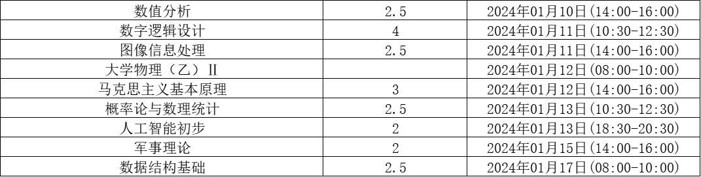

# 大二下课程相关内容

## 考试

- [x] **04.13 20:00-22:00** UX：期中考核
- [x] **04.17 10:00** 毛概：小测
- [x] **04.22 10:00** ADS：期中考试
- [x] **05.11** 计算机组成：期中考试，包含单周期处理器
- [x] **05.25 20:00-22:00** UX：期中考核
- [ ] **05.30** 计算机组成：小测
- [ ] **06.20 10:30-12:30** 面向对象程序设计：期末考试
- [ ] **06.21 08:00-10:00** 数据库系统：期末考试
- [ ] **06.22 14:00-16:00** 计算机组成：期末考试
- [ ] **06.22 18:30-20:30** 信息理论：期末考试
- [ ] **06.23 10:30-12:30** 人工智能：期末考试
- [ ] **06.23 14:00-16:00** 毛泽东思想和中国特色社会主义理论体系概论(H)：期末考试
- [ ] **06.24 10:30-12:30** 高级数据结构与算法分析：期末考试
- [ ] **06.26 08:00-10:00** 数学软件：期末考试
- [ ] **06.27 08:00-10:00** 密码学：期末考试

## 作业DDL

    
52/76

    

            

    

- [x] **03.04 13:25** 数据库系统：[书后习题1.7、1.8、1.9、1.15](https://courses.zju.edu.cn/course/67605/learning-activity#/785944)
- [x] **03.05** 计算机组成：LAB00
- [x] **03.11 13:25** 数据库系统：[书后习题2.7、2.12、2.13、2.15](https://courses.zju.edu.cn/course/67605/learning-activity#/785952)
- [x] **03.12 08:00** 数据库系统：[实验1 DBMS的安装和使用](https://courses.zju.edu.cn/course/67605/learning-activity#/785945?&view=scores)
- [x] **03.12 13:25** 计组：书上习题1.2, 1.5, 1.6, 1.7, 1.13
- [x] **03.13 13:38** ADS：[PTA_Project1](https://pintia.cn/problem-sets/1762714625671319552/exam/overview)
- [x] **03.13 15:32** ADS：[PTA_HW1](https://pintia.cn/problem-sets/1762712504909582336/exam/overview)
- [x] **03.13 20:01** 毛概：[第一章 阅读材料及思考题](https://courses.zju.edu.cn/course/69115/learning-activity#/808583)
- [x] **03.16 23:59** OOP：[8-1 Students I](https://pintia.cn/problem-sets/1763038164098105344/exam/problems/1763038232272322560?type=8&page=0)
- [x] **03.18 13:25** 数据库系统：[书后习题 3.8、3.9](https://courses.zju.edu.cn/course/67605/learning-activity#/785957)
- [x] **03.18 16:00** ADS：[PTA_HW2](https://pintia.cn/problem-sets/1764531499556134912/exam/overview)
- [x] **03.18 22:00** 数据库系统：Quiz 1, Quiz 2
- [x] **03.20 09:48** 毛概：[第二章 阅读材料及思考题](https://courses.zju.edu.cn/course/69115/learning-activity#/812477)
- [x] **03.23 23:59** 计算摄影学：[Lab2 图像滤波和傅里叶变换](http://www.cad.zju.edu.cn/home/gfzhang/course/computational-photography/2024/lab2-filtering/filtering.html)
- [x] **03.25 13:25** 数据库系统：[书后习题 3.10、3.11、3.15](https://courses.zju.edu.cn/course/67605/learning-activity#/785962?view=scores)
- [x] **03.25 23:59** 密码学：[第01次作业](https://pintia.cn/problem-sets/1764659602467049472/exam/overview)
- [x] **03.26 08:00** 数据库系统：[实验2 SQL数据定义和操作](https://courses.zju.edu.cn/course/67605/learning-activity#/785958)
- [x] **03.26 13:25** 计组：书上习题3.7, 3.20, 3.26, 3.27, 3.32
- [x] **03.26 14:58** ADS：[PTA_HW3](https://pintia.cn/problem-sets/1767414856930770944)
- [x] **03.26 23:59** 人工智能：[八皇后问题](https://mo.zju.edu.cn/classroom/class/65d811402b0dde6bb0eac218?&activeKey=work)
- [x] **03.27 23:59** UX：[HW2](https://ke.neoschool.com/student/)
- [x] **03.30 7:29** UX：[HW3](https://ke.neoschool.com/student/)
- [x] **03.31 23:59** 计算摄影学：[Lab3 实现稀疏矩阵以及 Gauss-Seidel 迭代法](http://www.cad.zju.edu.cn/home/gfzhang/course/computational-photography/2024/lab3-gauss-seidel/gauss-seidel.html)
- [x] **04.01 13:25** 数据库系统：[书后习题 4.7、4.9、4.12 | 随堂测试 | 讨论](https://courses.zju.edu.cn/course/67605/learning-activity#/785966?view=scores)
- [x] **04.01 20:47** ADS：[PTA_HW4](https://pintia.cn/problem-sets/1769677146061225984)
- [x] **04.02 08:00** 数据库系统：[实验3 SQL数据完整性](https://courses.zju.edu.cn/course/67605/learning-activity#/785963?view=scores)
- [x] **04.03 14:32** 毛概：[第三章 阅读材料及思考题](https://courses.zju.edu.cn/course/69115/learning-activity#/820171?view=scores)
- [x] **04.06 23:59** UX：[期中问卷](https://ke.neoschool.com/student/)
- [x] **04.06 23:59** 控制的哲学与方法：三个有质量的小纸条，可以是问题/疑惑/思考
- [x] **04.07 19:00** UX：[HW4](https://ke.neoschool.com/student/)
- [x] **04.08 13:15** 数据库系统：[书后习题 5.6、5.15、5.19 | 随堂测试 | 讨论](https://courses.zju.edu.cn/course/67605/learning-activity#/785972?view=scores)
- [x] **04.08 15:32** ADS：[Project2](https://pintia.cn/problem-sets/1772164889915912192/exam/overview)
- [x] **04.08 17:25** ADS：[PTA_HW5](https://pintia.cn/problem-sets/1772162901027262464)
- [x] **04.08 23:59** 密码学：[第02次作业](https://pintia.cn/problem-sets/1769719326503018496/exam/problems/1769719976095850496?type=9&page=0)
- [x] **04.09 08:00** 数据库系统：[实验4 SQL安全性](https://courses.zju.edu.cn/course/67605/learning-activity#/785967?view=scores)
- [x] **04.09 13:25** 计组：书上习题2.4,2.8,2.12.2.14,2.17.2.22.2.24.2.29
- [x] **04.09 23:59** 控制的哲学与方法：更新自选题的题目、描述和问题、要点条目，信息登记表单
- [x] **04.10 20:07** 计算摄影学：[Lab5 非线性最小二乘](http://www.cad.zju.edu.cn/home/gfzhang/course/computational-photography/2024/lab5-gauss-newton/gauss-newton.html)
- [x] **04.12 15:38** 计组：[Lab01 报告](https://courses.zju.edu.cn/course/68313/learning-activity#/810440)
- [x] **04.13 23:59** 控制的哲学与方法：三个有质量的小纸条，可以是问题/疑惑/思考
- [x] **04.15 13:00** 数据库系统：[讨论]
- [x] **04.16 00:42** ADS：[PTA_HW6](https://pintia.cn/problem-sets/1774809628464222208/exam/overview)
- [x] **04.16 23:59** 信息理论：第二章作业
- [x] **04.17 10:00** 毛概：PPT(在工作方法六十条中，你觉得哪些方法至今仍有借鉴？举例说明。)
- [x] **04.17 23:59** 控制的哲学与方法：小组成员合作完成，含配音的pptx，≤10页，≤5分钟，≤50MB，小纸条表单
- [x] **04.18 09:54** ADS：[Project3](https://pintia.cn/problem-sets/1775703610572509184)
- [x] **04.21 23:59** 控制的哲学与方法：提出三个有质量的小纸条，可以是问题/疑惑/思考，小纸条表单
- [x] **04.21 23:59** 控制的哲学与方法：小组展示。
- [x] **04.22 13:15** 数据库系统：[讨论]
- [x] **04.22 13:15** 数据库系统：[书后习题 6.1、6.2、6.21 | 随堂测试 | 讨论](https://courses.zju.edu.cn/course/67605/learning-activity#/785979?view=scores)
- [x] **04.22 23:59** 密码学：[第03次作业](https://pintia.cn/problem-sets/1774804733921169408)
- [x] **04.22 23:59** UX：[HW5](https://ke.neoschool.com/student/)
- [x] **04.23 13:05** ADS：[PTA_HW7](https://pintia.cn/problem-sets/1777533325767835648/exam/overview)
- [x] **04.23 15:50** 计组：[Lab02](https://courses.zju.edu.cn/course/68313/learning-activity#/824567)
- [x] **04.26 21:30** 数据库系统：[实验5 数据库程序设计](https://courses.zju.edu.cn/course/67605/learning-activity#/785973?view=scores)
- [x] **04.28 10:00** UX：[HW6](https://ke.neoschool.com/student/)
- [x] **04.28 23:59** 计算摄影学：[Lab 6 - 深度学习图像补全](http://www.cad.zju.edu.cn/home/gfzhang/course/computational-photography/2024/lab6-deep-learning/lab6.html)
- [x] **04.29 13:15** 数据库系统：[书后习题 7.1、7.13、7.21、7.22、7.30](https://courses.zju.edu.cn/course/67605/learning-activity/full-screen#/785984)
- [x] **04.29 14:45** ADS：[Project4](https://pintia.cn/problem-sets/1779763173806538752/exam/overview)
- [x] **04.29 14:57** ADS：[PTA_HW8](https://pintia.cn/problem-sets/1779736258848718848/exam/overview)
- [x] **04.30 15:50** 计组：[Lab03](https://courses.zju.edu.cn/course/68313/learning-activity#/824568)
- [x] **05.05 23:59** 计算摄影学：[Lab 7 - 全景图拼接](http://www.cad.zju.edu.cn/home/gfzhang/course/computational-photography/2024/lab7-panorama/panorama.html)
- [x] **05.06 19:55** 数据库系统：[作业9 书后习题 12.1、13.5、13.9、13.11](https://courses.zju.edu.cn/course/67605/learning-activity#/785999?view=scores)
- [x] **05.06 23:00** UX：[HW7](https://ke.neoschool.com/student/)
- [x] **05.07 13:17** ADS：[PTA_HW9](https://pintia.cn/problem-sets/1782609865617960960/exam/overview)
- [x] **05.07 13:25** 计组：4.1,4.4,4.6,4.7,4.9,4.11,4.16,4.18,4.20,4.25
- [x] **05.08 21:34** ADS：[Project5](https://pintia.cn/problem-sets/1783127670282457088/exam/overview)
- [x] **05.12 00:00** UX：[HW8](https://ke.neoschool.com/student/)
- [x] **05.13 13:15** 数据库系统：[作业10 书后习题 14.3[a] 、14.4、14.11、24.10](https://courses.zju.edu.cn/course/67605/learning-activity#/786005?view=scores)
- [x] **05.13 23:59** 密码学：[第04次作业](https://pintia.cn/problem-sets/1779727015819042816/exam/overview)
- [x] **05.14 15:56** ADS：[PTA_HW10](https://pintia.cn/problem-sets/1785186616308117504/exam/overview)
- [x] **05.20 13:15** 数据库系统：[作业11 书后习题 15.2、15.3 ](https://courses.zju.edu.cn/course/67605/learning-activity#/786011)
- [x] **05.21 12:38** ADS：[PTA_HW11](https://pintia.cn/problem-sets/1787673461810155520/exam/overview)
- [x] **05.21 13:25** 计组：5.3,5.4, 5.5, 5.6, 5.10, 5.11, 5.16, 5.17,5.20
- [x] **05.21 14:36** ADS：[Project6](https://pintia.cn/problem-sets/1787733319506935808/exam/problem)
- [x] **05.22 23:59** 密码学：[第05次作业](https://pintia.cn/problem-sets/1785491687654924288/exam/overview)
- [x] **05.22 23:59** UX：[HW9](https://ke.neoschool.com/student/)
- [x] **05.27 22:25** ADS：[PTA_HW12](https://pintia.cn/problem-sets/1789995487511252992/exam/overview)
- [ ] **05.28 20:45** 计组：[Lab04](https://courses.zju.edu.cn/course/68313/learning-activity#/826267)
- [ ] **05.31 24:00** UX：[大作业](https://courses.zju.edu.cn/course/68313/learning-activity#/826267?view=scores)
- [x] **05.31 23:59** 计算摄影学：[Lab 9 - 增强现实](http://www.cad.zju.edu.cn/home/gfzhang/course/computational-photography/2024/lab9-ar/ar.html)
- [ ] **06.03 14:55** ADS：[Project7](https://pintia.cn/problem-sets/1792449328521859072/exam/problem)
- [ ] **06.03 15:40** 数据库系统：[书后习题 17.6、17.7](https://courses.zju.edu.cn/course/67605/learning-activity/full-screen#/786023)
- [x] **06.03 17:01** ADS：[PTA_HW13](https://pintia.cn/problem-sets/1792450601170169856/exam/problems/type/1)
- [ ] **06.10 23:59** 密码学：[第06次作业](https://pintia.cn/problem-sets/1792552941353099264/exam/problems/type/9)
- [ ] **06.10 14:59** ADS：[Project8](https://pintia.cn/problem-sets/1792450151960203264/exam/problem)
- [ ] **06.15 14:50** 计组：[Lab05](https://courses.zju.edu.cn/course/68313/learning-activity#/842973)
- [x] **06.18 00:00** 数学软件：[准备工作](https://courses.zju.edu.cn/course/68818/learning-activity/full-screen#/808545)
- [x] **06.18 00:00** 数学软件：[复习和预习作业](https://courses.zju.edu.cn/course/68818/learning-activity#/812102)
- [x] **06.18 00:00** 数学软件：[调查作业：生命游戏 (GOL)](https://courses.zju.edu.cn/course/68818/learning-activity#/812106)
- [x] **06.18 00:00** 数学软件：[项目结合实现](https://courses.zju.edu.cn/course/68818/learning-activity#/814923)
- [x] **06.18 00:00** 数学软件：[调查并实现 Conway GOL的各种模式](https://courses.zju.edu.cn/course/68818/learning-activity#/819134)
- [x] **06.18 00:00** 数学软件：[进一步完善 GOL 项目](https://courses.zju.edu.cn/course/68818/learning-activity#/820282)
- [x] **06.18 00:00** 数学软件：[调查作业：Mandelbrot 集](https://courses.zju.edu.cn/course/68818/learning-activity#/820491)
- [ ] **06.18 00:00** 数学软件：[调查作业 Shell 脚本的实现](https://courses.zju.edu.cn/course/68818/learning-activity#/822493)
- [x] **06.18 00:00** 数学软件：[更新你的项目](https://courses.zju.edu.cn/course/68818/learning-activity#/822988)
- [x] **06.18 00:00** 数学软件：[项目作业: Mandelbrot 集的可视化实现](https://courses.zju.edu.cn/course/68818/learning-activity#/824862)
- [ ] **06.18 00:00** 数学软件：[项目作业: 矩阵乘法](https://courses.zju.edu.cn/course/68818/learning-activity#/825358)
- [ ] **06.18 00:00** 数学软件：[调查作业: Pi 的计算](https://courses.zju.edu.cn/course/68818/learning-activity#/828015)
- [ ] **06.18 00:00** 数学软件：[项目作业: Pi 的计算](https://courses.zju.edu.cn/course/68818/learning-activity#/830947?&view=scores)
- [ ] **06.18 23:59** 信息理论：报告
- [x] 计组：[Lab00 验收](https://courses.zju.edu.cn/course/68313/courseware#/)
- [x] 计组：[Lab01 验收](https://courses.zju.edu.cn/course/68313/courseware#/)
- [x] 计组：[Lab02 验收](https://courses.zju.edu.cn/course/68313/courseware#/)
- [ ] 计组：[Lab03 验收](https://courses.zju.edu.cn/course/68313/courseware#/)
- [ ] 计组：[Lab04 验收](https://courses.zju.edu.cn/course/68313/courseware#/)
- [ ] 计组：[Lab05 验收](https://courses.zju.edu.cn/course/68313/courseware#/)
- [ ] 计组：[Lab06 验收](https://courses.zju.edu.cn/course/68313/courseware#/)

## ADS

上课请带上纸 & 笔

课程评分方法: Homework(10') + Discussions(10') + Research Project(30') + Midterm(10'*'/机房测试) + Final(40'/可覆盖期中考试成绩)

!!! note "Research topics (30')"

    - Done in groups of 4
    - choose 2 out of 7 topics
    - Report ((20+20)/2 points)
    - In-class presentation (10 minutes, 10 points)
    - The speaker will be chosen randomly from all the contributors
    - If there are many volunteers, at first 4 groups will be chosen to give presentations (5 groups forthe last 2 projects)
    - For those groups not to give presentations, each will gain bonus points = report points / 20

!!! note ""

## 数据库系统

课程评分方法: Exercise(10'/作业) + Quiz(10'/测试 + 讨论) + Lab & Project(30'/实验和大程) + Exam(50'/考试)

考试可携带一张A4纸双面的手写笔记，写上自己的学号和姓名

## 密码学

期末总评 = 50% 卷面+50% 平时作业（五次作业，PTA）

## 人工智能

课程评分方法: 平时作业35分(Mo平台，五道题)，课堂考勤5分，期末考试60分

## 计算机组成

课程评分方法：

- 平时占 20%：作业、课堂、阅读
- 期中闭卷(英文)考试(统一时间段)，10%
- 期末闭卷(英文)考试 40%
- 实验占 30%
    - Lab00~03: 基本实验 30%
    - Lab04 :单周期CPU 30%
    - Lab05 : 流水线CPU 40%
    - 附加分奖励：优秀作品 (附加后不超过100分)

注：卷面成绩不到45分(满分100分)者，总评不及格。

## 计算摄影学

[课程网站](http://www.cad.zju.edu.cn/home/gfzhang/course/computational-photography/)

评分分为3个部分

- 课程作业：50%
- 项目设计与演示：40%
- 项目课堂答辩：10%

!!! note "课后编程题"

    - 有5个必做编程题，1个选做编程题（按完成质
    量酌情加分）
    - 考核一些基本知识的掌握程度
    - 可以在上机课里完成

!!! note "软件工具"

    - Microsoft Visual Studio, C/C++编程
    - Matlab
    - OpenCV

!!! note "项目设计与演示"
    编程项目展示

    - 从项目列表中按兴趣自选一个项目
    - 会提供程序框架和测试数据，按要求实现模块和测试结果
    - 独立或分组合作完成（最多3人，建议1-2人）
    - 提交完整demo和项目报告

    课堂项目答辩
    
    - 每个人报告10分钟，提问5分钟
    
    软件开发工具

    - Microsoft Visual Studio, C/C++编程
    - OpenCV

## 毛概

!!! note "考核形式及比例"

    - 课程总成绩 = 平时成绩(60%)+期末考试成绩(40%)

    !!! note "平时成绩"

        - 平时成绩 = 线上成绩(60%)+线下成绩(40%)

        - 线上成绩(60分):以学在浙大等平台的教学资源为主，要求学生完成线上学习内容，参与相关话题讨论并提交相关作业等。
            1. 线上单元测试2次(10分)
            2. 线上点名考勤2次(5分)
            3. 线上观看相关视频并参与话题讨论(10分)
            4. 线上参与小组讨论并提交小组讨论记录表(10分)
            5. 线上提交小组经典研读PPT及笔记(10分)
            6. 线上提交小组实践调研PPT及报告(10分)
            7. 其他表现(5分)

        - 线下成绩(40分): 课堂上教师采用引导、启发式教学、互动式教学专家进课堂、现场教学等方式开展课堂教学和实践教学；评价主体:教师评价、助教评价和学生组内互评相结合
            1. 小组随堂讨论发言次数和质量(20分)
            2. 小组展示环节的形式灵活多样(10分)
            3. 小组展示环节的提问表现(5分)
            4. 其他表现(5分)

    !!! note "线上平台"
        同步建立班级钉钉群(课前)分组后，组长填写小组成员表，提交给助教，助教在学在浙大平台分小组建立学习群。
    
    !!! note "学在浙大"
    
        - 经典研读的书目和研讨问题由教师或助教在“学在浙大”平台每周课前发布;
        - 小组课前完成阅读，课堂参与讨论，课后把每次课的小组讨论记录表提交到“学在浙大”平台;
        - 参加2次单元测试，由助教把题目发布到“学在浙大”平台，完成在线测试。
        - 同学们要按照课程要求完成作业。
        - 线上考勤2次。
  
    !!! note "专题讨论·评价"
        - 教师根据同学的发言情况对参与专题随堂讨论的小组评分，分为优A、良B、中C、差D四个等级(随堂发言评价表)
        - 各小组应积极参与专题随堂讨论，发言次数及质量将决定此环节分数。

    !!! note "专题讨论· 程序"
        - 提前阅读该专题的课前阅读材料，并思考随堂讨论问题小组长组织同学线上讨论，线下做好记录，课程结束后提交学在浙大平台。
        - 由助教协助课代表制定发言顺序，每次讨论根据时间安排3-6组发言。
    
    !!! note "课堂时间安排"
        - 总体安排:采用2+1模式，前面2节课为教师讲授时间，后面1节课为随堂发言时间
        - 2次不在教室时间。分别是春学期第4周和夏学期第3周，分小组完成线上经典阅读和线下实践调研
        - 实践调研主题: **追寻伟人足迹，感受理论魅力**
    
    !!! note "课堂集中展示"

        - 展示次数:二次(春学期第六、七周;夏学期第四、五周)
        - 展示顺序:抽签决定，助教协助课代表决定
        - 课代表主持:每次安排一个主持，一个负责记录小组提问。
        - 展示时间:3节课，具体时间由组数决定。
        - 提问环节:小组展示完成后，其他小组提问，展示小组同学回答问题;提问小组可以加分
        - 分数构成:按照评分表指标打分
        - 评价主体:老师和各组评分员。

## OOP

课程评分方法: Lab(50%) + 期末考试(50%)

## 控制的哲学与方法

自选题报告：最后一周演讲考察，2-3人一组，分别讲述，互为补充